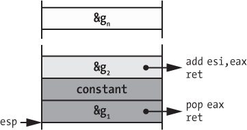

## 8 CUSTOMIZING DISASSEMBLY

So far, I’ve discussed basic binary analysis and disassembly techniques. But these basic techniques aren’t designed to handle obfuscated binaries that break standard disassembler assumptions or special-purpose analyses such as vulnerability scanning. Sometimes, even the scripting functionality offered by disassemblers isn’t enough to remedy this. In such cases, you can build your own specialized disassembly engine tailored to your needs.

In this chapter, you’ll learn how to implement a custom disassembler with *Capstone*, a disassembly framework that gives you full control over the entire analysis process. You’ll begin by exploring the Capstone API, using it to build a custom linear disassembler and a recursive disassembler. You’ll then learn to implement a more advanced tool, namely a *Return-Oriented Programming (ROP)* gadget scanner that you can use to build ROP exploits.

### 8.1 Why Write a Custom Disassembly Pass?

Most well-known disassemblers such as IDA Pro are designed to aid manual reverse engineering. These are powerful disassembly engines that offer an extensive graphical interface, a myriad of options to visualize the disassembled code, and convenient ways to navigate through large piles of assembly instructions. When your goal is just to understand what a binary does, a general-purpose disassembler works fine, but general-purpose tools lack the flexibility needed for advanced automated analysis. While many disassemblers come with scripting functionality for postprocessing the disassembled code, they don’t provide options for tweaking the disassembly process itself, and they aren’t meant for efficient batch processing of binaries. So when you want to perform a specialized, automated binary analysis of multiple binaries simultaneously, you’ll need a custom disassembler.

#### *8.1.1 A Case for Custom Disassembly: Obfuscated Code*

A custom disassembly pass is useful when you need to analyze binaries that break standard disassembler assumptions, such as malware, obfuscated or handcrafted binaries, or binaries extracted from memory dumps or firmware. Moreover, custom disassembly passes allow you to easily implement specialized binary analyses that scan for specific artifacts, such as code patterns that indicate possible vulnerabilities. They’re also useful as research tools, allowing you to experiment with novel disassembly techniques.

As a first concrete use case for custom disassembly, let’s consider a particular type of code obfuscation that uses *instruction overlapping*. Most disassemblers output a single disassembly listing per binary because the assumption is that each byte in a binary is mapped to at most one instruction, each instruction is contained in a single basic block, and each basic block is part of a single function. In other words, disassemblers typically assume that chunks of code don’t overlap with each other. Instruction overlapping breaks this assumption to confuse disassemblers, making the overlapping code more difficult to reverse engineer.

Instruction overlapping works because instructions on the x86 platform vary in length. Unlike some other platforms, such as ARM, not all x86 instructions consist of the same number of bytes. As a result, the processor doesn’t enforce any particular instruction alignment in memory, making it possible for one instruction to occupy a set of code addresses already occupied by another instruction. This means that on x86, you can start disassembling from the middle of one instruction, and the disassembly will yield *another* instruction that partially (or completely) overlaps with the first instruction.

Obfuscators happily abuse overlapping instructions to confuse disassemblers. Instruction overlapping is especially easy on x86 because the x86 instruction set is extremely dense, meaning that nearly any byte sequence corresponds to some valid instruction.

Listing 8-1 shows an example of instruction overlapping. You can find the original source that produced this listing in *overlapping_bb.c*. To disassemble overlapping code, you can use `objdump`’s `-start-address=<addr>` flag to start disassembling at the given address.

*Listing 8-1: Disassembly of* overlapping_bb *(1)*

```
   $ objdump -M   intel --start-address=0x4005f6 -d overlapping_bb
   4005f6: push   rbp
   4005f7: mov    rbp,rsp
   4005fa: mov    DWORD PTR [rbp-0x14],edi   ; ➊load i
   4005fd: mov    DWORD PTR [rbp-0x4],0x0    ; ➋j = 0
   400604: mov    eax,DWORD PTR [rbp-0x14]   ; eax = i
   400607: cmp    eax,0x0                    ; cmp i to 0
➌ 40060a: jne    400612 <overlapping+0x1c>   ; if i != 0, goto 0x400612
   400610: xor    eax,0x4                    ; eax = 4 (0 xor 4)
   400613: add    al,0x90                    ; ➍eax = 148 (4 + 144)
   400615: mov    DWORD PTR [rbp-0x4],eax    ; j = eax
   400618: mov    eax,DWORD PTR [rbp-0x4]    ; return j
   40061b: pop    rbp
   40061c: ret
```

Listing 8-1 shows a simple function that takes one input parameter, which is called `i` ➊, and has a local variable called `j` ➋. After some computation, the function returns `j`.

Upon closer inspection, you should notice something odd: the `jne` instruction at address `40060a` ➌ conditionally jumps into the *middle* of the instruction starting at `400610` instead of continuing at the *start* of any of the listed instructions! Most disassemblers like `objdump` and IDA Pro only disassemble the instructions shown in Listing 8-1. This means that general-purpose disassemblers would miss the overlapping instruction at address `400612` because those bytes are already occupied by the instruction reached in the fall-through case of the `jne`. This kind of overlapping makes it possible to hide code paths that can have a drastic effect on the overall outcome of a program. For example, consider the following case.

In Listing 8-1, if the jump at address `40060a` is not taken (`i == 0`), the instructions reached by the fall-through case compute and return the value `148` ➍. However, if the jump *is* taken (`i != 0`), the code path that was hidden in Listing 8-1 executes. Let’s look at Listing 8-2, which shows that hidden code path, to see how this returns an entirely different value.

*Listing 8-2: Disassembly of* overlapping_bb *(2)*

```
   $ objdump -M intel --start-address=0x4005f6 -d overlapping_bb
   4005f6:  push  rbp
   4005f7:  mov   rbp,rsp
   4005fa:  mov   DWORD PTR [rbp-0x14],edi  ; load i
   4005fd:  mov   DWORD PTR [rbp-0x4],0x0   ; j = 0
   400604:  mov   eax,DWORD PTR [rbp-0x14]  ; eax = i
   400607:  cmp   eax,0x0                   ; cmp i to 0
➊ 40060a:  jne   400612 <overlapping+0x1c> ; if i != 0, goto 0x400612

   # 400610: ; skipped
   # 400611: ; skipped

   $ objdump -M intel --start-address=0x400612 -d overlapping_bb
➋ 400612:  add  al,0x4                      ; ➌eax = i + 4
   400614:  nop
   400615:  mov  DWORD PTR [rbp-0x4],eax    ; j = eax
   400618:  mov  eax,DWORD PTR [rbp-0x4]    ; return j
   40061b:  pop  rbp
   40061c:  ret
```

Listing 8-2 shows the code path that executes if the `jne` instruction ➊ is taken. In that case, it jumps over two bytes (`400610` and `400611`) to address `0x400612` ➋, which is in the middle of the `xor` instruction reached in the fall-through case of the `jne`. This results in a different instruction stream. In particular, the arithmetic operations done on `j` are now different, causing the function to return `i + 4` ➌ instead of `148`. As you can imagine, this sort of obfuscation makes the code hard to understand, especially if the obfuscation is applied in more than one place.

You can usually coax disassemblers into revealing hidden instructions by restarting disassembly at a different offset, as I’ve done with `objdump`’s `-start-address` flag in the previous listings. As you can see in Listing 8-2, restarting the disassembly at address `400612` reveals the instruction hidden there. However, doing that causes the instruction at address `400610` to become hidden instead. Some obfuscated programs are riddled with overlapping code sequences like the one shown in this example, making the code extremely tedious and difficult to investigate manually.

The example of Listings 8-1 and 8-2 shows that building a specialized deobfuscation tool that automatically “untangles” overlapping instructions can make reverse engineering much easier. Especially if you need to reverse obfuscated binaries often, the effort to build a deobfuscation tool pays off in the long run.^(1) Later in this chapter, you’ll learn how to build a recursive disassembler that can deal with overlapping basic blocks like the ones shown in the previous listings.

Overlapping Code in Nonobfuscated Binaries

It’s interesting to note that overlapping instructions occur not only in deliberately obfuscated code but also in highly optimized code that contains handwritten assembly. Admittedly, the second case is both easier to deal with and a lot less common. The following listing shows an overlapping instruction from `glibc` 2.22.^(*a*)

```
7b05a: cmp          DWORD PTR fs:0x18,0x0
7b063: je           7b066
7b065: lock cmpxchg QWORD PTR [rip+0x3230fa],rcx
```

Depending on the result of the `cmp` instruction, the `je` either jumps to address `7b066` or falls through to address `7b065`. The only difference is that the latter address corresponds to a `lock cmpxchg` instruction, while the former corresponds to a `cmpxchg`. In other words, the conditional jump is used to choose between a locked and nonlocked variant of the same instruction by optionally jumping over a `lock` prefix byte.

*a*. `glibc` is the GNU C library. It’s used in virtually all C programs compiled on GNU/Linux platforms and is therefore heavily optimized.

#### *8.1.2 Other Reasons to Write a Custom Disassembler*

Obfuscated code isn’t the only reason to build a custom disassembly pass. In general, customization is useful in any situation where you need full control over the disassembly process. As I mentioned earlier, those situations occur when you’re analyzing obfuscated or otherwise special binaries or when you need to perform specialized analyses that general-purpose disassemblers aren’t designed for.

Later in this chapter, you’ll see an example that uses custom disassembly to build a ROP gadget scanner, which requires disassembling the binary from multiple starting offsets, an operation not readily supported by most disassemblers. ROP gadget scanning involves finding every possible code sequence in a binary, including unaligned ones, that could be used in a ROP exploit.

Conversely, sometimes you’ll want to omit some code paths from the disassembly rather than find every possible code sequence. For instance, this is useful when you want to ignore bogus paths created by an obfuscator^(2) or build a hybrid static-dynamic analysis and focus your disassembly on specific paths that you’ve already explored dynamically.

There are also cases when building a custom disassembly tool may not be needed strictly for technical reasons, but you may choose to do so anyway for the sake of improving efficiency or reducing cost. For instance, automated binary analysis tools often require only very basic disassembly functionality. The toughest part of their job is the custom analysis of the disassembled instructions, and this step doesn’t require the extensive user interfaces or conveniences that automated disassemblers have. In such cases, you can choose to build your own custom tools using only free open source disassembly libraries, rather than depend on large, commercial disassemblers that can cost up to thousands of dollars.

Another reason for building a custom disassembler is efficiency. Scripting in standard disassemblers typically requires at least two passes over the code: one for the initial disassembly and another for the postprocessing done by the script. Also, those scripts are typically written in a high-level language (such as Python), which yields relatively poor runtime performance. This means that when doing complex analysis on many large binaries, you can often greatly improve performance by building a tool that can run natively and do all necessary analysis in one pass.

Now that you’ve seen why custom disassembly is useful, let’s take a look at how to do it! I’ll start with a brief introduction to *Capstone*, one of the most popular libraries for building custom disassembly tools.

### 8.2 Introduction to Capstone

Capstone is a disassembly framework designed to provide a simple, lightweight API that transparently handles most popular instruction architectures, including x86/x86-64, ARM, and MIPS, among others. It has bindings for C/C++ and Python (plus other languages, but we’ll use C/C++ as usual) and runs on all popular platforms, including Windows, Linux, and macOS. It’s also completely free and open source.

Building disassembly tools with Capstone is a straightforward process, with extremely versatile possibilities. Although the API is centered around just a few functions and data structures, it doesn’t sacrifice usability for simplicity. With Capstone, you can easily recover virtually all relevant details of disassembled instructions, including instruction opcodes, mnemonics, class, registers read and written by the instruction, and more. The best way to learn Capstone is through example, so let’s dive right in.

#### *8.2.1 Installing Capstone*

Capstone v3.0.5 is preinstalled on the virtual machine supplied with this book. If you want to try Capstone on another machine, installing it is quite straightforward. The Capstone website^(3) provides ready-made packages for Windows and Ubuntu, among others, and there is a source archive for installing Capstone on other platforms.

As usual, we’ll write our Capstone-based tools in C/C++, but for quick experiments, you may also want to explore Capstone using Python. For this, you’ll need the Capstone Python bindings. These are also preinstalled on the virtual machine, but installing them on your own machine is easy if you have the `pip` Python package manager. Make sure you already have the Capstone core package and then enter the following into your command prompt to install the Capstone Python bindings:

```
pip install capstone
```

Once you have the Python bindings, you can start a Python interpreter and begin your own disassembly experiments in Python, as shown in Listing 8-3.

*Listing 8-3: Exploring the Python Capstone bindings*

```
   >>> import capstone
➊ >>> help(capstone)
   Help on package capstone:

   NAME
       capstone - # Capstone Python bindings, by Nguyen Anh
                  # Quynnh <aquynh@gmail.com>

   FILE
       /usr/local/lib/python2.7/dist-packages/capstone/__init__.py

   [...]

   CLASSES
       __builtin__.object
           Cs
           CsInsn
       _ctypes.PyCFuncPtr(_ctypes._CData)
           ctypes.CFunctionType
       exceptions.Exception(exceptions.BaseException)
           CsError
    ➋class Cs(__builtin__.object)
        | Methods defined here:
        |
        | __del__(self)
        |      # destructor to be called automatically when
        |      # object is destroyed.
        |
        | __init__(self, arch, mode)
        |
        | disasm(self, code, offset, count=0)
        |     # Disassemble binary & return disassembled
        |     # instructions in CsInsn objects
        [...]
```

This example imports the `capstone` package and uses Python’s built-in `help` command to explore Capstone ➊. The class that provides the main functionality is `capstone.Cs` ➋. Most important, it provides access to Capstone’s `disasm` function, which disassembles a code buffer and returns the disassembly result to you. To explore the remaining functionality offered by Capstone’s Python bindings, use Python’s built-in `help` and `dir` commands! In the rest of this chapter, I’ll focus on building Capstone tools with C/C++, but the API closely resembles Capstone’s Python API.

#### *8.2.2 Linear Disassembly with Capstone*

From a high-level perspective, Capstone takes a memory buffer containing a block of code bytes as an input and outputs instructions disassembled from those bytes. The most basic way to use Capstone is to feed it a buffer containing all the code bytes in the `.text` section of a given binary and then linearly disassemble those instructions into a human-readable form, or instruction mnemonics. Aside from some initialization and output-parsing code, Capstone allows you to implement this mode of usage using only a single API call to the `cs_disasm` function. The example in Listing 8-4 implements a simple `objdump`-like tool. To load a binary into a block of bytes that Capstone can use, we’ll reuse the `libbfd`-based binary loader (*loader.h*) implemented in Chapter 4.

*Listing 8-4:* basic_capstone_linear.cc

```
   #include  <stdio.h>
   #include  <string>
   #include  <capstone/capstone.h>
   #include  "../inc/loader.h"
   
   int disasm(Binary *bin);
   
   int
   main(int argc, char *argv[])
   {
     Binary bin;
     std::string fname;
   
     if(argc < 2) {
       printf("Usage: %s <binary>\n", argv[0]);
       return 1;
     }
     fname.assign(argv[1]);
➊    if(load_binary(fname, &bin, Binary::BIN_TYPE_AUTO) < 0) {
       return 1;
     }
   
➋    if(disasm(&bin) < 0) {
       return 1;
     }
   
     unload_binary(&bin);
   
     return 0;
  }

  int
  disasm(Binary *bin)
  {
    csh dis;
    cs_insn *insns;
    Section *text;
    size_t n;

    text = bin->get_text_section();
    if(!text) {
      fprintf(stderr, "Nothing to disassemble\n");
      return 0;
    }

➌   if(cs_open(CS_ARCH_X86, CS_MODE_64, &dis) != CS_ERR_OK) {
      fprintf(stderr, "Failed to open Capstone\n");
      return -1;
    }

➍   n = cs_disasm(dis, text->bytes, text->size, text->vma, 0, &insns);
    if(n <= 0) {
      fprintf(stderr, "Disassembly error: %s\n",
              cs_strerror(cs_errno(dis)));
      return -1;
    }
   
➎   for(size_t i = 0; i < n; i++) {
      printf("0x%016jx: ", insns[i].address);
      for(size_t j = 0; j < 16; j++) {
        if(j < insns[i].size) printf("%02x ", insns[i].bytes[j]);
        else printf("   ");
      }
        printf("%-12s %s\n", insns[i].mnemonic, insns[i].op_str);
      }
   
➏    cs_free(insns, n);
      cs_close(&dis);
   
      return 0;
   }
```

That’s all you need to implement a simple linear disassembler! Note the line at the top of the source that says `#include <capstone/capstone.h>`. To use Capstone in a C program, it’s enough to include this header file and link the program with the Capstone library using the `-lcapstone` linker flag. All other Capstone header files are `#include`’d from *capstone.h*, so you never need to `#include` them manually. With that covered, let’s walk through the rest of the source in Listing 8-4.

### Initializing Capstone

Let’s start with the `main` function, which expects a single command line argument: the name of a binary to disassemble. The `main` function passes the name of this binary to the `load_binary` function (implemented in Chapter 4), which loads the binary into a `Binary` object called `bin` ➊. Then `main` passes `bin` to the `disasm` function ➋, waits for it to complete, and finally cleans up by unloading the binary. As you may have guessed, all the actual disassembly work is done in the `disasm` function.

To disassemble the `.text` section of the given binary, `disasm` begins by calling `bin->get_text_section()` to get a pointer to a `Section` object representing the `.text` section. So far, this should be familiar from Chapter 4. Now let’s get to some actual Capstone code!

The first Capstone function called by `disasm` is typical in any program that uses Capstone. It’s called `cs_open`, and its purpose is to open a properly configured Capstone instance ➌. In this case, a properly configured instance is one that’s set up to disassemble `x86-64` code. The first parameter you pass to `cs_open` is a constant called `CS_ARCH_X86`, informing Capstone that you want to disassemble code for the x86 architecture. More specifically, you tell Capstone that the code will be 64-bit by passing `CS_MODE_64` as the second parameter. Finally, the third parameter is a pointer to an object of type `csh` (short for “Capstone handle”). This pointer is called `dis`. After `cs_open` completes successfully, this handle represents a fully configured Capstone instance, which you’ll need to invoke any of the other Capstone API functions. If the initialization is successful, `cs_open` returns `CS_ERR_OK`.

### Disassembling a Code Buffer

Now that you have a Capstone handle and a loaded code section at your disposal, you can start disassembling! This takes only a single call to the `cs_disasm` function ➍.

The first parameter to this call is `dis`, which is your Capstone handle. Next, `cs_disasm` expects a buffer (specifically, a `const uint8_t*`) containing the code to disassemble, a `size_t` integer indicating the number of code bytes in the buffer, and a `uint64_t` indicating the virtual memory address (VMA) of the first byte in the buffer. The code buffer and related values are all conveniently preloaded in the `Section` object representing the `.text` section of the loaded binary.

The final two parameters to `cs_disasm` are a `size_t`, which indicates the number of instructions to disassemble (here it’s 0 to disassemble as many as possible) and a pointer to a Capstone instruction buffer (`cs_insn**`). This final parameter deserves special attention because the `cs_insn` type plays a central role in Capstone-based applications.

### The cs_insn Structure

As you can see in the example code, the `disasm` function contains a local variable of type `cs_insn*`, called `insns`. The address of `insns` is used as the final parameter for the call to `cs_disasm` at ➍. While disassembling a code buffer, `cs_disasm` builds up an array of disassembled instructions. At the end of the disassembly process, it returns this array in `insns`, so that you can traverse all the disassembled instructions and handle them in some application-specific way. The example code just prints the instructions. Each instruction is of a `struct` type called `cs_insn`, which is defined in *capstone.h*, as shown in Listing 8-5.

*Listing 8-5: Definition of* struct cs_insn *from* capstone.h

```
typedef struct   cs_insn {
  unsigned int    id;
  uint64_t        address;
  uint16_t        size;
  uint8_t         bytes[16];
  char            mnemonic[32];
  char            op_str[160];
  cs_detail      *detail;
} cs_insn;
```

The `id` field is a unique (architecture-specific) identifier for the instruction type, allowing you to check what kind of instruction you’re dealing with without resorting to string comparisons with the instruction mnemonic. For instance, you could implement instruction-specific handling for disassembled instructions, as shown in Listing 8-6.

*Listing 8-6: Instruction-specific handling with Capstone*

```
switch(insn->id) {
case X86_INS_NOP:
  /* handle NOP instruction */
  break;
case X86_INS_CALL:
  /* handle call instruction */
  break;
default:
  break;
}
```

In this example, `insn` is a pointer to a `cs_insn` object. Note that `id` values are only unique within a particular architecture, not across architectures. The possible values are defined in an architecture-specific header file, which you’ll see in Section 8.2.3.

The `address`, `size`, and `bytes` fields in `cs_insn` contain the address, number of bytes, and bytes of the instruction. The `mnemonic` is a human-readable string representing the instruction (without the operands), while `op_str` is a human-readable representation of the operands of the instruction. Finally, `detail` is a pointer to a (mostly architecture-specific) data structure containing more detailed information about the disassembled instruction, such as which registers it reads and writes. Note that the `detail` pointer is set only if you explicitly enable Capstone’s detailed disassembly mode before starting the disassembly, which is not done in this example. You’ll see an example of disassembly using detailed disassembly mode in Section 8.2.4.

### Interpreting the Disassembled Code and Cleaning Up

If all goes well, `cs_disasm` should return the number of disassembled instructions. In case of failure, it returns 0, and you must call the `cs_errno` function to check what the error is. This yields an `enum` value of type `cs_err`. In most cases, you want to print a human-readable error message and exit. For this reason, Capstone provides a convenient function called `cs_strerror`, which turns a `cs_err` value into a string describing the error.

If there are no errors, the `disasm` function loops over all the disassembled instructions returned by `cs_disasm` ➎ (refer to Listing 8-4). This loop prints a line for each instruction, composed of the different fields in the `cs_insn` struct described earlier. Finally, after the loop completes, `disasm` calls `cs_free(insns, n)` to free the memory allocated by Capstone for each of the `n` instructions it parsed into the `insns` buffer ➏, then closes the Capstone instance by calling `cs_close`.

You should now know most of the important Capstone functions and data structures you’ll need to perform basic disassembly and analysis tasks. If you want, you can try compiling and running the `basic_capstone_linear` example. Its output should be a list of the instructions in the `.text` section of the disassembled binary, like in Listing 8-7.

*Listing 8-7: Example output of the linear disassembly tool*

```
$ ./basic_capstone_linear /bin/ls | head   -n 10
0x402a00: 41 57                  push      r15
0x402a02: 41 56                  push      r14
0x402a04: 41 55                  push      r13
0x402a06: 41 54                  push      r12
0x402a08: 55                     push      rbp
0x402a09: 53                     push      rbx
0x402a0a: 89 fb                  mov       ebx,   edi
0x402a0c: 48 89 f5               mov       rbp,   rsi
0x402a0f: 48 81 ec 88 03 00 00   sub       rsp,   0x388
0x402a16: 48 8b 3e               mov       rdi,   qword ptr [rsi]
```

In the rest of this chapter, you’ll see more elaborate disassembly examples using Capstone. The more complicated examples mostly come down to parsing some of the more detailed data structures. They’re not fundamentally more difficult than the examples you’ve already seen.

#### *8.2.3 Exploring the Capstone C API*

Now that you’ve seen some of the basic Capstone functions and data structures, you may wonder if the rest of the Capstone API is documented somewhere. Unfortunately, no such comprehensive documentation of the Capstone API currently exists. The closest thing you have at your disposal is the Capstone header files. Luckily, they are well commented and not too complex, so with some basic pointers, you can quickly skim through them and find what you need for any given project. Capstone header files are all the C header files included with Capstone v3.0.5. I shaded the most important ones for these purposes in Listing 8-8.

*Listing 8-8: The Capstone C header files*

```
$ ls /usr/include/capstone/
arm.h arm64.h capstone.h    mips.h   platform.h  ppc.h

sparc.h  systemz.h  x86.h  xcore.h
```

As you’ve seen, *capstone.h* is the main Capstone header file. It contains commented definitions of all the Capstone API functions as well as the architecture-independent data structures, such as `cs_insn` and `cs_err`. This is also where all the possible values for `enum` types like `cs_arch`, `cs_mode`, and `cs_err` are defined. For instance, if you wanted to modify the linear disassembler so it supports ARM code, you would reference *capstone.h* to find the proper architecture (`CS_ARCH_ARM`) and mode (`CS_MODE_ARM`) parameters to pass to the `cs_open` function.^(4)

Architecture-dependent data structures and constants are defined in separate header files, like *x86.h* for the x86 and x86-64 architecture. These files specify the possible values for the `id` field of the `cs_insn` struct—for x86, these are all the listed values of the `enum` type called `x86_insn`. For the most part, you’ll refer to the architecture-specific headers to find out which details are available through the `detail` field of the `cs_insn` type. If detailed disassembly mode is enabled, this field points to a `cs_detail` struct.

The `cs_detail` struct contains a `union` of architecture-dependent `struct` types that provide detailed information on the instruction. The type associated with x86 is called `cs_x86`, which is defined in *x86.h*. To illustrate this, let’s build a recursive disassembler that uses Capstone’s detailed disassembly mode to obtain architecture-specific information on x86 instructions.

#### *8.2.4 Recursive Disassembly with Capstone*

Without detailed disassembly, Capstone allows you to inspect only basic information about instructions, such as the address, raw bytes, or mnemonic representation. This is fine for a linear disassembler, as you saw in the previous example. However, more advanced binary analysis tools often need to make decisions based on instruction properties, such as the registers the instruction accesses, the type and value of its operands, the type of instruction (arithmetic, control flow, and so on), or the locations targeted by control flow instructions. This kind of detailed information is provided only in Capstone’s detailed disassembly mode. Parsing it requires extra effort on Capstone’s part, making detailed disassembly slower than in non-detailed mode. Therefore, you should use detailed mode only when needed. One instance that requires detailed disassembly mode is recursive disassembly. Recursive disassembly is a recurring theme in many binary analysis applications, so let’s explore it in more detail.

Recall from Chapter 6 that recursive disassembly discovers code by starting from known entry points, such as the main entry point of the binary, or function symbols, and following control flow instructions from there. In contrast to linear disassembly, which blindly disassembles all code in sequence, recursive disassembly isn’t easily fooled by things like data interspersed with the code. The downside is that recursive disassembly may miss instructions if the instructions are reachable only via indirect control flows, which cannot be resolved statically.

### Setting Up Detailed Disassembly Mode

Listing 8-9 shows a basic implementation of recursive disassembly. Unlike most recursive disassemblers, the one in this example doesn’t assume that bytes can belong to only a single instruction at a time, so overlapping code blocks are supported.

*Listing 8-9:* basic_capstone_recursive.cc

```
   #include   <stdio.h>
   #include   <queue>
   #include   <map>
   #include   <string>
   #include   <capstone/capstone.h>
   #include   "../inc/loader.h"
   int disasm(Binary *bin);
   void print_ins(cs_insn *ins);
   bool is_cs_cflow_group(uint8_t g);
   bool is_cs_cflow_ins(cs_insn *ins);
   bool is_cs_unconditional_cflow_ins(cs_insn *ins);
   uint64_t get_cs_ins_immediate_target(cs_insn *ins);
   
   int
   main(int argc, char *argv[])
   {
     Binary bin;
     std::string fname;
   
     if(argc < 2) {
       printf("Usage: %s <binary>\n", argv[0]);
       return 1;
     }
   
     fname.assign(argv[1]);
     if(load_binary(fname, &bin, Binary::BIN_TYPE_AUTO) < 0) {
       return 1;
     }
   
     if(disasm(&bin) < 0) {
       return 1;
     }
   
     unload_binary(&bin);
   
     return 0;
   }
   
   int
   disasm(Binary *bin)
   {
     csh dis;
     cs_insn *cs_ins;
     Section *text;
     size_t n;
     const uint8_t *pc;
     uint64_t addr, offset, target;
     std::queue<uint64_t> Q;
     std::map<uint64_t, bool> seen;
   
     text = bin->get_text_section();
     if(!text) {
 
     fprintf(stderr, "Nothing to disassemble\n");
     return 0;
   }

   if(cs_open(CS_ARCH_X86, CS_MODE_64, &dis) != CS_ERR_OK) {
     fprintf(stderr, "Failed to open Capstone\n");
     return -1;
   }
➊  cs_option(dis, CS_OPT_DETAIL, CS_OPT_ON);
   
➋  cs_ins = cs_malloc(dis);
    if(!cs_ins) {
      fprintf(stderr, "Out of memory\n");
      cs_close(&dis);
      return -1;
   }
   
   addr = bin->entry;
➌  if(text->contains(addr)) Q.push(addr);
    printf("entry point: 0x%016jx\n", addr);

➍  for(auto &sym: bin->symbols) {
      if(sym.type == Symbol::SYM_TYPE_FUNC
         && text->contains(sym.addr)) {
        Q.push(sym.addr);
        printf("function symbol: 0x%016jx\n", sym.addr);
      }
    }
   
➎  while(!Q.empty()) {
      addr = Q.front();
      Q.pop();
      if(seen[addr]) continue;
   
      offset = addr - text->vma;
      pc      = text->bytes + offset;
      n       = text->size - offset;
➏    while(cs_disasm_iter(dis, &pc, &n, &addr, cs_ins)) {
        if(cs_ins->id == X86_INS_INVALID || cs_ins->size == 0) {
          break;
        }

        seen[cs_ins->address] = true;
        print_ins(cs_ins);

➐      if(is_cs_cflow_ins(cs_ins)) {
➑        target = get_cs_ins_immediate_target(cs_ins);
          if(target && !seen[target] && text->contains(target)) {
            Q.push(target);
            printf(" -> new target: 0x%016jx\n", target);
          }
➒        if(is_cs_unconditional_cflow_ins(cs_ins)) {
           break;
          }
        } ➓else if(cs_ins->id == X86_INS_HLT) break;
      }
      printf("----------\n");
   }

   cs_free(cs_ins, 1);
   cs_close(&dis);
   
   return 0;
   }

   void
   print_ins(cs_insn *ins)
   {
     printf("0x%016jx: ", ins->address);
     for(size_t i = 0; i < 16; i++) {
       if(i < ins->size) printf("%02x ", ins->bytes[i]);
       else printf("   ");
     }
     printf("%-12s %s\n", ins->mnemonic, ins->op_str);
   }

   bool
   is_cs_cflow_group(uint8_t g)
   {
     return (g == CS_GRP_JUMP) || (g == CS_GRP_CALL)
            || (g == CS_GRP_RET) || (g == CS_GRP_IRET);
   }
   
   bool
   is_cs_cflow_ins(cs_insn *ins)
   {
     for(size_t i = 0; i < ins->detail->groups_count; i++) {
       if(is_cs_cflow_group(ins->detail->groups[i])) {
         return true;
       }
     }

     return false;
   }
   bool
   is_cs_unconditional_cflow_ins(cs_insn *ins)
   {
     switch(ins->id) {
     case X86_INS_JMP:
     case X86_INS_LJMP:
     case X86_INS_RET:
     case X86_INS_RETF:
     case X86_INS_RETFQ:
       return true;
     default:
       return false;
     }
   }

   uint64_t
   get_cs_ins_immediate_target(cs_insn *ins)
   {
     cs_x86_op *cs_op;

     for(size_t i = 0; i < ins->detail->groups_count; i++) {
       if(is_cs_cflow_group(ins->detail->groups[i])) {
         for(size_t j = 0; j < ins->detail->x86.op_count; j++) {
           cs_op = &ins->detail->x86.operands[j];
           if(cs_op->type == X86_OP_IMM) {
             return cs_op->imm;
           }
         }
       }
     }

     return 0;
   }
```

As you can see in Listing 8-9, the `main` function is identical to the one for the linear disassembler. And for the most part, the initialization code at the start of `disasm` is also similar. It starts by loading the `.text` section and getting a Capstone handle. However, there’s a small but important addition ➊. This added line enables detailed disassembly mode by activating the `CS_OPT_DETAIL` option. This is crucial for recursive disassembly because you need the control flow information, which is provided only in detailed disassembly mode.

Next, the code explicitly allocates an instruction buffer ➋. While this wasn’t necessary for the linear disassembler, you need it here because you’ll use another Capstone API function for the actual disassembly than the one used before. This alternative disassembly function allows you to inspect each instruction while it’s disassembled without having to wait for all other instructions to be disassembled. This is a common requirement in detailed disassembly because you typically want to act on the details of each instruction as you go along in order to influence the control flow of the disassembler.

### Looping Through Entry Points

Following the Capstone initialization, the logic of the recursive disassembler begins. The recursive disassembler is structured around a queue, which contains starting points for the disassembler. The first step is to bootstrap the disassembly process by filling the queue with initial entry points: the main entry point of the binary ➌ as well as any known function symbols ➍. After that, the code continues into the main disassembly loop ➎.

As mentioned, the loop is structured around a queue of addresses, which are used as starting points for the disassembly. As long as there are more starting points to explore, each iteration pops the next starting point from the queue and then follows control flow from there, disassembling as much code as possible. Essentially, this performs a linear disassembly from each starting point, pushing each newly discovered control flow destination into the queue. The new destination will be disassembled in a later iteration of the loop. Each linear sweep stops only when it encounters a `hlt` instruction, or an unconditional branch, because these instructions aren’t guaranteed to have a valid fall-through target. Data, instead of code, might come after these instructions, so you don’t want to continue disassembling past them.

The loop uses several new Capstone functions that you probably haven’t seen before. For one thing, it uses a different API call, named `cs_disasm_iter`, for the actual disassembly ➏. Also, there are functions that retrieve detailed disassembly information, such as the targets of control flow instructions and information on whether a particular instruction is a control flow instruction in the first place. Let’s begin by discussing why you need to use `cs_disasm_iter` instead of plain old `cs_disasm` in this example.

### Using Iterative Disassembly for Real-Time Instruction Parsing

As the name implies, `cs_disasm_iter` is an iterative variant of the `cs_disasm` function. With `cs_disasm_iter`, instead of disassembling a whole code buffer at once, Capstone disassembles only one instruction at a time. After disassembling each instruction, `cs_disasm_iter` returns either true or false. True means that an instruction was successfully disassembled, while false means nothing was disassembled. You can easily create a `while` loop, like the one shown at ➏, that calls `cs_disasm_iter` until there is no code left to disassemble.

The parameters to `cs_disasm_iter` are essentially iterative variants of those you saw in the linear disassembler. As before, the first parameter is your Capstone handle. The second parameter is a pointer to the code to disassemble. However, instead of a `uint8_t*`, it’s now a double pointer (that is, a `uint8_t**`). This allows `cs_disasm_iter` to automatically update the pointer each time it is called, setting it to point just past the recently disassembled bytes. Since this behavior is similar to a program counter, this parameter is called `pc`. As you can see, for each starting point in the queue, you just have to point `pc` to the correct location in the `.text` section once. After that, you can simply call `cs_disasm_iter` in a loop, and it automatically takes care of incrementing `pc`.

The third parameter is the number of bytes left to disassemble, which is also automatically decremented by `cs_disasm_iter`. In this case, it’s always equal to the size of the `.text` section minus the number of bytes already disassembled.

There’s also an automatically incremented parameter called `addr`, which informs Capstone about the VMA of the code pointed to by `pc` (just as `text->vma` did in the linear disassembler). The last parameter is a pointer to a `cs_insn` object, which serves as a buffer for each disassembled instruction.

Using `cs_disasm_iter` instead of `cs_disasm` has several advantages. The main reason for using it is its iterative behavior, which allows you to inspect each instruction right after it’s disassembled, letting you inspect control flow instructions and follow them recursively. In addition to its useful iterative behavior, `cs_disasm_iter` is faster and more memory efficient than `cs_disasm` since it doesn’t require a large preallocated buffer to contain all disassembled instructions at once.

### Parsing Control Flow Instructions

As you’ve seen, the disassembly loop uses several helper functions to determine whether a particular instruction is a control flow instruction and, if so, what its target is. For example, the function `is_cs_cflow_ins` (called at ➐) determines whether an instruction is any kind of control flow instruction (conditional or unconditional). To this end, it inspects Capstone’s detailed disassembly information. In particular, the `ins->detail` struct provided by Capstone contains an array of “groups” to which the instruction belongs (`ins->detail->groups`). With this information, you can easily make decisions based on the groups an instruction belongs to. For instance, you can tell that an instruction is some kind of jump instruction without having to explicitly check the `ins->id` field against every possible kind of jump, such as `jmp`, `ja`, `je`, `jnz`, and so on. In the case of the `is_cs_cflow_ins` function, it checks whether an instruction is a kind of jump, call, return, or return from interrupt (the actual check is implemented in another helper function, called `is_cs_cflow_group`). If an instruction is one of these four types, it’s considered a control flow instruction.

If a disassembled instruction turns out to be a control flow instruction, then you want to resolve its target if possible and add it to your queue if you haven’t seen it before so that the instructions at that target address are disassembled later. The code to resolve control flow targets is in a helper function called `get_cs_insn_immediate_target`. The example calls this function at ➑. As the name implies, it’s only capable of resolving “immediate” control flow targets: target addresses that are hardcoded in the control flow instruction. In other words, it makes no attempt to resolve indirect control flow targets, which is difficult to do statically, as you may recall from Chapter 6.

Parsing control flow targets is the first instance of architecture-specific instruction handling in this example. Resolving a control flow target requires you to examine the instruction’s operands, and since every instruction architecture has its own set of operand types, parsing them cannot be done in a generic way. In this case, you’re operating on x86 code, so you need to access the x86-specific operand array provided by Capstone as part of the detailed disassembly information (`ins->detail->x86.operands`). This array contains operands in the form of a `struct` type called `cs_x86_op`. This struct contains an anonymous `union` of all possible operand types: register (`reg`), immediate (`imm`), floating point (`fp`), or memory (`mem`). Which of these fields is actually set depends on the operand type, and the type is indicated by the `type` field of `cs_x86_op`. The example disassembler only parses immediate control flow targets, so it checks for operands of `type X86_OP_IMM` and returns the value of any immediate targets it finds. If this target hasn’t been disassembled yet, the `disasm` function adds it to the queue.

Finally, if `disasm` encounters a `hlt` or an unconditional control flow, it halts disassembly because it doesn’t know whether there are noncode bytes after such instructions. To check for unconditional control flow instructions, `disasm` calls another helper function, called `is_cs_unconditional_cflow_ins` ➒. This function simply uses the `ins->id` field to check explicitly for all relevant types of instructions since there are only a few such types. There’s a separate check for `hlt` instructions at ➓. After the disassembly loop ends, the `disasm` function cleans up the allocated instruction buffer and closes the Capstone handle.

### Running the Recursive Disassembler

The recursive disassembly algorithm just explored is the basis for many custom disassembly tools, as well as full-fledged disassembler suites such as Hopper or IDA Pro. Of course, these contain many more heuristics than this simple example for identifying function entry points and other useful code properties, even in the absence of function symbols. Try compiling and running the recursive disassembler! It works best on binaries with symbolic information. Its output is designed to let you follow along with what the recursive disassembly process is doing. For example, Listing 8-10 shows a snippet of the recursive disassembly output for the obfuscated binary with overlapping basic blocks introduced at the start of this chapter.

*Listing 8-10: Example output of the recursive disassembler*

```
   $ ./basic_capstone_recursive overlapping_bb
   entry point: 0x400500
   function symbol: 0x400530
   function symbol: 0x400570
   function symbol: 0x4005b0
   function symbol: 0x4005d0
   function symbol: 0x4006f0
   function symbol: 0x400680
   function symbol: 0x400500
   function symbol: 0x40061d
   function symbol: 0x4005f6
   0x400500: 31 ed                    xor    ebp, ebp
   0x400502: 49 89 d1                 mov    r9, rdx
   0x400505: 5e                       pop    rsi
   0x400506: 48 89 e2                 mov    rdx, rsp
   0x400509: 48 83 e4 f0              and    rsp, 0xfffffffffffffff0
   0x40050d: 50                       push   rax
   0x40050e: 54                       push   rsp
   0x40050f: 49 c7 c0 f0 06 40   00   mov    r8, 0x4006f0
   0x400516: 48 c7 c1 80 06 40   00   mov    rcx, 0x400680
   0x40051d: 48 c7 c7 1d 06 40   00   mov    rdi, 0x40061d
   0x400524: e8 87 ff ff ff           call   0x4004b0
   0x400529: f4                       hlt
   ----------
   0x400530: b8 57 10 60 00           mov    eax, 0x601057
   0x400535: 55                       push   rbp
   0x400536: 48 2d 50 10 60 00        sub    rax, 0x601050
   0x40053c: 48 83 f8 0e              cmp    rax, 0xe
   0x400540: 48 89 e5                 mov    rbp, rsp
   0x400543: 76 1b                    jbe    0x400560
     -> ➊new target: 0x400560
   0x400545: b8 00 00 00 00           mov    eax, 0
   0x40054a: 48 85 c0                 test   rax, rax
   0x40054d: 74 11                    je     0x400560
     -> new target: 0x400560
   0x40054f: 5d                       pop    rbp
   0x400550: bf 50 10 60 00           mov    edi, 0x601050
   0x400555: ff e0                    jmp    rax
   ----------
   ...
   0x4005f6: 55                       push   rbp
   0x4005f7: 48 89 e5                 mov    rbp, rsp
   0x4005fa: 89 7d ec                 mov    dword ptr [rbp - 0x14], edi
   0x4005fd: c7 45 fc 00 00 00 00     mov    dword ptr [rbp - 4], 0
   0x400604: 8b 45 ec                 mov    eax, dword ptr [rbp - 0x14]
   0x400607: 83 f8 00                 cmp    eax, 0
   0x40060a: 0f 85 02 00 00 00        jne    0x400612
     -> new target: 0x400612
➋  0x400610: 83 f0 04                 xor    eax, 4
   0x400613: 04 90                    add    al, 0x90
   0x400615: 89 45 fc                 mov    dword ptr [rbp - 4], eax
   0x400618: 8b 45 fc                 mov    eax, dword ptr [rbp - 4]
   0x40061b: 5d                       pop    rbp
   0x40061c: c3                       ret
   ----------
   ...
➌  0x400612: 04 04                   add     al, 4
   0x400614: 90                       nop
   0x400615: 89 45 fc                 mov    dword ptr [rbp - 4], eax
   0x400618: 8b 45 fc                 mov    eax, dword ptr [rbp - 4]
   0x40061b: 5d                       pop    rbp
   0x40061c: c3                       ret
   ----------
```

As you can see in Listing 8-10, the disassembler starts by queueing up entry points: first the binary’s main entry point and then any known function symbols. It then proceeds to disassemble as much code as safely possible starting from each address in the queue (the dashes denote the points at which the disassembler decides to stop and move to the next address in the queue). Along the way, the disassembler also finds new, previously unknown, addresses to put in the queue for later disassembly. For instance, the `jbe` instruction at address `0x400543` reveals the new target address `0x400560` ➊. The disassembler successfully finds both overlapping blocks in the obfuscated binary: the one at address `0x400610` ➋ as well as the one at address `0x400612` ➌ that’s embedded in it.

### 8.3 Implementing a ROP Gadget Scanner

All the examples you’ve seen so far are custom implementations of well-known disassembly techniques. However, you can do much more with Capstone! In this section, you’ll see a more specialized kind of tool with disassembly needs that aren’t covered by standard linear or recursive disassembly. Specifically, you’ll learn about a tool that is indispensable for modern exploit writing: a scanning tool that can find gadgets for use in ROP exploits. First, let’s explore what this means.

#### *8.3.1 Introduction to Return-Oriented Programming*

Nearly every introduction to exploitation covers Aleph One’s classic article “Smashing the Stack for Fun and Profit,” which explains the basics of exploiting stack-based buffer overflows. When this article was published in 1996, exploitation was relatively straightforward: find a vulnerability, load malicious shellcode into a buffer (typically a stack buffer) in the target application, and use the vulnerability to redirect control flow to the shellcode.

Much has happened in the world of security since, and exploitation has gotten vastly more complicated. One of the most widespread defenses against classic exploits of this kind is data execution prevention (DEP), also known as W⊕X or NX. It was introduced in Windows XP in 2004 and prevents shellcode injection in an extremely straightforward way. DEP enforces that no region of memory is ever writable and executable at the same time. So if an attacker injects shellcode into a buffer, they cannot execute it.

Unfortunately, it wasn’t long before hackers found a way to circumvent DEP. New defenses prevented the injection of shellcode, but they couldn’t stop an attacker from using a vulnerability to redirect control flow to *existing code* in the exploited binary or the libraries it uses. This weakness was first exploited in a class of attacks known as return-to-libc (ret2libc) in which control flow is redirected to sensitive functions in the widely used libc library, like the `execve` function, which can be used to start a new process of the attacker’s choice.

In 2007 came a generalized variant of ret2libc, known as *return-oriented programming (ROP)*. Instead of restricting attacks to existing functions, ROP allows an attacker to implement arbitrary malicious functionality by chaining together short existing code sequences in the target program’s memory space. These short code sequences are called *gadgets* in ROP terminology.

Each gadget ends in a return instruction and performs a basic operation, such as addition or logical comparison.^(5) By carefully selecting gadgets with well-defined semantics, an attacker can create what is essentially a customized instruction set where each gadget forms an instruction and then use this instruction set to craft arbitrary functionality, called a ROP program, without injecting any new code. Gadgets can be part of the host program’s normal instructions, but they can also be unaligned instruction sequences of the sort you saw in the obfuscated code example in Listings 8-1 and 8-2.

A ROP program consists of a series of gadget addresses carefully arranged on the stack so that the return instruction terminating each gadget transfers control to the next gadget in the chain. To start the ROP program, you execute an initial return instruction (for instance, by triggering it through an exploit) that jumps to the first gadget address. Figure 8-1 illustrates an example ROP chain.



*Figure 8-1: An example ROP chain. Gadget* g₁ *loads a constant into* `eax`, *which is then added to* `esi` *by* g₂.

As you can see, the stack pointer (the `esp` register) initially points to the address of the first gadget g₁ in the chain. When the initial return instruction happens, it pops this first gadget address off the stack and transfers control to it, causing g₁ to run. Gadget g₁ performs a `pop` instruction that loads a constant arranged on the stack into the `eax` register and increments `esp` to point to the address of gadget g₂. Then, g₁’s `ret` instruction transfers control to g₂, which subsequently adds the constant in `eax` to the `esi` register. Gadget g₂ then returns to gadget g₃, and so on, until all gadgets g₁, . . . ,g_(n) have been executed.

As you may have gathered from this, creating a ROP exploit requires that an attacker first select an appropriate set of ROP gadgets to use. In the following section, we’ll implement a tool that scans a binary for usable ROP gadgets and creates an overview of these gadgets to aid in building ROP exploits.

#### *8.3.2 Finding ROP Gadgets*

The next listing shows the code for the ROP gadget finder. It outputs a list of ROP gadgets that can be found in the given binary. You can use this list to select appropriate gadgets and combine them into an exploit for the binary.

As mentioned, you want to find gadgets that end in a return instruction. Moreover, you want to look for both aligned and unaligned gadgets with respect to the binary’s normal instruction stream. Usable gadgets should have well-defined and simple semantics, so the length of the gadgets should be fairly limited. In this case, let’s (arbitrarily) limit gadget length to five instructions.

To find both aligned and unaligned gadgets, one possible approach is to disassemble the binary from each possible starting byte and see for which bytes you end up with a usable gadget. However, you can make things more efficient by first scanning the binary for locations of return instructions (aligned or unaligned) and then traversing backward from there, building up increasingly long gadgets as you go along. This way, you don’t have to start a disassembly sweep at every possible address, but only at addresses near return instructions. Let’s clarify what exactly this means by taking a closer look at the gadget finder code shown in Listing 8-11.

*Listing 8-11:* capstone_gadget_finder.cc

```
  #include <stdio.h>
  #include <map>
  #include <vector>
  #include <string>
  #include <capstone/capstone.h>
  #include "../inc/loader.h"
  
  int find_gadgets(Binary *bin);
  int find_gadgets_at_root(Section *text, uint64_t root,
                           std::map<std::string, std::vector<uint64_t> > *gadgets,
                           csh dis);
  bool is_cs_cflow_group(uint8_t g);
  bool is_cs_cflow_ins(cs_insn *ins);
  bool is_cs_ret_ins(cs_insn *ins);
  int
  main(int argc, char *argv[])
  {
    Binary bin;
    std::string fname;
  
    if(argc < 2) {
      printf("Usage: %s <binary>\n", argv[0]);
      return 1;
    }
  
    fname.assign(argv[1]);
    if(load_binary(fname, &bin, Binary::BIN_TYPE_AUTO) < 0) {
      return 1;
    }
  
    if(find_gadgets(&bin) < 0) {
      return 1;
    }
  
    unload_binary(&bin);
  
    return 0;
  }
  
  int
  find_gadgets(Binary *bin)
  {
    csh dis;
    Section *text;
    std::map<std::string, std::vector<uint64_t> > gadgets;
  
    const uint8_t x86_opc_ret = 0xc3;
  
    text = bin->get_text_section();
    if(!text) {
      fprintf(stderr, "Nothing to disassemble\n");
      return 0;
    }
  
    if(cs_open(CS_ARCH_X86, CS_MODE_64, &dis) != CS_ERR_OK) {
      fprintf(stderr, "Failed to open Capstone\n");
      return -1;
    }
    cs_option(dis, CS_OPT_DETAIL, CS_OPT_ON);
  
    for(size_t i = 0; i < text->size; i++) {
➊   if(text->bytes[i] == x86_opc_ret) {
➋     if(find_gadgets_at_root(text, text->vma+i, &gadgets, dis) < 0) {
         break;
        }
      }
    }

➌   for(auto &kv: gadgets) {
       printf("%s\t[ ", kv.first.c_str());
       for(auto addr: kv.second) {
         printf("0x%jx ", addr);
       }
       printf("]\n");
    }

    cs_close(&dis);

    return 0;
  }

  int
  find_gadgets_at_root(Section *text, uint64_t root,
     std::map<std::string, std::vector<uint64_t> > *gadgets,
     csh dis)
  {
     size_t n, len;
     const uint8_t *pc;
     uint64_t offset, addr;
     std::string gadget_str;
     cs_insn *cs_ins;

     const size_t max_gadget_len    = 5; /* instructions */
     const size_t x86_max_ins_bytes = 15;
     const uint64_t root_offset = max_gadget_len*x86_max_ins_bytes;

     cs_ins = cs_malloc(dis);
     if(!cs_ins) {
       fprintf(stderr, "Out of memory\n");
       return -1;
     }

➍   for(uint64_t a = root-1;
                 a >= root-root_offset && a >= 0;
                 a--) {
       addr   = a;
       offset = addr - text->vma;
       pc     = text->bytes + offset;
       n      = text->size - offset;
       len    = 0;
       gadget_str = "";
➎      while(cs_disasm_iter(dis, &pc, &n, &addr, cs_ins)) {
          if(cs_ins->id == X86_INS_INVALID || cs_ins->size == 0) {
            break;
          } ➏else if(cs_ins->address > root) {
            break;
          } ➐else if(is_cs_cflow_ins(cs_ins) && !is_cs_ret_ins(cs_ins)) {
            break;
          } ➑else if(++len > max_gadget_len) {
            break;
          }
  
➒         gadget_str += std::string(cs_ins->mnemonic)
                        + " " + std::string(cs_ins->op_str);
  
➓         if(cs_ins->address == root) {
            (*gadgets)[gadget_str].push_back(a);
            break;
          }
  
          gadget_str += "; ";
        }
      }
  
      cs_free(cs_ins, 1);
  
      return 0;
  }
  
  bool
  is_cs_cflow_group(uint8_t g)
  {
    return (g == CS_GRP_JUMP) || (g == CS_GRP_CALL)
            || (g == CS_GRP_RET) || (g == CS_GRP_IRET);
  }
  
  bool
  is_cs_cflow_ins(cs_insn *ins)
  {
    for(size_t i = 0; i < ins->detail->groups_count; i++) {
      if(is_cs_cflow_group(ins->detail->groups[i])) {
        return true;
      }
    }
    return false;
  }
  
  bool
  is_cs_ret_ins(cs_insn *ins)
  {
    switch(ins->id) {
    case X86_INS_RET:
      return true;
    default:
      return false;
    }
  }
```

The gadget finder in Listing 8-11 doesn’t introduce any new Capstone concepts. The `main` function is the same one you saw in the linear and recursive disassemblers, and the helper functions (`is_cs_cflow_group`, `is_cs_cflow_ins`, and `is_cs_ret_ins`) are similar to those you saw before. The Capstone disassembly function, `cs_disasm_iter`, is also one you’ve seen before. The interesting thing about the gadget finder is that it uses Capstone to analyze a binary in a way that can’t be done with a standard linear or recursive disassembler. All the gadget-finding functionality is implemented in the functions `find_gadgets` and `find_gadgets_at_root`, so let’s focus on them.

### Scanning for Roots and Mapping Gadgets

The `find_gadgets` function is called from `main`, and it starts in a familiar way. First, it loads the `.text` section and initializes Capstone in detailed disassembly mode. After the initialization, `find_gadgets` loops over each byte in `.text` and checks whether it is equal to the value `0xc3`, the opcode for an x86 `ret` instruction ➊.^(6) Conceptually, each such instruction is a potential “root” for one or more gadgets, which you can find by searching backward starting from the root. You can think of all the gadgets that end in a particular `ret` instruction as a tree rooted at that `ret` instruction. To find all gadgets connected to a particular root, there’s a separate function, called `find_gadgets_at_root` (called at ➋), which I’ll discuss shortly.

All the gadgets are added to a C++ `map` data structure that maps each unique gadget (in the form of a `string`) to the set of addresses at which this gadget can be found. The actual adding of gadgets to the `map` happens in the `find_gadgets_at_root` function. After the gadget search completes, `find_gadgets` prints out the entire mapping of gadgets ➌ and then cleans up and returns.

### Finding All Gadgets at a Given Root

As mentioned, the function `find_gadgets_at_root` finds all gadgets that end up at a given root instruction. It starts by allocating an instruction buffer, which you need when using `cs_disasm_iter`. Then, it enters a loop that searches backward from the root instruction, beginning at one byte before the root address and decrementing the search address in each loop iteration until it’s 15 × 5 bytes from the root ➍. Why 15 × 5? This is because you want gadgets of at most five instructions, and since x86 instructions never consist of more than 15 bytes each, the furthest you’ll ever need to search backward from any given root is 15 × 5 bytes.

For every search offset, the gadget finder performs a linear disassembly sweep ➎. In contrast to the earlier linear disassembly example, this example uses Capstone’s `cs_disasm_iter` function for each disassembly sweep. The reason is that instead of disassembling an entire buffer at once, the gadget finder needs to check a series of stop conditions after each instruction.

First, it breaks off the linear sweep if it encounters an invalid instruction, discarding the gadget and moving on to the next search address, starting a new linear sweep from there. Checking for invalid instructions is important since gadgets at unaligned offsets are often invalid.

The gadget finder also breaks off the disassembly sweep if it hits an instruction with an address beyond the root ➏. You may be wondering how it’s possible for the disassembly to reach an instruction beyond the root without hitting the root itself first. To see an example of this, remember that some of the addresses you disassemble are unaligned with respect to the normal instruction stream. This means that if you disassemble a multibyte unaligned instruction, the disassembly might consume the root instruction as part of the unaligned instruction’s opcode or operands so that the root itself never appears in the unaligned instruction stream.

Finally, the gadget finder stops disassembling a given gadget if it finds a control flow instruction other than a return ➐. After all, gadgets are easier to use if they contain no control flow other than the final return instruction.^(7) The gadget finder also discards gadgets that grow longer than the maximum gadget size ➑.

If none of the stop conditions is true, then the gadget finder appends the newly disassembled instruction (`cs_ins`) to a string containing the gadget built up so far ➒. When the analysis reaches the root instruction, the gadget is complete and is appended to the `map` of gadgets ➓. After considering all possible starting points near the root, `find_gadgets_at_root` is done and returns control to the main `find_gadgets` function, which then continues with the next root instruction, if there are any left.

### Running the Gadget Finder

The command line interface for the gadget finder is the same as for the disassembly tools. Listing 8-12 shows what the output should look like.

*Listing 8-12: Example output of the ROP scanner*

```
$ ./capstone_gadget_finder /bin/ls | head -n 10
adc byte ptr [r8], r8b; ret                       [ 0x40b5ac ]
adc byte ptr [rax - 0x77], cl; ret                [ 0x40eb10 ]
adc byte ptr [rax], al; ret                       [ 0x40b5ad ]
adc byte ptr [rbp - 0x14], dh; xor eax, eax; ret  [ 0x412f42 ]
adc byte ptr [rcx + 0x39], cl; ret                [ 0x40eb8c ]
adc eax, 0x5c415d5b; ret                 [ 0x4096d7 0x409747 ]
add al, 0x5b; ret                                 [ 0x41254b ]
add al, 0xf3; ret                                 [ 0x404d8b ]
add al, ch; ret                                   [ 0x406697 ]
add bl, dh; ret ; xor eax, eax; ret               [ 0x40b4cf ]
```

Each line of output shows a gadget string, followed by the addresses where this gadget is found. For instance, there’s an `add al, ch; ret` gadget at address `0x406697`, which you could use in a ROP payload to add the `al` and `ch` registers together. Having an overview of the available gadgets like this helps a lot in selecting suitable ROP gadgets to use when crafting a ROP payload for use in an exploit.

### 8.4 Summary

You should now feel comfortable using Capstone to start building your own custom disassemblers. All the examples in this chapter are present on the virtual machine included with this book. Playing around with them is a good starting point for gaining fluency with the Capstone API. Use the following exercises and challenges to put your custom disassembly skills to the test!

Exercises

1\. Generalizing the Disassembler

All the disassembly tools you saw in this chapter configured Capstone to disassemble x64 code only. You did this by passing `CS_ARCH_X86` and `CS_MODE_64` as the architecture and mode arguments to `cs_open`.

Let’s generalize these tools to automatically select the proper Capstone parameters to deal with other architectures by checking the type of the loaded binary using the `arch` and `bits` fields in the `Binary` class that the loader provides. To figure out which architecture and mode arguments to pass to Capstone, remember that */usr/include/capstone/capstone.h* contains lists of all possible `cs_arch` and `cs_mode` values.

2. Explicit Detection of Overlapping Blocks

Although the example recursive disassembler can deal with overlapping basic blocks, it doesn’t give any explicit warning when there is overlapping code. Extend the disassembler to inform the user which blocks overlap.

3\. Cross-Variant Gadget Finder

When compiling a program from source, the resulting binary can differ significantly depending on factors such as the compiler version, compilation options, or target architecture. In addition, randomization strategies that harden binaries against exploitation by changing register allocations or shuffling code around complicate the exploit process. This means that when developing an exploit (such as a ROP exploit), you won’t always know which binary “variant” of a program is running on the target. For instance, is the target server compiled with `gcc` or `llvm`? Is it running on 32-bit or 64-bit? If you guess wrong, your exploit will likely fail.

In this exercise, your goal is to expand the ROP gadget finder to take two or more binaries as input, representing different variants of the same program. It should output a list of VMAs that contain usable gadgets in *all* of the variants. Your new gadget finder should be able to scan each of the input binaries for gadgets but output only those addresses where all binaries contain a gadget, not just some of the binaries. For each reported VMA, the gadgets should also implement similar operations. For instance, they’ll contain an `add` instruction or a `mov`. Implementing a usable notion of similarity will be part of the challenge. The end result should be a cross-variant gadget finder that can be used to develop exploits that simultaneously work on multiple variants of the same program!

To test your gadget finder, you can create variants of a program of your choice by compiling it multiple times with different compilation options or different compilers.