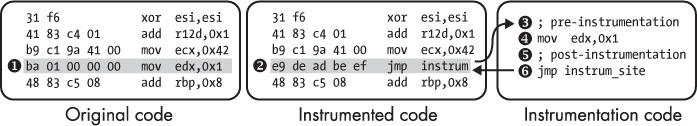
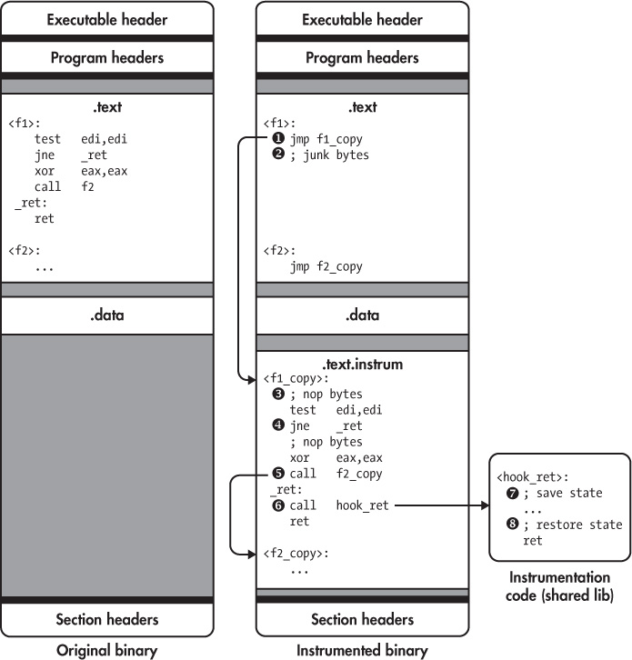
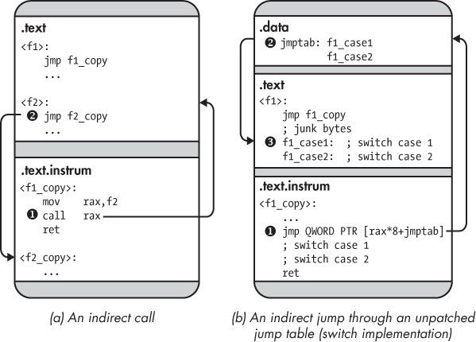
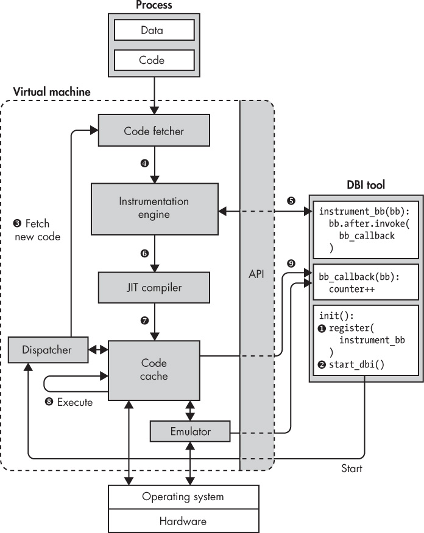
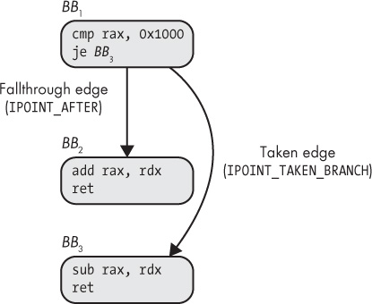
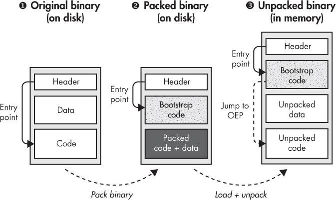
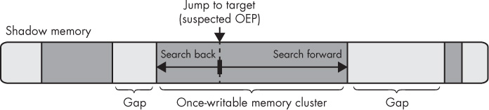
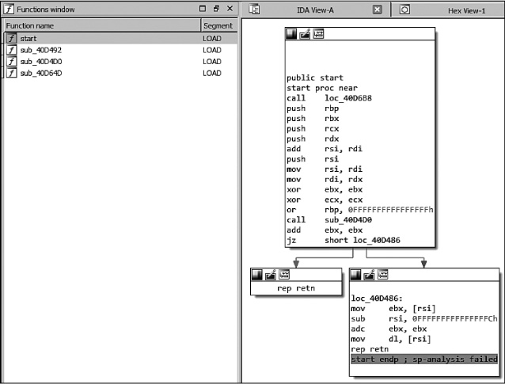
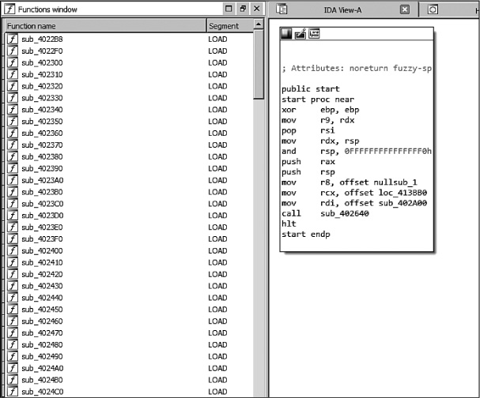

## 9 BINARY INSTRUMENTATION

In Chapter 7, you learned several techniques for modifying and augmenting binary programs. While relatively simple to use, those techniques are limited in the amount of new code you can insert into the binary and where you can insert it. In this chapter, you’ll learn about a technique called *binary instrumentation* that allows you to insert a practically unlimited amount of code at any location in a binary to observe or modify that binary’s behavior.

After a brief overview of binary instrumentation, I’ll discuss how to implement *static binary instrumentation (SBI)* and *dynamic binary instrumentation (DBI)*, two types of binary instrumentation with different trade-offs. Finally, you’ll learn how to build your own binary instrumentation tools with Pin, a popular DBI system made by Intel.

### 9.1 What Is Binary Instrumentation?

Inserting new code at any point in an existing binary to observe or modify the binary’s behavior in some way is called *instrumenting* the binary. The point where you add new code is called the *instrumentation point*, and the added code is called *instrumentation code*.

For example, let’s say you want to know which functions in a binary are called most often so that you can focus on optimizing those functions. To find this out, you can instrument all `call` instructions in the binary,^(1) adding instrumentation code that records the target of the call so that the instrumented binary produces a list of called functions when you execute it.

Although this example only observes the binary’s behavior, you can also modify it. For instance, you can improve a binary’s security against control-flow-hijacking attacks by instrumenting all indirect control transfers (such as `call rax` and `ret`) with code that checks whether the control-flow target is in a set of expected targets. If not, you abort the execution and raise an alert.^(2)

#### *9.1.1 Binary Instrumentation APIs*

Generic binary instrumentation that allows you to add new code at every point in a binary is far more difficult to implement correctly than the simple binary modification techniques you saw in Chapter 7. Recall that you cannot simply insert new code into an existing binary code section because the new code will shift existing code to different addresses, thereby breaking references to that code. It’s practically impossible to locate and patch all existing references after moving code around, because binaries don’t contain any information that tells you where these references are and there’s no way to reliably distinguish referenced addresses from constants that *look* like addresses but aren’t.

Fortunately, there are generic binary instrumentation platforms you can use to handle all of the implementation complexities for you, and they offer relatively easy-to-use APIs with which you can implement binary instrumentation tools. These APIs typically allow you to install callbacks to instrumentation code at instrumentation points of your choice.

Later in this chapter, you’ll see two practical examples of binary instrumentation using Pin, a popular binary instrumentation platform. You’ll use Pin to implement a profiler that records statistics about a binary’s execution to aid optimization. You’ll also use Pin to implement an automatic unpacker that helps you deobfuscate *packed binaries*.^(3)

You can distinguish two classes of binary instrumentation platforms: static and dynamic. Let’s first discuss the differences between these two classes and then explore how they work at a low level.

#### *9.1.2 Static vs. Dynamic Binary Instrumentation*

Static and dynamic binary instrumentation solve the difficulties with inserting and relocating code using different approaches. SBI uses *binary rewriting* techniques to permanently modify binaries on disk. You’ll learn about the various binary rewriting approaches that SBI platforms use in Section 9.2.

On the other hand, DBI doesn’t modify binaries on disk at all but instead monitors binaries as they execute and inserts new instructions into the instruction stream on the fly. The advantage of this approach is that it avoids code relocation issues. The instrumentation code is injected only into the instruction stream, not into the binary’s code section in memory, so it doesn’t break references. However, the trade-off is that DBI’s runtime instrumentation is more computationally expensive, causing larger slowdowns in the instrumented binary than SBI.

Table 9-1 summarizes the main advantages and disadvantages of SBI and DBI, showing advantages with a + symbol and disadvantages with a – symbol.

**Table 9-1:** Trade-offs of Dynamic and Static Binary Instrumentation

| Dynamic instrumentation – Relatively slow (4 times or more) – Depends on DBI library and tool + Transparently instruments libraries + Handles dynamically generated code + Can dynamically attach/detach + No need for disassembly + Transparent, no need to modify binary + No symbols needed | Static instrumentation + Relatively fast (10% to 2 times) + Stand-alone binary – Must explicitly instrument libraries – Dynamically generated code unsupported – Instruments entire execution – Prone to disassembly errors – Error-prone binary rewriting – Symbols preferable to minimize errors |
|------------------------------------------------------------------------------------------------------------------------------------------------------------------------------------------------------------------------------------------------------------------------------------------------|----------------------------------------------------------------------------------------------------------------------------------------------------------------------------------------------------------------------------------------------------------------------------------------------------|

As you can see, DBI’s need for runtime analysis and instrumentation induces slowdowns of four times or more, while SBI only induces a slowdown of 10 percent to two times. Note that these are ballpark numbers, and the actual slowdown can vary significantly depending on your instrumentation needs and the implementation quality of your tool. Moreover, binaries instrumented with DBI are more difficult to distribute: you have to ship not only the binary itself but also the DBI platform and tool that contain the instrumentation code. On the other hand, binaries instrumented with SBI are stand-alone, and you can distribute them normally once the instrumentation is done.

A major advantage of DBI is that it’s much easier to use than SBI. Because DBI uses runtime instrumentation, it automatically accounts for all executed instructions, whether those are part of the original binary or of libraries used by the binary. In contrast, with SBI you have to explicitly instrument and distribute all libraries that the binary uses, unless you’re willing to leave those libraries uninstrumented. The fact that DBI operates on the executed instruction stream also means that it supports dynamically generated code that SBI cannot support, such as JIT-compiled code or self-modifying code.

Additionally, DBI platforms can typically attach to and detach from processes dynamically, just like debuggers can. That’s convenient if you want to observe part of the execution of a long-running process, for example. With DBI, you can simply attach to that process, gather the information you want, and then detach, leaving the process running normally again. With SBI, this is not possible; you either instrument the entire execution or don’t instrument at all.

Finally, DBI is far less error-prone than SBI. SBI instruments binaries by disassembling them and then making any needed changes. That means disassembly errors can easily cause errors in the instrumentation, potentially causing incorrect results or even breaking the binary. DBI doesn’t have this problem because it doesn’t require disassembly; it simply observes instructions as they’re being executed, so it’s guaranteed to see the correct instruction stream.^(4) To minimize the possibility of disassembly errors, many SBI platforms require symbols, while DBI has no such requirement.^(5)

As I mentioned earlier, there are various ways to implement SBI’s binary rewriting and DBI’s runtime instrumentation. In the next two sections, let’s look at the most popular ways to implement SBI and DBI, respectively.

### 9.2 Static Binary Instrumentation

Static binary instrumentation works by disassembling a binary and then adding instrumentation code where needed and storing the updated binary permanently on disk. Well-known SBI platforms include PEBIL^(6) and Dyninst^(7) (which supports both DBI and SBI). PEBIL requires symbols while Dyninst does not. Note that both PEBIL and Dyninst are research tools, so they’re not as well documented as a production-quality tool.

The main challenge in implementing SBI is finding a way to add the instrumentation code and rewrite the binary without breaking any existing code or data references. Let’s consider two popular solutions to this challenge, which I call the *int 3 approach* and the *trampoline approach*. Note that, in practice, SBI engines may incorporate elements from both these techniques or use another technique entirely.

#### *9.2.1 The int 3 Approach*

The *int 3 approach* gets its name from the x86 `int 3` instruction, which debuggers use to implement software breakpoints. To illustrate the need for `int 3`, let’s first consider an SBI approach that does *not* work in the general case.

### A Naive SBI Implementation

Given the practical impossibility of fixing all references to relocated code, it’s clear that SBI cannot store the instrumentation code inline in an existing code section. Because there’s no room for arbitrary amounts of new code in the existing code sections, it follows that SBI approaches must store instrumentation code in a separate location, such as a new section or a shared library, and then somehow transfer control to the instrumentation code when execution reaches an instrumentation point. To achieve this, you might come up with the solution shown in Figure 9-1.



*Figure 9-1: A nongeneric SBI approach that uses* `jmp` *to hook instrumentation points*

The leftmost column of Figure 9-1 shows a chunk of original, uninstrumented code. Let’s say you want to instrument the instruction `mov edx,0x1` ➊, adding instrumentation code to run before and after that instruction. To get around the problem that there’s no room to add the new code inline, you overwrite `mov edx,0x1` with a `jmp` to your instrumentation code ➋, stored in a separate code section or library. The instrumentation code first runs any *pre-instrumentation* code that you added ➌, which is code that runs before the original instruction. Next, it runs the original `mov edx,0x1` instruction ➍ and then the *post-instrumentation* code ➎. Finally, the instrumentation code jumps back to the instruction following the instrumentation point ➏, resuming normal execution.

Note that if the pre-instrumentation or post-instrumentation code changes register contents, that may inadvertently affect other parts of the program. That’s why SBI platforms store the register state before running this added code and restore the state afterward, unless you explicitly tell the SBI platform that you *want* to change the register state.

As you can see, the approach in Figure 9-1 is a simple and elegant way to run arbitrary amounts of code of your choice before or after any instruction. So what’s the problem with this approach? The issue is that `jmp` instructions take up multiple bytes; to jump to instrumentation code, you typically need a 5-byte `jmp` instruction that consists of 1 opcode byte with a 32-bit offset.

When you instrument a short instruction, the `jmp` to your instrumentation code may be longer than the instruction it replaces. For example, the `xor esi,esi` instruction at the top left of Figure 9-1 is only 2 bytes long, so if you replace that with a 5-byte `jmp`, the `jmp` will overwrite and corrupt part of the next instruction. You can’t solve this issue by making that next overwritten instruction part of the instrumentation code because the instruction may be a branch target. Any branches targeting that instruction would end up in the middle of the `jmp` you inserted, breaking the binary.

This brings us back to the `int 3` instruction. You can use the `int 3` instruction to instrument short instructions where multibyte jumps don’t fit, as you’ll see next.

### Solving the Multibyte Jump Problem with int 3

The x86 `int 3` instruction generates a software interrupt that user-space programs like SBI libraries or debuggers can catch (on Linux) in the form of a `SIGTRAP` signal delivered by the operating system. The key detail about `int 3` is that it’s only 1 byte long, so you can overwrite any instruction with it without fear of overwriting a neighboring instruction. The opcode for `int 3` is `0xcc`.

From an SBI viewpoint, to instrument an instruction using `int3`, you simply overwrite the first byte of that instruction with `0xcc`. When a `SIGTRAP` happens, you can use Linux’s `ptrace` API to find out at which address the interrupt occurred, telling you the instrumentation point address. You can then invoke the appropriate instrumentation code for that instrumentation point, just as you saw in Figure 9-1.

From a purely functional standpoint, `int 3` is an ideal way to implement SBI because it’s easy to use and doesn’t require any code relocation. Unfortunately, software interrupts like `int 3` are slow, causing excessive overhead in the instrumented application. Moreover, the *int 3 approach* is incompatible with programs that are already being debugged using `int 3` for breakpoints. That’s why in practice many SBI platforms use more complicated but faster rewriting methods, such as the trampoline approach.

#### *9.2.2 The Trampoline Approach*

Unlike the `int 3` approach, the trampoline approach makes no attempt to instrument the original code directly. Instead, it creates a copy of all the original code and instruments only this copied code. The idea is that this won’t break any code or data references because these all still point to the original, unchanged locations. To ensure that the binary runs the instrumented code instead of the original code, the trampoline approach uses `jmp` instructions called *trampolines* to redirect the original code to the instrumented copy. Whenever a call or jump transfers control to a part of the original code, the trampoline at that location immediately jumps to the corresponding instrumented code.

To clarify the trampoline approach, consider the example shown in Figure 9-2. The figure shows an uninstrumented binary on the left side, while the right side shows how that binary transforms when you instrument it.



*Figure 9-2: Static binary instrumentation with trampolines*

Let’s assume the original noninstrumented binary contains two functions called `f1` and `f2`. Figure 9-2 shows that `f1` contains the following code. The contents of `f2` are not important for this example.

```
<f1>:
  test edi,edi
  jne _ret
  xor eax,eax
  call f2
_ret:
  ret
```

When you instrument a binary using the trampoline approach, the SBI engine creates copies of all the original functions, places them in a new code section (called `.text.instrum` in Figure 9-2), and overwrites the first instruction of each original function with a `jmp` trampoline that jumps to the corresponding copied function. For example, the SBI engine rewrites the original `f1` as follows to redirect it to `f1_copy`:

```
<f1>:
  jmp f1_copy
  ; junk bytes
```

The trampoline instruction is a 5-byte `jmp`, so it may partially overwrite and corrupt multiple instructions, creating “junk bytes” just after the trampoline. However, this isn’t normally a problem for the trampoline approach because it ensures that these corrupted instructions are never executed. You’ll see some cases where this may go wrong at the end of this section.

### Trampoline Control Flow

To get a better sense of the control flow of a program instrumented with the trampoline approach, let’s return to the right side of Figure 9-2 showing the instrumented binary and assume that the original `f1` function has just been called. As soon as `f1` is called, the trampoline jumps to `f1_copy` ➊, the instrumented version of `f1`. There may be some junk bytes following the trampoline ➋, but these aren’t executed.

The SBI engine inserts several `nop` instructions at every possible instrumentation point in `f1_copy` ➌. That way, to instrument an instruction, the SBI engine can simply overwrite the `nop` instructions at that instrumentation point with a `jmp` or `call` to a chunk of instrumentation code. Note that both the `nop` insertion and the instrumentation are done statically, not at runtime. In Figure 9-2, all of the `nop` regions are unused except for the last one, just before the `ret` instruction, as I’ll explain in a moment.

To maintain the correctness of relative jumps despite the code shifting because of newly inserted instructions, the SBI engine patches the offsets of all relative `jmp` instructions. Additionally, the engine replaces all 2-byte relative `jmp` instructions, which have an 8-bit offset, with a corresponding 5-byte version that has a 32-bit offset ➍. This is necessary because as you shift code around in `f1_copy`, the offset between `jmp` instructions and their targets may become too large to encode in 8 bits.

Similarly, the SBI engine rewrites direct calls, such as `call f2`, so that they target the instrumented function instead of the original ➎. Given this rewriting of direct calls, you may wonder why the trampolines at the start of every original function are needed at all. As I’ll explain in a moment, they’re necessary to accommodate indirect calls.

Now let’s assume you’ve told the SBI engine to instrument every `ret` instruction. To do this, the SBI engine overwrites the `nop` instructions reserved for this purpose with a `jmp` or `call` to your instrumentation code ➏. In the example of Figure 9-2, the instrumentation code is a function named `hook_ret`, which is placed in a shared library and reached by a `call` that the SBI engine placed at the instrumentation point.

The `hook_ret` function first saves state ➐, such as register contents, and then runs any instrumentation code that you specified. Finally, it restores the saved state ➑ and resumes normal execution by returning to the instruction following the instrumentation point.

Now that you’ve seen how the trampoline approach rewrites direct control flow instructions, let’s take a look at how it handles indirect control flow.

### Handling Indirect Control Flow

Because indirect control flow instructions target dynamically computed addresses, there’s no reliable way for SBI engines to statically redirect them. The trampoline approach allows indirect control transfers to flow to original, uninstrumented code and uses trampolines placed in the original code to intercept and redirect the control flow back to the instrumented code. Figure 9-3 shows how the trampoline approach handles two types of indirect control flow: indirect function calls and indirect jumps used to implement C/C++ `switch` statements.



*Figure 9-3: Indirect control transfers in a statically instrumented binary*

Figure 9-3a shows how the trampoline approach handles indirect calls. The SBI engine doesn’t alter code that computes addresses, so the target addresses used by indirect calls point to the original function ➊. Because there’s a trampoline at the start of every original function, control flows immediately back to the instrumented version of the function ➋.

For indirect jumps, things are more complicated, as you can see in Figure 9-3b. For the purposes of this example, let’s assume an indirect jump that’s part of a C/C++ `switch` statement. At the binary level, switch statements are often implemented using a *jump table* that contains all the addresses of the possible `switch` cases. To jump to a particular case, the `switch` computes the corresponding jump table index and uses an indirect `jmp` to jump to the address stored there ➊.

Trampolines in Position-Independent Code

SBI engines based on the trampoline approach require special support for indirect control flows in position-independent executables (PIE binaries), which don’t depend on any particular load address. PIE binaries read the value of the program counter and use it as the basis for address computations. On 32-bit x86, PIE binaries read the program counter by executing a `call` instruction and then reading the return address from the stack. For example, `gcc 5.4.0` emits the following function that you can call to read the address of the instruction after the `call`:

```
<__x86.get_pc_thunk.bx>:
  mov ebx,DWORD PTR [esp]
  ret
```

This function copies the return address into `ebx` and then returns. On x64, you can read the program counter (`rip`) directly.

The danger with PIE binaries is that they may read the program counter while running instrumented code and use it in address computations. This likely yields incorrect results because the layout of the instrumented code differs from the original layout that the address computation assumes. To solve this, SBI engines instrument code constructs that read the program counter such that they return the value the program counter would have in the original code. That way, subsequent address computations yield the original code location just as in an uninstrumented binary, allowing the SBI engine to intercept control there with a trampoline.

By default, the addresses stored in the jump table all point into the original code ➋. Thus, the indirect `jmp` ends up in the middle of an original function, where there’s no trampoline, and resumes execution there ➌. To avoid this problem, the SBI engine must either patch the jump table, changing original code addresses to new ones, or place a trampoline at every `switch` case in the original code.

Unfortunately, basic symbolic information (as opposed to extensive DWARF information) contains no information on the layout of `switch` statements, making it hard to figure out where to place the trampolines. Additionally, there may not be enough room between the `switch` statements to accommodate all trampolines. Patching jump tables is also dangerous because you risk erroneously changing data that just happens to be a valid address but isn’t really part of a jump table.

### Reliability of the Trampoline Approach

As you can tell from the problems handling `switch` statements, the trampoline approach is error-prone. Similar to `switch` cases that are too small to accommodate a normal trampoline, programs may (however unlikely) contain very short functions that don’t have enough room for a 5-byte `jmp`, requiring the SBI engine to fall back to another solution like the `int 3` approach. Moreover, if the binary contains any inline data mixed in with the code, trampolines may inadvertently overwrite part of that data, causing errors when the program uses the data. All this is assuming that the disassembly used is correct in the first place; if it’s not, any changes made by the SBI engine may break the binary.

Unfortunately, there’s no known SBI technique that’s both efficient and sound, making SBI dangerous to use on production binaries. In many cases, DBI solutions are preferable, because they’re not prone to the errors SBI faces. Although they’re not as fast as SBI, modern DBI platforms perform efficiently enough for many practical use cases. The rest of this chapter focuses on DBI, specifically on a well-known DBI platform called Pin. Let’s take a look at some of DBI’s implementation details and then explore practical examples.

### 9.3 Dynamic Binary Instrumentation

Because DBI engines monitor binaries (or rather, processes) as they execute and instrument the instruction stream, they don’t require disassembly or binary rewriting like SBI does, making them less error-prone.

Figure 9-4 shows the architecture of modern DBI systems like Pin and DynamoRIO. These systems are all based on the same high-level approach, although they differ in implementation details and optimizations. I’ll focus the rest of this chapter on the kind of “pure” DBI systems shown in the figure, rather than hybrid platforms like Dyninst that support both SBI and DBI by using code-patching techniques such as trampolines.

#### *9.3.1 Architecture of a DBI System*

DBI engines dynamically instrument processes by monitoring and controlling all the executed instructions. The DBI engine exposes an API that allows you to write user-defined DBI tools (often in the form of a shared library loaded by the engine) that specify which code should be instrumented and how. For example, the DBI tool shown on the right side of Figure 9-4 implements (in pseudocode) a simple profiler that counts how many basic blocks are executed. To achieve that, it uses the DBI engine’s API to instrument the last instruction of every basic block with a callback to a function that increments a counter.

Before the DBI engine starts the main application process (or resumes it, if you attach to an existing process), it allows the DBI tool to initialize itself. In Figure 9-4, the DBI tool’s initialization function registers a function called `instrument_bb` with the DBI engine ➊. This function tells the DBI engine how to instrument every basic block; in this case, it adds a callback to `bb_callback` after the last instruction in the basic block. Next, the initialization function informs the DBI engine that it’s done initializing and ready to start the application ➋.



*Figure 9-4: Architecture of a DBI system*

The DBI engine never runs the application process directly but instead runs code in a *code cache* that contains all the instrumented code. Initially, the code cache is empty, so the DBI engine fetches a block of code from the process ➌ and instruments that code ➍ as instructed by the DBI tool ➎. Note that DBI engines don’t necessarily fetch and instrument code at basic block granularity, as I’ll explain further in Section 9.4. However, for this example I’ll assume that the engine instruments code at basic block granularity by calling `instrument_bb`.

After instrumenting the code, the DBI engine compiles it with a just-intime (JIT) compiler ➏, which re-optimizes the instrumented code and stores the compiled code in the code cache ➐. The JIT compiler also rewrites control flow instructions to ensure that the DBI engine retains control, preventing control transfers from continuing execution in the uninstrumented application process. Note that unlike most compilers, the JIT compiler in a DBI engine doesn’t translate the code into a different language; it compiles from native machine code to native machine code. It’s only necessary to instrument and JIT-compile code the first time it’s executed. After that, it’s stored in the code cache and reused.

The instrumented and JIT-compiled code now executes in the code cache until there’s a control-flow instruction that requires fetching new code or looking up another code chunk in the cache ➑ DBI engines like Pin and DynamoRIO reduce runtime overhead by rewriting control-flow instructions when possible, so they jump directly to the next block in the code cache without mediation by the DBI engine. When that’s not possible (for example, for indirect calls), the rewritten instructions return control to the DBI engine so that it can prepare and start the next code chunk.

While most instructions run natively in the code cache, the DBI engine may emulate some instructions instead of running them directly. For example, Pin does this for system calls like `execve` that require special handling by the DBI engine.

The instrumented code contains callbacks to functions in the DBI tool that observe or modify the code’s behavior ➒. For instance, in Figure 9-4, the DBI tool’s `instrument_bb` function adds a callback at the end of every basic block that invokes `bb_callback`, which increments the DBI tool’s basic block counter. The DBI engine automatically saves and restores register state when transferring control to or from a callback function in the DBI tool.

Now that you’re familiar with the workings of DBI engines, let’s discuss Pin, the DBI engine I’ll use for the examples in this chapter.

#### *9.3.2 Introduction to Pin*

One of the most popular DBI platforms, Intel Pin is an actively developed, free-to-use (though not open source), and well-documented tool that offers a relatively easy-to-use API.^(8) You’ll find Pin v3.6 preinstalled on the virtual machine in *~/pin/pin-3.6-97554-g31f0a167d-gcc-linux*. Pin ships with many example tools that you can find in the *source/tools* subdirectory of the main Pin directory.

### Pin Internals

Pin currently supports Intel CPU architectures including x86 and x64 and is available for Linux, Windows, and macOS. Its architecture is similar to Figure 9-4. Pin fetches and JIT-compiles code at *trace* granularity, a basic block-like abstraction that can be entered only at the top but may contain multiple exits, unlike regular basic blocks.^(9) Pin defines a trace as a straight-line instruction sequence that ends when it hits an unconditional control transfer or reaches a predefined maximum length or number of conditional control-flow instructions.

Although Pin always JIT-compiles code at trace granularity, it allows you to instrument code at many granularities, including instruction, basic block, trace, function, and image (a complete executable or library). Both Pin’s DBI engine and Pintools run in user space, so you can only instrument user-space processes with Pin.

### Implementing Pintools

The DBI tools you implement with Pin are called *Pintools*, which are shared libraries that you write in C/C++ using the Pin API. The Pin API is architecture independent as far as possible, using architecture-specific components only when needed. This allows you to write Pintools that are portable between architectures or require only minimal changes to support another architecture.

To create a Pintool, you write two different kinds of functions: *instrumentation routines* and *analysis routines*. Instrumentation routines tell Pin which instrumentation code to add and where; these functions run only the first time Pin encounters a particular piece of code that’s not yet instrumented. To instrument code, the instrumentation routines install callbacks to analysis routines that contain the actual instrumentation code and are called every time an instrumented code sequence runs.

Note that you shouldn’t confuse Pin’s *instrumentation routines* with the SBI term *instrumentation code*. Instrumentation code is new code added to an instrumented program and corresponds to Pin’s analysis routines, not to the instrumentation routines that insert the callbacks to the analysis routines. The distinction between instrumentation and analysis routines will become clearer in the practical examples that follow.

Because of Pin’s popularity, many other binary analysis platforms are based on it. For example, you’ll see Pin again in Chapters 10 through 13 about dynamic taint analysis and symbolic execution.

In this chapter, you’ll see two practical examples implemented with Pin: a profiling tool and an automatic unpacker. In the course of implementing these tools, you’ll learn about Pin’s internals, such as the instrumentation points it supports. Let’s start with the profiling tool.

### 9.4 Profiling with Pin

The profiling tool records statistics about a program’s execution to help optimize that program. Specifically, it counts the number of executed instructions and the number of times basic blocks, functions, and syscalls are invoked.

#### *9.4.1 The Profiler’s Data Structures and Setup Code*

Listing 9-1 shows the first part of the profiler’s code. The following discussion omits standard includes and functions that don’t use any Pin functionality, such as the usage function and the function that prints the results. You can see these in the *profiler.cpp* source file on the VM. I’ll refer to the profiler Pintool as “the Pintool” or “the profiler” and to the profiled program, which the profiler instruments, as “the application.”

*Listing 9-1:* profiler.cpp

```
➊ #include "pin.H"

➋ KNOB<bool> ProfileCalls(KNOB_MODE_WRITEONCE, "pintool", "c", "0", "Profile function calls");
   KNOB<bool> ProfileSyscalls(KNOB_MODE_WRITEONCE, "pintool", "s", "0", "Profile syscalls");

➌ std::map<ADDRINT, std::map<ADDRINT, unsigned long> > cflows;
   std::map<ADDRINT, std::map<ADDRINT, unsigned long> > calls;
   std::map<ADDRINT, unsigned long> syscalls;
   std::map<ADDRINT, std::string> funcnames;

   unsigned long insn_count    = 0;
   unsigned long cflow_count   = 0;
   unsigned long call_count    = 0;
   unsigned long syscall_count = 0;

   int
   main(int argc, char *argv[])
   {
➍   PIN_InitSymbols();
➎   if(PIN_Init(argc,argv)) {
       print_usage();
       return 1;
     }

➏   IMG_AddInstrumentFunction(parse_funcsyms, NULL);
     TRACE_AddInstrumentFunction(instrument_trace, NULL);
     INS_AddInstrumentFunction(instrument_insn, NULL);
➐   if(ProfileSyscalls.Value()) {
       PIN_AddSyscallEntryFunction(log_syscall, NULL);
     }


➑   PIN_AddFiniFunction(print_results, NULL);

     /* Never returns */
➒   PIN_StartProgram();

     return 0;
   }
```

Every Pintool must include *pin.H* to access the Pin API ➊.^(10) This single header file provides the entire API.

Note that Pin observes the program starting from the first instruction, which means the profiler sees not only the application code but also the instructions executed by the dynamic loader and shared libraries. This is important to keep in mind for all Pintools that you write.

### Command Line Options and Data Structures

Pintools can implement tool-specific command line options, which are called *knobs* in Pin parlance. The Pin API includes a dedicated `KNOB` class that you use to create command line options. In Listing 9-1, there are two Boolean options (`KNOB<bool>`) ➋ called `ProfileCalls` and `ProfileSyscalls`. The options use mode `KNOB_MODE_WRITEONCE` because they’re Boolean flags that are set only once when you supply the flag. You enable the `ProfileCalls` option by passing the flag `-c` to the Pintool, and you enable `ProfileSyscalls` by passing `-s`. (You’ll see how to pass these options in the profiler tests.) Both options have the default value 0, meaning they’re false if you don’t pass the flag. Pin also allows you to create other types of command line options, such as `string` or `int` options. To learn more about these options, you can refer to the Pin documentation online or take a look at the example tools.

The profiler uses multiple `std::map` data structures and counters to keep track of the program’s runtime statistics ➌. The `cflows` and `calls` data structures map addresses of control flow targets (basic blocks or functions) to another map that in turn tracks the addresses of the control flow instructions (jumps, calls, and so on) that invoked each target and counts how often that control transfer was taken. The `syscall` map simply tracks how often each syscall number was invoked, and `funcnames` maps function addresses to symbolic names, if known. The counters (`insn_count`, `cflow_count`, `call_count`, and `syscall_count`) track the total number of executed instructions, control flow instructions, calls, and syscalls, respectively.

### Initializing Pin

Like normal C/C++ programs, Pintools start in the `main` function. The first Pin function that the profiler calls is `PIN_InitSymbols` ➍, which causes Pin to read the application’s symbol tables. To use symbols in your Pintool, Pin requires that you call `PIN_InitSymbols` before any other Pin API function. The profiler uses symbols when they’re available to show human-readable statistics on how often each function was called.

The next function the profiler calls is `PIN_Init` ➎, which initializes Pin and must be called before any other Pin function except `PIN_InitSymbols`. It returns `true` if anything went wrong during initialization, in which case the profiler prints usage instructions and exits. The `PIN_Init` function processes Pin’s command line options as well as your Pintool’s options as specified by the `KNOB`s you created. Usually, your Pintool won’t need to implement any of its own command line processing code.

### Registering Instrumentation Functions

Now that Pin is initialized, it’s time to initialize the Pintool. The most important part of that is registering the instrumentation routines that are responsible for instrumenting the application.

The profiler registers three instrumentation routines ➏. The first of these, called `parse_funcsyms`, instruments at image granularity, while `instrument_trace` and `instrument_insn` instrument at trace and instruction granularity, respectively. To register these routines with Pin, you call `IMG _AddInstrumentFunction`, `TRACE_AddInstrument Function`, and `INS_AddInstrument Function`, respectively. Note that you can add as many instrumentation routines of each type as you want.

As you’ll see shortly, the three instrumentation routines take an `IMG`, a `TRACE`, and an `INS` object as their first parameter, respectively, depending on their type. Additionally, they all take a `void*` as their second parameter, which allows you to pass a Pintool-specific data structure that you specify when you register the instrumentation routines using `*_AddInstrument Function`. The profiler doesn’t use this facility (it passes `NULL` for each `void*`).

### Registering a Syscall Entry Function

Pin also allows you to register functions that are called before or after every syscall, in the same way as you register instrumentation callbacks. Note that you can’t specify callbacks for only some syscalls; you can only differentiate between syscalls inside the callback function.

The profiler uses `PIN_AddSyscallEntryFunction` to register a function named `log_syscall` that’s called whenever a syscall is entered ➐. To register a callback that triggers when a syscall exits, use `PIN_AddSyscallExitFunction` instead. The profiler registers the callback only if `ProfileSyscalls.Value()`, the value of the `ProfileSyscalls` knob, is `true`.

### Registering a Fini Function

The final callback that the profiler registers is a *fini function*, which is called when the application exits or when you detach Pin from it ➑. Fini functions receive an exit status code (an `INT32`) and a user-defined `void*`. To register a fini function, you use `PIN_AddFiniFunction`. Note that fini functions may not be called reliably for some programs, depending on how the program exits.

The fini function that the profiler registers is responsible for printing the profiling results. I won’t discuss it here because it doesn’t contain any Pin-specific code, but you can see the output of `print_results` when testing the profiler.

### Starting the Application

The last step of every Pintool’s initialization is to call `PIN_StartProgram`, which starts the application running ➒. After that, it’s no longer possible to register any new callbacks; the Pintool gets back control only when an instrumentation or analysis routine is called. The `PIN_StartProgram` function never returns, meaning that the `return 0` at the end of `main` is never reached.

#### *9.4.2 Parsing Function Symbols*

Now that you know how to initialize a Pintool and register instrumentation routines and other callbacks, let’s take a detailed look at the callback functions just registered. Let’s start with `parse_funcsyms`, shown in Listing 9-2.

*Listing 9-2:* profiler.cpp *(continued)*

```
   static void
   parse_funcsyms(IMG img, void *v)
   {
➊    if(!IMG_Valid(img)) return;

➋    for(SEC sec = IMG_SecHead(img); SEC_Valid(sec); sec = SEC_Next(sec)) {
➌      for(RTN rtn = SEC_RtnHead(sec); RTN_Valid(rtn); rtn = RTN_Next(rtn)) {
➍        funcnames[RTN_Address(rtn)] = RTN_Name(rtn);
        }
      }
   }
```

Recall that `parse_funcsyms` is an image-granularity instrumentation routine, which you can tell because it receives an `IMG` object as its first argument. Image instrumentation routines are called when a new image (an executable or shared library) loads, allowing you to instrument the image as a whole. Among other things, this lets you loop over all the functions in the image and add analysis routines that run before or after each function. Note that function instrumentation is reliable only if the binary contains symbolic information, and after-function instrumentation doesn’t work with some optimizations, such as tail calls.

However, `parse_funcsyms` doesn’t add any instrumentation at all. Instead, it takes advantage of another feature of image instrumentation, which lets you inspect the symbolic names of all functions in the image. The profiler saves these names so that it can read them back later to show human-readable function names in the output.

Before using its `IMG` argument, `parse_funcsyms` calls `IMG_Valid` to ensure that it’s a valid image ➊. If it is, `parse_funcsyms` loops over all the `SEC` objects in the image, which represent all the sections ➋. `IMG_SecHead` returns the first section in the image, and `SEC_Next` returns the next section; the loop continues until `SEC_Valid` returns `false`, indicating that there’s no next remaining section.

For each section, `parse_funcsyms` loops over all the functions (represented by `RTN` objects, as in “routine”) ➌ and maps each function’s address (as returned by `RTN_Address`) in the `funcnames` map to the symbolic name of the function (as returned by `RTN_Name`) ➍. If the function’s name is not known (for example, when the binary has no symbol table), `RTN_Name` returns an empty string.

After `parse_funcsyms` completes, `funcnames` contains a mapping of all known function addresses to symbolic names.

#### *9.4.3 Instrumenting Basic Blocks*

Recall that one of the things the profiler records is the number of instructions the program executes. To that end, the profiler instruments every basic block with a call to an analysis function that increases the instruction counter (`insn_count`) by the number of instructions in the basic block.

### A Few Notes on Basic Blocks in Pin

Because Pin discovers basic blocks dynamically, the basic blocks that Pin finds may differ from what you would find based on static analysis. For example, Pin may initially find a large basic block, only to later discover a jump into the middle of that basic block, forcing Pin to renew its decision, break the basic block in two, and reinstrument both basic blocks. Although this doesn’t matter for the profiler since it doesn’t care about the shape of basic blocks, only the number of executed instructions, it’s important to keep in mind to prevent confusion with some Pintools.

Also note that as an alternative implementation, you could increment `insn_count` on every instruction. However, that would be significantly slower than the basic block-level implementation because it requires one callback per instruction to the analysis function that increments `insn_count`. In contrast, the basic block-level implementation requires only one callback per basic block. When writing a Pintool, it’s important to optimize the analysis routines as much as you can because they’re called repeatedly throughout the execution, unlike instrumentation routines, which are called only the first time a piece of code is encountered.

### Implementing Basic Block Instrumentation

You can’t directly instrument basic blocks in the Pin API. That is, there’s no `BBL_AddInstrumentFunction`. To instrument basic blocks, you have to add a trace-level instrumentation routine and then loop over all the basic blocks in the trace, instrumenting each one, as shown in Listing 9-3.

*Listing 9-3:* profiler.cpp *(continued)*

```
   static void
   instrument_trace(TRACE trace, void *v)
   {
➊    IMG img = IMG_FindByAddress(TRACE_Address(trace));
     if(!IMG_Valid(img) || !IMG_IsMainExecutable(img)) return;

➋    for(BBL bb = TRACE_BblHead(trace); BBL_Valid(bb); bb = BBL_Next(bb)) {
➌      instrument_bb(bb);
     }
   }

   static void
   instrument_bb(BBL bb)
   {
➍    BBL_InsertCall(
       bb, ➎IPOINT_ANYWHERE, ➏(AFUNPTR)count_bb_insns,
       ➐IARG_UINT32, BBL_NumIns(bb),
       ➑IARG_END
     );
   }
```

The first function in the listing, `instrument_trace`, is the trace-level instrumentation routine that the profiler registered earlier. Its first argument is the `TRACE` to instrument.

First, `instrument_trace` calls `IMG_FindByAddress` with the trace’s address to find the `IMG` that the trace is part of ➊. Next, it verifies that the image is valid and calls `IMG_IsMainExecutable` to check that the trace is part of the main application executable. If not, `instrument_trace` returns without instrumenting the trace. The rationale behind this is that when you’re profiling an application, you typically want to count code only inside the application itself, not code in shared libraries or the dynamic loader.

If the trace is valid and part of the main application, `instrument_trace` loops over all the basic blocks (`BBL` objects) in the trace ➋. For each `BBL`, it calls `instrument_bb` ➌, which performs the actual instrumentation of each `BBL`.

To instrument a given `BBL`, `instrument_bb` calls `BBL_InsertCall` ➍, which is Pin’s API function to instrument a basic block with an analysis routine callback. The `BBL_InsertCall` function takes three mandatory arguments: the basic block to instrument (`bb` in this case), an *insertion point*, and a function pointer to the analysis routine you want to add.

The insertion point determines where in the basic block Pin inserts the analysis callback. In this case, the insertion point is `IPOINT_ANYWHERE` ➎ because it doesn’t matter at what point in the basic block the instruction counter is updated. This allows Pin to optimize the placement of the analysis callback. Table 9-2 shows all the possible insertion points. These apply not only for basic block-level instrumentation but also for instruction instrumentation and all other granularities.

The name of the analysis routine is `count_bb_insns` ➏, and you’ll see its implementation in a moment. Pin provides an `AFUNPTR` type that you should cast function pointers to when passing them to Pin API functions.

Table 9-2: Pin Insertion Points

| Insertion point       | Analysis callback                                        | Validity                      |
|-----------------------|----------------------------------------------------------|-------------------------------|
| `IPOINT_BEFORE`       | Before instrumented object                               | Always valid                  |
| `IPOINT_AFTER`        | On fallthrough edge (of branch or “regular” instruction) | If INS_HasFallthrough is true |
| `IPOINT_ANYWHERE`     | Anywhere in instrumented object                          | For TRACE or BBL only         |
| `IPOINT_TAKEN_BRANCH` | On taken edge of branch                                  | If INS_IsBranchOrCall is true |

After the mandatory arguments to `BBL_InsertCall`, you can add optional arguments to pass to the analysis routine. In this case, there’s an optional argument of type `IARG_UINT32` ➐ with value `BBL_NumIns`. This way, the analysis routine (`count_bb_insns`) receives a `UINT32` argument containing the number of instructions in the basic block so that it can increment the instruction counter as needed. You’ll see other types of arguments in the rest of this example and the next example. You can find a complete overview of all possible argument types in the Pin documentation. When you’re done passing in optional arguments, you add the special argument `IARG_END` ➑ to inform Pin that the argument list is complete.

The final result of the code in Listing 9-3 is that Pin instruments each executed basic block in the main application with a callback to `count _bb_insns`, which increases the profiler’s instruction counter by the number of instructions in the basic block.

#### *9.4.4 Instrumenting Control Flow Instructions*

Besides counting how many instructions the application executes, the profiler also counts the number of control flow transfers and, optionally, the number of calls. It uses the instruction-level instrumentation routine shown in Listing 9-4 to insert the analysis callbacks that count control-flow transfers and calls.

*Listing 9-4:* profiler.cpp *(continued)*

```
   static void
   instrument_insn(INS ins, void *v)
   {
➊   if(!INS_IsBranchOrCall(ins)) return;

     IMG img = IMG_FindByAddress(INS_Address(ins));
     if(!IMG_Valid(img) || !IMG_IsMainExecutable(img)) return;

➋   INS_InsertPredicatedCall(
       ins, ➌IPOINT_TAKEN_BRANCH, (AFUNPTR)count_cflow,
       ➍IARG_INST_PTR, ➎IARG_BRANCH_TARGET_ADDR,
       IARG_END
     );
 
➏   if(INS_HasFallThrough(ins)) {
       INS_InsertPredicatedCall(
         ins, ➐IPOINT_AFTER, (AFUNPTR)count_cflow,
         IARG_INST_PTR, ➑IARG_FALLTHROUGH_ADDR,
         IARG_END
       );
     }

➒   if(INS_IsCall(ins)) {
       if(ProfileCalls.Value()) {
         INS_InsertCall(
           ins, ➓IPOINT_BEFORE, (AFUNPTR)count_call,
           IARG_INST_PTR, IARG_BRANCH_TARGET_ADDR,
           IARG_END
         );
       }
     }
   }
```

The instrumentation routine, named `instrument_insn`, receives an `INS` object as its first argument, representing the instruction to instrument. First, `instrument_insn` calls `INS_IsBranchOrCall` to check whether this is a control-flow instruction ➊. If not, it doesn’t add any instrumentation. After ensuring that it’s dealing with a control-flow instruction, `instrument_insn` checks that the instruction is part of the main application, just as you saw for the basic block instrumentation.

### Instrumenting the Taken Edge

To record control transfers and calls, `instrument_insn` inserts three different analysis callbacks. First, it uses `INS_InsertPredicatedCall` ➋ to insert a callback on the instruction’s taken edge ➌ (see Figure 9-5). The inserted analysis callback to `count_cflow` increments the control-flow counter (`cflow_count`) in case the branch is taken and records the source and target addresses of the control transfer. To that end, the analysis routine takes two arguments: the instruction pointer value at the time of the callback (`IARG_INST_PTR`) ➍ and the target address of the branch’s taken edge (`IARG_BRANCH_TARGET_ADDR`) ➎.

Note that `IARG_INST_PTR` and `IARG_BRANCH_TARGET_ADDR` are special argument types for which the data type and value are implicit. In contrast, for the `IARG_UINT32` argument you saw in Listing 9-3, you have to separately specify the type (`IARG_UINT32`) and the value (`BBL_NumIns` in that example).

As you saw in Table 9-2, the taken edge is a valid instrumentation point only for branch or call instructions (`INS_IsBranchOrCall` must return `true`). In this case, the check at the start of `instrument_insn` guarantees that it’s a branch or call.



*Figure 9-5: Insertion points on the fallthrough and taken edges of a branch*

Note that `instrument_insn` uses `INS_InsertPredicatedCall` to insert the analysis callback instead of `INS_InsertCall`. Some x86 instructions, such as conditional moves (`cmov`) and string operations with `rep` prefixes, have built-in predicates that cause the instruction to repeat if certain conditions hold. Analysis callbacks inserted with `INS_InsertPredicatedCall` are called only if that condition holds and the instruction is actually executed. In contrast, callbacks inserted with `INS_InsertCall` are called even if the repeat condition doesn’t hold, leading to an overestimation of the instruction count.

### Instrumenting the Fallthrough Edge

You’ve just seen how the profiler instruments the taken edge of control-flow instructions. However, the profiler should record control transfers regardless of the branch direction. In other words, it should instrument not only the taken edge but also the fallthrough edge of control-flow instructions that have one (see Figure 9-5). Note that some instructions, such as unconditional jumps, have no fallthrough edge, so you have to explicitly check `INS_HasFallthrough` before you try to instrument an instruction’s fallthrough edge ➏. Also note that by Pin’s definition, non-control-flow instructions that just continue to the next instruction do have a fallthrough edge.

If the given instruction turns out to have a fallthrough edge, `instrument _insn` inserts an analysis callback to `count_cflow` on that edge just as it did for the taken edge. The only difference is that this new callback uses insertion point `IPOINT_AFTER` ➐ and passes the fallthrough address (`IARG _FALLTHROUGH_ADDR`) as the target address to record ➑.

### Instrumenting Calls

Finally, the profiler keeps a separate counter and mapping to track called functions so that you can see which functions are the most rewarding options for optimizing your application. Recall that to track called functions, you have to enable the profiler’s `-c` option.

To instrument calls, `instrument_insn` first uses `INS_IsCall` to separate calls from other instructions ➒. If the instruction currently being instrumented is indeed a call and if the `-c` option was passed to the Pintool, the profiler inserts an analysis callback before the call instruction (at `IPOINT _BEFORE`) ➓ to an analysis routine called `count_call`, passing in the call’s source (`IARG_INST_PTR`) and target address (`IARG_BRANCH_TARGET_ADDR`). Note that in this case, it’s safe to use `INS_InsertCall` instead of `INS_InsertPredicatedCall` because there are no call instructions with built-in conditionals.

#### *9.4.5 Counting Instructions, Control Transfers, and Syscalls*

So far, you’ve seen all the code responsible for initializing the Pintool and inserting the required instrumentation in the form of callbacks to analysis routines. The only code you haven’t seen yet consists of the actual analysis routines that count and record statistics as the application runs. Listing 9-5 shows all the analysis routines that the profiler uses.

*Listing 9-5:* profiler.cpp *(continued)*

```
   static void
➊ count_bb_insns(UINT32 n)
   {
     insn_count += n;
   }

   static void
➋ count_cflow(➌ADDRINT ip, ADDRINT target)
   {
     cflows[target][ip]++;
     cflow_count++;
   }

   static void
➍ count_call(ADDRINT ip, ADDRINT target)
   {
     calls[target][ip]++;
     call_count++;
   }

   static void
➎ log_syscall(THREADID tid, CONTEXT *ctxt, SYSCALL_STANDARD std, VOID *v)
   {
     syscalls[➏PIN_GetSyscallNumber(ctxt, std)]++;
     syscall_count++;
   }
```

As you can see, the analysis routines are simple, implementing only the bare minimum code to track the required statistics. That’s important because analysis routines are called often as the application executes and so have a major impact on the performance of your Pintool.

The first analysis routine `count_bb_insns` ➊ is called when a basic block executes and simply increments `insn_count` by the number of instructions in the basic block. Similarly, `count_cflow` ➋ increments `cflow_count` when a control flow instruction executes. Additionally, it records the branch’s source and target address in the `cflows` map and increments the counter for this particular combination of source and target. In Pin, you use the `ADDRINT` integer type ➌ to store addresses. The analysis routine that records call information, `count_call` ➍, is analogous to `count_cflow`.

The last function in Listing 9-5, `log_syscall` ➎, is not a regular analysis routine but a callback for syscall entry events. In Pin, syscall handlers take four arguments: a `THREADID` identifying the thread that made the syscall; a `CONTEXT*` containing things like the syscall number, arguments, and return value (only for syscall exit handlers); a `SYSCALL_STANDARD` argument that identifies the syscall’s calling convention; and finally, the now-familiar `void*` that lets you pass in a user-defined data structure.

Recall that the purpose of `log_syscall` is to record how often each syscall is called. To that end, it calls `PIN_GetSyscallNumber` to get the number of the current syscall ➏ and records a hit for that syscall in the `syscalls` map.

Now that you’ve seen all of the profiler’s important code, let’s test it!

#### *9.4.6 Testing the Profiler*

In this test, you’ll see two use cases for the profiler. First you’ll see how to profile an application’s entire execution from the start, and then you’ll learn how to attach the profiler Pintool to a running application.

### Profiling an Application from the Start

Listing 9-6 shows how to profile an application from the start.

*Listing 9-6: Profiling* /bin/true *with the profiler Pintool*

```
➊ $ cd ~/pin/pin-3.6-97554-g31f0a167d-gcc-linux/
➋ $ ./pin -t ~/code/chapter9/profiler/obj-intel64/profiler.so -c -s -- /bin/true
➌ executed 95 instructions

➍ ******* CONTROL TRANSFERS *******
   0x00401000 <- 0x00403f7c:   1 (4.35%)
   0x00401015 <- 0x0040100e:   1 (4.35%)
   0x00401020 <- 0x0040118b:   1 (4.35%)
   0x00401180 <- 0x004013f4:   1 (4.35%)
   0x00401186 <- 0x00401180:   1 (4.35%)
   0x00401335 <- 0x00401333:   1 (4.35%)
   0x00401400 <- 0x0040148d:   1 (4.35%)
   0x00401430 <- 0x00401413:   1 (4.35%)
   0x00401440 <- 0x004014ab:   1 (4.35%)
   0x00401478 <- 0x00401461:   1 (4.35%)
   0x00401489 <- 0x00401487:   1 (4.35%)
   0x00401492 <- 0x00401431:   1 (4.35%)
   0x004014a0 <- 0x00403f99:   1 (4.35%)
   0x004014ab <- 0x004014a9:   1 (4.35%)
   0x00403f81 <- 0x00401019:   1 (4.35%)
   0x00403f86 <- 0x00403f84:   1 (4.35%)
   0x00403f9d <- 0x00401479:   1 (4.35%)
   0x00403fa6 <- 0x00403fa4:   1 (4.35%)
   0x7fa9f58437bf <- 0x00403fb4:   1 (4.35%)
   0x7fa9f5843830 <- 0x00401337:   1 (4.35%)
   0x7faa09235de7 <- 0x0040149a:   1 (4.35%)
   0x7faa09235e05 <- 0x00404004:   1 (4.35%)
   0x7faa0923c870 <- 0x00401026:   1 (4.35%)

➎ ******* FUNCTION CALLS *******
   [_init                         ] 0x00401000 <- 0x00403f7c:   1 (25.00%)
   [__libc_start_main@plt         ] 0x00401180 <- 0x004013f4:   1 (25.00%)
   [                              ] 0x00401400 <- 0x0040148d:   1 (25.00%)
   [                              ] 0x004014a0 <- 0x00403f99:   1 (25.00%)

➏ ******* SYSCALLS *******
     0:   1 (4.00%)
     2:   2 (8.00%)
     3:   2 (8.00%)
     5:   2 (8.00%)
     9:   7 (28.00%)
    10:   4 (16.00%)
    11:   1 (4.00%)
    12:   1 (4.00%)
    21:   3 (12.00%)
   158:   1 (4.00%)
   231:   1 (4.00%)
```

To use Pin, you first navigate to the main Pin directory ➊, where you’ll find an executable called `pin` that starts the Pin engine. Next, you start your application running under the control of `pin` with the Pintool of your choice ➋.

As you can see, `pin` uses a special format for the command line parameters. The `-t` option indicates the path to the Pintool you want to use and is followed by any options you want to pass *to the Pintool*. In this case, the used options are `-c` and `-s` to enable profiling for both calls and syscalls. Next, the `--` indicates the end of the Pintool’s options, which is followed by the name and options of the application you want to run with Pin (*/bin/true* in this case, without any command line options).

When the application terminates, the Pintool invokes its fini function to print the recorded statistics, and then Pin terminates itself after the fini function completes. The profiler prints statistics on the number of executed instructions ➌, the taken control transfers ➍, the function calls ➎, and the syscalls ➏. Because */bin/true* is an extremely simple program,^(11) it executes only 95 instructions during its lifetime.

The profiler reports control transfers in the format `target <- source: count`, where the count indicates how often this specific branch edge was taken and for what percentage of all control transfers the branch edge accounts. In this case, all control transfers are taken exactly once: there were apparently no loops or other repetitions of the same code. Aside from `_init` and `__libc_start_main`, */bin/true* makes only two function calls to internal functions with no known symbolic name. The most used syscall is syscall number 9, which is `sys_mmap`. This is because of the dynamic loader, which sets up the address space for */bin/true*. (In contrast to instructions and control transfers, the profiler does record syscalls that originate in the loader or shared libraries.)

Now that you know how to run an application with a Pintool from the start, let’s look at how to attach Pin to an already running process.

### Attaching the Profiler to a Running Application

To attach Pin to a running process, you use the `pin` program just like when you instrument an application from the start. However, the `pin` options are a little different, as you can see in Listing 9-7.

*Listing 9-7: Attaching the profiler to a running* netcat *process*

```
➊ $ echo 0 | sudo tee /proc/sys/kernel/yama/ptrace_scope
➋ $ nc -l -u 127.0.0.1 9999 &
   [1] ➌3100
➍ $ cd ~/pin/pin-3.6-97554-g31f0a167d-gcc-linux/
➎ $ ./pin -pid 3100 -t /home/binary/code/chapter9/profiler/obj-intel64/profiler.so -c -s
➏ $ echo "Testing the profiler" | nc -u 127.0.0.1 9999
   Testing the profiler
   ˆC
➐ $ fg
   nc -l -u 127.0.0.1 9999
   ˆC
   executed 164 instructions

➑ ******* CONTROL TRANSFERS *******
   0x00401380 <- 0x0040140b:   1 (2.04%)
   0x00401380 <- 0x0040144b:   1 (2.04%)
   0x00401380 <- 0x004014db:   1 (2.04%)
   ...
   0x7f4741177ad0 <- 0x004015e0:   1 (2.04%)

   0x7f474121b0b0 <- 0x004014d0:   1 (2.04%)
   0x7f4741913870 <- 0x00401386:   5 (10.20%)

➒ ******* FUNCTION CALLS *******
   [__read_chk@plt                ] 0x00401400 <- 0x00402dc7:   1 (11.11%)
   [write@plt                     ] 0x00401440 <- 0x00403c06:   1 (11.11%)
   [__poll_chk@plt                ] 0x004014d0 <- 0x00402eba:   2 (22.22%)
   [fileno@plt                    ] 0x004015e0 <- 0x00402d62:   1 (11.11%)
   [fileno@plt                    ] 0x004015e0 <- 0x00402d71:   1 (11.11%)
   [connect@plt                   ] 0x004016a0 <- 0x00401e80:   1 (11.11%)
   [                              ] 0x00402d30 <- 0x00401e90:   1 (11.11%)
   [                              ] 0x00403bb0 <- 0x00402dfc:   1 (11.11%)

➓ ******* SYSCALLS *******
     0:   1 (16.67%)
     1:   1 (16.67%)
     7:   2 (33.33%)
    42:   1 (16.67%)
    45:   1 (16.67%)
```

On some Linux platforms, including the Ubuntu distribution on the virtual machine, there’s a security mechanism in place that prevents Pin from attaching to running processes. To allow Pin to attach normally, you have to temporarily disable that security mechanism, as shown in Listing 9-7 ➊ (it will automatically be re-enabled on the next reboot). Additionally, you’ll need a suitable test process to attach Pin to. Listing 9-7 starts a background `netcat` process for this purpose that listens on UDP port 9999 on the local-host ➋. To attach to a process, you need to know its PID, which you can write down when you start the process ➌ or find with `ps`.

With these preliminaries out of the way, you can now navigate to the Pin folder ➍ and start `pin` ➎. The `-pid` option tells Pin to attach to the running process with the given PID (3100 for the example `netcat` process), and the `-t` option tells Pin the path to your Pintool as usual.

To coax the listening `netcat` process into executing some instructions rather than blocking waiting for network input, Listing 9-7 uses another `netcat` instance to send it the message “Testing the profiler” ➏. Then, it brings the listening `netcat` process to the foreground ➐ and terminates it. When the application terminates, the profiler calls its fini function and prints statistics for you to inspect, including a list of control transfers ➑, called functions ➒ and syscalls ➓. You can see network-related function calls like `connect`, as well as a `sys_recvfrom` system call (number 45) that `netcat` used to receive the test message.

Note that once you attach Pin to a running process, it will stay attached until that process terminates or you call `PIN_Detach` from somewhere inside your Pintool. This means if you want to instrument a system process that never terminates, you have to incorporate some suitable termination criterion into your Pintool.

Now let’s look at a slightly more complex Pintool: an automatic unpacker that can extract obfuscated binaries!

### 9.5 Automatic Binary Unpacking with Pin

In this example, you’ll see how to use Pin to build a Pintool that can automatically unpack packed binaries. But first, let’s briefly discuss what packed binaries are so that you can better understand the example that follows.

#### *9.5.1 Introduction to Executable Packers*

*Executable packers*, or *packers* for short, are programs that take a binary as input and “pack” that binary’s code and data sections together into a compressed or encrypted data region, producing a new *packed executable*. Originally, packers were used mainly for compressing binaries, but nowadays they’re often used by malware to produce binaries that are more difficult for reverse engineers to analyze statically. Figure 9-6 illustrates the packing process and the loading process of a packed binary.



*Figure 9-6: Creating and running a packed binary*

The left part of Figure 9-6 shows a normal binary containing an executable header and a code and data section ➊. The entry point field in the executable header points into the code section.

### Creating and Executing Packed Binaries

When you process the binary with a packer, it produces a new binary in which all the original code and data are compressed or encrypted into a packed region ➋ (see Figure 9-6). Additionally, the packer inserts a new code section that contains bootstrap code and redirects the binary’s entry point to the bootstrap code. When you try to statically disassemble and analyze the packed program, you see only the packed region and the bootstrap code, which don’t give you any idea of what the binary actually does at runtime.

When you load and execute the packed binary, the bootstrap code extracts the original code and data into memory and then transfers control to the *original entry point (OEP)* of the binary, resuming execution normally ➌.^(12) The point of the automatic unpacking Pintool you’ll see shortly is to detect the moment that the bootstrap code transfers control to the OEP and then to dump the unpacked code and data to disk so that you can statically disassemble and reverse engineer it as you would a normal binary.

### Unpacking Packed Binaries

There are many different packers that pack binaries in their own way. For well-known packers, such as UPX^(13) and AsPack,^(14) there are specialized unpacking tools that can automatically extract an approximation of the original binary from a packed binary. However, that’s not always possible for packers used in malware, which malware authors often customize or design from scratch. To unpack such malware, you have to build your own unpacking tool, unpack the malware manually (for instance, by using a debugger to locate the jump to OEP and then dumping the code to disk), or use a generic unpacker, as you’ll see next.

Generic unpackers rely on common (but not foolproof) runtime patterns indicative of packers to try to detect the jump to the original entry point and then dump the memory region that contains the OEP (and ideally the rest of the code) to disk. The automatic unpacker you’ll see in a moment is a simple generic unpacker. It assumes that when you run a packed binary, the bootstrap code unpacks the original code completely, writes it into memory, and later transfers control to the OEP in the previously written code. When the unpacker detects that control transfer, it dumps the targeted memory region to disk.

Now that you know how packers work and have a high-level intuition of the automatic unpacker’s behavior, let’s implement the automatic unpacker with Pin. After that, you’ll learn how to use it to unpack a UPX-packed binary.

#### *9.5.2 The Unpacker’s Data Structures and Setup Code*

Let’s begin by taking a look at the unpacker’s setup code and the data structures it revolves around. Listing 9-8 shows the first part of the unpacker’s code, omitting standard C++ includes.

*Listing 9-8:* unpacker.cpp

```
   #include "pin.H"

➊ typedef struct mem_access {
     mem_access()                                  : w(false), x(false), val(0) {}
     mem_access(bool ww, bool xx, unsigned char v) : w(ww)   , x(xx)   , val(v) {}
     bool w;
     bool x;
     unsigned char val;
   } mem_access_t;

➋ typedef struct mem_cluster {
     mem_cluster() : base(0), size(0), w(false), x(false) {}
     mem_cluster(ADDRINT b, unsigned long s, bool ww, bool xx)
                   : base(b), size(s), w(ww), x(xx)       {}
     ADDRINT       base;
     unsigned long size;
     bool          w;
     bool          x;
   } mem_cluster_t;

➌ FILE *logfile;
   std::map<ADDRINT, mem_access_t> shadow_mem;
   std::vector<mem_cluster_t> clusters;
   ADDRINT saved_addr;

➍ KNOB<string> KnobLogFile(KNOB_MODE_WRITEONCE, "pintool", "l", "unpacker.log", "log file");

   static void
➎ fini(INT32 code, void *v)
   {
     print_clusters();
     fprintf(logfile, "------- unpacking complete -------\n");
     fclose(logfile);
   }

   int
   main(int argc, char *argv[])
   {
➏   if(PIN_Init(argc, argv) != 0) {
       fprintf(stderr, "PIN_Init failed\n");
       return 1;
     }

➐   logfile = fopen(KnobLogFile.Value().c_str(), "a");
     if(!logfile) {
       fprintf(stderr, "failed to open '%s'\n", KnobLogFile.Value().c_str());
       return 1;
     }
     fprintf(logfile, "------- unpacking binary -------\n");

➑   INS_AddInstrumentFunction(instrument_mem_cflow, NULL);
➒   PIN_AddFiniFunction(fini, NULL);

➓   PIN_StartProgram();

     return 1;
   }
```

The unpacker tracks memory activity by logging written or executed memory bytes in a `struct` type called `mem_access_t` ➊, which records the type of memory access (write or execute) and the value of written bytes. Later in the unpacking process, when dumping memory to disk, the unpacker needs to cluster adjacent memory bytes. It uses a second `struct` type called `mem_cluster_t` ➋ to cluster those bytes, recording the base address, size, and access permissions of the memory cluster.

There are four global variables ➌. First, there’s a log file where the unpacker logs details on the unpacking progress and the written memory regions. Then there’s a global `std::map` called `shadow_mem`, which is a “shadow memory” that maps memory addresses to `mem_access_t` objects that detail the accesses and writes to each address. The `std::vector` called `clusters` is where the unpacker stores all the unpacked memory clusters it’s found, and `saved_addr` is a temporary variable that’s needed for storing state between two analysis routines.

Note that `clusters` can contain multiple unpacked memory regions because some binaries may have multiple layers of packing. In other words, you can pack an already packed binary again with another packer. When the unpacker detects a control transfer to a previously written memory region, it has no way of knowing whether that’s the jump to the OEP or simply a jump to the bootstrap code of the next packer. Therefore, the unpacker dumps all of the candidate regions it finds to disk, leaving you to figure out which dumped file is the final unpacked binary.

The unpacker has only one command line option ➍: a `string` knob where you can specify the name of the log file. By default, the log file is named *unpacker.log* .

As you’ll see shortly, the unpacker registers one fini function called `fini` ➎, which calls `print_clusters` to print a summary of all the memory clusters the unpacker found to the log file. I won’t show the listing of that function here because it doesn’t use any Pin functionality, but you’ll see its output when we test the unpacker.

The unpacker’s `main` function is similar to the profiler’s you saw previously. It initializes Pin ➏, skipping symbol initialization since the unpacker doesn’t use symbols. Next, it opens the log file ➐, registers an instruction-level instrumentation routine called `instrument_mem_cflow` ➑ and the fini function ➒, and finally starts the packed application running ➓.

Now, let’s look at the instrumentation that `instrument_mem_cflow` adds to the packed program to track its memory access and control flow activity.

#### *9.5.3 Instrumenting Memory Writes*

Listing 9-9 shows how `instrument_mem_cflow` instruments memory writes and control-flow instructions.

*Listing 9-9:* unpacker.cpp *(continued)*

```
   static void
   instrument_mem_cflow(INS ins, void *v)
   {
➊   if(INS_IsMemoryWrite(ins) && INS_hasKnownMemorySize(ins)) {
➋     INS_InsertPredicatedCall(
         ins, IPOINT_BEFORE, (AFUNPTR)queue_memwrite,
➌       IARG_MEMORYWRITE_EA,
         IARG_END
       );
➍     if(INS_HasFallThrough(ins)) {
➎       INS_InsertPredicatedCall(
           ins, IPOINT_AFTER, (AFUNPTR)log_memwrite,
➏         IARG_MEMORYWRITE_SIZE,
           IARG_END
         );
       }
➐     if(INS_IsBranchOrCall(ins)) {
➑       INS_InsertPredicatedCall(
           ins, IPOINT_TAKEN_BRANCH, (AFUNPTR)log_memwrite,
           IARG_MEMORYWRITE_SIZE,
           IARG_END
         );
       }
     }

➒   if(INS_IsIndirectBranchOrCall(ins) && INS_OperandCount(ins) > 0) {
➓     INS_InsertCall(
         ins, IPOINT_BEFORE, (AFUNPTR)check_indirect_ctransfer,
         IARG_INST_PTR, IARG_BRANCH_TARGET_ADDR,
         IARG_END
      );
    }
  }
```

The first three analysis callbacks that `instrument_mem_cflow` inserts (at ➊ through ➑) are for tracking memory writes. It adds these callbacks only for instructions for which `INS_IsMemoryWrite` and `INS_hasKnownMemorySize` are both true ➊. The first of these, `INS_IsMemoryWrite`, tells you whether an instruction writes to memory, while `INS_hasKnownMemorySize` tells you whether the size (in bytes) of the write is known. That’s important because the unpacker records written bytes in `shadow_mem`, and it can copy the right number of bytes only if the write size is known. Because memory writes with an unknown size occur only for special-purpose instructions, such as MMX and SSE instructions, the unpacker simply ignores them.

For every memory write, the unpacker needs to know the written address and the write size so that it can record all the written bytes. Unfortunately, in Pin the write address is known only *before* the memory write happens (at `IPOINT_BEFORE`), but you can’t copy the written bytes until after the write is done. That’s why `instrument_mem_cflow` inserts multiple analysis routines for every write.

First, it adds an analysis callback to `queue_memwrite` before every memory write ➋, which saves the write’s effective address (`IARG_MEMORYWRITE_EA` ➌) into the global `saved_addr` variable. Then, for memory write instructions that have a fallthrough edge ➍, `instrument_mem_cflow` instruments that fallthrough edge with a callback to `log_memwrite` ➎, which records all the written bytes in `shadow_mem`. The `IARG_MEMORYWRITE_SIZE` parameter ➏ tells `log_memwrite` how many bytes to record, starting from the `saved_addr` that `queue_memwrite` saved before the write. Similarly, for writes that happen as part of a branch or call ➐, the unpacker adds an analysis callback to `log_memwrite` on the taken edge ➑, ensuring that the write will be recorded regardless of which branch direction the application takes at runtime.

#### *9.5.4 Instrumenting Control-Flow Instructions*

Recall that the unpacker’s goal is to detect the control transfer to the original entry point and then dump the unpacked binary to disk. To that end, `instrument_mem_cflow` instruments indirect branches and calls ➒ with a call-back to `check_indirect_ctransfer` ➓, an analysis routine that checks whether the branch targets a previously writable memory region and, if so, marks it as a possible jump to OEP and dumps the targeted memory region to disk.

Note that for optimization, `instrument_mem_cflow` instruments only indirect control transfers because many packers use indirect branches or calls to jump to the unpacked code. This may not be true for all packers, and you can easily change `instrument_mem_cflow` to instrument all control transfers instead of only indirect ones, but this will be at the cost of a significant performance hit.

#### *9.5.5 Tracking Memory Writes*

Listing 9-10 shows the analysis routines responsible for recording memory writes, which you’ve already seen in the previous sections.

*Listing 9-10:* unpacker.cpp *(continued)*

```
   static void
➊ queue_memwrite(ADDRINT addr)
   {
     saved_addr = addr;
   }

   static void
➋ log_memwrite(UINT32 size)
   {
➌   ADDRINT addr = saved_addr;
➍   for(ADDRINT i = addr; i < addr+size; i++) {
➎     shadow_mem[i].w = true;
➏     PIN_SafeCopy(&shadow_mem[i].val, (const void*)i, 1);
     }
   }
```

The first of the analysis routines, `queue_memwrite` ➊, is called before every memory write and stores the write’s address in the global variable `saved_addr`. Recall that this is necessary because Pin allows you to inspect the write’s address only at `IPOINT_BEFORE`.

After every memory write (on the fallthrough or taken edge), there’s a callback to `log_memwrite` ➋, which records all the written bytes in `shadow_mem`. It first retrieves the write’s base address by reading `saved_addr` ➌ and then loops over all the written addresses ➍. It marks each address as written in `shadow_mem` ➎ and calls `PIN_SafeCopy` to copy the value of the written byte from application memory into `shadow_mem` ➏.

Note that the unpacker must copy all written bytes into its own memory because when it later dumps unpacked memory to disk, the application may have already deallocated part of that memory region. When copying bytes from application memory, you should always use `PIN_SafeCopy` because Pin may modify some memory contents. If you read from application memory directly, you’d see the contents written by Pin, which is usually not what you want. In contrast, `PIN_SafeCopy` will always show you the memory state as written by the original application and will also safely handle cases where memory regions are inaccessible without causing a segmentation fault.

You may notice that the unpacker ignores the return value of `PIN _SafeCopy`, which indicates the number of bytes it successfully read. For the unpacker, there’s nothing it can do if a read from application memory fails; the unpacked code will simply be corrupted. In other Pintools, you’ll want to check the return value and handle errors gracefully.

#### *9.5.6 Detecting the Original Entry Point and Dumping the Unpacked Binary*

The ultimate goal of the unpacker is to detect the jump to the OEP and dump the unpacked code. Listing 9-11 shows the analysis routine that implements this.

*Listing 9-11:* unpacker.cpp *(continued)*

```
   static void
   check_indirect_ctransfer(ADDRINT ip, ADDRINT target)
   {
➊   mem_cluster_t c;

➋   shadow_mem[target].x = true;
➌   if(shadow_mem[target].w && ➍!in_cluster(target)) {
       /* control transfer to a once-writable memory region, suspected transfer
        * to original entry point of an unpacked binary */
➎     set_cluster(target, &c);
➏     clusters.push_back(c);
       /* dump the new cluster containing the unpacked region to file */
➐     mem_to_file(&c, target);
       /* we don't stop here because there might be multiple unpacking stages */
     }
   }
```

When `check_indirect_ctransfer` detects a suspected jump to OEP, it builds a memory cluster ➊ of all the consecutive bytes surrounding the OEP and dumps that to disk. Because `check_indirect_ctransfer` is called only on control-flow instructions, it always marks the target address as executable ➋. If the target address lies within a once-written memory region ➌, then this may be a jump to OEP, and the unpacker proceeds to dump the targeted memory region if it hasn’t already done so. To check whether the region has been dumped before, the unpacker calls `in_cluster` ➍, which checks whether there’s already a memory cluster containing the target address. I won’t discuss `in_cluster`’s code here since it doesn’t use any Pin functionality.



*Figure 9-7: Building a memory cluster after a control transfer to a candidate OEP*

If the targeted region isn’t unpacked yet, `check_indirect_ctransfer` calls `set_cluster` ➎ to cluster the memory around the suspected OEP into a contiguous chunk it can dump to disk and stores that chunk into `clusters` ➏, the global list of all unpacked regions. I won’t go over `set_cluster`’s code here, but Figure 9-7 illustrates how it simply searches backward and forward in `shadow_mem` starting from the suspected OEP, expanding the cluster across all neighboring bytes that have been written, until it hits a “gap” of unwritten memory locations.

Next, `check_indirect_ctransfer` unpacks the just-built memory cluster by dumping it to disk ➐. Rather than assuming that the unpacking was successful and exiting the application, the unpacker continues just as it did before because there might be another layer of packing to discover and unpack.

#### *9.5.7 Testing the Unpacker*

Now let’s test the automatic unpacker by using it to unpack an executable packed with UPX, a well-known packer that you can install on Ubuntu with `apt install upx`. Listing 9-12 shows how to pack a test binary with UPX (the *Makefile* for this chapter does this automatically).

*Listing 9-12: Packing* /bin/ls *with UPX*

```
➊ $ cp /bin/ls packed
➋ $ upx packed
                           Ultimate Packer for eXecutables
                              Copyright (C) 1996 - 2013
   UPX 3.91         Markus Oberhumer, Laszlo Molnar & John Reiser   Sep 30th 2013

           File size         Ratio      Format      Name
      --------------------   ------   -----------   -----------
➌     126584 ->     57188   45.18%  linux/ElfAMD   packed

   Packed 1 file.
```

For this example, let’s copy */bin/ls* to a file called *packed* ➊ and then pack it with UPX ➋. UPX reports that it successfully packed the binary and compressed it to 45.18 percent of its original size ➌. You can confirm that a binary is packed by viewing it in IDA Pro, as shown in Figure 9-8. As you can see, the packed binary contains a much smaller number of functions than most binaries; IDA finds only four functions because all others are packed. You can also use IDA to see that there’s a large region of data containing the packed code and data (not shown in the figure).



*Figure 9-8: The packed binary as shown in IDA Pro*

Now let’s test the unpacker’s ability to recover *ls*’s original code and data from the packed binary. Listing 9-13 shows how to use the unpacker.

*Listing 9-13: Testing the binary unpacker*

```
   $ cd ~/pin/pin-3.6-97554-g31f0a167d-gcc-linux/
➊ $ ./pin -t ~/code/chapter9/unpacker/obj-intel64/unpacker.so -- ~/code/chapter9/packed
➋ doc  extlicense  extras  ia32  intel64  LICENSE  pin  pin.log  README  redist.txt  source
   unpacked.0x400000-0x41da64_entry-0x40000c  unpacked.0x800000-0x80d6d0_entry-0x80d465
   unpacked.0x800000-0x80dd42_entry-0x80d6d0  unpacker.log
➌ $ head unpacker.log
   ------- unpacking binary -------
   extracting unpacked region 0x0000000000800000 (   53.7kB) wx entry 0x000000000080d465
   extracting unpacked region 0x0000000000800000 (   55.3kB) wx entry 0x000000000080d6d0
➍ extracting unpacked region 0x0000000000400000 (  118.6kB) wx entry 0x000000000040000c
   ******* Memory access clusters *******
   0x0000000000400000 (  118.6kB) wx: =======================================================...==
   0x0000000000800000 (   55.3kB) wx: =====================================
   0x000000000061de00 (    4.5kB) w-: ===
   0x00007ffc89084f60 (    3.8kB) w-: ==
   0x00007efc65ac12a0 (    3.3kB) w-: ==
➎ $ file unpacked.0x400000-0x41da64_entry-0x40000c
   unpacked.0x400000-0x41da64_entry-0x40000c: ERROR: ELF 64-bit LSB executable, x86-64,
   version 1 (SYSV), dynamically linked, interpreter /lib64/ld-linux-x86-64.so.2
   error reading (Invalid argument)
```

To use the unpacker, you call `pin` with the unpacker as the Pintool and the packed binary (*packed*) as the application ➊. The application now runs with the unpacker’s instrumentation and, because it’s a copy of */bin/ls*, prints a directory listing ➋. You can see that the directory listing contains several unpacked files, each of which uses a naming scheme that indicates the dumped region’s start and end address and the entry point address detected by the instrumentation code.

The log file *unpacker.log* details the extracted regions and lists all the memory clusters (even the ones that weren’t unpacked) that the unpacker found ➌. Let’s take a more detailed look at the largest unpacked file ➍, named *unpacked.0x400000-0x41da64_entry-0x40000c*.^(15) Using `file`, you can tell it’s an ELF binary ➎, although a somewhat “damaged” one in the sense that ELF binaries’ memory representation doesn’t correspond directly to the on-disk representation that utilities like `file` expect. For example, the section header table isn’t available at runtime, so there’s no way for the unpacker to recover it. Nevertheless, let’s see if IDA Pro and other utilities can parse the unpacked file.

As shown in Figure 9-9, IDA Pro manages to find a lot more functions in the unpacked binary than it did in the packed one, which is promising.



*Figure 9-9: The unpacked binary as shown in IDA Pro*

Moreover, you can use `strings` to see that the unpacked binary contains many human-readable strings that suggest a successful unpack, as shown in Listing 9-14.

*Listing 9-14: Strings found in the unpacked binary*

```
➊  $ strings unpacked.0x400000-0x41da64_entry-0x40000c
    ...
➋  Usage: %s [OPTION]... [FILE]...
    List information about the FILEs (the current directory by default).
    Sort entries alphabetically if none of -cftuvSUX nor --sort is specified.
    Mandatory arguments to long options are mandatory for short options too.
      -a, --all                 do not ignore entries starting with .
      -A, --almost-all          do not list implied . and ..
          --author              with -l, print the author of each file
      -b, --escape              print C-style escapes for nongraphic characters
          --block-size=SIZE     scale sizes by SIZE before printing them; e.g.,
                                  '--block-size=M' prints sizes in units of
                                  1,048,576 bytes; see SIZE format below
      -B, --ignore-backups      do not list implied entries ending with ~
      -c                        with -lt: sort by, and show, ctime (time of last
                                  modification of file status information);
                                  with -l: show ctime and sort by name;
                                  otherwise: sort by ctime, newest first
      -C                        list entries by columns
          --color[=WHEN]        colorize the output; WHEN can be 'always' (default
                                  if omitted), 'auto', or 'never'; more info below
      -d, --directory           list directories themselves, not their contents
     ...
```

Recall from Chapter 5 that `strings` ➊ is a Linux utility that shows you human-readable strings that it finds in any file. For the unpacked binary, `strings` shows the usage instructions for */bin/ls* ➋ (among many other strings).

As a final sanity check, let’s use `objdump` to compare the unpacked code to *ls*’s original code. Listing 9-15 shows part of the original `main` function in */bin/ls*, and Listing 9-16 shows the corresponding unpacked code.

To disassemble the original binary, you can use `objdump` normally ➊, but for the unpacked binary you need to pass some special options ➋ telling `objdump` to treat the file as a raw binary containing x86-64 code and to disassemble all of the file’s contents (`-D` instead of the usual `-d`). That’s necessary because the unpacked binary doesn’t contain a section header table that `objdump` can use to figure out where the code sections are.

*Listing 9-15: Partial disassembly of* main *in the original* /bin/ls

```
➊  $ objdump -M intel -d /bin/ls

   402a00: push   r15
   402a02: push   r14
   402a04: push   r13
   402a06: push   r12
   402a08: push   rbp
   402a09: push   rbx
   402a0a: mov    ebx,edi
   402a0c: mov    rbp,rsi
   402a0f: sub    rsp,0x388
   402a16: mov    rdi,QWORD PTR [rsi]
   402a19: mov    rax,QWORD PTR fs:0x28
   402a22: mov    QWORD PTR [rsp+0x378],rax
   402a2a: xor    eax,eax
   402a2c: call   40db00 <__sprintf_...>
   402a31: mov    esi,0x419ac1
   402a36: mov    edi,0x6
   402a3b: call   402840 <setlocale@plt>
```

*Listing 9-16: Partial disassembly of* main *in the unpacked binary*

```
➋  $ objdump -M intel -b binary -mi386 -Mx86-64 \
     -D unpacked.0x400000-0x41da64_entry-0x40000c
   2a00: push  r15
   2a02: push  r14
   2a04: push  r13
   2a06: push  r12
   2a08: push  rbp
   2a09: push  rbx
   2a0a: mov   ebx,edi
   2a0c: mov   rbp,rsi
   2a0f: sub   rsp,0x388
   2a16: mov   rdi,QWORD PTR [rsi]
   2a19: mov   rax,QWORD PTR fs:0x28
   2a22: mov   QWORD PTR [rsp+0x378],rax
   2a2a: xor   eax,eax
➌  2a2c: call  0xdb00
   2a31: mov   esi,0x419ac1
   2a36: mov   edi,0x6
➍  2a3b: call  0x2840
```

Comparing Listings 9-15 and 9-16 side by side, you can see that the code is identical, except for code addresses at ➌ and ➍. That’s because `objdump` isn’t aware of the unpacked binary’s expected load address because of the missing section header table. Note that in the unpacked binary, `objdump` is also unable to automatically annotate calls to PLT stubs with the corresponding function names. Fortunately, disassemblers like IDA Pro allow you to manually specify a load address so that after some configuration, you can reverse engineer the unpacked binary just like you would a normal one!

### 9.6 Summary

In this chapter, you learned how binary instrumentation techniques work and how to instrument binaries with Pin. You should now be ready to build your own Pintools to analyze and modify binaries at runtime. You’ll see Pin again in Chapters 10 through 13 when I cover taint analysis and symbolic execution platforms that build on Pin.

Exercises

1\. Extending the Profiler

The profiler records all syscalls, even ones that happen outside of the main application. Modify the profiler to check where a syscall originated and profile only those that originate in the main application. To find out how to do this, you’ll have to consult the Pin user manual online.

2\. Investigating Unpacked Files

When you were testing the unpacker, it dumped several files, one of which was the unpacked */bin/ls*. Investigate what the other files contain and why the unpacker dumped them.

3\. Extending the Unpacker

Add a command line option to the automatic unpacker that, when enabled, causes it to instrument *all* control transfers, rather than just indirect ones, to look for the jump to OEP. Compare the runtimes of the unpacker with and without this option enabled. How would a packer that jumps to OEP with a direct control transfer work?

4\. Dumping Decrypted Data

Build a Pintool that can monitor an application and automatically detect and dump data when the application decrypts it with RC4 (or another cryptographic algorithm of your choice). Your Pintool is allowed to report false positives (bogus data that’s not really decrypted) but should try to minimize them.