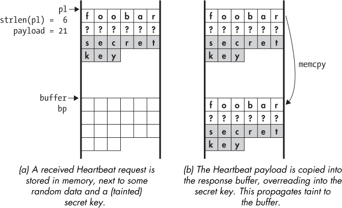
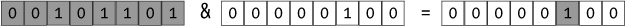
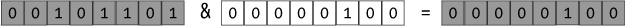
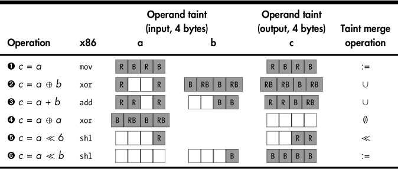
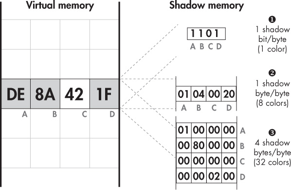

## 10 PRINCIPLES OF DYNAMIC TAINT ANALYSIS

Imagine that you’re a hydrologist who wants to trace the flow of a river that runs partly underground. You already know where the river goes underground, but you want to find out whether and where it emerges. One way to solve this problem is to color the river’s water using a special dye and then look for locations

where the colored water reappears. The topic of this chapter, *dynamic taint analysis (DTA)*, applies the same idea to binary programs. Similar to coloring and tracing the flow of water, you can use DTA to color, or *taint*, selected data in a program’s memory and then dynamically track the data flow of the tainted bytes to see which program locations they affect.

In this chapter, you’ll learn the principles of dynamic taint analysis. DTA is a complex technique, so it’s important to be familiar with its inner workings to build effective DTA tools. In Chapter 11, I’ll introduce you to `libdft`, an open source DTA library, which we’ll use to build several practical DTA tools.

### 10.1 What Is DTA?

Dynamic taint analysis (DTA), also called *data flow tracking (DFT)*, *taint tracking*, or simply *taint analysis*, is a program analysis technique that allows you to determine the influence that a selected program state has on other parts of the program state. For instance, you can *taint* any data that a program receives from the network, track that data, and raise an alert if it affects the program counter, as such an effect can indicate a control-flow hijacking attack.

In the context of binary analysis, DTA is typically implemented on top of a dynamic binary instrumentation platform such as Pin, which we discussed in Chapter 9. To track the flow of data, DTA instruments all instructions that handle data, either in registers or in memory. In practice, this includes nearly all instructions, which means that DTA leads to very high performance overhead on instrumented programs. Slowdowns of 10x or more are not uncommon, even in optimized DTA implementations. While a 10x overhead may be acceptable during security tests of a web server, for instance, it usually isn’t okay in production. This is why you’ll typically use DTA only for offline analysis of programs.

You can also base taint analysis systems on static instrumentation instead of dynamic instrumentation, inserting the necessary taint analysis logic at compile time rather than at runtime. While that approach usually results in better performance, it also requires source code. Since our focus is binary analysis, we’ll stick to dynamic taint analysis in this book.

As mentioned, DTA allows you to track the influence of a selected program state on interesting program locations. Let’s take a closer look at the details of what this means: how do you define interesting state or locations, and what exactly does it mean for one part of the state to “influence” another?

### 10.2 DTA in Three Steps: Taint Sources, Taint Sinks, and Taint Propagation

At a high level, taint analysis involves three steps: defining *taint sources*, defining *taint sinks*, and *tracking taint propagation*. If you’re developing a tool based on DTA, the first two steps (defining taint sources and sinks) are up to you. The third step (tracking the taint propagation) is usually handled by an existing DTA library, such as `libdft`, but most DTA libraries also provide ways for you to customize this step if you want. Let’s go over these three steps and what each entails.

#### *10.2.1 Defining Taint Sources*

*Taint sources* are the program locations where you select the data that’s interesting to track. For example, system calls, function entry points, or individual instructions can all be taint sources, as you’ll see shortly. What data you choose to track depends on what you want to achieve with your DTA tool.

You can mark data as interesting by tainting it using API calls provided for that very purpose by the DTA library you’re using. Typically, those API calls take a register or memory address to mark as tainted as the input. For example, let’s say you want to track any data that comes in from the network to see whether it exhibits any behavior that could indicate an attack. To do that, you instrument network-related system calls like `recv` or `recvfrom` with a callback function that’s called by the dynamic instrumentation platform whenever these system calls occur. In that callback function, you loop over all the received bytes and mark them as tainted. In this example, the `recv` and `recvfrom` functions are your taint sources.

Similarly, if you’re interested in tracking data read from file, then you’d use system calls such as `read` as your taint source. If you want to track numbers that are the product of two other numbers, you could taint the output operands of multiplication instructions, which are then your taint sources, and so on.

#### *10.2.2 Defining Taint Sinks*

*Taint sinks* are the program locations you check to see whether they can be influenced by tainted data. For example, to detect control-flow hijacking attacks, you’d instrument indirect calls, indirect jumps, and return instructions with callbacks that check whether the targets of these instructions are influenced by tainted data. These instrumented instructions would be your taint sinks. DTA libraries provide functions that you can use to check whether a register or memory location is tainted. Typically, when taint is detected at a taint sink, you’ll want to trigger some response, such as raising an alert.

#### *10.2.3 Tracking Taint Propagation*

As I mentioned, to track the flow of tainted data through a program, you need to instrument all instructions that handle data. The instrumentation code determines how taint propagates from the input operands of an instruction to its output operands. For instance, if the input operand of a `mov` instruction is tainted, the instrumentation code will mark the output operand as tainted as well, since it’s clearly influenced by the input operand. In this way, tainted data may eventually propagate all the way from a taint source to a taint sink.

Tracking taint is a complicated process because determining which parts of an output operand to taint isn’t always trivial. Taint propagation is subject to a *taint policy* that specifies the taint relationship between input and output operands. As I’ll explain in Section 10.4, there are different taint policies you can use depending on your needs. To save you the trouble of having to write instrumentation code for all instructions, taint propagation is typically handled by a dedicated DTA library, such as `libdft`.

Now that you understand how taint tracking works in general, let’s explore how you can use DTA to detect an information leak using a concrete example. In Chapter 11, you’ll learn how to implement your own tool to detect just this kind of vulnerability!

### 10.3 Using DTA to Detect the Heartbleed Bug

To see how DTA can be useful in practice, let’s consider how you can use it to detect the Heartbleed vulnerability in OpenSSL. OpenSSL is a cryptographic library that’s widely used to protect communications on the Internet, including connections to websites and email servers. Heartbleed can be abused to leak information from systems using a vulnerable version of OpenSSL. This can include highly sensitive information, such as private keys and usernames/passwords stored in memory.

#### *10.3.1 A Brief Overview of the Heartbleed Vulnerability*

Heartbleed abuses a classic buffer overread in OpenSSL’s implementation of the Heartbeat protocol (note that *Heartbeat* is the name of the exploited protocol, while *Heartbleed* is the name of the exploit). The Heartbeat protocol allows devices to check whether the connection with an SSL-enabled server is still alive by sending the server a *Heartbeat request* containing an arbitrary character string specified by the sender. If all is well, the server responds by echoing back that string in a *Heartbeat response* message.

In addition to the character string, the Heartbeat request contains a field specifying the length of that string. It’s the incorrect handling of this length field that results in the Heartbleed vulnerability. Vulnerable versions of OpenSSL allow an attacker to specify a length that’s much longer than the actual string, causing the server to leak additional bytes from memory when copying the string into the response.

Listing 10-1 shows the OpenSSL code responsible for the Heartbleed bug. Let’s briefly discuss how it works and then go over how DTA can detect Heartbleed-related information leaks.

*Listing 10-1: The code that causes the OpenSSL Heartbleed vulnerability*

```
   /* Allocate memory for the response, size is 1 byte
    * message type, plus 2 bytes payload length, plus
    * payload, plus padding
    */
➊ buffer = OPENSSL_malloc(1 + 2 + payload + padding);
➋ bp = buffer;

   /* Enter response type, length and copy payload */
➌ *bp++ = TLS1_HB_RESPONSE;
➍ s2n(payload, bp);
➎ memcpy(bp, pl, payload);
   bp += payload;

   /* Random padding */
➏ RAND_pseudo_bytes(bp, padding);

➐ r = ssl3_write_bytes(s, TLS1_RT_HEARTBEAT, buffer, 3 + payload + padding);
```

The code in Listing 10-1 is part of the OpenSSL function that prepares a Heartbeat response after receiving a request. The three most important variables in the listing are `pl`, `payload`, and `bp`. The variable `pl` is a pointer to the payload string in the Heartbeat request, which will be copied into the response. Despite the confusing name, `payload` is not a pointer to the pay-load string but an `unsigned int` specifying the *length* of that string. Both `pl` and `payload` are taken from the Heartbeat request message, so in the context of Heartbleed they are *controlled by the attacker*. The variable `bp` is a pointer into the response buffer where the payload string is copied.

First, the code in Listing 10-1 allocates the response buffer ➊ and sets `bp` to the start of that buffer ➋. Note that the size of the buffer is controlled by the attacker through the `payload` variable. The first byte in the response buffer contains the packet type: `TLS1_HB_RESPONSE` (a Heartbeat response) ➌. The next 2 bytes contain the payload length, which is simply copied (by the `s2n` macro) from the attacker-controlled `payload` variable ➍.

Now comes the core of the Heartbleed vulnerability: a `memcpy` that copies `payload` bytes from the `pl` pointer into the response buffer ➎. Recall that both `payload` and the string stored at `pl` are under the attacker’s control. Thus, by supplying a short string and a large number for `payload`, you can trick the `memcpy` to continue copying past the request string, leaking whatever happens to be in memory next to the request. In this way, it’s possible to leak up to 64KB of data. Finally, after adding some random padding bytes to the end of the response ➏, the response containing the leaked information is sent over the network to the attacker ➐.

#### *10.3.2 Detecting Heartbleed Through Tainting*

Figure 10-1 shows how you can use DTA to detect this kind of information leak by illustrating what happens in the memory of a system being attacked by Heartbleed. For the purposes of this example, you can assume that the Heartbeat request is stored in memory close to a secret key and that you’ve tainted the secret key so that you can track where it’s copied. You can also assume the `send` and `sendto` system calls are taint sinks, detecting any tainted data that’s about to be sent out over the network. For simplicity, the figure shows only the relevant strings in memory but not the type and length fields of the request and response messages.

Figure 10-1a shows the situation just after a Heartbeat request crafted by an attacker is received. The request contains the payload string `foobar`, which happens to be stored in memory next to some random bytes (marked as `?`) and a secret key. The variable `pl` points to the start of the string, and the attacker has set `payload` to 21 so that the 15 bytes adjacent to the payload string will be leaked.^(1) The secret key is tainted so that you can detect when it leaks over the network, and the buffer for the response is allocated elsewhere in memory.



*Figure 10-1: The Heartbleed buffer overread leaks a secret key into the response buffer, which is sent over the network. Tainting the key allows the overread to be detected when the leaked information is sent out.*

Next, Figure 10-1b shows what happens when the vulnerable `memcpy` is executed. As it should, the `memcpy` begins by copying the payload string `foobar`, but because the attacker set `payload` to 21, the `memcpy` continues even after it’s done copying the 6 bytes of the payload string. The `memcpy` over-reads, first into the random data stored adjacent to the payload string and then into the secret key. As a result, the secret key ends up in the response buffer, from where it’s about to be sent out over the network.

Without taint analysis, the game would be over at this point. The response buffer, including the leaked secret key, would now be sent back to the attacker. Fortunately, in this example, you’re using DTA to prevent this from happening. When the secret key is copied, the DTA engine notices that it’s copying tainted bytes and marks the output bytes as tainted as well. After the `memcpy` completes and you check for tainted bytes before executing the network `send`, you’ll notice that part of the response buffer is tainted, thereby detecting the Heartbleed attack.

This is just one of many applications of dynamic taint analysis, some others of which I’ll cover in Chapter 11. As I mentioned, you wouldn’t want to run this kind of DTA on a production server because of the large slowdown it imposes. However, the kind of analysis I just described works well in combination with fuzzing, where you test the security of an application or library like OpenSSL by providing it with pseudorandomly generated inputs, such as Heartbeat requests where the payload string and length fields don’t match up.

To detect bugs, fuzzing relies on externally observable effects, such as the program crashing or hanging. However, not all bugs produce such visible effects since bugs such as information leaks may occur silently without a crash or hang. You can use DTA to extend the range of observable bugs in fuzzing to include noncrashing bugs such as information leaks. This type of fuzzing could have revealed the presence of Heartbleed before vulnerable OpenSSL versions ever went into the wild.

This example involved simple taint propagation where the tainted secret key was directly copied into the output buffer. Next I’ll cover more complex types of taint propagation with more complicated data flow.

### 10.4 DTA Design Factors: Taint Granularity, Taint Colors, and Taint Policies

In the previous section, DTA required only simple taint propagation rules, and the taint itself was also simple: a byte of memory is either tainted or not. In more complex DTA systems, there are multiple factors that determine the balance between the performance and versatility of the system. In this section, you’ll learn about the three most important design dimensions for DTA systems: the *taint granularity*, the *number of colors*, and the *taint propagation policy*.

Note that you can use DTA for many different purposes, including bug detection, preventing data exfiltration, automatic code optimization, forensics, and more. In each of these applications, it means something different to say a value is tainted. To keep the following discussion simple, when a value is tainted, I’ll consistently take that to mean “an attacker can affect this value.”

#### *10.4.1 Taint Granularity*

*Taint granularity* is the unit of information by which a DTA system tracks taint. For instance, a bit-granular system keeps track of whether each individual bit in a register or memory is tainted, whereas a byte-granular system tracks taint information only per byte. If even 1 bit in a particular byte is tainted, a byte-granular system will mark that whole byte as tainted. Similarly, in a word-granular system, taint information is tracked per memory word, and so on.

To visualize the difference between bit-granularity and byte-granularity DTA systems, let’s consider how taint propagates through a bitwise AND (`&`) operation on two byte-sized operands where one of the operands is tainted. In the following example, I’ll show all the bits of each operand individually. Each bit is enclosed in a box. The white boxes represent untainted bits, while the gray ones represent tainted bits. First, here’s how the taint would propagate in a bit-granularity system:



As you can see, all the bits in the first operand are tainted, while no bits are tainted in the second operand. Since this is a bitwise AND operation, each output bit can be set to 1 only if both input operands have a 1 at the corresponding position. In other words, if an attacker controls only the first input operand, then the only bit positions in the output that they can affect are those where the second operand has a 1. All other output bits will always be set to 0. That’s why in this example, only one output bit is tainted. It’s the only bit position the attacker can control since only that position is set to 1 in the second operand. In effect, the untainted second operand acts as a “filter” for the first operand’s taint.^(2)

Now let’s contrast this with the corresponding operation in a byte-granularity DTA system. The two input operands are the same as before.



Because a byte-granularity DTA system can’t consider each bit individually, the whole output is marked as tainted. The system simply sees a tainted input byte and a nonzero second operand and therefore concludes that an attacker could affect the output operand.

As you can see, the granularity of a DTA system is an important factor influencing its accuracy: a byte-granular system may be less accurate than a bit-granular system, depending on the inputs. On the other hand, taint granularity is also a major factor in the performance of a DTA system. The instrumentation code required to track taint individually for each bit is complex, leading to high performance overhead. While byte-granularity systems are less accurate, they allow for simpler taint propagation rules, requiring only simple instrumentation code. Generally, this means that byte-granular systems are much faster than bit-granular ones. In practice, most DTA systems use byte-granularity to achieve a reasonable compromise between accuracy and speed.

#### *10.4.2 Taint Colors*

In all the examples so far, we’ve assumed that a value is either tainted or not. Going back to our river analogy, this was simple enough to do using only a single color of dye. But sometimes you may want to simultaneously trace multiple rivers that flow through the same cave system. If you dyed multiple rivers using just one color, you wouldn’t know exactly how the rivers connect since the colored water could have come from any source.

Similarly, in DTA systems, you sometimes want to know not just that a value is tainted but *where* the taint came from. You can use multiple *taint colors* to apply a different color to each taint source so that when taint reaches a sink, you can tell exactly which source affects that sink.

In a byte-granular DTA system with just one taint color, you need only a single bit to keep track of the taint for each byte of memory. To support more than one color, you need to store more taint information per byte. For instance, to support eight colors, you need 1 byte of taint information per byte of memory.

At first glance, you might think that you can store 255 different colors in 1 byte of taint information since a byte can store 255 distinct nonzero values. However, that approach doesn’t allow for different colors to mix. Without the ability to mix colors, you won’t be able to distinguish between taint flows when two taint flows run together: if a value is affected by two different taint sources, each with their own color, you won’t be able to record both colors in the affected value’s taint information.

To support mixing colors, you need to use a dedicated bit per taint color. For instance, if you have 1 byte of taint information, you can support the colors `0x01`, `0x02`, `0x04`, `0x08`, `0x10`, `0x20`, `0x40`, and `0x80`. Then, if a particular value is tainted by both the colors `0x01` and `0x02`, the combined taint information for this value is `0x03`, which is the bitwise OR of the two colors. You can think of the different taint colors in terms of actual colors to make things easier. For example, you can refer to `0x01` as “red,” `0x02` as “blue,” and the combined color `0x03` as “purple.”

#### *10.4.3 Taint Propagation Policies*

The *taint policy* of a DTA system describes how the system propagates taint and how it merges taint colors if multiple taint flows run together. Table 10-1 shows how taint propagates through several different operations in an example taint policy for a byte-granular DTA system with two colors, “red” (R) and “blue” (B). All operands in the examples consist of 4 bytes. Note that other taint policies are possible, especially for complex operations that perform nonlinear transformations on their operands.

**Table 10-1:** Taint Propagation Examples for a Byte-Granularity DTA System with Two Colors, Red (R) and Blue (B)



In the first example, the value of a variable *a* is assigned to a variable *c* ➊, equivalent to an x86 `mov` instruction. For simple operations like this, the taint propagation rules are likewise straightforward: since the output *c* is just a copy of *a*, the taint information for *c* is a copy of *a*’s taint information. In other words, the taint merge operator in this case is :=, the assignment operator.

The next example is an `xor` operation, *c* = *a* ⊕ *b* ➋. In this case, it doesn’t make sense to simply assign the taint from one of the input operands to the output because the output depends on both inputs. Instead, a common taint policy is to take the byte-by-byte union (∪) of the input operands’ taint. For instance, the most significant byte of the first operand is tainted red (R), while it’s blue (B) in the second operand. Thus, the taint of the most signifi-cant output byte is the union of these, colored both red and blue (RB).

The same byte-by-byte union policy is used for addition in the third example ➌. Note that for addition there is a corner case: adding 2 bytes can produce an overflow bit, which flows into the least significant bit (LSB) of the neighboring byte. Suppose that an attacker controls only the least significant byte of one of the operands. Then, in this corner case, the attacker may be able to cause 1 bit to overflow into the neighboring byte, allowing the attacker to also partially affect that byte’s value. You can accommodate this corner case in the taint policy by adding an explicit check for it and tainting the neighboring byte if an overflow occurs. In practice, many DTA systems choose not to check for this corner case for simpler and faster taint propagation.

Example ➍ is a special case of the `xor` operation. Taking the `xor` of an operand with itself (*c* = *a* *a*) always produces the output zero. In this case, even if an attacker controls *a*, they still won’t have any control over the output *c*. The taint policy is therefore to clear the taint of each output byte by setting it to the empty set (ø).

Next is a left-shift operation by a constant value, *c* = *a* ≪ 6 ➎. Because the second operand is constant, an attacker can’t always control all output bytes, even if they partially control the input *a*. A reasonable policy is to only propagate the input taint to those bytes of the output that are (partially or entirely) covered by one of the tainted input bytes, in effect “shifting the taint left.” In this example, since the attacker controls only the lower byte of *a* and it’s shifted left by 6 bits, this means the taint from the lower byte propagates to the lower *two* bytes of the output.

In example ➏, on the other hand, the value that is shifted (*a*) and the shift amount (*b*) are both variable. An attacker who controls *b*, as is the case in the example, can affect all bytes of the output. Thus, the taint of *b* is assigned to every output byte.

DTA libraries, such as `libdft`, have a predefined taint policy, saving you the trouble of implementing rules for all types of instructions. However, you can tweak the rules on a tool-by-tool basis for those instructions where the default policy doesn’t entirely suit your needs. For instance, if you’re implementing a tool that’s meant to detect information leaks, you may want to improve performance by disabling taint propagation through instructions that alter the data beyond recognition.

#### *10.4.4 Overtainting and Undertainting*

Depending on the taint policy, a DTA system may suffer from undertainting, overtainting, or both.

*Undertainting* occurs when a value isn’t tainted even though it “should be,” which in our case means that an attacker can get away with influencing that value without being noticed. Undertainting can be the result of the taint policy, for instance if the system doesn’t handle corner cases such as overflow bits in addition, as mentioned previously. It can also occur when taint flows through unsupported instructions for which no taint propagation handler exists. For example, DTA libraries such as `libdft` usually don’t have built-in support for x86 MMX or SSE instructions, so taint that flows through such instructions can get lost. Control dependencies can also cause under-tainting, as you’ll see shortly.

Similarly to undertainting, *overtainting* means that values end up tainted even though they “shouldn’t be.” This results in false positives, such as alerts when there is no actual attack in progress. Like undertainting, overtainting can be a result of the taint policy or the way control dependencies are handled.

While DTA systems strive to minimize undertainting and overtainting, it’s generally impossible to avoid these problems completely while keeping reasonable performance. There is currently no practical DTA library that doesn’t suffer from a degree of undertainting or overtainting.

#### *10.4.5 Control Dependencies*

Recall that taint tracking is used to trace *data flows*. Sometimes, however, data flows can be implicitly influenced by control structures like branches in what is known as an *implicit flow*. You’ll see a practical example of an implicit flow in Chapter 11, but for now, take a look at the following synthetic example:

```
var = 0;
while(cond--) var++;
```

Here, an attacker who controls the loop condition `cond` can determine the value of `var`. This is called a *control dependency*. While the attacker can control `var` through `cond`, there’s no explicit data flow between the two variables. Thus, DTA systems that track only explicit data flows will fail to capture this dependency and will leave `var` untainted even if `cond` is tainted, resulting in undertainting.

Some research has attempted to resolve this problem by propagating taint from branch and loop conditions to operations that execute *because* of the branch or loop. In this example, that would mean propagating the taint from `cond` to `var`. Unfortunately, this approach leads to massive overtainting because tainted branch conditions are common, even if no attack is going on. For example, consider user input sanitization checks like the following:

```
if(is_safe(user_input)) funcptr = safe_handler;
else                    funcptr = error_handler;
```

Let’s assume we’re tainting all user input to check for attacks and that the taint of `user_input` propagates to the return value of the `is_safe` function, which is used as the branch condition. Assuming that the user input sanitization is done properly, the listing is completely safe despite the tainted branch condition.

But DTA systems that try to track control dependencies cannot distinguish this situation from the dangerous one shown in the previous listing. These systems will always end up tainting `funcptr`, a function pointer that points to a handler for the user input. This may raise false positive alerts when the tainted `funcptr` is later called. Such rampant false positives can render a system completely unusable.

Because branches on user input are common while implicit flows usable by an attacker are relatively rare, most DTA systems in practice don’t track control dependencies.

#### *10.4.6 Shadow Memory*

So far, I’ve shown you that taint trackers can track taint for each register or memory byte, but I haven’t yet explained where they store that taint information. To store the information on which parts of registers or memory are tainted, and with what color, DTA engines maintain dedicated *shadow memory*. Shadow memory is a region of virtual memory allocated by the DTA system to keep track of the taint status of the rest of the memory. Typically, DTA systems also allocate a special structure in memory where they keep track of taint information for CPU registers.

The structure of the shadow memory differs depending on the taint granularity and how many taint colors are supported. Figure 10-2 shows example byte-granularity shadow memory layouts for tracking up to 1, 8, or 32 colors per byte of memory, respectively.



*Figure 10-2: Shadow memory with byte-granularity and 1, 8, or 32 colors per byte*

The left part of Figure 10-2 shows the virtual memory of a program running with DTA. Specifically, it shows the contents of four virtual memory bytes, which are labeled A, B, C, and D. Together, those bytes store the example hexadecimal value `0xde8a421f`.

### Bitmap-Based Shadow Memory

The right part of the figure shows three different types of shadow memory and how they encode the taint information for bytes A–D. The first type of shadow memory, shown at the top right of Figure 10-2, is a *bitmap* ➊. It stores a single bit of taint information per byte of virtual memory, so it can represent only one color: each byte of memory is either tainted or untainted. Bytes A–D are represented by the bits `1101`, meaning that bytes A, B, and D are tainted, while byte C is not.

While bitmaps can represent only a single color, they have the advantage of requiring relatively little memory. For instance, on a 32-bit x86 system, the total size of the virtual memory is 4GB. A shadow memory bitmap for 4GB of virtual memory requires only 4GB/8 = 512MB of memory, leaving the remaining 7/8 of the virtual memory available for normal use. Note that this approach does not scale for 64-bit systems, where the virtual memory space is vastly larger.

### Multicolor Shadow Memory

Multicolor taint engines and x64 systems require more complex shadow memory implementations. For instance, take a look at the second type of shadow memory shown in Figure 10-2 ➋. It supports eight colors and uses 1 byte of shadow memory per byte of virtual memory. Again, you can see that bytes A, B, and D are tainted (with colors `0x01`, `0x04`, and `0x20`, respectively), while byte C is untainted. Note that to store taint for every virtual memory byte in a process, an unoptimized eight-color shadow memory must be as large as that process’s entire virtual memory space!

Luckily, there’s usually no need to store shadow bytes for the memory area where the shadow memory itself is allocated, so you can omit shadow bytes for that memory area. Even so, without further optimizations, the shadow memory still requires half of the virtual memory. This can be reduced further by dynamically allocating shadow memory only for the parts of virtual memory that are actually in use (on the stack or heap), at the cost of some extra runtime overhead. Moreover, virtual memory pages that are not writable can never be tainted, so you can safely map all of those to the same “zeroed-out” shadow memory page. With these optimizations, multicolor DTA becomes manageable, though it still requires a lot of memory.

The final shadow memory type shown in Figure 10-2 supports 32 colors ➌. Bytes A, B, and D are tainted with the colors `0x01000000`, `0x00800000`, and `0x00000200`, respectively, while byte C is untainted. As you can see, this requires 4 bytes of shadow memory per memory byte, which is quite a hefty memory overhead.

All of these examples implement the shadow memory as a simple bitmap, byte array, or integer array. By using more complex data structures, it’s possible to support an arbitrary number of colors. For instance, you can implement the shadow memory using a C++-style `set` of colors for each memory byte. However, that approach significantly increases complexity and runtime overhead of the DTA system.

### 10.5 Summary

In this chapter, I introduced you to dynamic taint analysis, one of the most powerful binary analysis techniques. DTA allows you to track the flow of data from a taint source to a taint sink, which enables automated analyses ranging from code optimization to vulnerability detection. Now that you’re familiar with DTA basics, you’re ready to move on to Chapter 11, where you’ll build practical DTA tools with `libdft`.

Exercise

1\. Designing a Format String Exploit Detector

Format string vulnerabilities are a well-known class of exploitable software bugs in C-like programming languages. They occur when there’s a `printf` with a user-controlled format string, as in `printf(user)` instead of the correct `printf("%s", user)`. For a good introduction to format string vulnerabilities, you can read the article “Exploiting Format String Vulnerabilities” available at *<http://julianor.tripod.com/bc/formatstring-1.2.pdf>*.

Design a DTA tool that can detect format string exploits launched from the network or the command line. What should the taint sources and sinks be, and what sort of taint propagation and granularity do you need? At the end of Chapter 11, you’ll be able to implement your exploit detector!