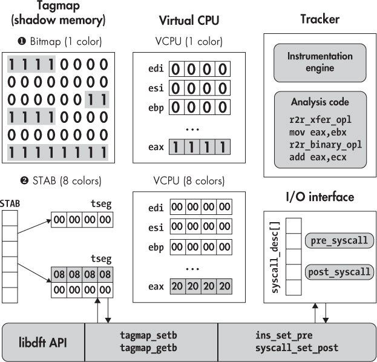

## 11 PRACTICAL DYNAMIC TAINT ANALYSIS WITH LIBDFT

In Chapter 10, you learned the principles of dynamic taint analysis. In this chapter, you will learn how to build your own DTA tools with `libdft`, a popular open source DTA library. I’ll cover two practical examples: a tool that prevents remote control-hijacking attacks and a tool that automatically detects information leaks. But first, let’s take a look at the internals and API of `libdft`.

### 11.1 Introducing libdft

Because DTA is the subject of ongoing research, existing binary-level taint tracking libraries are research tools; don’t expect production quality from them. The same is true for `libdft`, developed at Columbia University, which you’ll use in the remainder of this chapter.

A byte-granularity taint-tracking system built on Intel Pin, `libdft` is one of the easiest to use DTA libraries available at the moment. In fact, it’s the tool of choice of many security researchers because you can use it to easily build DTA tools that are both accurate and fast. I’ve preinstalled `libdft` on the VM in the directory */home/binary/libdft*. You can also download it at *<https://www.cs.columbia.edu/~vpk/research/libdft/>*.

Like all binary-level DTA libraries available at the time of writing, `libdft` has several shortcomings. The most obvious one is that `libdft` supports only 32-bit x86. You can still use it on a 64-bit platform, but only to analyze 32-bit processes. It also relies on legacy versions of Pin (versions between 2.11 and 2.14 should work). Another limitation is that `libdft` implements support only for “regular” x86 instructions, not extended instruction sets like MMX or SSE. This means `libdft` may suffer from undertainting if taint flows through such instructions. If you’re building the program you’re analyzing from source, use `gcc`’s compilation options `-mno-{mmx, sse, sse2, sse3}` to ensure that the binary won’t contain MMX or SSE instructions.

Despite its limitations, `libdft` is still an excellent DTA library you can use to build solid tools. Also, because it’s open source, it’s relatively easy to extend it with 64-bit support or support for more instructions. To help you get the most out of `libdft`, let’s take a look at its most important implementation details.

#### *11.1.1 Internals of libdft*

Because `libdft` is based on Intel Pin, `libdft`-based DTA tools are just Pin tools like the ones you saw in Chapter 9, except they’re linked with `libdft`, which provides the DTA functionality. On the VM, I’ve installed a dedicated legacy version of Intel Pin (v2.13) you can use with `libdft`. Pin is used by `libdft` to instrument instructions with taint propagation logic. Taint itself is stored in shadow memory, which is accessible through the `libdft` API. Figure 11-1 shows an overview of `libdft`’s most important components.

### Shadow Memory

As you can see in Figure 11-1, `libdft` comes in two variants, each with a different kind of shadow memory (called the *tagmap* in `libdft` parlance). First, there’s a bitmap-based variant ➊, which supports only one taint color but is slightly faster and has less memory overhead than the other variant. In the `libdft` source archive available from the Columbia University website,^(1) this variant is in the directory called *libdft_linux-i386*. The second variant implements an eight-color shadow memory ➋, and you can find it in the directory *libdft-ng_linux-i386* in the source archive. This second variant is the one I’ve preinstalled on the VM and the one I’ll use here.

To minimize the memory requirements of the eight-color shadow memory, `libdft` implements it using an optimized data structure, called the *segment translation table (STAB)*. The STAB contains one entry for every memory page. Each entry contains an *addend* value, which is just a 32-bit offset that you add to a virtual memory address to obtain the address of the corresponding shadow byte.



*Figure 11-1: Internals of* `libdft` *: shadow memory and virtual CPU implementation, instrumentation, and API*

For example, to read the shadow memory for virtual address `0x1000`, you can look up the corresponding addend in the STAB, which turns out to be `438`. That means you’ll find the shadow byte containing the taint information for address `0x1000` at address `0x1438`.

The STAB provides a level of indirection that allows `libdft` to allocate shadow memory on demand, whenever the application allocates a region of virtual memory. Shadow memory is allocated in page-sized chunks, keeping memory overhead to a minimum. Since each allocated memory page corresponds to exactly one shadow page, the same addend can be used for all addresses in a page. For virtual memory regions with multiple adjacent pages, `libdft` ensures that the shadow memory pages are also adjacent, simplifying shadow memory access. Each chunk of adjacent shadow map pages is called a *tagmap segment (tseg)*. As an additional memory usage optimization, `libdft` maps all read-only memory pages to the same zeroed-out shadow page.

### Virtual CPU

To keep track of the taint status of CPU registers, `libdft` keeps a special structure in memory called the *virtual CPU*. The virtual CPU is a sort of mini-shadow memory with 4 shadow bytes for each of the 32-bit general-purpose CPU registers available on x86: `edi`, `esi`, `ebp`, `esp`, `ebx`, `edx`, `ecx`, and `eax`. In addition, there’s a special scratch register on the virtual CPU, which `libdft` uses to store taint for any unrecognized register. In the preinstalled `libdft` version on the VM, I’ve made some modifications to the virtual CPU so that it has room for all registers supported by Intel Pin.

### Taint-Tracking Engine

Recall that `libdft` uses Pin’s API to inspect all instructions in a binary and then instruments these instructions with the relevant taint propagation functions. If you’re interested, you can find the implementations of `libdft`’s taint propagation functions in the file */home/binary/libdft/libdft-ng_linux-i386/src/ libdft_core.c* on the VM, but I won’t cover them all here. Together, the taint propagation functions implement `libdft`’s taint policy, which I’ll describe in Section 11.1.2.

### The libdft API and I/O Interface

Ultimately, the goal of `libdft` is to function as a library for building your own DTA tools. For this purpose, `libdft` provides a taint-tracking API, which provides several classes of functions. The two most important classes of functions for building DTA tools are those that manipulate the tagmap and those that add callbacks and instrumentation code.

The tagmap API is defined in the header file *tagmap.h*. It provides functions such as `tagmap_setb` to mark a memory byte as tainted and `tagmap_getb` to retrieve the taint information for a memory byte.

The API for adding callbacks and instrumentation code is split over the header files *libdft_api.h* and *syscall_desc.h*. It allows you to register callbacks for syscall events using the functions `syscall_set_pre` and `syscall_set_post`. To store all these callbacks, `libdft` uses a dedicated array called `syscall_desc`, which keeps track of all the syscall pre- and post-handlers you install. Similarly, you can register instruction callbacks with `ins_set_pre` and `ins_set_post`. You’ll learn about these and other `libdft` API functions in more detail from the DTA tools later in this chapter.

#### *11.1.2 Taint Policy*

The `libdft` taint propagation policy defines the following five classes of instructions.^(2) Each of these classes propagates and merges taint in a different way.

**ALU** These are arithmetic and logic instructions with two or three operands, such as `add`, `sub`, `and`, `xor`, `div`, and `imul`. For these operations, `libdft` merges taint in the same way as the `add` and `xor` examples in Table 10-1 on page 273—the output taint is the union (∪) of the input operands’ taint. Also as in Table 10-1, `libdft` considers immediate values untainted since there’s no way an attacker can influence them.

**XFER** The XFER class contains all the instructions that copy a value to another register or memory location, such as the `mov` instruction. Again, it’s handled like the `mov` example in Table 10-1, using the assignment operation (:=). For these instructions, `libdft` simply copies the taint from the source operand to the destination.

**CLR** As the name implies, instructions in this class always cause their output operands to become untainted. In other words, `libdft` sets the output taint to the empty set (ø). This class includes some special cases of instructions from other classes, such as `xor`-ing an operand with itself or subtracting an operand from itself. It also includes instructions such as `cpuid`, where an attacker has no control over the outputs.

**SPECIAL** These are instructions that require special rules for taint propagation not covered by other classes. Among others, this class includes `xchg` and `cmpxchg` (where the taint of two operands is swapped) and `lea` (where the taint results from a memory address computation).

**FPU, MMX, SSE** This class includes instructions that `libdft` doesn’t currently support, such as FPU, MMX, and SSE instructions. When taint flows through such instructions, `libdft` cannot track it, so the taint information doesn’t propagate to the output operands of the instructions, resulting in undertainting.

Now that you’re acquainted with `libdft`, let’s build some DTA tools with `libdft`!

### 11.2 Using DTA to Detect Remote Control-Hijacking

The first DTA tool you’ll see is designed to detect some types of remote control-hijacking attacks. Specifically, it detects attacks where data received from the network is used to control the arguments of an `execve` call. Thus, the taint sources will be the network receive functions `recv` and `recvfrom`, while the `execve` syscall will be the taint sink. As usual, you can find the complete source code on the VM, in *~/code/chapter11*.

I tried to make this example tool as simple as possible to keep the discussion easy to understand. That means it necessarily makes simplifying assumptions and will not catch all types of control-hijacking attacks. In a real, fully fledged DTA tool, you’ll want to define additional taint sources and sinks to prevent more types of attacks. For instance, in addition to data received with `recv` and `recvfrom`, you’ll want to consider data read from the network using the `read` syscall. Moreover, to prevent tainting innocent file reads, you’ll need to keep track of which file descriptors are reading from the network by hooking network calls like `accept`.

When you understand how the following example tool works, you should be able to refine it on your own. Additionally, `libdft` comes with a more elaborate example DTA tool that implements many of these refinements for reference. You can find it in the file *tools/libdft-dta.c* in the *libdft* directory if you’re interested.

Many `libdft`-based DTA tools hook syscalls to use as taint sources and sinks. On Linux, every syscall has its own *syscall number*, which `libdft` uses to index the `syscall_desc` array. For a list of available syscalls and their associated syscall numbers, refer to */usr/include/x86_64-linux-gnu/asm/unistd_32.h* for x86 (32 bit) or to */usr/include/asm-generic/unistd.h* for x64.^(3)

Now, let’s take a look at the example tool called `dta-execve`. Listing 11-1 shows the first part of the source code.

*Listing 11-1:* dta-execve.cpp

```
    /* some #includes omitted for brevity */

➊  #include "pin.H"

➋  #include "branch_pred.h"
   #include "libdft_api.h"
   #include "syscall_desc.h"
   #include "tagmap.h"

➌  extern syscall_desc_t syscall_desc[SYSCALL_MAX];

   void alert(uintptr_t addr, const char *source, uint8_t tag);
   void check_string_taint(const char *str, const char *source);
   static void post_socketcall_hook(syscall_ctx_t *ctx);
   static void pre_execve_hook(syscall_ctx_t *ctx);

   int
   main(int argc, char **argv)
   {
➍    PIN_InitSymbols();
➎    if(unlikely(PIN_Init(argc, argv))) {
        return 1;
     }

➏    if(unlikely(libdft_init() != 0)) {
➐       libdft_die();
        return 1;
     }

➑    syscall_set_post(&syscall_desc[__NR_socketcall], post_socketcall_hook);
➒    syscall_set_pre (&syscall_desc[__NR_execve], pre_execve_hook);

➒    PIN_StartProgram();

     return 0;
   }
```

Here, I show only the header files that are specific to `libdft`-based DTA tools, but you can see the omitted code in the source on the VM if you’re interested.

The first header file is *pin.H* ➊ because all `libdft` tools are just Pin tools linked with the `libdft` library. Next, there are several header files that together provide access to the `libdft` API ➋. The first of these, *branch_pred.h*, contains the macros `likely` and `unlikely`, which you can use to provide the compiler with hints for branch prediction, as I’ll explain in a moment. Next, *libdft_api.h*, *syscall_desc.h*, and *tagmap.h* provide access to the `libdft` base API, syscall hooking interface, and tagmap (shadow memory), respectively.

After the includes, there’s an `extern` declaration of the `syscall_desc` array ➌, which is the data structure `libdft` uses to keep track of syscall hooks. You’ll need access to it to hook your taint sources and sinks. The actual definition of `syscall_desc` is in `libdft`’s source file *syscall_desc.c*.

Now let’s take a look at the `main` function of the `dta-execve` tool. It starts by initializing Pin’s symbol processing ➍ in case symbols are present in the binary, followed by Pin itself ➎. You saw Pin initialization code in Chapter 9, but this time the return value of `PIN_Init` is checked using an optimized branch, marked with the `unlikely` macro to tell the compiler it’s unlikely that `PIN_Init` will fail. This knowledge can help the compiler with branch prediction, which may allow it to output slightly faster code.

Next, the `main` function initializes `libdft` itself using the `libdft_init` function ➏, again with an optimized check of the return value. This initialization allows `libdft` to set up crucial data structures, such as the tagmap. If this setup fails, `libdft_init` returns a nonzero value, in which case you call `libdft_die` to deallocate any resources `libdft` may have allocated ➐.

Once Pin and `libdft` are both initialized, you can install your syscall hooks, which serve as taint sources and taint sinks. Keep in mind that the appropriate hook will be called whenever the instrumented application (the program you’re protecting with your DTA tool) executes the corresponding syscall. Here, `dta-execve` installs two hooks: a post-handler called `post_socketcall_hook` that runs right after every `socketcall` syscall ➑ and a pre-handler that runs before `execve` syscalls, called `pre_execve_hook` ➒. The `socketcall` syscall captures all socket-related events on x86-32 Linux, including `recv` and `recvfrom` events. The `socketcall` handler (`post_socketcall_hook`) differentiates between the different types of socket events, as I’ll explain in a moment.

To install a syscall handler, you call `syscall_set_post` (for post-handlers) or `syscall_set_pre` (for pre-handlers). Both of these functions take a pointer to the entry in `libdft`’s `syscall_desc` array in which to install the handler, and a function pointer to the handler to install. To get the appropriate `syscall_desc` entry, you index `syscall_desc` with the syscall number of the syscall you’re hooking. In this case, the relevant syscall numbers are represented by the symbolic names `__NR_socketcall` and `__NR_execve`, which you can find in */usr/include/i386-linux-gnu/asm/unistd_32.h* for x86-32.

Finally, you call `PIN_StartProgram` to begin running the instrumented application ➓. Recall from Chapter 9 that `PIN_StartProgram` never returns, so the `return 0` at the end of `main` is never reached.

Although I don’t use it in this example, `libdft` does provide the ability to hook instructions in nearly the same way as syscalls, as shown in the following listing:

```
➊  extern ins_desc_t ins_desc[XED_ICLASS_LAST];
   /* ... */
➋  ins_set_post(&ins_desc[XED_ICLASS_RET_NEAR], dta_instrument_ret);
```

To hook instructions, you globally declare the `extern ins_desc` array ➊ (analogous to `syscall_desc`) in your DTA tool and then use `ins_set_pre` or `ins_set_post` ➋ to install instruction pre- or post-handlers, respectively. Instead of syscall numbers, you index the `ins_desc` array using symbolic names provided by Intel’s x86 encoder/decoder library (XED), which comes with Pin. XED defines these names in an `enum` called `xed_iclass_enum_t`, and each name denotes an instruction class such as `X86_ICLASS_RET_NEAR`. The names of the classes correspond to instruction mnemonics. You can find a list of all the instruction class names online at *<https://intelxed.github.io/ref-manual/>* or in the header file *xed-iclass-enum.h* that ships with Pin.^(4)

#### *11.2.1 Checking Taint Information*

In the previous section, you saw how the `dta-execve` tool’s `main` function performs all the necessary initialization, sets up the appropriate syscall hooks to serve as taint sources and sinks, and then starts the application. In this case, the taint sink is a syscall hook called `pre_execve_hook`, which checks whether any of the `execve` arguments are tainted, indicating a control hijacking attack. If so, it raises an alert and stops the attack by aborting the application. Because the taint checking is done repeatedly for every `execve` argument, I’ve implemented it in a separate function called `check_string_taint`.

I’ll discuss `check_string_taint` first, and then I’ll move on to the code for `pre_execve_hook` in Section 11.2.3. Listing 11-2 shows the `check_string_taint` function, as well as the `alert` function that is called if an attack is detected.

*Listing 11-2:* dta-execve.cpp *(continued)*

```
   void
➊  alert(uintptr_t addr, const char *source, uint8_t tag)
   {
     fprintf(stderr,
       "\n(dta-execve) !!!!!!! ADDRESS 0x%x IS TAINTED (%s, tag=0x%02x), ABORTING !!!!!!!\n",
       addr, source, tag);
     exit(1);
   }
   void
➋  check_string_taint(const char *str, const char *source)
   {
     uint8_t tag;
     uintptr_t start = (uintptr_t)str;
     uintptr_t end   = (uintptr_t)str+strlen(str);

     fprintf(stderr, "(dta-execve) checking taint on bytes 0x%x -- 0x%x (%s)... ",
             start, end, source);

➌   for(uintptr_t addr = start; addr <= end; addr++) {
➍      tag = tagmap_getb(addr);
➎      if(tag != 0) alert(addr, source, tag);
     }

     fprintf(stderr, "OK\n");
   }
```

The `alert` function ➊ simply prints an alert message with details about the tainted address and then calls `exit` to stop the application and prevent the attack. The actual taint-checking logic is implemented in `check_string_taint` ➋, which takes two strings as input. The first string (`str`) is the one to check for taint, while the second (`source`) is a diagnostic string that’s passed to and printed by `alert`, specifying the source of the first string, which is the `execve` path, an `execve` parameter, or an environment parameter.

To check the taint of `str`, `check_string_taint` loops over all of `str`’s bytes ➌. For each byte, it checks the taint status using `libdft`’s `tagmap_getb` function ➍. If the byte is tainted, `alert` is called to print an error and exit ➎.

The `tagmap_getb` function takes the memory address of a byte (in the form of a `uintptr_t`) as input and returns the shadow byte containing the taint color for that address. The taint color (called `tag` in Listing 11-2) is a `uint8_t` since `libdft` keeps one shadow byte per memory byte. If `tag` is zero, then the memory byte is untainted. If it’s not zero, the byte is tainted, and the `tag` color can be used to find out what the taint source was. Because this DTA tool has only one taint source (network receives), it uses only a single taint color.

Sometimes you may want to fetch the taint tag of multiple memory bytes at once. For this purpose, `libdft` provides the `tagmap_getw` and `tagmap_getl` functions, which are analogous to `tagmap_getb` but return two or four consecutive shadow bytes at once, in the form of a `uint16_t` or a `uint32_t`, respectively.

#### *11.2.2 Taint Sources: Tainting Received Bytes*

Now that you know how to check the taint color for a given memory address, let’s discuss how to taint bytes in the first place. Listing 11-3 shows the code of `post_socketcall_hook`, which is the taint source called right after each `socketcall` syscall and that taints bytes received from the network.

*Listing 11-3:* dta-execve.cpp *(continued)*

```
   static void
   post_socketcall_hook(syscall_ctx_t *ctx)
   {
     int fd;
     void *buf;
     size_t len;

➊   int call            =            (int)ctx->arg[SYSCALL_ARG0];
➋   unsigned long *args = (unsigned long*)ctx->arg[SYSCALL_ARG1];

     switch(call) {
➌   case SYS_RECV:
     case SYS_RECVFROM:
➍      if(unlikely(ctx->ret <= 0)) {
          return;
       }

➎     fd =     (int)args[0];
➏     buf =  (void*)args[1];
➐     len = (size_t)ctx->ret;

       fprintf(stderr, "(dta-execve) recv: %zu bytes from fd %u\n", len, fd);

       for(size_t i = 0; i < len; i++) {
         if(isprint(((char*)buf)[i])) fprintf(stderr, "%c", ((char*)buf)[i]);
         else                         fprintf(stderr, "\\x%02x", ((char*)buf)[i]);
       }
       fprintf(stderr, "\n");

       fprintf(stderr, "(dta-execve) tainting bytes %p -- 0x%x with tag 0x%x\n",
               buf, (uintptr_t)buf+len, 0x01);

➑      tagmap_setn((uintptr_t)buf, len, 0x01);

       break;
     default:
       break;
     }
   }
```

In `libdft`, syscall hooks like `post_socketcall_hook` are `void` functions that take a `syscall_ctx_t*` as their only input argument. In Listing 11-3, I’ve called that input argument `ctx`, and it acts as a descriptor of the syscall that just took place. Among other things, it contains the arguments that were passed to the syscall and the return value of the syscall. The hook inspects `ctx` to determine which bytes (if any) to taint.

The `socketcall` syscall takes two arguments, which you can verify by reading `man socketcall`. The first is an `int` called `call`, and it tells you what kind of `socketcall` this is, for example, whether it’s a `recv` or `recvfrom`. The second, called `args`, contains a block of arguments for the `socketcall` in the form of an `unsigned long*`. The `post_socketcall_hook` begins by parsing `call` ➊ and `args` ➋ from the syscall `ctx`. To get an argument from the syscall `ctx`, you read the appropriate entry from its `arg` field (for example, `ctx->arg[SYSCALL_ARG0]`) and cast it to the correct type.

Next, `dta-execve` uses a `switch` to differentiate between the different possible `call` types. If `call` indicates that this is a `SYS_RECV` or `SYS_RECVFROM` event ➌, then `dta-execve` inspects it more closely to find out which bytes were received and need to be tainted. It simply ignores any other event in the `default` case.

If the current event is a receive, then the next thing `dta-execve` does is check the return value of the `socketcall` by inspecting `ctx->ret` ➍. If it’s less than or equal to zero, then no bytes were received, so nothing is tainted and the syscall hook simply returns. Inspecting the return value is possible only in a post-handler, since in a pre-handler the syscall you’re hooking hasn’t happened yet.

If bytes were received, then you need to parse the `args` array to access the `recv` or `recvfrom` argument and find the address of the receive buffer. The `args` array contains the arguments in the same order as the socket function corresponding to the `call` type. For `recv` and `recvfrom`, that means `args[0]` contains the socket file descriptor number ➎, and `args[1]` contains the receive buffer address ➏. The rest of the arguments aren’t needed here, so `post_socketcall_hook` doesn’t parse them. Given the receive buffer address and the `socketcall` return value (which indicates the number of received bytes ➐), `post_socketcall_hook` can now taint all the received bytes.

After some diagnostic prints of the received bytes, `post_socketcall_hook` finally taints the received bytes by calling `tagmap_setn` ➑, a `libdft` function that can taint an arbitrary number of bytes at once. It takes a `uintptr_t` representing a memory address as its first parameter, which is the first address that will be tainted. The next parameter is a `size_t` that specifies the number of bytes to taint and then a `uint8_t` containing the taint color. In this case, I’ve set the taint color to `0x01`. Now, all the received bytes are tainted, so if they ever influence any of `execve`’s inputs, `dta-execve` will notice and raise an alert.

To taint only a small fixed number of bytes, `libdft` also provides functions called `tagmap_setb`, `tagmap_setw`, and `tagmap_setl`, which taint one, two, or four consecutive bytes, respectively. These have arguments equivalent to `tagmap_setn`, except that they omit the length parameter.

#### *11.2.3 Taint Sinks: Checking execve Arguments*

Finally, let’s take a look at `pre_execve_hook`, the syscall hook that runs just before every `execve` and makes sure the `execve` inputs aren’t tainted. Listing 11-4 shows the code of `pre_execve_hook`.

*Listing 11-4:* dta-execve.cpp *(continued)*

```
   static void
   pre_execve_hook(syscall_ctx_t *ctx)
   {
➊   const char *filename = (const char*)ctx->arg[SYSCALL_ARG0];
➋   char * const *args   = (char* const*)ctx->arg[SYSCALL_ARG1];
➌   char * const *envp   = (char* const*)ctx->arg[SYSCALL_ARG2];

     fprintf(stderr, "(dta-execve) execve: %s (@%p)\n", filename, filename);

➍    check_string_taint(filename, "execve command");
➎    while(args && *args) {
        fprintf(stderr, "(dta-execve) arg: %s (@%p)\n", *args, *args);
➏       check_string_taint(*args, "execve argument");
        args++;
     }
➐    while(envp && *envp) {
        fprintf(stderr, "(dta-execve) env: %s (@%p)\n", *envp, *envp);
➑       check_string_taint(*envp, "execve environment parameter");
        envp++;
     }
   }
```

The first thing `pre_execve_hook` does is parse the inputs of the `execve` from its `ctx` parameter. These inputs are the filename of the program the `execve` is about to run ➊ and then the argument array ➋ and environment array ➌ passed to `execve`. If any of these inputs are tainted, `pre_execve_hook` will raise an alert.

To check each input for taint, `pre_execve_hook` uses the `check_string_taint` function I previously described in Listing 11-2. First, it uses this function to verify that the `execve` filename parameter is untainted ➍. Subsequently, it loops over all the `execve` arguments ➎ and checks each of these for taint ➏. Finally, `pre_execve_hook` loops over the environment array ➐ and checks that each environment parameter is untainted ➑. If none of the inputs is tainted, `pre_execve_hook` runs to completion, and the `execve` syscall proceeds without any alert. On the other hand, if any tainted input is found, then the program is aborted, and an error message is printed.

That’s all of the code in the `dta-execve` tool! As you can see, `libdft` allows you to implement DTA tools in a concise way. In this case, the example tool consists of only 165 lines of code, including all comments and diagnostic prints. Now that you’ve explored all of `dta-execve`’s code, let’s test how well it can detect attacks.

#### *11.2.4 Detecting a Control-Flow Hijacking Attempt*

To test `dta-execve`’s ability to detect network-borne control-hijacking attacks, I’ll use a test program called `execve-test-overflow`. Listing 11-5 shows the first part of its source, containing the `main` function. To save space, I omit error-checking code and unimportant functions in the listings of the test programs. As usual, you can find the full programs on the VM.

*Listing 11-5:* execve-test-overflow.c

```
   int
   main(int argc, char *argv[])
   {
     char buf[4096];
     struct sockaddr_storage addr;

➊   int sockfd = open_socket("localhost", "9999");

     socklen_t addrlen = sizeof(addr);
➋   recvfrom(sockfd, buf, sizeof(buf), 0, (struct sockaddr*)&addr, &addrlen);

➌   int child_fd = exec_cmd(buf);
➍   FILE *fp = fdopen(child_fd, "r");

     while(fgets(buf, sizeof(buf), fp)) {
➎       sendto(sockfd, buf, strlen(buf)+1, 0, (struct sockaddr*)&addr, addrlen);
     }

     return 0;
   }
```

As you can see, `execve-test-overflow` is a simple server program that opens a network socket (using the `open_socket` function omitted from the listing) and listens on `localhost` at port 9999 ➊. Next, it receives a message from the socket ➋ and passes that message to a function called `exec_cmd` ➌. As I’ll explain in the next listing, `exec_cmd` is a vulnerable function that executes a command using `execv` and can be influenced by an attacker who sends a malicious message to the server. When `exec_cmd` completes, it returns a file descriptor that the server uses to read the output of the executed command ➍. Finally, the server writes the command output to the network socket ➎.

Normally, the `exec_cmd` function executes a program called `date` to get the current time and date, and the server then echoes this output over the network, prefixing it with the message previously received from the socket. However, `exec_cmd` contains a vulnerability that allows attackers to run a command of their choosing, as shown in Listing 11-6.

*Listing 11-6:* execve-test-overflow.c *(continued)*

```
➊  static struct __attribute__((packed)) {
➋   char prefix[32];
     char datefmt[32];
     char cmd[64];
   } cmd = { "date: ", "\%Y-\%m-\%d \%H:\%M:\%S",
             "/home/binary/code/chapter11/date" };

   int
   exec_cmd(char *buf)
   {
     int pid;
     int p[2];
     char *argv[3];

➌   for(size_t i = 0; i < strlen(buf); i++) { /* Buffer overflow! */
       if(buf[i] == '\n') {
         cmd.prefix[i] = '\0';
         break;
       }
       cmd.prefix[i] = buf[i];
    }

➍   argv[0] = cmd.cmd;
    argv[1] = cmd.datefmt;
    argv[2] = NULL;

➎   pipe(p);
➏   switch(pid = fork()) {
    case -1: /* Error */
      perror("(execve-test) fork failed");
      return -1;
➐   case 0: /* Child */
       printf("(execve-test/child) execv: %s %s\n", argv[0], argv[1]);

➑     close(1);
       dup(p[1]);
       close(p[0]);

       printf("%s", cmd.prefix);
       fflush(stdout);
➒     execv(argv[0], argv);
       perror("(execve-test/child) execv failed");
       kill(getppid(), SIGINT);
       exit(1);
     default: /* Parent */
       close(p[1]);
       return p[0];
     }

     return -1;
  }
```

The server uses a global `struct` called `cmd` to keep track of the command and its associated parameters ➊. It contains a `prefix` for the command output (the message previously received from the socket) ➋, as well as a date format string and a buffer containing the `date` command itself. While Linux comes with a default `date` utility, I’ve implemented my own for this test, which you’ll find in *~/code/chapter11/date*. This is necessary because the default `date` utility on the VM is 64-bit, which `libdft` does not support.

Now let’s take a look at the `exec_cmd` function, which begins by copying the message received from the network (stored in `buf`) into `cmd`’s `prefix` field ➌. As you can see, the copy lacks proper bound checks, which means attackers could send a malicious message that would overflow `prefix`, allowing them to overwrite the adjacent fields in `cmd`, containing the date format and the command path.

Next, `exec_cmd` copies the command and date format argument from the `cmd` structure into an `argv` array to use for the `execv` ➍. Then, it opens a pipe ➎ and uses `fork` ➏ to start a child process ➐, which will execute the command and report the output to the parent process. The child process redirects `stdout` over the pipe ➑ so that the parent process can read the `execv` output from the pipe and forward it over the socket. Finally, the child calls the `execv` with the possibly attacker-controlled command and arguments as input ➒.

Let’s now run `execve-test-overflow` to see how an attacker can abuse the `prefix` overflow vulnerability to hijack control in practice. I’ll first run it without the protection of the `dta-execve` tool so that you can see the attack succeed. After that, I’ll enable `dta-execve` so you can see how it detects and stops the attack.

### A Successful Control Hijack Without DTA

Listing 11-7 shows a benign run of `execve-test-overflow`, followed by an example of how to exploit the buffer overflow to execute a command of the attacker’s choice instead of `date`. I’ve replaced some repetitive parts of the output with “...” to keep the code lines from becoming too wide.

*Listing 11-7: Control hijacking in* execve-test-overflow

```
   $ cd /home/binary/code/chapter11/
➊ $ ./execve-test-overflow &
   [1] 2506
➋ $ nc -u 127.0.0.1 9999
➌ foobar:
   (execve-test/child) execv: /home/binary/code/chapter11/date %Y-%m-%d %H:%M:%S
➍ foobar: 2017-12-06 15:25:08
   ˆC
   [1]+ Done                     ./execve-test-overflow
➎ $ ./execve-test-overflow &
   [1] 2533
➏ $ nc -u 127.0.0.1 9999
➐ AAAAAAAAAAAAAAAAAAAAAAAAAAAAAAAABBBBBBBBBBBBBBBBBBBBBBBBBBBBBBBB/home/binary/code/chapter11/echo
   (execve-test/child) execv: /home/binary/code/chapter11/echo BB...BB/home/binary/.../echo
➑ AA...AABB...BB/home/binary/code/chapter11/echo BB...BB/home/binary/code/chapter11/echo
   ˆC
   [1]+ Done                     ./execve-test-overflow
```

For the benign run, I start the `execve-test-overflow` server as a background process ➊ and then use `netcat` (`nc`) to connect to the server ➋. In `nc`, I enter the string “`foobar:` ” ➌ and send it to the server, which will use it as the output prefix. The server runs the `date` command and echoes back the current date, prefixed with “`foobar:` ” ➍.

Now to demonstrate the buffer overflow vulnerability, I restart the server ➎ and connect to it again with `nc` ➏. This time, the string I send is much longer ➐, long enough to overflow the `prefix` field in the global `cmd` structure. It consists of 32 `A`s to fill up the 32-byte `prefix` buffer, followed by 32 `B`s, which overflow into the `datefmt` buffer and again fill it up completely. The last part of the string overflows into the `cmd` buffer, and it’s a path to the program to run instead of `date`, namely, *~/code/chapter11/echo*. At this point, the contents of the global `cmd` struct look as follows:

```
static struct __attribute__((packed)) {
  char prefix[32];  /* AAAAAAAAAAAAAAAAAAAAAAAAAAAAAAAA */
  char datefmt[32]; /* BBBBBBBBBBBBBBBBBBBBBBBBBBBBBBBB */
  char cmd[64];     /* /home/binary/code/chapter11/echo */
} cmd;
```

Recall that the server copies the contents of the `cmd` structure into the `argv` array used for the `execv`. Thus, as a result of the overflow, the `execv` runs the `echo` program instead of `date`! The `datefmt` buffer is passed to `echo` as a command line argument, but because it doesn’t contain a terminating `NULL`, the real command line argument that `echo` sees is `datefmt` concatenated with the `cmd` buffer. Finally, after running `echo`, the server writes the output back to the socket ➑, which consists of the concatenation of `prefix`, `datefmt`, and `cmd` as the prefix, followed by the output of the `echo` command.

Now that you know how to coax the `execve-test-overflow` program into executing an unintended command by supplying it with a malicious input from the network, let’s see whether the `dta-execve` tool will succeed in stopping this attack!

### Using DTA to Detect the Hijacking Attempt

To test whether `dta-execve` can stop the attack in the previous section, I’ll run the same attack again. Only this time, `execve-test-overflow` will be protected by the `dta-execve` tool. Listing 11-8 shows the results.

*Listing 11-8: Detecting an attempted control hijack with* dta-execve

```
   $ cd /home/binary/libdft/pin-2.13-61206-gcc.4.4.7-linux/
➊  $ ./pin.sh -follow_execv -t /home/binary/code/chapter11/dta-execve.so \
              -- /home/binary/code/chapter11/execve-test-overflow &
   [1] 2994
➋  $ nc -u 127.0.0.1 9999
➌  AAAAAAAAAAAAAAAAAAAAAAAAAAAAAAAABBBBBBBBBBBBBBBBBBBBBBBBBBBBBBBB/home/binary/code/chapter11/echo
➍  (dta-execve) recv: 97 bytes from fd 4
    AA...AABB...BB/home/binary/code/chapter11/echo\x0a
➎  (dta-execve) tainting bytes 0xffa231ec -- 0xffa2324d with tag 0x1
➏  (execve-test/child) execv: /home/binary/code/chapter11/echo BB...BB/home/binary/.../echo
➐  (dta-execve) execve: /home/binary/code/chapter11/echo (@0x804b100)
➑  (dta-execve) checking taint on bytes 0x804b100 -- 0x804b120 (execve command)...
➒  (dta-execve) !!!!!!! ADDRESS 0x804b100 IS TAINTED (execve command, tag=0x01), ABORTING !!!!!!!
➓   AA...AABB...BB/home/binary/code/chapter11/echo
    [1]+ Done ./pin.sh -follow_execv ...
```

Because `libdft` is based on Pin, you’ll need to run Pin using `dta-execve` as the Pin tool ➊ to protect `execve-test-overflow` with `dta-execve`. As you can see, I’ve added `-follow_execv` to the Pin options so that Pin will instrument all child processes of `execve-test-overflow` the same way as the parent process. This is important because the vulnerable `execv` is called in a child process.

After starting the `execve-test-overflow` server protected with `dta-execve`, I run `nc` again to connect to the server ➋. Then, I send the same exploit string used in the previous section ➌ to overflow the `prefix` buffer and change the `cmd`. Keep in mind that `dta-execve` uses network receives as taint sources. You can see this in Listing 11-8 because the `socketcall` handler prints a diagnostic message showing that it has intercepted the received message ➍. The `socketcall` handler then taints all the bytes received from the network ➎.

Next, a diagnostic print from the server tells you that it’s about to execute the attacker-controlled `echo` command ➏. Fortunately, this time `dta-execve` intercepts the `execv` before it’s too late ➐. It checks the taint on all of the `execv` arguments, starting with the `execv` command ➑. Since this command is controlled by the attacker via the network-borne buffer overflow, `dta-execve` notices that the command is tainted with color `0x01`. It raises an alert and then stops the child process that’s about to execute the attacker’s command, thereby successfully preventing the attack ➒. The only server output that’s written back to the attacker is the prefix string they themselves supplied ➓, since it was printed before the `execv` that caused `dta-execve` to abort the child process.

### 11.3 Circumventing DTA with Implicit Flows

So far so good: `dta-execve` successfully detected and stopped the control-hijacking attack from the previous section. Unfortunately, `dta-execve` is not entirely foolproof because practical DTA systems like `libdft` can’t track data propagated through *implicit flows*. Listing 11-9 shows a modified version of the `execve-test-overflow` server, which contains an implicit flow that prevents `dta-execve` from detecting the attack. For brevity, the listing shows only the parts of the code that are different from the original server.

*Listing 11-9:* execve-test-overflow-implicit.c

```
  int
  exec_cmd(char *buf)
  {
    int pid;
    int p[2];
    char *argv[3];

➊   for(size_t i = 0; i < strlen(buf); i++) {
       if(buf[i] == '\n') {
         cmd.prefix[i] = '\0';
         break;
       }
➋      char c = 0;
➌      while(c < buf[i]) c++;
➍      cmd.prefix[i] = c;
    }

    /* Set up argv and continue with execv */
  }
```

The only changed parts of the code are in the `exec_cmd` function, which contains a vulnerable `for` loop that copies all of the bytes from the receive buffer `buf` into the global `prefix` buffer ➊. As before, the loop lacks bounds checking, so `prefix` will overflow if the message in `buf` is too long. Now, however, the bytes are copied *implicitly* in such a way that the overflow isn’t detected by the DTA tool!

As explained in Chapter 10, implicit flows are the result of *control dependencies*, meaning that the data propagation depends on control structures instead of explicit data operations. In Listing 11-9, that control structure is a `while` loop. For each byte, the modified `exec_cmd` function initializes a `char c` to zero ➋ and then uses the `while` loop to increment `c` until it has the same value as `buf[i]` ➌, effectively copying `buf[i]` into `c` without ever explicitly copying any data. Finally, `c` is copied into `prefix` ➍.

Ultimately, the effect of this code is the same as in the original version of `execve-test-overflow`: `buf` is copied into `prefix`. However, the key is that *there’s no explicit data flow between* *`buf`* *and* *`prefix`* because the copy from `buf[i]` into `c` is implemented using that `while` loop, avoiding an explicit data copy. This introduces a control dependency between `buf[i]` and `c` (and thus, transitively, between `buf[i]` and `prefix[i]`), which `libdft` cannot track.

When you retry Listing 11-8’s attack by replacing `execve-test-overflow` with `execve-test-overflow-implicit`, you’ll see that the attack now succeeds despite `dta-execve`’s protection!

You may remark that if you’re using DTA to prevent attacks against a server that you control, you can just write the server in such a way that it doesn’t contain implicit flows that confuse `libdft`. While this may be possible (though not trivial) in most cases, in malware analysis you’ll find it difficult to get around the problem of implicit flows, because you don’t control the malware’s code and the malware may contain deliberately crafted implicit flows to confuse taint analysis.

### 11.4 A DTA-Based Data Exfiltration Detector

The previous example tool requires only a single taint color because bytes are either attacker controlled or not. Now let’s build a tool that uses multiple taint colors to detect file-based information leaks so that when a file leaks, you can tell *which* file. The idea behind this tool is similar to the taint-based defense against the Heartbleed bug you saw in Chapter 10, except that here the tool uses file reads instead of memory buffers as the taint source.

Listing 11-10 shows the first part of this new tool, which I’ll call `dta -dataleak`. Again, I omit includes of standard C header files for brevity.

*Listing 11-10:* dta-dataleak.cpp

```
➊  #include "pin.H"

   #include  "branch_pred.h"
   #include  "libdft_api.h"
   #include  "syscall_desc.h"
   #include  "tagmap.h"

➋  extern syscall_desc_t syscall_desc[SYSCALL_MAX];
➌  static std::map<int, uint8_t> fd2color;
➍  static std::map<uint8_t, std::string> color2fname;

➎  #define MAX_COLOR 0x80

   void alert(uintptr_t addr, uint8_t tag);
   static void post_open_hook(syscall_ctx_t *ctx);
   static void post_read_hook(syscall_ctx_t *ctx);
   static void pre_socketcall_hook(syscall_ctx_t *ctx);

   int
   main(int argc, char **argv)
   {
     PIN_InitSymbols();

     if(unlikely(PIN_Init(argc, argv))) {
       return 1;
     }

     if(unlikely(libdft_init() != 0)) {
       libdft_die();
       return 1;
     }

➏  syscall_set_post(&syscall_desc[__NR_open], post_open_hook);
➐  syscall_set_post(&syscall_desc[__NR_read], post_read_hook);
➑  syscall_set_pre (&syscall_desc[__NR_socketcall], pre_socketcall_hook);

   PIN_StartProgram();

   return 0;
 }
```

Just as in the previous DTA tool, `dta-dataleak` includes *pin.H* and all the relevant `libdft` header files ➊. It also includes the now familiar `extern` declaration of the `syscall_desc` array ➋ to hook syscalls for the taint sources and sinks. In addition, `dta-dataleak` defines some data structures that weren’t there in `dta-execve`.

The first of these, `fd2color`, is a C++ `map` that maps file descriptors to taint colors ➌. The second is also a C++ map, called `color2fname`, and it maps taint colors to filenames ➍. You’ll see why these data structures are needed in the next few listings.

There’s also a `#define` of a constant called `MAX_COLOR` ➎, which is the maximum possible taint color value, `0x80`.

The `main` function of `dta-dataleak` is almost identical to that of `dta-execve` in that it initializes Pin and `libdft` and then starts the application. The only difference is in which taint sources and sinks `dta-dataleak` defines. It installs two post-handlers, called `post_open_hook` ➏ and `post_read_hook` ➐, which run just after the `open` and `read` syscalls, respectively. The `open` hook keeps track of which file descriptors are open, while the `read` hook is the actual taint source, which taints bytes read from open files, as I’ll explain in a moment.

In addition, `dta-dataleak` installs a pre-handler for the `socketcall` syscall, called `pre_socketcall_hook` ➑. The `pre_socketcall_hook` is the taint sink, which intercepts any data that’s about to be sent over the network so that it can make sure the data isn’t tainted before allowing the send. If any tainted data is about to be leaked, `pre_socketcall_hook` raises an alert, using a function called `alert`, which I’ll explain next.

Keep in mind that this example tool is simplified. In a real tool, you’ll want to hook additional taint sources (such as the `readv` syscall) and sinks (such as `write` syscalls on a socket) for completeness. You’ll also want to implement some rules that determine which files are okay to leak over the network and which aren’t, rather than assuming all file leaks are malicious.

Now let’s take a look at the `alert` function, shown in Listing 11-11, which is called if any tainted data is about to leak over the network. Because it’s similar to `dta-execve`’s `alert` function, I’ll describe it only briefly here.

*Listing 11-11:* dta-dataleak.cpp *(continued)*

```
   void
   alert(uintptr_t addr, uint8_t tag)
   {
➊   fprintf(stderr,
       "\n(dta-dataleak) !!!!!!! ADDRESS 0x%x IS TAINTED (tag=0x%02x), ABORTING !!!!!!!\n",
       addr, tag);

➋   for(unsigned c = 0x01; c <= MAX_COLOR; c <<= 1) {
➌     if(tag & c) {
➍       fprintf(stderr, " tainted by color = 0x%02x (%s)\n", c, color2fname[c].c_str());
      }
    }
➎   exit(1);
  }
```

The `alert` function starts by displaying an alert message, detailing which address is tainted and with which colors ➊. It’s possible that the data leaked over the network is influenced by multiple files and therefore tainted with multiple colors. So, `alert` loops over all possible taint colors ➋ and checks which of them are present in the tag of the tainted byte that caused the alert ➌. For each color that’s enabled in the tag, `alert` prints the color and the corresponding filename ➍, which it reads from the `color2fname` data structure. Finally, `alert` calls `exit` to stop the application and prevent the data leak ➎.

Next, let’s examine the taint sources for the `dta-dataleak` tool.

#### *11.4.1 Taint Sources: Tracking Taint for Open Files*

As I just mentioned, `dta-dataleak` installs two syscall post-handlers: a hook for the `open` syscall that keeps track of open files and a hook for `read` that taints bytes read from open files. Let’s first look at the code for the `open` hook and then look at the `read` handler.

### Tracking Open Files

Listing 11-12 shows the code for `post_open_hook`, the post-handler for the `open` syscall.

*Listing 11-12:* dta-dataleak.cpp *(continued)*

```
   static void
   post_open_hook(syscall_ctx_t *ctx)
   {
➊   static uint8_t next_color = 0x01;
     uint8_t color;
➋   int fd            =         (int)ctx->ret;
➌   const char *fname = (const char*)ctx->arg[SYSCALL_ARG0];
   
➍   if(unlikely((int)ctx->ret < 0)) {
       return;
     }
   
➎   if(strstr(fname, ".so") || strstr(fname, ".so.")) {
       return;
     }
   
     fprintf(stderr, "(dta-dataleak) opening %s at fd %u with color 0x%02x\n",
            fname, fd, next_color);
   
➏    if(!fd2color[fd]) {
        color = next_color;
        fd2color[fd] = color;
➐      if(next_color < MAX_COLOR) next_color <<= 1;
➑    } else {
       /* reuse color of file with same fd that was opened previously */
       color = fd2color[fd];
     }
   
     /* multiple files may get the same color if the same fd is reused
     * or we run out of colors */
➒   if(color2fname[color].empty()) color2fname[color] = std::string(fname);
➓   else color2fname[color] += " | " + std::string(fname);
  }
```

Recall that the purpose of `dta-dataleak` is to detect information leak attempts that leak data read from a file. For `dta-dataleak` to tell *which* file is being leaked, it assigns a different color to each open file. The purpose of the `open` syscall handler, `post_open_hook`, is to assign a taint color to each file descriptor when it’s opened. It also filters out some uninteresting files, such as shared libraries. In a real-world DTA tool, you’ll likely want to implement more filters to control which files to protect against information leaks.

To keep track of the next available taint color, `post_open_hook` uses a `static` variable called `next_color`, which is initialized to the color `0x01` ➊. Next, it parses the syscall context (`ctx`) of the `open` syscall that just occurred to obtain the file descriptor `fd` ➋ and the filename `fname` ➌ of the just opened file. If the `open` failed ➍ or the opened file is a shared library that’s not interesting to track ➎, `post_open_hook` returns without assigning any color to the file. To determine whether the file is a shared library, `post_open_hook` simply checks whether the filename contains a file extension indicative of a shared library, such as *.so*. In a real tool, you’ll want to use more robust checks by opening a suspected shared library and verifying that it starts with the ELF magic bytes, for instance (see also Chapter 2).

If the file is interesting enough to assign it a taint color, `post_open_hook` distinguishes two cases:

1.  If there is no color assigned to the file descriptor yet (in other words, there is no entry for `fd` in the `fd2color` map), then `post_open_hook` assigns `next_color` to this file descriptor ➏ and advances `next_color` by shifting it left by 1 bit.  
         Note that since `libdft` supports only eight colors, you might run out of colors if the application opens too many files. Therefore, `post_open_hook` advances `next_color` only until it reaches the maximum color `0x80` ➐. After that, the color `0x80` will be used for all subsequently opened files. What this means in practice is that the color `0x80` might correspond not just to one file but to a whole list of files. Thus, when a byte with color `0x80` leaks, you might not know exactly which file the byte came from, only that it’s from one of the files in the list. Unfortunately, that’s the price you have to pay for keeping the shadow memory small by supporting only eight colors.
2.  Sometimes a file descriptor is closed at some point, and then the same file descriptor number is reused to open another file. In that case, `fd2color` will already contain an assigned color for that file descriptor number ➑. To keep things simple, I simply reuse the existing color for the repurposed file descriptor, meaning that that color will now correspond to a list of files instead of just one, exactly as when you run out of colors.

At the end of `post_open_hook`, the `color2fname` map is updated with the filename of the just opened file ➒. This way, when data leaks, you can use the taint color of the leaked data to look up the name of the corresponding file, as you just saw in the `alert` function. If the taint color was reused for multiple files because of one of these reasons, then the `color2fname` entry for that color will be a list of filenames separated with a pipe (\|) ➓.

### Tainting File Reads

Now that every opened file is associated with a taint color, let’s look at the `post_read_hook` function, which taints bytes read from a file with that file’s assigned color. Listing 11-13 shows the relevant code.

*Listing 11-13:* dta-dataleak.cpp *(continued)*

```
   static void
   post_read_hook(syscall_ctx_t *ctx)
   {
➊    int fd     =    (int)ctx->arg[SYSCALL_ARG0];
➋    void *buf  =  (void*)ctx->arg[SYSCALL_ARG1];
➌    size_t len = (size_t)ctx->ret;
     uint8_t color;

➍    if(unlikely(len <= 0)) {
       return;
     }

     fprintf(stderr, "(dta-dataleak) read: %zu bytes from fd %u\n", len, fd);

➎    color = fd2color[fd];
➏    if(color) {
        fprintf(stderr, "(dta-dataleak) tainting bytes %p -- 0x%x with color 0x%x\n",
               buf, (uintptr_t)buf+len, color);
➐      tagmap_setn((uintptr_t)buf, len, color);
➑    } else {
       fprintf(stderr, "(dta-dataleak) clearing taint on bytes %p -- 0x%x\n",
               buf, (uintptr_t)buf+len);
➒      tagmap_clrn((uintptr_t)buf, len);
     }
   }
```

First, `post_read_hook` parses the relevant arguments and return value from the syscall context to obtain the file descriptor that’s being read (`fd`) ➊, the buffer into which bytes are read (`buf`) ➋, and the number of bytes read (`len`) ➌. If `len` is less than or equal to zero, no bytes were read, so `post_read_hook` returns without tainting anything ➍.

Otherwise, it obtains `fd`’s taint color by reading it from `fd2color` ➎. If `fd` has an associated taint color ➏, `post_read_hook` uses `tagmap_setn` to taint all of the read bytes with that color ➐. It may also happen that `fd` has no associated color ➑, meaning that it refers to an uninteresting file such as a shared library. In that case, we clear any taint from the addresses overwritten by the `read` syscall ➒ by using the `libdft` function `tagmap_clrn`. This clears the taint from any previously tainted buffer that’s reused to read untainted bytes.

#### *11.4.2 Taint Sinks: Monitoring Network Sends for Data Exfiltration*

Finally, Listing 11-14 shows `dta-dataleak`’s taint sink, the `socketcall` handler that intercepts network sends to check them for data exfiltration attempts. It’s similar to the `socketcall` handler you saw in the `dta-execve` tool, except that it checks sent bytes for taint instead of applying taint to received bytes.

*Listing 11-14:* dta-dataleak.cpp *(continued)*

```
   static void
   pre_socketcall_hook(syscall_ctx_t *ctx)
   {
     int fd;
     void *buf;
     size_t i, len;
     uint8_t tag;
     uintptr_t start, end, addr;

➊   int call            =            (int)ctx->arg[SYSCALL_ARG0];
➋   unsigned long *args = (unsigned long*)ctx->arg[SYSCALL_ARG1];

     switch(call) {
➌    case SYS_SEND:
     case SYS_SENDTO:
➍     fd  =    (int)args[0];
       buf =  (void*)args[1];
       len = (size_t)args[2];

       fprintf(stderr, "(dta-dataleak) send: %zu bytes to fd %u\n", len, fd);

       for(i = 0; i < len; i++) {
         if(isprint(((char*)buf)[i])) fprintf(stderr, "%c", ((char*)buf)[i]);
         else                         fprintf(stderr, "\\x%02x", ((char*)buf)[i]);
       }
       fprintf(stderr, "\n");

       fprintf(stderr, "(dta-dataleak) checking taint on bytes %p -- 0x%x...",
              buf, (uintptr_t)buf+len);

       start = (uintptr_t)buf;
       end   = (uintptr_t)buf+len;
➎     for(addr = start; addr <= end; addr++) {
➏        tag = tagmap_getb(addr);
➐        if(tag != 0) alert(addr, tag);
       }

       fprintf(stderr, "OK\n");
          break;

       default:
          break;
       }
    }
```

First, `pre_socketcall_hook` obtains the `call` ➊ and `args` ➋ parameters for the `socketcall`. It then uses a switch on `call` just like the one you saw in the `socketcall` handler for `dta-execve`, except that this new switch inspects `SYS_SEND` and `SYS_SENDTO` ➌ instead of `SYS_RECV` and `SYS_RECVFROM`. If it intercepts a send event, it parse the send’s arguments: the socket file descriptor, send buffer, and number of bytes to send ➍. After some diagnostic prints, the code loops over all of the bytes in the send buffer ➎ and gets each byte’s taint status using `tagmap_getb` ➏. If a byte is tainted, `pre_socketcall_hook` calls the `alert` function to print an alert and stop the application ➐.

That covers the entire code for the `dta-dataleak` tool. In the next section, you’ll see how `dta-dataleak` detects a data exfiltration attempt and how taint colors combine when exfiltrated data depends on multiple taint sources.

#### *11.4.3 Detecting a Data Exfiltration Attempt*

To demonstrate `dta-dataleak`’s ability to detect data leaks, I’ve implemented another simple server called `dataleak-test-xor`. For simplicity, this server “leaks” tainted files to the socket voluntarily, but `dta-dataleak` can detect files leaked through an exploit in the same way. Listing 11-15 shows the relevant code for the server.

*Listing 11-15:* dataleak-test-xor.c

```
   int
   main(int argc, char *argv[])
   {
     size_t i, j, k;
     FILE *fp[10];
     char buf[4096], *filenames[10];
     struct sockaddr_storage addr;
   
     srand(time(NULL));
   
➊   int sockfd = open_socket("localhost", "9999");
   
     socklen_t addrlen = sizeof(addr);
➋   recvfrom(sockfd, buf, sizeof(buf), 0, (struct sockaddr*)&addr, &addrlen);
   
➌   size_t fcount = split_filenames(buf, filenames, 10);
   
➍   for(i = 0; i < fcount; i++) {
       fp[i] = fopen(filenames[i], "r");
     }
   
➎   i = rand() % fcount;
     do { j = rand() % fcount; } while(j == i);
   
     memset(buf1, '\0', sizeof(buf1));
     memset(buf2, '\0', sizeof(buf2));
   
➏   while(fgets(buf1, sizeof(buf1), fp[i]) && fgets(buf2, sizeof(buf2), fp[j])) {
       /* sizeof(buf)-1 ensures that there will be a final NULL character
        * regardless of the XOR-ed values */
       for(k = 0; k < sizeof(buf1)-1 && k < sizeof(buf2)-1; k++) {
➐       buf1[k] ˆ= buf2[k];
       }
➑     sendto(sockfd, buf1, strlen(buf1)+1, 0, (struct sockaddr*)&addr, addrlen);
     }

     return 0;
   }
```

The server opens a socket on `localhost` port 9999 ➊ and uses it to receive a message ➋ containing a list of filenames. It splits this list into individual filenames using a function called `split_filenames`, which is omitted from the listing ➌. Next, it opens all the requested files ➍ and then chooses two of the opened files at random ➎. Note that in a realistic use case for `dta-dataleak`, the files would be accessed through an exploit rather than released voluntarily by the server. For the purposes of this example, the server reads the contents of the two randomly chosen files line by line ➏, combining each pair of lines (one line from each file) using an XOR operation ➐. Combining the lines will cause `dta-dataleak` to merge their taint colors, demonstrating taint merging for the purposes of this example. Finally, the result of the two XOR-ed lines is sent over the network ➑, providing a “data leak” for `dta-dataleak` to detect.

Now, let’s see how `dta-dataleak` detects a data leak attempt and specifically how taint colors are merged when the leaked data depends on multiple files. Listing 11-16 shows the output of running the `dataleak-test-xor` program while protected with `dta-dataleak`. I’ve abbreviated repetitive parts of the output with “`...`”.

*Listing 11-16: Detecting a data exfiltration attempt with* dta-dataleak

```
   $ cd ~/libdft/pin-2.13-61206-gcc.4.4.7-linux/
➊ $./pin.sh -follow_execv -t ~/code/chapter11/dta-dataleak.so \
             -- ~/code/chapter11/dataleak-test-xor &

➋ (dta-dataleak) read: 512 bytes from fd 4
   (dta-dataleak) clearing taint on bytes 0xff8b34d0 -- 0xff8b36d0
   [1] 22713
➌ $ nc -u 127.0.0.1 9999
➍ /home/binary/code/chapter11/dta-execve.cpp .../dta-dataleak.cpp .../date.c .../echo.c
➎ (dta-dataleak) opening /home/binary/code/chapter11/dta-execve.cpp at fd 5 with color 0x01
   (dta-dataleak) opening /home/binary/code/chapter11/dta-dataleak.cpp at fd 6 with color 0x02
   (dta-dataleak) opening /home/binary/code/chapter11/date.c at fd 7 with color 0x04
   (dta-dataleak) opening /home/binary/code/chapter11/echo.c at fd 8 with color 0x08
➏ (dta-dataleak) read: 155 bytes from fd 8
   (dta-dataleak) tainting bytes 0x872a5c0 -- 0x872a65b with color 0x8
➐ (dta-dataleak) read: 3923 bytes from fd 5
   (dta-dataleak) tainting bytes 0x872b5c8 -- 0x872c51b with color 0x1
➑ (dta-dataleak) send: 20 bytes to fd 4
   \x0cCdclude <stdio.h>\x0a\x00
➒ (dta-dataleak) checking taint on bytes 0xff8b19cc -- 0xff8b19e0...
➓ (dta-dataleak) !!!!!!! ADDRESS 0xff8b19cc IS TAINTED (tag=0x09), ABORTING !!!!!!!
     tainted by color = 0x01 (/home/binary/code/chapter11/dta-execve.cpp)
     tainted by color = 0x08 (/home/binary/code/chapter11/echo.c)
   [1]+ Exit 1 ./pin.sh -follow_execv -t ~/code/chapter11/dta-dataleak.so ...
```

This example runs the `dataleak-test-xor` server with Pin, using `dta -dataleak` as the Pin tool to protect against data leaks ➊. Immediately, there’s a first `read` syscall that’s related to the loading process of `dataleak-test-xor` ➋. Because these bytes are read from a shared library, which doesn’t have an associated taint color, `dta-dataleak` ignores the read.

Next, the example starts a `netcat` session to connect to the server ➌ and send it a list of filenames to open ➍. The `dta-dataleak` tool intercepts the `open` events for all those files and assigns each of them a taint color ➎. Then, the server randomly chooses two files that it’s going to leak. In this case, these turn out to be the files with file descriptor 8 ➏ and 5 ➐, respectively.

For both files, `dta-dataleak` intercepts the `read` events and taints the read bytes with the files’ associated taint color (`0x08` and `0x01`, respectively). Next, `dta-dataleak` intercepts the server’s attempt to send the file contents, which are now XOR-ed together, over the network ➑.

It checks the taint on the bytes the server is about to send ➒, notices that they’re tainted with the tag `0x09` ➓, and therefore prints an alert and aborts the program. Tag `0x09` is the combination of the two taint colors `0x01` and `0x08`. From the alert, you can see that these colors correspond to the files *dta-execve.cpp* and *echo.c*, respectively.

As you can see, taint analysis makes it easy to spot information leaks and to know exactly which files are leaked. Also, you can use merged taint colors to tell which taint sources contributed to a byte’s value. Even with just eight taint colors, there are endless ways to build powerful DTA tools!

### 11.5 Summary

In this chapter, you learned about the internals of `libdft`, a popular open source DTA library. You also saw practical examples of using `libdft` to detect two types of common attacks: control hijacking and data exfiltration. You should now be ready to start building your own DTA tools!

Exercise

1\. Implementing a Format String Exploit Detector

Use `libdft` to implement the format string exploit detection tool you designed in the previous chapter. Create an exploitable program and a format string exploit to test your detector. Also, create a program with an implicit flow that allows a format string exploit to succeed despite your detection tool.

Hint: You can’t directly hook `printf` with `libdft` because it’s not a syscall. Instead, you’ll have to find another way, such as with an instruction-level hook (`libdft`’s `ins_set_pre`) that checks for calls to the `printf` PLT stub. For the purposes of this exercise, you’re allowed to make simplifying assumptions, such as no indirect calls to `printf` and a fixed, hard-coded address for the PLT stub.

If you’re looking for a practical example of instruction-level hooking, check out the *libdft-dta.c* tool that ships with `libdft`\!