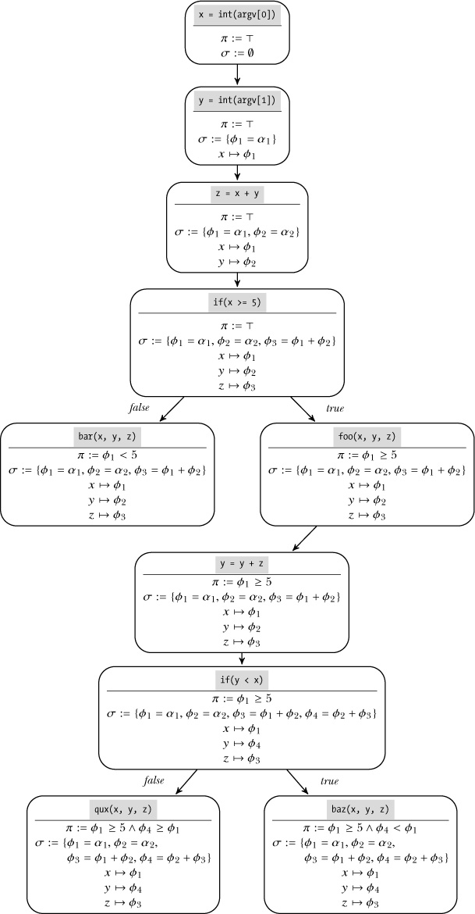
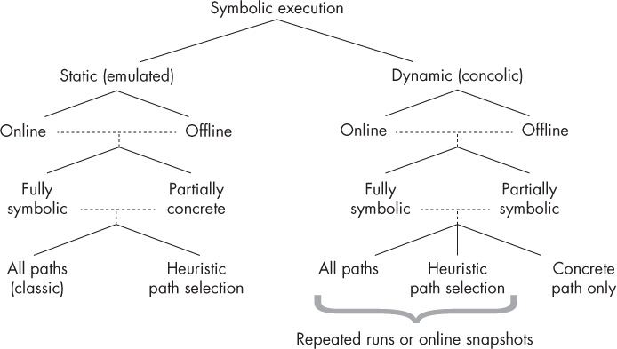

## 12 PRINCIPLES OF SYMBOLIC EXECUTION

*Symbolic execution* tracks metadata about the program state, just as taint analysis does. But unlike taint information, which only lets you infer *that* part of the program state affects another, symbolic execution allows you to reason about *how* the program state came to be and how to reach different program states. As you’ll see, symbolic execution enables many powerful analyses not possible with other techniques.

I’ll start this chapter with an overview of the basics of symbolic execution. Then, you’ll learn more about *constraint solving* (specifically, *SMT solving* ), which is a fundamental building block of symbolic execution. In Chapter 13, you’ll use Triton, a binary-level symbolic execution library, to build practical tools that demonstrate what symbolic execution can do.

### 12.1 An Overview of Symbolic Execution

Symbolic execution, or *symbex* for short, is a software analysis technique that expresses program state in terms of logical formulas that you can automatically reason about to answer complex questions about a program’s behavior. For example, NASA uses symbolic execution to generate test cases for mission-critical code, and hardware manufacturers use it to test code written in hardware description languages like Verilog and VHDL. You can also use symbolic execution to automatically increase the *code coverage* of dynamic analyses by generating new inputs that lead to unexplored program paths, which is useful for software testing and malware analysis. In Chapter 13, you’ll see practical examples that use symbex to implement code coverage, implement backward slicing, and even automatically generate exploits for vulnerabilities!

Unfortunately, although symbolic execution is a powerful technique, you have to apply it sparingly and carefully because of scalability issues. For example, depending on the type of symbolic execution problem you’re solving, the complexity may increase exponentially to the point where computing a solution becomes completely intractable. You’ll learn how to minimize these scalability issues in Section 12.1.3, but first let’s review the basic workings of symbolic execution.

#### *12.1.1 Symbolic vs. Concrete Execution*

Symbex executes (or emulates) an application with *symbolic values* instead of the concrete values used when you normally run a program. This means that variables don’t contain specific values like `42` or `foobar` as they would in a normal execution. Instead, some or all variables (or in the context of binary analysis, registers or memory locations) are represented by a symbol that stands in for any possible value the variable could take. As the execution proceeds, symbolic execution computes logical formulas over these symbols. These formulas represent the operations performed on the symbols during execution and describe limits for the range of values the symbols can represent.

As I’ll explain, many symbex engines maintain the symbols and formulas as metadata *in addition to* concrete values rather than replacing the concrete values, similar to how taint analysis tracks taint metadata. The collection of symbolic values and formulas that a symbex engine maintains is called the *symbolic state*. Let’s look at how the symbolic state is organized and then look at a concrete example of how the state evolves in a symbolic execution.

##### The Symbolic State

Symbolic execution operates on symbolic values that represent any possible concrete value. I’ll denote symbolic values as *α*_(i), where *i* is an integer (*i* ∈ *N*). The symbex engine computes two different kinds of formulas over these symbolic values: a set of *symbolic expressions* and a *path constraint*. In addition, it maintains a mapping of variables (or in the case of binary symbex, registers and memory locations) to symbolic expressions. I refer to the combination of the path constraint and all symbolic expressions and mappings as the *symbolic state*.

**Symbolic expressions** A symbolic expression *ϕ*_(j), with *j* ∈ *N*, corresponds either to a symbolic value *α*_(i) or to some mathematical combination of symbolic expressions, such as *ϕ*₃ = *ϕ*₁ + *ϕ*₂. I’ll use σ to denote the *symbolic expression store*, which is the set of all the symbolic expressions used in the symbolic execution. As I mentioned, binary-level symbex maps all or some of the registers and memory locations to an expression in σ.

**Path constraint** The path constraint encodes the limitations imposed on the symbolic expressions by the branches taken during execution. For instance, if the symbolic execution takes a branch `if(x < 5)` and then another branch `if(y >= 4)`, where *x* and *y* are mapped to the symbolic expressions *ϕ*₁ and *ϕ*₂, respectively, the path constraint formula becomes *ϕ*₁ \< 5 ∧ *ϕ*₂ ≥ 4. I’ll denote the path constraint as the symbol *π*.

In the literature on symbolic execution, path constraints are sometimes referred to as *branch constraints*. In this book, I’ll use the term *branch constraint* to refer to the constraint imposed by an individual branch and the term *path constraint* to refer to the conjunction of all the branch constraints accumulated along a program path.

##### Symbolically Executing an Example Program

Let’s make the concept of symbolic execution more concrete using the pseudocode in Listing 12-1.

*Listing 12-1: Pseudocode example to illustrate symbolic execution*

```
➊ x = int(argv[0])
   y = int(argv[1])

➋ z = x + y
➌ if(x >= 5)
      foo(x, y, z)
      y = y + z
      if(y < x)
          baz(x, y, z)
      else
          qux(x, y, z)
➍ else
      bar(x, y, z)
```

This pseudocode program takes two integers called *x* and *y* from user input. The example explored in this section uses symbolic execution to find user inputs that would cover paths through the code leading to the `foo` and `bar` functions, respectively. To achieve this, you represent *x* and *y* as symbolic values and then symbolically execute the program to compute the path constraint and symbolic expressions imposed on *x* and *y* by the program’s operations. Finally, you solve these formulas to find concrete values (if they exist) for *x* and *y* that lead the program to traverse each path. Figure 12-1 shows how the symbolic state evolves for all possible paths through the example function.



*Figure 12-1: Path constraints and symbolic state for all paths in the example function*

Listing 12-1 starts by reading *x* and *y* from user input ➊. As you can see in Figure 12-1, the path constraint *π* is initially set to ┬, the tautology symbol. This shows that no branches have yet been executed, so no constraints are imposed. Similarly, the symbolic expression store is initially the empty set. After reading *x*, the symbex engine creates a new symbolic expression *ϕ*₁ = *α*₁, which corresponds to an *unconstrained* symbolic value that can represent any concrete value, and maps *x* to that expression. Reading *y* causes an analogous effect, mapping *y* to *ϕ*₂ = *α*₂. Next, the operation *z* = *x* + *y* ➋ causes the symbex engine to map *z* to a new symbolic expression, *ϕ*₃ = *ϕ*₁ + *ϕ*₂.

Let’s assume the symbolic execution engine first explores the `true` branch of the conditional `if(x >= 5)` ➌. To do that, the engine adds the branch constraint *ϕ*₁ ≥ 5 to *π* and continues the symbolic execution at the branch target, which is the call to `foo`. Recall that the goal was to find concrete user inputs that lead to the `foo` or `bar` function. Because you’ve now reached a call to `foo`, you can solve the expressions and branch constraints to find concrete values for *x* and *y* that lead to this `foo` invocation.

At this point in the execution, *x* and *y* map to the symbolic expressions *ϕ*₁ = *α*₁ and *ϕ*₂ = *α*₂, respectively, and *α*₁ and *α*₂ are the only symbolic values. Moreover, you have only one branch constraint: *ϕ*₁ ≥ 5. Thus, one possible solution to reach this call to `foo` is *α*₁ = 5 ∧ *α*₂ = 0. This means that if you run the program normally (a concrete execution) with user inputs *x* = 5 and *y* = 0, you’ll reach the call to `foo`. Note that *α*₂ could take any value because it doesn’t occur in any of the symbolic expressions that appear in the path constraint.

A solution like the one you just saw is called a *model*. You usually compute models automatically with a special program called a *constraint solver*, which is capable of solving for the symbolic values such that all constraints and symbolic expressions are satisfied, as you’ll learn shortly in Section 12.2.

Now let’s say you want to find out how to reach the call to `bar` instead. To do this, you have to avoid the `if(x >= 5)` branch and take the `else` branch instead ➍. So you change the old path constraint *ϕ*₁ ≥ 5 to *ϕ*₁ \< 5 and ask the constraint solver for a new model. In this case, a possible model would be *α*₁ = 4 ∧ *α*₂ = 0. In some cases, the solver might also report that no solution exists, meaning that the path is unreachable.

In general, it’s not feasible to cover all paths through a nontrivial program since the number of possible paths increases exponentially with the number of branches. In Section 12.1.3, you’ll learn how to use heuristics to decide which paths to explore.

As I mentioned, there are several variants of symbolic execution, some of which work slightly differently from the example just covered. Let’s take a look at these other variants of symbolic execution and explore their trade-offs.

#### *12.1.2 Variants and Limitations of Symbolic Execution*

Like taint analysis engines, symbex engines are often designed as a framework that you can use to build your own symbex tools. Many symbex engines implement aspects from multiple symbolic execution variants and allow you to choose between them. Therefore, it’s important to be familiar with the trade-offs of these design decisions.

Figure 12-2 illustrates the most important design dimensions for symbex implementations, showing one dimension per level of the tree.

**Static vs. dynamic** Is the symbex implementation based on static or dynamic analysis?

**Online vs. offline** Does the symbex engine explore multiple paths in parallel (*online*) or not (*offline*)?

**Symbolic state** Which parts of the program state are represented symbolically, and which are concrete? How are symbolic memory accesses handled?

**Path coverage** Which (and how many) program paths does the symbolic analysis explore?



*Figure 12-2: Symbolic execution design dimensions*

Let’s discuss each of these design decisions and their trade-offs in performance, limitations, and completeness.

##### Static Symbolic Execution (SSE)

Like most software and binary analysis techniques, symbolic execution exists in static and dynamic variants with different trade-offs in scalability and completeness. Traditionally, symbolic execution is a static analysis technique that emulates part of a program, propagating symbolic state with each emulated instruction. This type of symbolic execution is also known as *static symbolic execution (SSE)*. It either analyzes all possible paths exhaustively or uses heuristics to decide which paths to traverse.

An advantage of SSE is that it enables you to analyze programs that can’t run on your CPU. For example, you can analyze ARM binaries on an x86 machine. Another benefit is that it’s easy to emulate only part of a binary (for instance, just one function) instead of the whole program.

The disadvantage is that exploring both directions at every branch isn’t always possible because of scalability issues. While you can use heuristics to limit the number of explored branches, it’s far from trivial to come up with effective heuristics that capture all the interesting paths.

Moreover, some parts of an application’s behavior are hard to model correctly with SSE, specifically when control flows outside the application to software components that the symbolic execution engine doesn’t control, such as the kernel or a library. This happens when a program issues a system call or library call, receives a signal, tries to read an environment variable, and so on. To get around this problem, you can use the following solutions, although each comes with its own disadvantages:

**Effect modeling** A common approach is for the SSE engine to model the effects of external interactions like system calls and library calls. These models are a sort of “summary” of the effects that a system or library call has on the symbolic state. (Note that the word *model* in this sense has nothing to do with the models returned by the constraint solver.)

Performance-wise, effect modeling is a relatively cheap solution. However, creating accurate models for all possible environment interactions—including with the network, the filesystem, and other processes—is a monumental task, which may involve creating a simulated symbolic filesystem, symbolic network stack, and so on. To make matters worse, the models have to be rewritten if you want to simulate a different operating system or kernel. Models are therefore often incomplete or inaccurate in practice.

**Direct external interactions** Alternatively, the symbolic execution engine may directly perform external interactions. For instance, instead of modeling the effects of a system call, the symbex engine may actually make the system call and incorporate the concrete return value and side effects into the symbolic state.

Although this approach is simple, it leads to problems when multiple paths that perform competing external interactions are explored in parallel. For instance, if multiple paths operate on the same physical file in parallel, this may lead to consistency issues if the changes conflict.

You can get around this by cloning the complete system state for each explored path, but that solution is extremely memory intensive. Moreover, because external software components cannot handle symbolic state, interacting directly with the environment means an expensive call to the constraint solver to compute suitable concrete values that you can pass to the system or library call you want to invoke.

Because of these difficulties with static symbolic execution, more recent research has explored alternative symbex implementations based on dynamic analysis.

##### Dynamic Symbolic Execution (Concolic Execution)

*Dynamic symbolic execution (DSE)* runs the application with concrete inputs and keeps the symbolic state *in addition to* the concrete state, rather than replacing it completely. In other words, this approach uses concrete state to drive the execution while maintaining symbolic state as metadata, just like how taint analysis engines maintain taint information. Because of this, dynamic symbolic execution is also known as *concolic execution*, as in “con-crete symbolic execution.”

In contrast to traditional static symbolic execution, which explores many program paths in parallel, concolic execution runs only one path at once, as determined by the concrete inputs. To explore different paths, concolic execution “flips” path constraints, as you saw in the example of Listing 12-1, and then uses the constraint solver to compute concrete inputs that lead to the alternative branch. You can then use these concrete inputs to start a new concolic execution that explores the alternative path.

Concolic execution has many advantages. It’s much more scalable since you don’t need to maintain multiple parallel execution states. You can also solve SSE’s problems with external interactions by simply running these interactions concretely. This doesn’t lead to consistency issues because concolic execution doesn’t run different paths in parallel. Because concolic execution symbolizes only “interesting” parts of the program state, such as user inputs, the constraints it computes tend to involve fewer variables than those computed by classic SSE engines, making the constraints easier and far faster to solve.

The main downside is that the code coverage achieved by concolic execution depends on the initial concrete inputs. Since concolic execution “flips” only a small number of branch constraints at once, it can take a long time to reach interesting paths if these are separated by many flips from the initial path. It’s also less trivial to symbolically execute only part of a program, although it can be implemented by dynamically enabling or disabling the symbolic engine at runtime.

##### Online vs. Offline Symbolic Execution

Another important consideration is whether the symbex engine explores multiple paths in parallel. Symbex engines that explore multiple program paths in parallel are called *online*, while engines that explore only one path at a time are called *offline*. For example, classic static symbolic execution is online because it forks off a new symbex instance at each branch and explores both directions in parallel. In contrast, concolic execution is usually offline, exploring only a single concrete run at once. However, offline SSE and online concolic execution implementations do exist.

The advantage of online symbex is that it doesn’t require you to execute the same instruction multiple times. In contrast, offline implementations often analyze the same chunk of code multiple times, having to run the entire program from the start for every program path. In this sense, online symbolic implementations are more efficient, but keeping track of all those states in parallel can cost a lot of memory, which you don’t have to worry about with offline symbolic execution.

Online symbex implementations attempt to keep the memory overhead to a minimum by merging identical parts of program states together, splitting them only when they diverge. This optimization is known as *copy on write* because it copies merged states when a write causes them to diverge, creating a fresh private copy of the state for the path issuing the write.

##### Symbolic State

The next consideration is determining which parts of the program state are represented symbolically and which are concrete, as well as figuring out how symbolic memory accesses are handled. Many SSE and concolic execution engines provide the option of omitting symbolic state for some registers and memory locations. By tracking symbolic information only for the selected state while keeping the rest of the state concrete, you can reduce the size of the state and the complexity of the path constraints and symbolic expressions.

This approach is more memory efficient and faster because the constraints are easier to solve. The trade-off is that you have to choose which state to make symbolic and which to make concrete only, and this decision is not always trivial. If you choose incorrectly, your symbex tool may report unexpected results.

Another important aspect of how symbex engines maintain symbolic state is how they represent symbolic memory accesses. Like other variables, pointers can be symbolic, meaning that their value is not concrete but partly undetermined. This introduces a difficult problem when memory loads or stores use a symbolic address. For instance, if a value is written to an array using a symbolic index, how should the symbolic state be updated? Let’s discuss several ways to approach this issue.

**Fully symbolic memory** Solutions based on fully symbolic memory attempt to model all the possible outcomes of a memory load or store operation. One way to achieve this is to fork the state into multiple copies, one to reflect each possible outcome of the memory operation. For instance, let’s suppose we’re reading from an array *a* using a symbolic index *ϕ*_(i), with the constraint that *ϕ*_(i) \< 5. The state-forking approach would then fork the state into five copies: one for the situation where *ϕ*_(i) = 0 (so that *a*\[0\] is read), another one for *ϕ*_(i) = 1, and so on.

Another way to achieve the same effect is to use constraints with *if-then-else* expressions supported by some constraint solvers. These expressions are analogous to if-then-else conditionals used in programming languages. In this approach, the same array read is modeled as a conditional constraint that evaluates to the symbolic expression of *a*\[*i*\] if *ϕ*_(i) = *i*.

While fully symbolic memory solutions accurately model program behavior, they suffer from state explosion or extremely complicated constraints if any memory accesses use unbounded addresses. These problems are more prevalent in binary-level symbex than source-level symbex because bounds information is not readily available in binaries.

**Address concretization** To avoid the state explosion of fully symbolic memory, you can replace unbounded symbolic addresses with concrete ones. In concolic execution, the symbex engine can simply use the real concrete address. In static symbolic execution, the engine will have to use a heuristic to decide on a suitable concrete address. The advantage of this approach is that it reduces the state space and complexity of constraints considerably, but the downside is that it doesn’t fully capture all possible program behaviors, which may lead the symbex engine to miss some possible outcomes.

In practice, many symbex engines employ a combination of these solutions. For instance, they may symbolically model memory accesses if the access is limited to a sufficiently small range by the constraints, while concretizing unbounded accesses.

##### Path Coverage

Finally, you will need to know which program paths the symbolic analysis explores. Classic symbolic execution explores *all* program paths, forking off a new symbolic state at every branch. This approach doesn’t scale because the number of possible paths increases exponentially with the number of branches in the program; this is the well-known *path explosion problem*. In fact, the number of paths may be infinite if there are unbounded loops or recursive calls. For nontrivial programs, you need a different approach to make symbolic execution more practical.

An alternative approach for SSE is using heuristics to decide which paths to explore. For instance, in an automatic bug discovery tool, you might focus on analyzing loops that index arrays, as these are relatively likely to contain bugs like buffer overflows.

Another common heuristic is *depth-first search (DFS)*, which explores one complete program path entirely before moving on to another path, under the assumption that deeply nested code is likely more “interesting” than superficial code. *Breadth-first search (BFS)* does the opposite, exploring all paths in parallel but taking longer to reach deeply nested code. Which heuristics to use depends on the goal of your symbex tool, and finding suitable heuristics can be a major challenge.

Concolic execution explores only one path at a time, as driven by concrete inputs. But you can also combine it with the heuristic path exploration approach or even with the approach of exploring all paths. For concolic execution, the easiest way to explore multiple paths is to run the application repeatedly, each time with new inputs discovered by “flipping” branch constraints in the previous run. A more sophisticated approach is to take snapshots of the program state so that after you’re done exploring one path, you can restore the snapshot to an earlier point in the execution and explore another path from there.

In sum, symbolic execution has many parameters that you can tweak to balance the performance and limitations of the analysis. The optimal configuration will depend on your goals, and different symbex engines make different configuration choices.

For example, Triton (which you’ll see again in Chapter 13) and angr^(1) are binary-level symbex engines that support application-level SSE and concolic execution. S2E^(2) also operates on binaries but uses a system-wide virtual machine–based approach that can apply symbex not only to applications but also to the kernel, libraries, and drivers running in the VM. In contrast, KLEE^(3) does classic online SSE on LLVM bitcode rather than directly on binary, supporting multiple search heuristics to optimize path coverage. There are even higher-level symbex engines that run directly on C, Java, or Python code.

Now that you’re familiar with the workings of various symbex techniques, let’s discuss some common optimizations you can use to increase the scalability of your symbex tools.

#### *12.1.3 Increasing the Scalability of Symbolic Execution*

As you’ve seen, symbolic execution suffers from two major factors of performance and memory overhead that undermine its scalability. These are the infeasibility of covering all possible program paths as well as the computational complexity of solving huge constraints covering hundreds or even thousands of symbolic variables.

You’ve already seen ways to reduce the impact of the path explosion problem, such as heuristically selecting which paths to execute, merging symbolic states to reduce memory usage, and using program snapshots to avoid repeated analysis of the same instructions. Next I’ll discuss several ways to minimize the cost of constraint solving.

##### Simplifying Constraints

Because constraint solving is one of the most computationally expensive aspects of symbex, it makes sense to simplify constraints as much as possible and to keep usage of the constraint solver to an absolute minimum. First, let’s look at some ways to simplify the path constraints and symbolic expressions. By simplifying these formulas, you can reduce the complexity of the constraint solver’s task, thereby speeding up the symbolic execution. Of course, the trick is to do this without significantly affecting the accuracy of the analysis.

**Limiting the number of symbolic variables** An obvious way to simplify constraints is to reduce the number of symbolic variables and make the rest of the program state concrete only. However, you can’t just randomly concretize state because if you concretize the wrong state, your symbex tool may miss possible solutions to the problem you’re trying to solve.

For example, if you’re using symbex to find network inputs that allow you to exploit a program but you concretize all the network inputs, your tool will consider only those concrete inputs and therefore fail to find an exploit. On the other hand, if you symbolize every byte received from the network, the constraints and symbolic expressions may become too complex to solve in a reasonable amount of time. The key is to symbolize only those parts of the input that stand a chance of being useful in an exploit.

One way to achieve this for concolic execution tools is to use a preprocessing pass that employs taint analysis and fuzzing to find inputs that cause dangerous effects, such as a corrupted return address, and then use symbex to find out whether there are any inputs that corrupt that return address such that it allows exploitation. This way, you can use relatively cheap techniques such as DTA and fuzzing to find out *whether* there’s a potential vulnerability and use symbolic execution only in potentially vulnerable program paths to find out *how* to exploit that vulnerability in practice. Not only does this approach allow you to focus the symbex on the most promising paths, but it also reduces the complexity of the constraints by symbolizing only those inputs that the taint analysis shows to be relevant.

**Limiting the number of symbolic operations** Another way to simplify constraints is to symbolically execute only those instructions that are relevant. For instance, if you’re trying to exploit an indirect call through the `rax` register, then you’re interested only in the instructions that contribute to `rax`’s value. Thus, you could first compute a backward slice to find the instructions contributing to `rax` and then symbolically emulate the instructions in the slice. Alternatively, some symbex engines (including Triton, which I use for the examples in Chapter 13) offer the possibility of symbolically executing only instructions that operate on tainted data or on symbolized expressions.

**Simplifying symbolic memory** As I explained previously, full symbolic memory can cause an explosion in the number of states or the size of the constraints if there are any unbounded symbolic memory accesses. You can reduce the impact of such memory accesses on constraint complexity by concretizing them. Alternatively, symbex engines like Triton allow you to make simplifying assumptions on memory accesses, such as that they can only access word-aligned addresses.

##### Avoiding the Constraint Solver

The most effective way to get around the complexity of constraint solving is to avoid the need for a constraint solver altogether. Although this may sound like an unhelpful statement, there are practical ways to limit the need for constraint solving in your symbex tools.

First, you can use the preprocessing passes I discussed to find potentially interesting paths and inputs to explore with symbex and pinpoint the instructions affected by these inputs. This helps you to avoid needless constraint solver invocations for uninteresting paths or instructions. Symbex engines and constraint solvers may also cache the results of previously evaluated (sub)formulas, thereby avoiding the need to solve the same formula twice.

Because constraint solving is a crucial part of symbolic execution, let’s explore how it works in more detail.

### 12.2 Constraint Solving with Z3

Symbolic execution describes a program’s operations in terms of symbolic formulas and uses a constraint solver to automatically solve these formulas and answer questions about the program. To understand symbolic execution and its limitations, you’ll need to be familiar with the process of constraint solving.

In this section, I’ll explain the most important aspects of constraint solving using a popular constraint solver called *Z3*. Z3 is developed by Microsoft Research and is freely available at *<https://github.com/Z3Prover/z3/>*.

Z3 is a so-called *satisfiability modulo theories (SMT)* solver, which means it’s specialized to solve satisfiability problems for formulas with respect to specific mathematical theories, such as the theory of integer arithmetic.^(4) This is in contrast to solvers for pure *Boolean satisfiability (SAT)* problems, which have no built-in knowledge of theory-specific operations such as integer operations like + or \<. Z3 has built-in knowledge of how to solve formulas involving integer operations and operations on *bitvectors* (representations of binary-level data), among others. This domain-specific knowledge is useful when solving formulas produced by symbex, which involve exactly such operations.

Note that constraint solvers like Z3 are separate programs from symbolic execution engines, and their purpose isn’t limited to symbex alone. Some symbex engines even offer you the possibility of plugging in multiple different constraint solvers, depending on which one you prefer. Z3 is a popular choice because its features are ideally suited to symbex and it offers easy-touse APIs in C/C++ and Python, among others. It also comes with a command line tool that you can use to solve formulas, which you’ll see shortly.

It’s also important to realize that Z3 is not a magic cure-all. Although Z3 and other similar solvers are useful for solving certain classes of decidable formulas, they may not be able to solve formulas outside those classes. And even formulas in the supported classes may take a long time to solve, especially if they contain lots of variables. This is why it’s important to keep your constraints as simple as possible.

I’ll only cover Z3’s most important features here, but if you’re interested, check out more comprehensive tutorials online.^(5)

#### *12.2.1 Proving Reachability of an Instruction*

Let’s begin by using the Z3 command line tool, which is preinstalled on the VM, to express and solve a simple set of formulas. Start the command line tool with the `z3 -in` command to read from standard input or `z3` *file* to read from a script file.

Z3’s input format is an extension of *SMT-LIB 2.0*, a language standard for SMT solvers. In the next examples, you’ll learn the most important commands supported by this language; these will help you debug your symbex tools because you can use them to make sense of the input your symbex tool is passing to the constraint solver. For more details on a particular command, type `(help)` into the `z3` tool.

Internally, Z3 maintains a *stack* of the formulas and declarations you provide. In Z3-speak, a formula is called an *assertion*. Z3 allows you to check whether the set of assertions you’ve provided is *satisfiable*, which means there’s a way to make all the assertions simultaneously true.

Let’s clarify this by returning to the pseudocode from Listing 12-1. The following example will use Z3 to prove that the call to function `baz` is reachable. Listing 12-2 repeats the example code, with the call to `baz` marked ➊.

*Listing 12-2: Pseudocode example to illustrate constraint solving*

```
x = int(argv[0])
y = int(argv[1])

z = x + y
if(x >= 5)
    foo(x, y, z)
    y = y + z
    if(y < x)
        ➊baz(x, y, z)
    else
         qux(x, y, z)
else
    bar(x, y, z)
```

Listing 12-3 shows how to model the symbolic expressions and path constraints, similarly to how a symbex engine would do it, to prove that `baz` is reachable. For simplicity, I assume that the call to `foo` has no side effects, so you can ignore what happens in `foo` when modeling the path to `baz`.

*Listing 12-3: Using Z3 to prove that* baz *is reachable*

```
   $ z3 -in
➊ (declare-const x Int)
   (declare-const y Int)
   (declare-const z Int)
➋ (declare-const y2 Int)
➌ (assert (= z (+ x y)))
➍ (assert (>= x   5))
➎ (assert (= y2   (+ y z)))
➏ (assert (< y2   x))
➐ (check-sat)
   sat
➑ (get-model)
   (model
     (define-fun y () Int
       (- 1))
     (define-fun x () Int
       5)
     (define-fun y2 () Int
       3)
     (define-fun z () Int
       4)
   )
```

Two things immediately stand out in Listing 12-3: all commands are enclosed in parentheses, and all operations are written in Polish notation, with the operator first and then the operands (+ *x* *y* instead of *x* + *y*).

##### Declaring Variables

Listing 12-3 starts by declaring the variables (`x`, `y`, and `z`) that occur on the path to `baz` ➊. From Z3’s perspective, these are modeled as *constants* rather than variables. To declare a constant, you use the command `declare-const`, giving the name and type of the constant. In this case, all constants are of type `Int`.

The reason for modeling `x`, `y`, and `z` as constants is that there’s a fundamental difference between executing a program path and modeling it in Z3. When you execute a program, all operations are executed one by one, but when you model a program path in Z3, you represent those same operations as a system of formulas to be solved simultaneously. When Z3 solves these formulas, it assigns concrete values to `x`, `y`, and `z`, effectively finding the appropriate constants to satisfy the formulas.

In addition to `Int`, Z3 supports other common data types like `Real` (for floating-point numbers) and `Bool`, as well as more complex types like `Array`.

`Int` and `Real` both support arbitrary precision, which is not representative of machine code operations that operate on fixed-width numbers. That’s why Z3 also offers special bitvector types, which I’ll cover in Section 12.2.5.

##### Static Single Assignment Form

The fact that Z3 solves all formulas in unison without regard for the order of operations in the program path has another important implication. Suppose that the same variable, say *y*, is assigned multiple times in the same program path, once as *y* = 5 and then later as *y* = 10. When solving, Z3 then sees two conflicting constraints stating that *y* must be simultaneously equal to 5 and 10, which is of course impossible.

Many symbex engines solve this problem by emitting symbolic expressions in *static single assignment (SSA)* form, which mandates that each variable be assigned exactly once. That means that on *y*’s second assignment, it’s split into two versions, *y*₁ and *y*₂, removing any ambiguity and resolving the contradicting constraints from Z3’s perspective. This is exactly why there’s an additional declaration of a constant named `y2` in Listing 12-3 ➋: the variable `y` in Listing 12-2 is assigned twice on the path to `baz`, so it must be split up using the SSA trick. You can also observe this in Figure 12-1, where you can see `y` being mapped to a new symbolic expression *ϕ*₄, representing the new version of `y`.

##### Adding Constraints

After declaring all the constants, you can add constraint formulas (assertions) to Z3’s formula stack using the `assert` command. As I mentioned, you express formulas in Polish notation with operators before their operands. Z3 supports common mathematical operators like +, −, =, \<, and so on, with their usual meanings. As you’ll see in later examples, Z3 also supports logical operators and operators that deal with bitvectors.

The first assertion in Listing 12-3 is a symbolic expression for `z` stating that it must equal `x + y` ➌, modeling the assignment `z = x + y` in the pseudocode program from Listing 12-2. Next, there’s an assertion that adds the branch constraint `x >= 5` ➍ (to model the branch `if(x >= 5)`), followed by a symbolic expression `y2 = y + z` ➎. Note that `y2` depends on the original `y` assigned from user input, clearly showing the need for SSA form to disambiguate the assertions and prevent circular dependencies. The final assertion adds the second branch constraint, `y2 < x` ➏. Note that I’ve omitted modeling the call to `foo` because it has no side effects and therefore doesn’t affect the reachability of `baz`.

##### Checking Satisfiability and Getting a Model

After adding all the assertions needed to model the path to `baz`, you can check the stack of assertions for satisfiability using Z3’s `check-sat` command ➐. In this case, `check-sat` prints `sat`, meaning that the system of assertions is satisfiable. This tells you that `baz` is reachable along the modeled program path. If a system of assertions is not satisfiable, `check-sat` prints `unsat` instead.

Once you know that the assertions are satisfiable, you can ask Z3 for a *model*: a concrete assignment of all the constants that satisfies all the assertions. To ask for a model, you use the command `get-model` ➑. The returned model expresses each constant assignment as a *function* (defined with the command `define-fun`) that returns a constant value. That’s because in Z3, constants are really just functions that take no arguments, and the command `declare-const` is just syntactic sugar that `get-model` omits. For instance, the line `define-fun y () Int (-1)` in the model in Listing 12-3 defines a function called `y` that takes no parameters and returns an `Int` with the value `-1`. This just means that in this model, the constant `y` has the value `-1`.

As you can see, in the case of Listing 12-3, Z3 finds the solution `x = 5`, `y = -1`, `z = 4` (since `z = x + y = 5 - 1`), and `y2 = 3` (since `y2 = y + z = -1 + 4`). This means that if you use the input values `x = 5` and `y = -1` for the pseudo-code program in Listing 12-2, you’ll reach the call to `baz`. Note that there are often multiple possible models, and the specific one that `get-model` returns here is chosen arbitrarily.

#### *12.2.2 Proving Unreachability of an Instruction*

Note that in the model from Listing 12-3, the value assigned for `y` is negative. As it happens, `baz` is reachable if `x` and `y` are signed, but not if they’re unsigned. Let’s prove this so that you can see an example of an unsatisfiable system of assertions. Listing 12-4 models the path to `baz` again, this time with the added constraint that `x` and `y` must both be non-negative.

*Listing 12-4: Proving that* baz *is unreachable if the inputs are unsigned*

```
   $ z3 -in
   (declare-const x Int)
   (declare-const y Int)
   (declare-const z Int)
   (declare-const y2 Int)
➊ (assert (>= x 0))
➋ (assert (>= y 0))
   (assert (= z (+ x y)))
   (assert (>= x 5))
   (assert (= y2 (+ y z)))
   (assert (< y2 x))
➌ (check-sat)
   unsat
```

As you can see, Listing 12-4 is exactly the same as Listing 12-3 except for the added assertions that `x >= 0` ➊ and `y >= 0` ➋. This time, `check-sat` returns `unsat` ➌, proving that `baz` is unreachable if `x` and `y` are unsigned. For an unsatisfiable problem, you cannot get a model, as none exists.

#### *12.2.3 Proving Validity of a Formula*

You can also use Z3 to prove that a set of assertions is not only satisfiable but *valid*, which means that it’s always true regardless of the concrete values you plug into it. Proving that a formula or set of formulas is valid is equivalent to proving that its negation is unsatisfiable, which you already know how to do with Z3. If the negation turns out to be satisfiable, that means the set of formulas is not valid, and you can ask Z3 for a model as a counterexample.

Let’s use this idea to prove the validity of the *bidirectional lemma*, a well-known valid formula in propositional logic. This will also allow you to see Z3’s propositional logic operators in action, as well as Z3’s Boolean data type `Bool`.

The bidirectional lemma states that ((*p* → *q*) ∧ (*r* → *s*) ∧ (*p* ∨ ¬ *s*)) ├ (*q* ∨ ¬ *r*). Listing 12-5 models the lemma in Z3 and proves its validity.

*Listing 12-5: Proving the bidirectional lemma with Z3*

```
   $ z3 -in
➊ (declare-const p Bool)
   (declare-const q Bool)
   (declare-const r Bool)
   (declare-const s Bool)
➋ (assert (=> (and (and (=> p q) (=> r s)) (or p (not s))) (or q (not r))))
➌ (check-sat)
   sat
➍ (get-model)
   (model
     (define-fun r () Bool
      true)
   )
➎ (reset)
➏ (declare-const p Bool)
   (declare-const q Bool)
   (declare-const r Bool)
   (declare-const s Bool)
➐ (assert (not (=> (and (and (=> p q) (=> r s)) (or p (not s))) (or q (not r)))))
➑ (check-sat)
   unsat
```

Listing 12-5 declares four `Bool` constants named `p`, `q`, `r`, and `s` ➊, one for each variable in the bidirectional lemma. It then asserts the bidirectional lemma itself using Z3’s logical operators ➋. As you can see, Z3 supports all the usual logical operators, including `and` (∧), `or` (∨), `xor` (⊕), `not` (¬), and the logical implication operator `=>` (→). Z3 expresses bi-implication (↔) using the equality symbol (`=`). Moreover, Z3 supports an *if-then-else* operator called `ite`, with the syntax `ite` *condition value-if-true value-if-false*. I’ve modeled the “entails” symbol ⊢ as an implication (`=>`) in the listing.

First, let’s prove that the bidirectional lemma is satisfiable. You can easily confirm that with `check-sat` ➌ and use `get-model` to get a model ➍. In this case, the model only assigns the value `true` to `r` since that’s enough to make the assertion true regardless of the values of `p`, `q`, and `s`. This tells you the bidirectional lemma is satisfiable but doesn’t prove that it’s valid.

To prove that the lemma is valid, you reset Z3’s stack of assertions ➎, declare the same constants as before ➏, and then assert the negation of the bidirectional lemma ➐. Using `check-sat`, you confirm that the negation of the lemma is unsatisfiable ➑, proving that the bidirectional lemma is valid.

In addition to propositional logic, Z3 can also solve *effectively propositional* formulas, which are a decidable subset of formulas from predicate logic. I won’t go over the details of effectively propositional formulas here since you won’t need to use predicate logic for the symbex purposes in this book.

#### *12.2.4 Simplifying Expressions*

Z3 can also simplify expressions, as shown in Listing 12-6.

*Listing 12-6: Simplifying a formula with Z3*

```
   $ z3 -in
➊ (declare-const x Int)
   (declare-const y Int)
➋ (simplify (+ (* 3 x) (* 2 y) 5 x y))
   (+ 5 (* 4 x) (* 3 y))
```

This example declares two integers called `x` and `y` ➊ and then calls Z3’s `simplify` command to simplify the formula `3x + 2y + 5 + x + y` ➋. Z3 simplifies this to `5 + 4x + 3y`. Note that in this example, I’ve used Z3’s ability to take more than two operands for the + operator and add them all together in one go. In simple examples like this, Z3’s `simplify` command works well, but it may not work as well in more complex cases. Z3’s simplification is primarily meant to benefit programs like symbex engines that process formulas automatically, not to improve human readability.

#### *12.2.5 Modeling Constraints for Machine Code with Bitvectors*

So far, all the examples have used Z3’s arbitrary precision `Int` data type. If you use arbitrary precision data types to model a binary, the result may not be representative of reality because binaries operate on fixed-width integers that offer only limited precision. That’s why Z3 also offers *bitvectors*, which are fixed-width integers perfectly suited for use in symbolic execution.

To manipulate bitvectors, you use dedicated operators like `bvadd`, `bvsub`, and `bvmul` instead of the usual integers operators like +, −, and ×. Table 12-1 shows an overview of the most common bitvector operators. You’ll see a lot of these if you inspect the constraints and symbolic expressions that symbex engines like Triton pass to the constraint solver. Moreover, knowledge of these operators comes in handy when building your own symbex tools, as you’ll do in Chapter 13. Let’s discuss how to use the operators listed in Table 12-1 in practice.

Z3 allows you to create bitvectors of any desired bit width. There are several ways to achieve this, as you can see in the first part of Table 12-1 ➊. First, you can create a 4-bit-wide bitvector constant containing the bits `1101` using the notation `#b1101`. Similarly, the notation `#xda` creates an 8-bit-wide bitvector containing the value `0xda`.

As you can see, for binary or hexadecimal constants, Z3 automatically infers the minimum size the bitvector needs to have. To declare decimal constants, you need to state both the bitvector’s value and its width explicitly. For instance, the notation `(_ bv10 32)` creates a 32-bit-wide bitvector containing the value 10. You can also declare bitvector constants with an undetermined value using the notation `(declare-const x (_ BitVec 32))`, where `x` is the constant’s name and `32` is its bit width.

**Table 12-1:** Common Z3 Bitvector Operators

|                                          |                                    |                                      |
|------------------------------------------|------------------------------------|--------------------------------------|
| Operation                                | Description                        | Example                              |
| ➊ Bitvector creation                     |                                    |                                      |
| `#b<value>`                              | Binary bitvector constant          | `#b1101        ; 1101`               |
| `#x<value>`                              | Hexadecimal bitvector constant     | `#xda           ; 0xda`              |
| `(_ bv<value> <width>)`                  | Decimal bitvector constant         | `(_ bv10 32) ; 10 (32 bits wide)`    |
| `(_ BitVec <width>)`                     | Type for \<width\> -bit bitvector  | `(declare-const x (_ BitVec 32))`    |
| ➋ Arithmetic operators                   |                                    |                                      |
| `bvadd`                                  | Addition                           | `(bvadd x #x10)          ; x + 0x10` |
| `bvsub`                                  | Subtraction                        | `(bvsub #x20 y)          ; 0x20 - y` |
| `bvmul`                                  | Multiplication                     | `(bvmul #x2 #x3)         ; 6`        |
| `bvsdiv`                                 | Signed division                    | `(bvsdiv x y)            ; x/y`      |
| `bvudiv`                                 | Unsigned division                  | `(bvudiv y x)            ; y/x`      |
| `bvsmod`                                 | Signed modulo                      | `(bvsmod x y)            ; x % y`    |
| `bvneg`                                  | Two's complement                   | `(bvneg #b1101)          ; 0011`     |
| `bvshl`                                  | Left shift                         | `(bvshl #b0011 #x1)      ; 0110`     |
| `bvlshr`                                 | Logical (unsigned) right shift     | `(bvlshr #b1000 #x1)     ; 0100`     |
| `bvashr`                                 | Arithmetic (signed) right shift    | `(bvashr #b1000 #x1)     ; 1100`     |
| ➌ Bitwise operators                      |                                    |                                      |
| `bvor`                                   | Bitwise OR                         | `(bvor #x1 #x2)              ; 3`    |
| `bvand`                                  | Bitwise AND                        | `(bvand #xffff #x0001)       ; 1`    |
| `bvxor`                                  | Bitwise XOR                        | `(bvxor #x3 #x5)             ; 6`    |
| `bvnot`                                  | Bitwise NOT (one's complement)     | `(bvnot x);                  ∼x`     |
| ➍ Comparison operators                   |                                    |                                      |
| `=`                                      | Equality                           | `(= x y)           ; x == y`         |
| `bvult`                                  | Unsigned less than                 | `(bvult x #x1a) ; x < 0x1a`          |
| `bvslt`                                  | Signed less than                   | `(bvslt x #x1a) ; x < 0x1a`          |
| `bvugt`                                  | Unsigned greater than              | `(bvugt x y)       ; x > y`          |
| `bvsgt`                                  | Signed greater than                | `(bvsgt x y)       ; x > y`          |
| `bvule`                                  | Unsigned less than or equal        | `(bvule x #x55) ; x <= 0x55`         |
| `bvsle`                                  | Signed less than or equal          | `(bvsle x #x55) ; x <= 0x55`         |
| `bvuge`                                  | Unsigned greater than or equal     | `(bvuge x y)       ; x >= y`         |
| `bvsge`                                  | Signed greater than or equal       | `(bvsge x y)       ; x >= y`         |
| ➎ Bitvector concatenation and extraction |                                    |                                      |
| `concat`                                 | Concatenate bitvectors             | `(concat #x4 #x8)       ; 0x48`      |
| `(_ extract <hi> <lo>)`                  | Extract bits \<lo\> through \<hi\> | `((_ extract 3 0) #x48) ; 0x8`       |

Z3 also supports arithmetic bitvector operators to mirror all the primitive operations supported in languages like C/C++ and instruction sets like x86 ➋. For instance, the Z3 command `(assert (= y (bvadd x #x10)))` asserts that the bitvector `y` must be equal to the bitvector `x + 0x10`. For many operations, Z3 includes both signed and unsigned variants. For example, `(bvsdiv x y)` performs a signed division `x/y`, while `(bvudiv x y)` does an unsigned division. Also note that Z3 demands that both operands in an arithmetic bitvector operation have the same bit width.

In the “Example” column of Table 12-1, I’ve listed examples of all of Z3’s common bitvector operations. The semicolons denote comments that show the C/C++ equivalent or arithmetic outcome of the Z3 operation.

In addition to arithmetic operators, Z3 also implements common bitwise operators such as OR (equivalent to C’s `|`), AND (`&`), XOR (`^`), and NOT (`~`) ➌. It also implements comparisons like `=` to check for equality between bitvectors, `bvult` to perform an unsigned “less than” comparison, and so on ➍. The supported comparisons are quite similar to those supported by x86’s conditional jumps and are especially useful in combination with Z3’s `ite` operator. For instance, `(ite (bvsge x y) 22 44)` evaluates to `22` if `x >= y`, or `44` otherwise.

You can also concatenate two bitvectors or extract part of a bitvector ➎. This is useful when you have to equalize the size of two bitvectors to allow a certain operation or when you’re interested in only part of the bitvector.

Now that you’re familiar with Z3’s bitvector operators, let’s take a look at a practical example that uses these operators.

#### *12.2.6 Solving an Opaque Predicate Over Bitvectors*

Let’s solve an opaque predicate with Z3 to see how to use bitvector operations in practice. Opaque predicates are branch conditions that always evaluate to true or false, without this being obvious to a reverse engineer. They’re used as code obfuscations to make code harder for reverse engineers to understand, for instance by inserting dead code that’s never reached in practice.

In some cases, you can use a constraint solver like Z3 to prove that a branch is opaquely true or false. For example, consider an opaquely false branch that makes use of the fact that ∀*x* ∈ ℤ,2 \| (*x* + *x*²). In other words, for any integer *x*, the result of *x* + *x*² is zero modulo two. You can use this to construct a branch `if((x + x*x) % 2 != 0)` that will never be taken, no matter the value of `x`, without that being immediately obvious. You can then insert confusing bogus code in the “taken” path of the branch to lead reverse engineers astray.

Listing 12-7 shows how to model this branch in Z3 and prove that it can never be taken.

*Listing 12-7: Solving an opaque predicate with Z3*

```
   $ z3 -in
➊ (declare-const x (_ BitVec 64))
➋ (assert (not (= (bvsmod (bvadd (bvmul x x) x) (_ bv2 64)) (_ bv0 64))))
➌ (check-sat)
   unsat
```

First, you declare a 64-bit bitvector called `x` ➊ to use in the branch condition. You then assert the branch condition itself ➋, and finally you check its satisfiability with `check-sat` ➌. Because `check-sat` returns `unsat`, you know the branch condition can never be true, so you can safely ignore any code inside the branch when reverse engineering.

As you can see, manually modeling and proving even a simple opaque predicate like this is tedious. But with symbolic execution, you can solve problems like this automatically.

### 12.3 Summary

In this chapter, you learned the principles of symbolic execution and constraint solving. Symbolic execution is a powerful but unscalable technique that should be used with care. For that reason, there are several ways of optimizing symbex tools, most of which rely on minimizing the amount of code to analyze and the load on the constraint solver. In Chapter 13, you’ll learn how to use symbex in practice by building practical symbex tools with Triton.

Exercises

1\. Tracking Symbolic State

Consider the following code:

```
x = int(argv[0])
y = int(argv[1])

z = x*x
w = y*y
if(z <= 1)
  if( ((z + w) % 7 == 0) && (x % 7 != 0) )
     foo(z, w)
else
  if((2**z - 1) % z != 0)
     bar(x, y, z)

  else
    z = z + w
    baz(z, y, x)
z = z*z
qux(x, y, z)
```

Create a tree diagram that shows how the symbolic state evolves for every path through this code (similar to Figure 12-1). The statement `2**z` stands for 2^(z).

Note that the last two statements in this code are executed at the end of each code path, regardless of which branches were taken. However, the value of `z` in these last statements depends on which path was taken before. To capture this behavior in the tree, you have these two options:

1\. Create a private copy of the last two statements for each path in your diagram.

2\. Merge all paths back together at these last statements and model the symbolic value of `z` with a conditional *if-then-else* expression that depends on the taken path.

2\. Proving Reachability

Use Z3 to figure out which of the calls to `foo`, `bar`, and `baz` are reachable in the listing from the previous exercise. Model the relevant operations and branches using bitvectors.

3\. Finding Opaque Predicates

Use Z3 to check whether any of the conditionals in the previous listing are opaque predicates. If so, are they opaquely true or false? Which code is unreachable and therefore safe to eliminate from the listing?