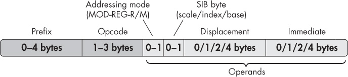
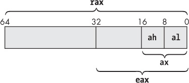
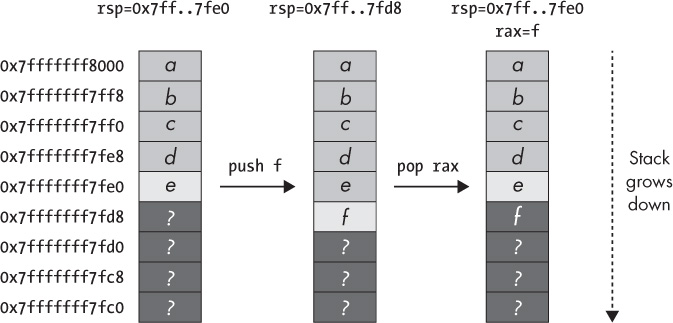
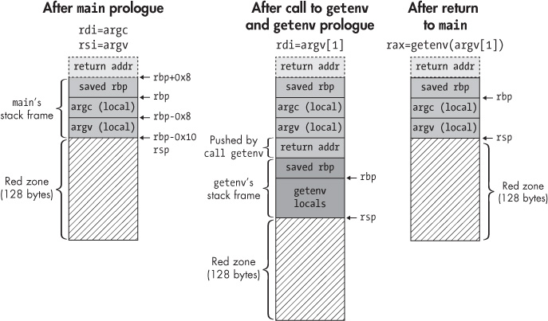

## A A CRASH COURSE ON X86 ASSEMBLY

Because assembly language is the standard representation of the machine instructions you’ll find in binaries, many binary analyses are based on disassembly. Therefore, it’s important that you’re familiar with the basics of x86 assembly language to get the most out of this book. This appendix introduces you to the essentials that you need to know to follow along.

The purpose of this appendix is not to teach you how to write assembly programs (there are books dedicated to that subject) but to show you the essentials you need to know to understand disassembled programs. You’ll learn how assembly programs and x86 instructions are structured and how they behave at runtime. Moreover, you’ll see how common code constructs from C/C++ programs are represented at the assembly level. I’ll only cover basic 64-bit user-mode x86 instructions, not floating-point instructions or extended instruction sets like SSE or MMX. For brevity, I’ll refer to the 64-bit variant of x86 (x86-64 or x64) simply as x86, since that’s the focus of this book.

### A.1 Layout of an Assembly Program

Listing A-1 shows a simple C program, and Listing A-2 shows the corresponding assembly program produced by `gcc` 5.4.0. (Chapter 1 explains how compilers transform C programs into assembly listings and eventually into binaries.)

When you disassemble a binary, the disassembler essentially tries to translate it back into an accurate assembly listing resembling the compiler-generated assembly as closely as possible. For now, let’s take a look at the *layout* of the assembly program without going into details on the assembly instructions yet.

*Listing A-1: “Hello, world!” in C*

```
  #include <stdio.h>

  int
➊ main(int argc, char *argv[])
  {
     ➋printf(➌"Hello, world!\n");

     return 0;
  }
```

*Listing A-2: Assembly generated by* gcc

```
      .file "hello.c"
      .intel_syntax noprefix
➍    .section .rodata
  .LC0:
➎    .string "Hello, world!"
➏    .text
     .globl  main
     .type   main, @function
➐ main
      push    rbp
      mov     rbp, rsp
      sub     rsp, 16
      mov     DWORD PTR [rbp-4], edi
      mov     QWORD PTR [rbp-16], rsi
➑    mov     edi, OFFSET FLAT:.LC0
➒    call    puts
      mov     eax, 0
      leave
      ret
      .size    main, .-main
      .ident  "GCC: (Ubuntu 5.4.0-6ubuntu1~16.04.9)"
      .section .note.GNU-stack,"",@progbits
```

Listing A-1 consists of a `main` function ➊ that calls `printf` ➋ to print a constant `"Hello, world!"` string ➌. At a high level, the corresponding assembly program consists of four types of components: instructions, directives, labels, and comments.

#### *A.1.1 Assembly Instructions, Directives, Labels, and Comments*

Table A-1 shows examples of each component type. Note that the exact syntax for each component varies per assembler or disassembler. For the purposes of this book, you won’t need to be intimately familiar with any assembler’s syntactical quirks; you’ll only need to learn to read and analyze disassembled code, not write your own assembly code. Here, I’ll stick to the assembly syntax produced by `gcc` with the `-masm=intel` option.

**Table A-1:** Components of an Assembly Program

| Type        | Example                 | Meaning                                            |
|-------------|-------------------------|----------------------------------------------------|
| Instruction | `mov eax, 0`            | Move zero into eax                                 |
| Directive   | `.section .text`        | Place the following content into the .text section |
| Directive   | `.string "foobar"`      | Define an ASCII string containing "foobar"         |
| Directive   | `.long 0x12345678`      | Define a doubleword with value 0x12345678          |
| Label       | `foo: .string "foobar"` | Define the "foobar" string with symbolic name foo  |
| Comment     | `# this is a comment`   | A human-readable comment                           |

*Instructions* are the actual operations that the CPU executes. *Directives* are commands that tell the assembler to produce a particular piece of data, place instructions or data in a particular section, and so on. Finally, *labels* are symbolic names that you can use to refer to instructions or data in the assembly program, and *comments* are human-readable strings for documentation purposes. After the program is assembled and linked into a binary, all symbolic names are replaced by addresses.

The assembly program in Listing A-2 directs the assembler to place the `"Hello, world!"` string in the `.rodata` section ➍➎, which is a section dedicated to storing constant data. The directive `.section` tells the assembler in which section to place the following content, while `.string` is a directive that allows you to define an ASCII string. There are also directives to define other types of data, such as `.byte` (define a byte), `.word` (a 2-byte word), `.long` (a 4-byte doubleword), and `.quad` (an 8-byte quadword).

The `main` function is placed in the `.text` section ➏➐, dedicated to storing code. The `.text` directive is shorthand for `.section .text`, and `main:` introduces a symbolic label for the `main` function.

The label is followed by the actual instructions that `main` contains. These instructions can refer symbolically to previously declared data, such as `.LC0` ➑ (the symbolic name `gcc` chose for the `"Hello, world!"` string). Because the program prints a constant string (without variadic arguments), `gcc` replaces the `printf` call with a call to `puts` ➒, a simpler function that prints a given string to screen.

#### *A.1.2 Separation Between Code and Data*

One key observation you can make in Listing A-2 is that compilers usually separate code and data into different sections. That’s convenient when you’re disassembling or analyzing a binary because you know which bytes in the program to interpret as code and which to interpret as data. However, there’s nothing inherent in the x86 architecture preventing you from mixing code and data in the same section, and in practice, some compilers or handwritten assembly programs do exactly that.

#### *A.1.3 AT&T vs. Intel Syntax*

As mentioned, different assemblers use different syntaxes for assembly programs. On top of that, there are two different syntax formats in use to represent x86 machine instructions: *Intel syntax* and *AT&T syntax*.

AT&T syntax explicitly prefixes every register name with the `%` symbol and every constant with a `$` symbol, while Intel syntax omits these symbols. In this book, I use Intel syntax because it’s less verbose. The most crucial difference between AT&T and Intel is that they order instruction operands in exactly opposite ways. In AT&T syntax, the source operand comes before the destination so that moving a constant into the `edi` register looks like this:

```
mov    $0x6,%edi
```

In contrast, Intel syntax represents the same instruction as follows, with the destination operand first:

```
mov    edi,0x6
```

It’s important to keep the operand ordering in mind because you’ll probably encounter both syntax styles as you delve further into binary analysis.

### A.2 Structure of an x86 Instruction

Now that you have an idea of how assembly programs are structured, let’s take a look at the format of assembly instructions. You’ll also see the structure of the machine-level instructions that the assembly represents.

#### *A.2.1 Assembly-Level Representation of x86 Instructions*

At the assembly level, x86 instructions generally have the form `mnemonic destination, source`. The mnemonic is a human-readable representation of a machine instruction, and source and destination are the operands of the instruction. For example, the assembly instruction `mov rbx, rax` copies the value from the `rax` register into `rbx`. Note that not all instructions have exactly two operands; some even have no operands at all, as you’ll see shortly.

As mentioned, mnemonics are higher-level representations of the machine instructions the CPU understands. Let’s take a brief look at how x86 instructions are structured at the machine level. That’s useful to know in some binary analysis situations, such as when you’re modifying an existing binary.

#### *A.2.2 Machine-Level Structure of x86 Instructions*

The x86 ISA uses variable-length instructions; there are x86 instructions that consist of only 1 byte, but also multibyte instructions, ranging up to a maximum instruction length of 15 bytes. Moreover, instructions can start at any memory address. This means that the CPU doesn’t enforce any particular code alignment, although compilers often do align code to optimize the performance of fetching instructions from memory. Figure A-1 shows the machine-level structure of an x86 instruction.



*Figure A-1: Structure of an x86 instruction*

An x86 instruction consists of optional prefixes, an opcode, and zero or more operands. Note that all parts except for the opcode are optional.

The opcode is the main designator for the instruction type. For instance, the opcode `0x90` encodes a `nop` instruction, which does nothing, while the opcodes `0x00`–`0x05` encode various types of `add` instructions. Prefixes can modify the behavior of an instruction, for example, causing it to repeat multiple times or access a different memory segment. Finally, the operands are the data that the instruction operates on.

The *addressing mode* byte, also known as the *MOD-R/M* or *MOD-REGR/M* byte, contains metadata about the instruction’s operand types. The *SIB (scale/index/base)* bytes and the *displacement* are used to encode memory operands, and the *immediate* field can contain an immediate operand (a constant numeric value). You’ll see what these fields mean in more detail shortly.

In addition to the *explicit operands* shown in Figure A-1, some instructions have *implicit operands*. These aren’t explicitly encoded in the instruction but are innate to the opcode. For example, the destination operand of opcode `0x05` (an `add` instruction) is always `rax`, and only the source operand is variable and needs to be explicitly encoded. As another example, the `push` instruction implicitly updates `rsp` (the stack pointer register).

On x86, instructions can have three different types of operands: register operands, memory operands, and immediates. Let’s take a look at each of the valid operand types.

#### *A.2.3 Register Operands*

*Registers* are small, quickly accessible pieces of storage located on the CPU itself. Some registers have a special purpose, such as the instruction pointer that tracks the current execution address or the stack pointer that tracks the top of the stack. Others are general-purpose storage units for variables used by whatever program the CPU is executing.

##### General-Purpose Registers

In the original 8086 instruction set on which x86 is based, registers were 16 bits wide. The 32-bit x86 ISA extended these registers to 32 bits, and x86-64 extended them further to 64 bits. To retain backward compatibility, the registers used in the newer instruction sets are a superset of the older registers.

To specify a register operand in assembly, you use the register’s name. For example, `mov rax,64` moves the value 64 into the `rax` register. Figure A-2 shows how the 64-bit `rax` register is subdivided into legacy 32-bit and 16-bit registers. The lower 32 bits of `rax` form a register named `eax`, and the lower 16 bits of that form the original 8086 register `ax`. You can access the lower byte in `ax` through the register name `al` and the higher byte through `ah`.



*Figure A-2: Subdivision of the x86-64* `rax` *register*

Other registers have similar naming schemes. Table A-2 shows the names of the general-purpose registers available on x86-64, as well as the available legacy “subregisters.” The `r8`–`r15` registers were added in x86-64 and aren’t available in earlier x86 variants. Note that if you set a 32-bit subregister like `eax`, this automatically zeros out the other bits in the parent register (in this case, `rax`); setting smaller subregisters like `ax`, `al`, and `ah` retains the other bits.

**Table A-2:** x86 General-Purpose Registers

| Description         | 64-bit    | Lower 32 bits | Lower 16 bits | Lower byte | 2nd byte |     |
|---------------------|-----------|---------------|---------------|------------|----------|-----|
| Accumulator         | `rax`     | `eax`         | `ax`          | `al`       | `ah`     |     |
| Base                | `rbx`     | `ebx`         | `bx`          | `bl`       | `bh`     |     |
| Counter             | `rcx`     | `ecx`         | `cx`          | `cl`       | `ch`     |     |
| Data                | `rdx`     | `edx`         | `dx`          | `dl`       | `dh`     |     |
| Stack               | `pointer` | `rsp`         | `esp`         | `sp`       | `spl`    |     |
| Base                | `pointer` | `rbp`         | `ebp`         | `bp`       | `bpl`    |     |
| Source index        | `rsi`     | `esi`         | `si`          | `sil`      |          |     |
| Destination index   | `rdi`     | `edi`         | `di`          | `dil`      |          |     |
| x86-64 GP registers | `r8–r15`  | `r8d–r15d`    | `r8w–r15w`    | `r8l–r15l` |          |     |

Don’t put too much weight on the description column for most registers. Those descriptions stem from the 8086 instruction set, but nowadays most of the registers shown in Table A-2 are simply used interchangeably. As you can see in Section A.4.1, the stack pointer (`rsp`) and base pointer (`rbp`) are considered special because they’re used to track the layout of the stack, even though you can in principle use them as general-purpose registers.

##### Other Registers

In addition to the registers shown in Table A-2, x86 CPUs contain other registers that aren’t general purpose. The two most important are `rip` (called `eip` on 32-bit x86 and `ip` on 8086) and `rflags` (called `eflags` or `flags` in older ISAs). The instruction pointer always points to the next instruction address and is automatically set by the CPU; you can’t manually write it. On x86-64 you can read the value of the instruction pointer, but on 32-bit x86 you can’t even do that. The status flags register is used for comparisons and conditional branches and tracks things like whether the last operation yielded zero, resulted in an overflow, and so on.

The x86 ISA also has *segment registers* named `cs`, `ds`, `ss`, `es`, `fs`, and `gs` that you can use to divide memory into different segments. Segmentation has largely fallen into disuse, and x86-64 has mostly dropped support for it, so I won’t go into details on segmentation here. If you’re interested in learning more, a dedicated book on x86 assembly should cover this topic.

There are also *control registers* such as `cr0`–`cr10` that the kernel uses to control the CPU’s behavior, for instance, to switch between protected mode and real mode. Additionally, registers `dr0`–`dr7` are *debug registers* that provide hardware support for debugging features such as breakpoints. On x86, control and debug registers are not accessible from user mode; only the kernel can access them. Therefore, I won’t cover these registers further in this appendix.

There are also various *model-specific registers (MSRs)* and registers used in extended instruction sets like SSE and MMX that aren’t present on all x86 CPUs. You can use the `cpuid` instruction to find out which features the CPU supports and use the `rdmsr` and `wrmsr` instructions to read or write model-specific registers. Because many of these special registers are available only from the kernel, you won’t have to deal with them in this book.

#### *A.2.4 Memory Operands*

*Memory operands* specify a memory address where the CPU should fetch one or more bytes. The x86 ISA supports only one explicit memory operand per instruction. That is, you can’t directly `mov` bytes from one memory location to another in one instruction. To accomplish that, you have to use a register as intermediate storage.

On x86, you specify memory operands with `[`*base* `+` *index*`*`*scale* `+` *displacement*`]`, where *base* and *index* are 64-bit registers, *scale* is an integer with the value 1, 2, 4, or 8, and *displacement* is a 32-bit constant or a symbol. All of these components are optional. The CPU computes the result of the memory operand expression, yielding the final memory address. The base, index, and scale are encoded in the instruction’s SIB byte, while the displacement is encoded in the field of the same name. The scale defaults to 1, while the displacement defaults to 0.

This memory operand format is flexible enough to allow many common code paradigms in a straightforward way. For instance, you can use an instruction like `mov eax, DWORD PTR [rax*4 + arr]` to access an array element, where `arr` is a displacement containing the array’s starting address, `rax` contains the index of the element you want to access, and each array element is 4 bytes long. Here, `DWORD PTR` tells the assembler that you want to fetch 4 bytes (a doubleword or DWORD) from memory. Similarly, one way to access a field in a `struct` is to store the `struct`’s starting address in a base register and add the displacement of the field you want to access.

On x86-64, you’re allowed to use `rip` (the instruction pointer) as the base in a memory operand, though in that case you can’t use an index register. Compilers make frequent use of this possibility for position-independent code and data accesses, among other things, so you’ll see lots of `rip`-relative addressing in x86-64 binaries.

#### *A.2.5 Immediates*

*Immediates* are constant integer operands hardcoded in the instruction. For example, in the instruction `add rax, 42`, the value 42 is an immediate.

On x86, immediates are encoded in little-endian format; the least significant byte of a multibyte integer comes first in memory. In other words, if you write an assembly-level instruction like `mov ecx, 0x10203040`, the corresponding machine-level instruction encodes the immediate with the bytes reversed, as `0x40302010`.

To encode signed integers, x86 uses two’s complement notation, which encodes a negative value by taking the positive version of that value and then flipping all the bits and adding 1 while ignoring overflows. For example, to encode a 4-byte integer with the value −1, you take the integer `0x00000001` (the hexadecimal representation of 1), flip all the bits to produce `0xfffffffe`, and then add 1 to yield the final two’s complement representation `0xffffffff`. When you’re disassembling code and you see an immediate or memory value that starts with lots of `0xff` bytes, you’re often dealing with a negative value.

Now that you’re familiar with the general format and workings of x86 instructions, let’s take a look at the semantics of some of the common instructions you’ll encounter in this book and your own binary analysis projects.

### A.3 Common x86 Instructions

Table A-3 describes common x86 instructions. To learn more about an instruction not listed in this table, look it up in an online reference such as *<http://ref.x86asm.net/>* or in the Intel manual at *<https://software.intel.com/en-us/articles/intel-sdm/>*. Most of the instructions listed in the table are self-explanatory, but a few deserve a more detailed discussion.

**Table A-3:** Common x86 Instructions

| Instruction                                                                                                                                                                      | Description                                                                                                            |
|----------------------------------------------------------------------------------------------------------------------------------------------------------------------------------|------------------------------------------------------------------------------------------------------------------------|
| Data transfer                                                                                                                                                                    |                                                                                                                        |
| ➊ mov dst, src                                                                                                                                                                   | dst = src                                                                                                              |
| `xchg dst1, dst2`                                                                                                                                                                | Swap dst1 and dst2                                                                                                     |
| ➋ push src                                                                                                                                                                       | Push src onto the stack and decrement rsp                                                                              |
| `pop dst`                                                                                                                                                                        | Pop value from stack into dst and increment rsp                                                                        |
| Arithmetic                                                                                                                                                                       |                                                                                                                        |
| `add dst, src`                                                                                                                                                                   | dst += src                                                                                                             |
| `sub dst, src`                                                                                                                                                                   | dst –= src                                                                                                             |
| `inc dst`                                                                                                                                                                        | dst += 1                                                                                                               |
| `dec dst`                                                                                                                                                                        | dst –= 1                                                                                                               |
| `neg dst`                                                                                                                                                                        | dst = –dst                                                                                                             |
| ➌ cmp src1, src2                                                                                                                                                                 | Set status flags based on src1 – src2                                                                                  |
| Logical/bitwise                                                                                                                                                                  |                                                                                                                        |
| `and dst, src`                                                                                                                                                                   | dst &= src                                                                                                             |
| `or dst, src`                                                                                                                                                                    | dst \|= src                                                                                                            |
| `xor dst, src`                                                                                                                                                                   | dst ^= src                                                                                                             |
| `not dst`                                                                                                                                                                        | dst = ~dst                                                                                                             |
| ➍ test src1, src2                                                                                                                                                                | Set status flags based on src1 & src2                                                                                  |
| Unconditional branches                                                                                                                                                           |                                                                                                                        |
| `jmp addr`                                                                                                                                                                       | Jump to address                                                                                                        |
| `call addr`                                                                                                                                                                      | Push return address on stack, then call function at address                                                            |
| `ret`                                                                                                                                                                            | Pop return address from stack and return to that address                                                               |
| ➎ syscall                                                                                                                                                                        | Enter the kernel to perform a system call                                                                              |
| Conditional branches (based on status flags) jcc addr jumps to address only if condition cc holds, else it falls through jncc inverts the condition, jumping if it does not hold |                                                                                                                        |
| ➏ je addr / jz addr                                                                                                                                                              | Jump if zero flag is set (for example, operands were equal in last cmp )                                               |
| `ja addr`                                                                                                                                                                        | Jump if dst \> src (“above”) in last comparison (unsigned)                                                             |
| `jb addr`                                                                                                                                                                        | Jump if dst \< src (“below”) in last comparison (unsigned)                                                             |
| `jg addr`                                                                                                                                                                        | Jump if dst \> src (“greater than”) in last comparison (signed)                                                        |
| `jl addr`                                                                                                                                                                        | Jump if dst \< src (“less than”) in last comparison (signed)                                                           |
| `jge addr`                                                                                                                                                                       | Jump if dst \>= src in last comparison (signed)                                                                        |
| `jle addr`                                                                                                                                                                       | Jump of dst \<= src in last comparison (signed)                                                                        |
| `js addr`                                                                                                                                                                        | Jump if last comparison set the sign bit (meaning the result was negative)                                             |
| Miscellaneous                                                                                                                                                                    |                                                                                                                        |
| ➐ lea dst, src                                                                                                                                                                   | Load memory address into dst ( dst = &src , where src must be in memory) nop Do nothing (for example for code padding) |

First, it’s worth noting that `mov` ➊ is a bit of a misnomer because it doesn’t technically *move* the source operand into the destination. Rather, it copies it, leaving the source operand intact. The `push` and `pop` instructions ➋ have special significance with regard to stack management and function calls, as you’ll see shortly.

#### *A.3.1 Comparing Operands and Setting Status Flags*

The `cmp` instruction ➌ is important for implementing conditional branches. It subtracts the second operand from the first, but instead of storing the outcome of that operation somewhere, it sets status flags in the `rflags` register based on the outcome. Subsequent conditional branches check these status flags to decide whether the branch should be taken. Important flags include the *zero flag (ZF)*, the *sign flag (SF)*, and the *overflow flag (OF)*, which indicate whether the outcome of the comparison was zero, negative, or resulted in an overflow, respectively.

The `test` instruction ➍ is similar to `cmp`, but it sets status flags based on the bitwise AND of its operands, rather than the subtraction. It’s worth noting that some other instructions, besides `cmp` and `test`, set status flags as well. The Intel manual or online instruction reference show exactly which flags each instruction sets.

#### *A.3.2 Implementing System Calls*

To perform a system call, you use the `syscall` instruction ➎. Before using it, you have to prepare the system call by selecting its number and setting its operands as specified by the operating system. For example, to perform a `read` system call on Linux, you load the value 0 (the system call number for `read`) into `rax`; then load the file descriptor, buffer address, and number of bytes to read into `rdi`, `rsi`, and `rdx`, respectively; and finally execute a `syscall` instruction.

To find out how to configure system calls on Linux, refer to `man syscalls` or an online reference like *<https://filippo.io/linux-syscall-table/>*. Note that on 32-bit x86, you make a system call using `sysenter` or `int 0x80` (which triggers a software interrupt for interrupt vector `0x80`) instead of `syscall`. Also, system call conventions can differ on operating systems other than Linux.

#### *A.3.3 Implementing Conditional Jumps*

Conditional jump instructions ➏ implement branches by working in unison with earlier instructions that set status flags, like `cmp` or `test`. They jump to a specified address or label if the given condition holds or fall through to the next instruction if the condition does not hold. For example, to jump to a program location named *label* if `rax < rbx` (using an unsigned comparison), you typically use an instruction sequence like this:

```
cmp rax, rbx
jb label
```

Similarly, to jump to *label* if `rax` is not zero, you can use the following:

```
test rax, rax
jnz label
```

#### *A.3.4 Loading Memory Addresses*

Finally, the `lea` instruction ➐ (*load effective address*) computes the address resulting from a memory operand (formatted as `[base + index*scale + displacement]`) and stores it in a register but does not dereference the address. This is equivalent to the address-of operator (`&`) in C/C++. For example, `lea r12, [rip+0x2000]` loads the address resulting from the expression `rip+0x2000` into the `r12` register.

Now that you’re familiar with the most important x86 instructions, let’s see how these instructions come together to implement common C/C**++** code constructs.

### A.4 Common Code Constructs in Assembly

Compilers like `gcc`, `clang`, and Visual Studio emit common code patterns for constructs like function calls, `if`/`else` branches, and loops. You’ll also see these same code patterns in handwritten assembly code. It helps to be familiar with them so that you can quickly understand what a piece of assembly or disassembled code is doing. Let’s take a look at code patterns emitted by `gcc 5.4.0`. Other compilers use similar patterns.

The first code construct you’ll see are function calls. But before you can understand how function calls are implemented at the assembly level, you need to be familiar with how *the stack* works on x86.

#### *A.4.1 The Stack*

The stack is a memory region reserved for storing data related to function calls, such as return addresses, function arguments, and local variables. On most operating systems, each thread has its own stack.

The stack gets its name from the way it’s accessed. Rather than writing values at random places in the stack, you do so in a *last-in-first-out (LIFO)* order. That is, you can write values by *pushing* them to the top of the stack and remove values by *popping* them from the top. This makes sense for function calls because it matches the way you invoke and return from functions: the last function you call returns first. Figure A-3 illustrates the stack access pattern.

In Figure A-3, the stack starts at address `0x7fffffff8000`^(1) and initially contains five values: *a*–*e*. The rest of the stack contains uninitialized memory (marked with “?”). On x86, the stack grows toward lower memory addresses, which means that newly pushed values are at lower addresses than older values. The stack pointer register (`rsp`) always points to the top of the stack, where the most recently pushed value is. Initially, that’s *e* at address `0x7fffffff7fe0`.



*Figure A-3: Pushing the value* f *onto the stack and then popping it into* `rax`

Now, when you push a new value *f*, it ends up at the top of the stack, and `rsp` is decremented to point there. There are special instructions on x86 called `push` and `pop` that insert or remove a value on the stack and automatically update `rsp`. Similarly, the x86 `call` instruction automatically pushes the return address onto the stack, and `ret` pops the return address and returns there.

When you execute a `pop` instruction, it copies the value at the top of the stack into the `pop` operand and then increments `rsp` to reflect the new top of the stack. For example, the `pop rax` instruction in Figure A-3 copies *f* from the stack into `rax` and then updates `rsp` to point to *e*, the new top of the stack. You can push an arbitrary number of values onto the stack before popping anything. Of course, this is subject to the available memory reserved for the stack.

Note that popping a value from the stack doesn’t clean it up; it merely copies the value and updates `rsp`. After the `pop`, *f* is technically still in memory until it’s overwritten by a later `push`. It’s important to realize that if you place sensitive information on the stack, it might still be accessible later unless you explicitly clean it up.

Now that you know how the stack works, let’s look at how function calls use it to store their arguments, return address, and local variables.

#### *A.4.2 Function Calls and Function Frames*

Listing A-3 shows a simple C program that contains two function calls, omitting any error-checking code for brevity. First, it calls `getenv` to get the value of an environment variable specified in `argv[1]`. Then, it prints this value with `printf`.

Listing A-4 shows the corresponding assembly code, obtained by compiling the C program with `gcc 5.4.0` and then disassembling it with `objdump`. Note that for this example, I’ve compiled the program with `gcc`’s default options, and the output will look different if you enable optimizations or use another compiler.

*Listing A-3: Function calls in C*

```
#include <stdio.h>
#include <stdlib.h>

int
main(int argc, char *argv[])
{
  printf("%s=%s\n",
         argv[1], getenv(argv[1]));
                                
  return 0;
}
```

*Listing A-4: Function calls in assembly*

```
   Contents of section .rodata:
    400630 01000200 ➊25733d25 730a00 ....%s=%s..

   Contents of section .text:
   0000000000400566 <main>:
➋   400566:  push    rbp
     400567:  mov     rbp,rsp
➌   40056a:  sub     rsp,0x10
➍   40056e:  mov     DWORD PTR [rbp-0x4],edi
     400571:  mov     QWORD PTR [rbp-0x10],rsi
     400575:  mov     rax,QWORD PTR [rbp-0x10]
     400579:  add     rax,0x8
     40057d:  mov     rax,QWORD PTR [rax]
➎   400580:  mov     rdi,rax
➏   400583:  call    400430 <getenv@plt>
➐   400588:  mov     rdx,rax
     40058b:  mov     rax,QWORD PTR [rbp-0x10]
     40058f:  add     rax,0x8
     400593:  mov     rax,QWORD PTR [rax]
➑   400596:  mov     rsi,rax
     400599:  mov     edi,0x400634
     40059e:  mov     eax,0x0
➒   4005a3:  call    400440 <printf@plt>
➓   4005a8:  mov     eax,0x0
     4005ad:  leave
     4005ae:  ret
```

The compiler stores the string constant `%s=%s` used in the `printf` call separately from the code, in the `.rodata` (read-only data) section ➊ at address `0x400634`. You’ll see this address used later in the code as a `printf` argument.

In principle, each function in an x86 Linux program has its own *function frame* (also called *stack frame*) on the stack, delimited by `rbp` (the base pointer) pointing to the base of that function frame and `rsp` pointing to the top. Function frames are used to store the function’s stack-based data. Note that with certain optimizations, compilers may omit the base pointer (making all stack accesses relative to `rsp`) and use `rbp` as an extra general-purpose register. However, the following example assumes that all functions use full function frames.

Figure A-4 shows the function frames created for `main` and `getenv` when you run the program shown in Listing A-4. To understand how this works, let’s go over the assembly listing and see how it produces the function frames shown in the figure.



*Figure A-4: Example of x86 function frames on a Linux system*

As explained in Chapter 2, `main` isn’t really the first function that runs in a typical Linux program. For now, all you need to know is that `main` is invoked by a `call` instruction that places a return address on the stack where `main` returns when it’s done (shown at the top left of Figure A-4).

##### Function Prologues, Local Variables, and Reading Arguments

The first thing `main` does is run a *prologue* that sets up its function frame. This prologue starts by saving the contents of the `rbp` register on the stack and then copying `rsp` into `rbp` ➋ (see Listing A-4). This has the effect of saving the start address of the previous function frame and creating a fresh function frame at the top of the stack. Because the instruction sequence `push rbp; mov rbp,rsp` is so common, x86 has a shorthand instruction called `enter` (not used in Listing A-4) that does the same thing.

On x86-64 Linux, the registers `rbx` and `r12`–`r15` are guaranteed not to be polluted by any functions you call. That means that if a function does pollute these registers, it must take care to restore them to their original values before returning. Typically, functions achieve that by pushing any registers that need to be saved onto the stack just after the saved base pointer and popping them back off just before returning. In Listing A-4, `main` doesn’t do this because it doesn’t use any of the registers in question.

After setting up a basic function frame, `main` decrements `rsp` by `0x10` bytes to reserve room for two 8-byte local variables on the stack ➌. Even though the C version of the program doesn’t explicitly reserve any local variables, `gcc` generated them automatically to serve as temporary storage for `argc` and `argv`. On x86-64 Linux systems, the first six arguments to a function are passed in `rdi`, `rsi`, `rdx`, `rcx`, `r8`, and `r9`, respectively.^(2) If there are more than six arguments or some arguments don’t fit in a 64-bit register, the remaining arguments are pushed onto the stack in reverse order (compared to the order they appear in the argument list), as follows:

```
mov rdi, param1
mov rsi, param2
mov rdx, param3
mov rcx, param4
mov r8, param5
mov r9, param6
push param9
push param8
push param7
```

Note that some popular 32-bit x86 calling conventions (such as cdecl) pass all arguments on the stack in reverse order (without using any registers), while other calling conventions (such as fastcall) pass some arguments in registers.

After reserving room on the stack, `main` copies `argc` (stored in `rdi`) into one of the local variables and `argv` (stored in `rsi`) into the other ➍. The left side of Figure A-4 shows the layout of the stack after `main`’s prologue is done.

##### The Red Zone

You may notice the 128-byte “red zone” at the top of the stack in Figure A-4. On x86-64, functions are allowed to use the red zone as scratch space with the guarantee that the operating system won’t touch it (for instance, if a signal handler needs to set up a new function frame). Subsequently called functions do overwrite the red zone as part of their own function frame, so the red zone is most useful for so-called *leaf functions* that don’t call any other functions. As long as leaf functions don’t use more than 128 bytes of stack space, the red zone frees these functions from having to explicitly set up a function frame, thereby reducing execution time. On 32-bit x86, there’s no concept of a red zone.

##### Preparing Arguments and Calling a Function

After the prologue, `main` loads `argv[1]` into `rax` by first loading the address of `argv[0]` and then adding 8 bytes (the size of a pointer) and dereferencing the resulting pointer to `argv[1]`. It copies this pointer into `rdi` to serve as the argument for `getenv` ➎ and then calls `getenv` ➏ (see Listing A-4). The `call` instruction automatically pushes the return address (the address of the instruction right after the `call`) onto the stack, where `getenv` can find it when it returns. I won’t go into details on `getenv`’s code here since it’s a library function. Let’s simply assume that it sets up a standard function frame by saving `rbp`, possibly saving some registers and reserving room for local variables. The center part of Figure A-4 shows the stack layout after `getenv` is called and has completed its prologue, assuming that it didn’t push any registers to save.

After `getenv` completes, it saves its return value in `rax` (the standard register designated for that purpose) and then cleans up its local variables from the stack by incrementing `rsp`. It then pops the saved base pointer from the stack into `rbp`, restoring `main`’s function frame. At this point, the top of the stack is the saved return address, which is `0x400588` in `main` in this case. Finally, `getenv` executes a `ret` instruction that pops the return address from the stack and returns there, restoring control to `main`. The right side of Figure A-4 shows the stack layout just after `getenv` returns.

##### Reading Return Values

The `main` function copies the return value (a pointer to the requested environment string) into `rdx` to serve as the third argument of the `printf` call ➐. Next, `main` loads `argv[1]` again in the same way as before and stores it in `rsi` as the second argument for `printf` ➑. The first argument (in `rdi`) is the address `0x400634` of the format string `%s=%s` in the `.rodata` section you saw earlier.

Note that unlike the call to `getenv`, `main` sets `rax` to zero before calling `printf`. That’s because `printf` is a variadic function, which assumes that `rax` specifies the number of floating-point arguments passed in via vector registers (in this case there are none). After preparing the arguments, `main` calls `printf` ➒, pushing the return address for `printf`.

##### Returning from a Function

After `printf` completes, `main` prepares its own return value (the exit status) by zeroing out the `rax` register ➓. Then, it executes a `leave` instruction, which is x86’s shorthand instruction for `mov rsp,rbp; pop rbp`. This is a standard function epilogue that does the opposite of the prologue. It cleans up the function frame by pointing `rsp` to the frame base (where the saved `rbp` is) and restoring the previous frame’s `rbp`. Finally, `main` executes a `ret` instruction, which pops the saved return address from the top of the stack and returns there, ending `main` and passing control back to whatever function called `main`.

#### *A.4.3 Conditional Branches*

Next, let’s take a look at another important construct: conditional branches. Listing A-5 shows a C program containing an `if`/`else` branch that prints the message `argc > 5` if `argc` is greater than 5 or the message `argc <= 5` otherwise. Listing A-6 shows the corresponding assembly-level implementation produced by `gcc 5.4.0` with default options, as recovered from the binary with `objdump`.

*Listing A-5: A conditional branch in C*

```
#include <stdio.h>

int
main(int argc, char *argv[])
{
  if(argc > 5) {
    printf("argc > 5\n");
  } else {
    printf("argc <= 5\n");
  }

  return 0;
}
```

*Listing A-6: A conditional branch in assembly*

```
  Contents of section .rodata:
   4005e0 01000200 ➊61726763 ....argc
   4005e8 203e2035 00➋617267  > 5.arg
   4005f0 63203c3d 203500    c <= 5.
   
  Contents of section .text:
  0000000000400526 <main>:
    400526:  push   rbp
    400527:  mov    rbp,rsp
    40052a:  sub    rsp,0x10
    40052e:  mov    DWORD PTR [rbp-0x4],edi
    400531:  mov    QWORD PTR [rbp-0x10],rsi
➌  400535:  cmp     DWORD PTR [rbp-0x4],0x5
➍  400539:  jle     400547 <main+0x21>
    40053b:  mov    edi,0x4005e4
    400540:  call   400400 <puts@plt>
➎  400545:  jmp     400551 <main+0x2b>
    400547:  mov    edi,0x4005ed
    40054c:  call   400400 <puts@plt>
    400551:  mov    eax,0x0
    400556:  leave
    400557:  ret
```

Just like you saw in Section A.4.2, the compiler stored the `printf` format strings in the `.rodata` section ➊➋, away from the code, which is in the `.text` section. The `main` function starts with a prologue and copies `argc` and `argv` into local variables.

The conditional branch implementation starts with the `cmp` instruction at ➌, which compares the local variable containing `argc` to the immediate value `0x5`. It’s followed by a `jle` instruction that jumps to address `0x400547` if `argc` is less than or equal to `0x5` ➍ (the `else` branch). At that address, there’s a call to `puts` that prints the string `argc <= 5`, followed by `main`’s epilogue and `ret` instruction.

If `argc` is greater than `0x5`, the `jle` is not taken but falls through to the next instruction sequence at address `0x40053b` (the `if` branch). It calls `puts` to print the string `argc > 5` and then jumps to `main`’s epilogue at address `0x400551` ➎. Note that this last `jmp` is necessary to jump over the code for the `else` branch at address `0x400547`.

#### *A.4.4 Loops*

At the assembly level, you can think of loops as special cases of conditional branches. Just like regular branches, loops are implemented with `cmp`/`test` and conditional jump instructions. Listing A-7 shows a `while` loop in C that loops over all given command line arguments and prints them in reverse order. Listing A-8 shows a corresponding assembly program.

*Listing A-7: A* while *loop in C*

```
#include <stdio.h>
                      
int                    
main(int argc, char *argv[])
{                          
  while(argc > 0) {
    printf("%s\n",    
           argv[(unsigned)--argc]);
  }                                
                              
  return 0;                  
}                              
```

*Listing A-8: A* while *loop in assembly*

```
   0000000000400526 <main>:
     400526:  push   rbp
     400527:  mov    rbp,rsp
     40052a:  sub    rsp,0x10
     40052e:  mov    DWORD PTR [rbp-0x4],edi
     400531:  mov    QWORD PTR [rbp-0x10],rsi
➊   400535:  jmp    40055a <main+0x34>
     400537:  sub    DWORD PTR [rbp-0x4],0x1
     40053b:  mov    eax,DWORD PTR [rbp-0x4]
     40053e:  mov    eax,eax
     400540:  lea    rdx,[rax*8+0x0]
     400548:  mov    rax,QWORD PTR [rbp-0x10]
     40054c:  add    rax,rdx
     40054f:  mov    rax,QWORD PTR [rax]
     400552:  mov    rdi,rax
     400555:  call   400400 <puts@plt>
➋   40055a:  cmp    DWORD PTR [rbp-0x4],0x0
➌   40055e:  jg     400537 <main+0x11>
     400560:  mov    eax,0x0
     400565:  leave
     400566:  ret
```

In this case, the compiler chose to place the code that checks the loop condition at the end of the loop. So, the loop begins by jumping to address `0x40055a` where the loop condition is checked ➊.

This check is implemented with a `cmp` instruction that compares `argc` to the value zero ➋. If `argc` is greater than zero, the code jumps to address `0x400537` where the loop body begins ➌. The loop body decrements `argc`, prints the next string from `argv`, and then ends up at the loop condition check again.

The loop continues until `argc` is zero, at which point the `jg` instruction in the loop condition check falls through into `main`’s epilogue, where `main` cleans up its stack frame and returns.