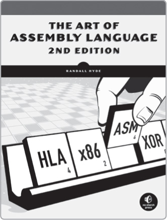
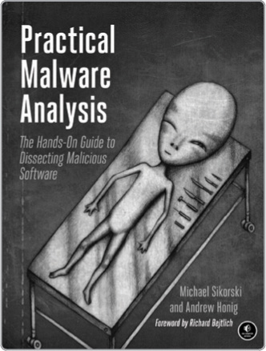
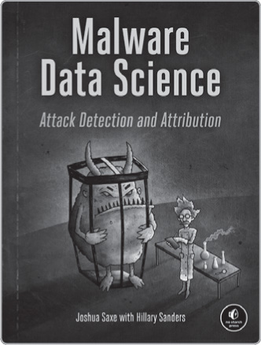
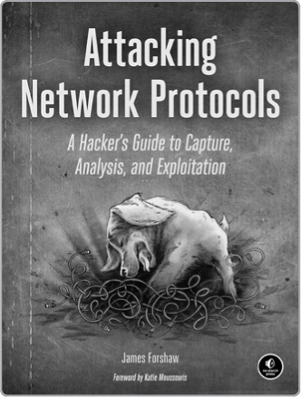
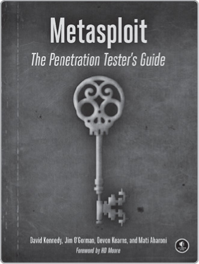
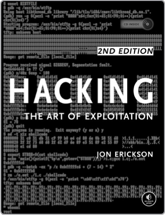

**RESOURCES**

Visit *<https://nostarch.com/binaryanalysis/>* for updates, errata, and other information.

*More no-nonsense books from*  **NO STARCH PRESS**

**THE ART OF ASSEMBLY LANGUAGE, 2ND EDITION**

*by* RANDALL HYDE  
MARCH 2010, 760 pp., \$59.95  
ISBN 978-1-59327-207-4

**PRACTICAL MALWARE ANALYSIS**

**The Hands-On Guide to Dissecting Malicious Software**  
*by* MICHAEL SIKORSKI *and*  
ANDREW HONIG  
FEBRUARY 2012, 800 PP., \$59.95  
ISBN 978-1-59327-290-6

**MALWARE DATA SCIENCE**

**Attack Detection and Attribution**  
*by* JOSHUA SAXE *with*  
HILLARY SANDERS  
SEPTEMBER 2018, 272 PP., \$49.95  
ISBN 978-1-59327-859-5

**ATTACKING NETWORK PROTOCOLS**

**A Hacker’s Guide to Capture, Analysis, and Exploitation**  
*by* JAMES FORSHAW  
DECEMBER 2017, 336 PP., \$49.95  
ISBN 978-1-59327-750-5

**METASPLOIT**

**The Penetration Tester’s Guide**  
*by* DAVID KENNEDY, JIM O’GORMAN,  
DEVON KEARNS, *and* MATI AHARONI  
JULY 2011, 328 PP., \$49.95  
ISBN 978-1-59327-288-3

**HACKING, 2ND EDITION**

**The Art of Exploitation**  
*by* JON ERICKSON  
FEBRUARY 2008, 488 pp., \$49.95  
ISBN 978-1-59327-144-2

**PHONE:**  
1.800.420.7240 or  
1.415.863.9900

**EMAIL:**  
<SALES@NOSTARCH.COM>

**WEB:**  
[WWW.NOSTARCH.COM](http://WWW.NOSTARCH.COM)