## `6` `HASH FUNCTIONS`

Hash functions—such as SHA-256, SHA3, and BLAKE3—compose the cryptographer’s Swiss Army Knife: they are used in digital signatures, public-key encryption, integrity verification, message authentication, password protection, key agreement protocols, and many other cryptographic protocols.

Whether you’re encrypting an email, sending a message on your mobile phone, connecting to an HTTPS website, or connecting to a remote machine through a virtual private network (VPN) or Secure Shell (SSH), a hash function is somewhere under the hood.

Hash functions are by far the most versatile and ubiquitous of all crypto algorithms. Their applications include the following: cloud storage systems use them to identify identical files and to detect modified files; the Git revision control system uses them to identify files in a repository; endpoint detection and response (EDR) systems use them to detect modified files; network-based intrusion detection systems (NIDSs) use hashes to detect known-malicious data going through a network; forensic analysts use hash values to prove that digital artifacts have not been modified; Bitcoin uses a hash function in its proof-of-work systems—and there are many more.

Unlike stream ciphers, which create a long output from a short one, hash functions take a long input and produce a short output, called a *hash value* or *digest* (see Figure 6-1).

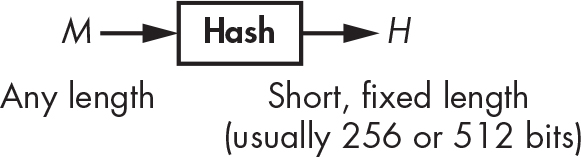

`Figure 6-1: A hash function’s input and output`

This chapter revolves around two main topics. First, security: What does it mean for a hash function to be secure? To that end, I introduce two essential notions—collision resistance and preimage resistance. The second topic revolves around hash function construction. I explain the high-level techniques modern hash functions use and then review the internals of the most common hash functions: SHA-1, SHA-2, SHA-3, and BLAKE2. Finally, you see how secure hash functions can behave insecurely if misused.

> `NOTE`

*Don’t confuse cryptographic hash functions with* noncryptographic *ones. You use noncryptographic hash functions in data structures such as hash tables or to detect accidental errors, and they provide no security whatsoever. For example, cyclic redundancy checks (CRCs) are noncryptographic hashes you use to detect accidental modifications of a file.*

### `Secure Hash Functions`

The notion of security for hash functions is different from what we’ve discussed thus far. Whereas ciphers protect data confidentiality in an effort to guarantee that data sent in the clear can’t be read, hash functions protect data integrity in an effort to guarantee that data—whether sent in the clear or encrypted—hasn’t been modified. If a hash function is secure, two distinct pieces of data should always have different hashes. A file’s hash can thus serve as its identifier.

Consider the most common application of a hash function: *digital signatures*, or just *signatures*. When using digital signatures, applications process the hash of the message to be signed rather than the message itself, as Figure 6-2 illustrates.

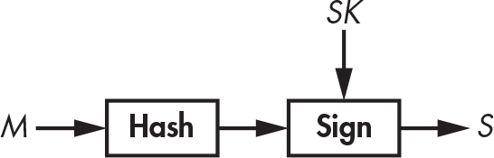

`Figure 6-2: A hash function in a digital signature scheme, wherein the hash acts as a proxy for the message`

The hash acts as an identifier for the message. If even a single bit is changed in the message, the hash of the message will be totally different. The hash function thus helps ensure that the message hasn’t been modified. Signing a message’s hash is as secure as signing the message itself, and signing a short hash of, say, 256 bits is much faster than signing a message that may be very large. In fact, most signature algorithms work only on short inputs such as hash values.

#### `Unpredictability` `Again`

The cryptographic strength of hash functions stems from the unpredictability of their outputs. Take the following 256-bit hexadecimal values; you compute these hashes using the NIST standard hash function SHA-256 with the ASCII letters `a`, `b`, and `c` as inputs. Though the values `a`, `b`, and `c` differ by only 1 or 2 bits (`a` is the bit sequence 01100001, `b` is 01100010, and `c` is 01100011), their hash values are completely different:

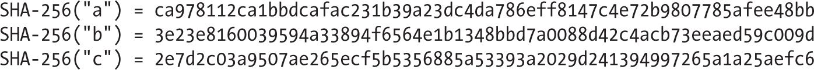

Given only these three hashes, it’s impossible to predict the value of the SHA-256 hash of `d` or any of its bits because hash values of a secure hash function are *unpredictable*. A secure hash function should be like a black box that returns a random string each time it receives an input.

The general, theoretical definition of a secure hash function is that it behaves like a truly random function (sometimes called a *random oracle*). Specifically, a secure hash function shouldn’t have any property or pattern that a random function wouldn’t have. This definition is helpful for theoreticians, but in practice we need more specific notions, namely, preimage resistance and collision resistance.

#### `Preimage Resistance`

A *preimage* of a given hash value, *H*, is any message, *M*, such that **Hash**(*M*) = *H*. Preimage *resistance* describes the security guarantee that given a random hash value, an attacker will never find a preimage of that hash value. Indeed, you can sometimes call hash functions *one-way functions* because you can go from the message to its hash but not the other way around.

Indeed, you can’t invert a hash function, even given unlimited computing power. For example, suppose that I hash some message using the SHA-256 hash function and get this 256-bit hash value:

Even given infinite time and computing power, you’d never be able to determine *the* message that I picked to produce this particular hash, since there are many messages hashing to the same value. You would therefore find *some* messages that produce this hash value (possibly including the one I picked) but would be unable to determine the message I used. You get *unconditional security*.

For example, there are 2²⁵⁶ possible values of a 256-bit hash (a typical length with hash functions used in practice), but there are many more values of, say, 1,024-bit messages (namely, 2^(1,024) possible values). Therefore, it follows that, on average, each possible 256-bit hash value will have 2^(1,024) / 2²⁵⁶ = 2^(1,024 – 256) = 2⁷⁶⁸ preimages of 1,024 bits each.

In practice, you must be sure that it’s practically impossible to find *any* message that maps to a given hash value, not just the message that was used, which is what preimage resistance actually stands for. Specifically, you can speak of first-preimage and second-preimage resistance. *First-preimage resistance* (or just *preimage resistance*) describes cases where it’s practically impossible to find a message that hashes to a given value. *Second-preimage resistance*, on the other hand, describes the case that when given a message, *M*₁, it’s practically impossible to find another message, *M*₂, that hashes to the same value that *M*₁ does.

##### `The Cost of Preimages`

Given a hash function and a hash value, you can search for first preimages by trying different messages until one hits the target hash. Listing 6-1 shows how to do this using an algorithm similar to `solve_preimage()`.

    solve_preimage(H) {
        repeat {
            M = random_message()
            if Hash(M) == H then return M
        }
    }

`Listing 6-1: The optimal preimage search algorithm for a secure hash function`

Here, `random_message()` generates a random message (say, a random 1,024-bit value). If the hash’s bit length, *n*, is large enough, `solve_preimage()`will practically never complete, because it will take on average 2*^(n)* attempts before finding a preimage. That’s a hopeless situation when working with *n* = 256, as in modern hashes like SHA-256 and BLAKE2.

##### `Why Second-Preimage Resistance Is Weaker`

If you can find first preimages, then you can find second preimages as well (for the same hash function). As proof, if the algorithm `solve_preimage()` returns a preimage of a given hash value, use the algorithm in Listing 6-2 to find a second preimage of some message, *M*.

    solve_second_preimage(M) {
        H = Hash(M)
        return solve_preimage(H)
    }

`Listing 6-2: How to find second preimages if you can find first preimages`

You’ll find the second preimage by seeing it as a preimage problem and applying the preimage attack. It follows that any second-preimage resistant hash function is also preimage resistant. (Were it not, it wouldn’t be second preimage resistant either, per the preceding `solve_second_preimage()` algorithm.) In other words, the best attack you can use to find second preimages is almost identical to the best attack you can use to find first preimages, unless the hash function has some defect that allows for more efficient attacks. Also note that a preimage search attack is fundamentally similar to a key-recovery attack on a block cipher or stream cipher, except that in the case of encryption there is exactly one solution of known size.

#### `Collision Resistance`

Whatever hash function you choose, collisions will inevitably exist because of the *pigeonhole principle*, which posits that if you have *m* holes and *n* pigeons to put into those holes and if *n* is greater than *m*, at least one hole must contain more than one pigeon.

> `NOTE`

*You can generalize the pigeonhole principle to other items and containers. For example, any 27-word sequence in the US Constitution includes at least two words that start with the same letter. In the world of hash functions, holes are the hash values, and pigeons are the messages. Because you know that there are many more possible messages than hash values, collisions* must *exist.*

However, despite the inevitable, collisions should be hard to find to consider a hash function *collision resistant*—in other words, attackers shouldn’t be able to find two distinct messages that hash to the same value.

The notion of collision resistance relates to that of second-preimage resistance: if you can find second preimages for a hash function, you can also find collisions, as Listing 6-3 shows.

    solve_collision() {
        M = random_message()
        return (M, solve_second_preimage(M))
    }

`Listing 6-3: The naive collision search algorithm`

That is, any collision-resistant hash is also second-preimage resistant. If this were not the case, there would be an efficient solve-second-preimage algorithm that could be used to break collision resistance.

#### `How to Find Collisions`

Finding collisions is faster than finding preimages: it takes approximately 2*^(n)*^(/2) operations instead of 2*^(n)*, thanks to the *birthday attack*, whose key idea is the following: given *N* messages and as many hash values, you can produce a total of *N* × (*N* – 1) / 2 potential collisions by considering each *pair* of two hash values (a number of the same order of magnitude as *N* ²). It’s called the *birthday* attack because it’s usually illustrated using the *birthday paradox*, which is the fact that a group of 23 people will include two people having the same birth date with probability close to 1/2—which is not a paradox, just a surprise for many people.

> `NOTE`

N *× (*N *– 1) / 2 is the count of pairs of two* distinct *messages, where you divide by 2 because you view (*M1*,* M2*) and (*M2*,* M1*) as a same pair, the ordering being unimportant.*

For comparison, in the case of a preimage search, *N* messages get you only *N* candidate preimages, whereas the same *N* messages give approximately *N* ² potential collisions. With *N* ² instead of *N*, you can say that there are *quadratically* more chances to find a solution. The complexity of the search is in turn quadratically lower: to find a collision, use the square root of 2*^(n)* messages; that is, use 2*^(n)*^(/2) instead of 2*^(n)*.

##### `The Naive Birthday Attack`

Here’s the simplest way to find collisions using the birthday attack:

  1.  Compute 2*^(n)*^(/2) hashes of 2*^(n)*^(/2) arbitrarily chosen messages and store all the message/hash pairs in a list.

  2.  Sort the list with respect to the hash value to move any identical hash values next to each other.

  3.  Search the sorted list to find two consecutive entries with the same hash value.

Unfortunately, this method requires a lot of memory (enough to store 2*^(n)*^(/2) message/hash pairs), and sorting lots of elements slows down the search, requiring about *n*2*^(n/2)* operations on average, using a fast sorting algorithm such as quicksort.

##### `Low-Memory Collision Search with the Rho Method`

The *Rho method* is an algorithm for finding collisions that, unlike the naive birthday attack, requires only a small amount of memory. It works like this:

  1.  Given a hash function with *n*-bit hash values, pick some random hash value (*H*₁), and define *H*₁ = *H* ′₁.

  2.  Compute *H*₂ = **Hash**(*H*₁) and *H* ′₂ = **Hash**(**Hash**(*H* ′₁)). In the first case apply the hash function once, while in the second case apply it twice.

  3.  Iterate the process and compute *H*i ₊ ₁ = **Hash**(*H*i), *H* ′i ₊ ₁ = **Hash**(**Hash** (*H* ′i)), for increasing values of *i*, until you reach *i* such that *H*i ₊ ₁ = *H* ′i ₊ ₁.

Figure 6-3 helps visualize the attack, where an arrow from, say, *H*₁ to *H*₂ means *H*₂ = **Hash**(*H*₁). Observe that the sequence of *H*is eventually enters a loop, also called a *cycle*, which resembles the Greek letter rho (ρ) in shape. The cycle starts at *H*₅ and is characterized by the collision **Hash**(*H*₄) = **Hash**(*H*₁₀) = *H*₅. The key observation here is that to find a collision, you simply need to find such a cycle. The Rho method allows an attacker to detect the position of the cycle and therefore to find the collision.

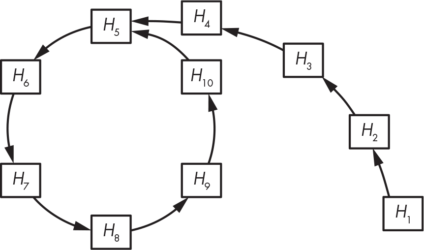

`Figure 6-3: The structure of the Rho hash function, where each arrow represents an evaluation of the hash function. The cycle beginning at` `H``5` `corresponds to a collision,` `Hash``(``H``4``) =` `Hash``(``H``10``) =` `H``5``.`

Advanced collision-finding techniques based on the Rho method work by first detecting the start of the cycle and then finding the collision, without storing numerous values in memory or needing to sort a long list. This takes about 2*^(n)*^(/2) operations to succeed. Indeed, Figure 6-3 has many fewer hash values than would an actual function with digests of 256 bits or more. On average, the cycle and the tail (the part that extends from *H*₁ to *H*₅ in Figure 6-3) each include about 2*^(n)*^(/2) hash values, where *n* is the bit length of the hash values. Therefore, you’ll need at least 2*^(n)*^(/2) + 2*^(n)*^(/2) evaluations of the hash to find a collision.

### `How to Build Hash Functions`

In the 1980s, cryptographers realized that the simplest way to hash a message is to split it into chunks and process each chunk consecutively using a similar algorithm. This strategy, *iterative hashing*, comes in two main forms:

- Iterative hashing using a *compression function* that transforms an input to a *smaller output*, as Figure 6-4 illustrates. This technique is also called the *Merkle–Damgård* construction, named after the cryptographers Ralph Merkle and Ivan Damgård who described it.
- Iterative hashing using a function that transforms an input to an output of the *same size*, such that any two different inputs give two different outputs (that is, a *permutation*). Such functions are called *sponge functions*.

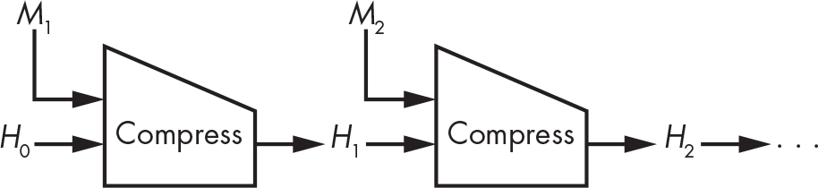

`Figure 6-4: The Merkle–Damgård construction using a compression function called Compress`

We’ll now discuss how these constructions work and how compression functions look in practice.

#### `Compression-Based Hash Functions`

All hash functions developed from the 1980s through the 2010s are based on the Merkle–Damgård (M–D) construction: MD4, MD5, SHA-1, and the SHA-2 family, as well as the lesser-known RIPEMD and Whirlpool hash functions. While the M–D construction isn’t perfect, it is simple and has proven to be secure enough for many applications.

> `NOTE`

*In MD4, MD5, and RIPEMD, the* MD *stands for* message digest *rather than* Merkle–Damgård*.*

To hash a message, the M–D construction splits the message into blocks of identical size and mixes these blocks with an internal state using a compression function, as Figure 6-4 shows. Here, *H*₀ is the *initial value* (denoted IV) of the internal state, the values *H*₁, *H*₂, . . . are the *chaining values*, and the final value of the internal state is the message’s hash value.

The message blocks are often 512 or 1,024 bits, but they can, in principle, be any size. Whatever the block length, it is fixed for a given hash function. For example, SHA-256 works with 512-bit blocks, and SHA-512 works with 1,024-bit blocks.

##### `Padding Blocks`

What happens if you want to hash a message that can’t be split into a sequence of complete blocks? For example, if blocks are 512 bits, then a 520-bit message consists of one 512-bit block plus 8 bits. In such a case, the M–D construction forms the last block as follows: take the chunk of bits left (8 in our example), append 1 bit, then append 0 bits, and finally append the length of the original message, encoded on a fixed number of bits. This padding trick guarantees that any two distinct messages give a distinct sequence of blocks and thus a distinct hash value.

For example, if you hash the 8-bit string 10101010 using SHA-256, which is a hash function with 512-bit message blocks, the first and only block appears, in bits, as follows:

Here, the message bits are the first 8 bits (10101010), and the padding bits are all the subsequent bits (shown in italic). The *1000* at the end of the block (underlined) is the message’s length, or 8 encoded in binary (on 32 bits at most). The padding thus produces a 512-bit message composed of a single 512-bit block, ready to be processed by SHA-256’s compression function.

##### `Security Guarantees`

The Merkle–Damgård construction turns a secure compression function that takes small, fixed-length inputs into a secure hash function that takes inputs of arbitrary lengths. If a compression function is preimage and collision resistant, then a hash function built on it using the M–D construction is also preimage and collision resistant. This is true because we can turn any successful preimage attack for the M–D hash into a successful preimage attack for the compression function, as Merkle and Damgård demonstrated in their 1989 papers (see this chapter’s “Further Reading” section). The same is true for collisions: an attacker can’t break the hash’s collision resistance without breaking the underlying compression function’s collision resistance; hence, the security of the latter guarantees the security of the hash.

Note that the converse argument doesn’t hold, because a collision for the compression function doesn’t necessarily give a collision for the hash. An arbitrary collision between **Compress**(*X*, *M*₁) and **Compress**(*Y*, *M*₂) for chaining values *X* and *Y*, both distinct from *H*₀, won’t get you a collision for the hash because you can’t “plug” the collision into the iterative chain of hashes—except if one of the chaining values happens to be *X* and the other *Y*, but that’s unlikely to happen.

##### `Finding Multicollisions`

A *multicollision* occurs when a set of three or more messages hash to the same value. For example, the triplet (*X*, *Y*, *Z*), such that **Hash**(*X*) = **Hash**(*Y*) = **Hash**(*Z*), is a *3-collision*. Ideally, multicollisions should be much harder to find than collisions, but there’s a simple trick for finding them at almost the same cost as that of a single collision. Here’s how it works:

  1.  Find a collision **Compress**(*H*₀, *M*_(1.1)) = **Compress**(*H*₀, *M*_(1.2)) = *H*₁. This is just a 2-collision, or two messages hashing to the same value.

  2.  Find a second collision with *H*₁ as a starting chaining value: **Compress** (*H*₁, *M*_(2.1)) = **Compress**(*H*₁, *M*_(2.2)) = *H*₂. Now you have a 4-collision, with four messages hashing to the same value *H*₂: *M*_(1.1) \|\| *M*_(2.1), *M*_(1.1) \|\| *M*_(2.2), *M*_(1.2) \|\| *M*_(2.1), and *M*_(1.2) \|\| *M*_(2.2).

  3.  Repeat and find *N* times a collision, and you’ll have 2*^(N)* messages, each of *N* blocks, hashing to the same value—that is, a 2*^(N)*-collision, at the cost of “only” about *N*2*^(N)* hash computations.

In practice, this trick isn’t all that practical because it requires finding a basic 2-collision in the first place.

##### `Building Compression Functions`

All compression functions used in real hash functions such as SHA-256 and BLAKE2 are based on block ciphers because that’s the simplest way to build a compression function. Figure 6-5 shows the most common of the block cipher–based compression functions, the *Davies–Meyer construction*.

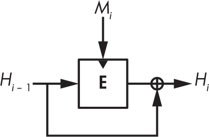

`Figure 6-5: The Davies–Meyer construction. The dark triangle shows where the block cipher’s key is input.`

Given a message block *M*i and the previous chaining value *H*i _(– 1), the Davies–Meyer compression function uses a block cipher, **E**, to compute the new chaining value as:

The message block *M*i acts as the block cipher key, and the chaining value *H*i _(– 1) acts as its plaintext block. As long as the block cipher is secure, the resulting compression function is secure as well as collision and preimage resistant. Without the XOR of the preceding chaining value (⊕ *H*i _(– 1)), Davies–Meyer would be insecure because you could invert it, going from the new chaining value to the previous one using the block cipher’s decryption function.

> `NOTE`
>
> *The Davies–Meyer construction has a surprising property: you can find* fixed points*, or chaining values, that are unchanged after applying the compression function with a given message block. It suffices to take* H_(i –) 1 *=* **D***(*M_(i)*, 0) as a chaining value, where* **D** *is the decryption function corresponding to* ***E****. The new chaining value* H_(i) *is therefore equal to the original* H_(i –) 1*:*
>
> 
>
> *You get* H_(i) *=* H_(i –) 1 *because plugging the decryption of zero into the encryption function yields zero—the term* ***E****(*M_(i)*,* ***D****(*M_(i)*, 0)) = 0—leaving only the* ⊕ H_(i –) 1 *part of the equation in the expression of the compression function’s output. You can then find fixed points for the compression functions of the SHA-2 functions, for example, which are based on the Davies–Meyer construction. Fortunately, fixed points aren’t a security risk.*

There are many block cipher–based compression functions other than Davies–Meyer, such as those in Figure 6-6.

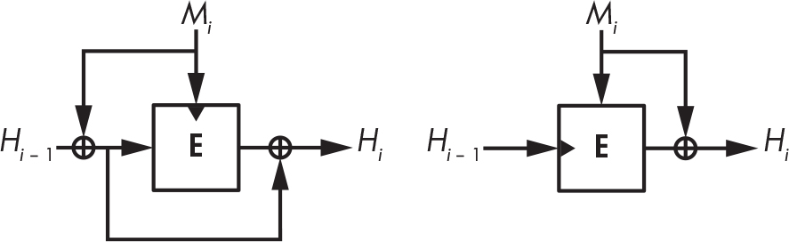

`Figure 6-6: Other secure block cipher–based compression function constructions`

These are less popular because they’re more complex or require the message block to be the same length as the chaining value.

#### `Permutation-Based Hash Functions`

After decades of research, cryptographers know everything there is to know about block cipher–based hashing techniques. Still, shouldn’t there be a simpler way to hash? Why bother with a block cipher, an algorithm that takes a secret key, when hash functions don’t take a secret key? Why not build hash functions with a fixed-key block cipher, a single permutation algorithm?

Those simpler hash functions are sponge functions, and they use a single permutation instead of a compression function and a block cipher (see Figure 6-7). Instead of using a block cipher to mix message bits with the internal state, sponge functions just do an XOR operation. Sponge functions are not only simpler than Merkle–Damgård functions, they’re also more versatile. You’ll find them used as hash functions and also as deterministic random bit generators, stream ciphers, pseudorandom functions (see Chapter 7), and authenticated ciphers (see Chapter 8). The most famous sponge function is Keccak, also known as SHA-3.

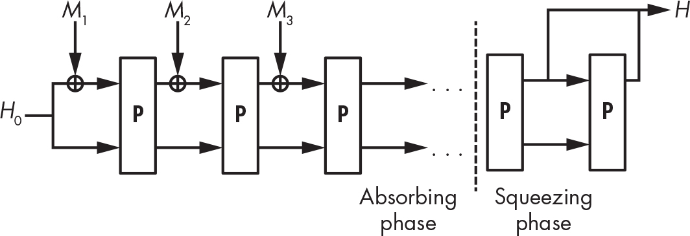

`Figure 6-7: The sponge construction`

A sponge function works as follows:

  1.  It XORs the first message block, *M*₁, to *H*₀, a predefined initial value of the internal state (for example, the all-zero string). Message blocks are all the same size and smaller than the internal state.

  2.  A permutation, **P**, transforms the internal state to another value of the same size.

  3.  It XORs block *M*₂ and applies **P** and then repeats this for the message blocks *M*₃, *M*₄, and so on. This is the *absorbing phase*.

  4.  After injecting all the message blocks, it applies **P** again and extracts a block of bits from the state to form the hash. If you need a longer hash, apply **P** again and extract a block. This is the *squeezing phase*.

The security of a sponge function depends on the length of its internal state and the length of the blocks. If message blocks are *r*-bit long and the internal state is *w*-bit long, then there are *c* = *w* – *r* bits of the internal state that message blocks can’t modify. The value of *c* is a sponge’s *capacity*, and the security level guaranteed by the sponge function is *c*/2. For example, to reach 256-bit security with 64-bit message blocks, the internal state should be at least *w* = 2 × 256 + 64 = 576 bits. The security level also depends on the length, *n*, of the hash value. The complexity of a collision attack is therefore the smallest value between 2*^(n)*^(/2) and 2*^(c)*^(/2), while the complexity of a second preimage attack is the smallest value between 2*^(n)* and 2*^(c)*^(/2).

To be secure, the permutation **P** should behave like a random permutation, without statistical bias and without a mathematical structure that would allow an attacker to predict outputs. As with compression function–based hashes, sponge functions also pad messages, but the padding is simpler because it doesn’t need to include the message’s length. The last message bit is simply followed by a 1 bit and as many zeros as necessary.

### `The SHA Family of Hash Functions`

The *Secure Hash Algorithm (SHA)* hash functions are standards defined by NIST for use by nonmilitary federal government agencies in the United States. They are considered worldwide standards, and only certain non-US governments opt for their own hash algorithms (such as China’s SM3, Russia’s Streebog, and Ukraine’s Kupyna) for reasons of sovereignty rather than a lack of trust in SHA’s security. The US SHAs have been more extensively reviewed by cryptanalysts than the non-US ones.

> `NOTE`

*Message Digest 5 (MD5) was the most popular hash function from 1992 until it was broken around 2005, and many applications switched to one of the SHA hash functions. MD5 processes 512-bit block messages and updates a 128-bit internal state to produce a 128-bit hash, thus providing at best 128-bit preimage security and 64-bit collision security. In 1996, cryptanalysts warned of a collision for MD5’s compression function, but their warning went unheeded until 2005 when a team of Chinese cryptanalysts discovered how to compute collisions for the full MD5 hash. As I write this, it takes only seconds to find a collision for MD5, yet some systems still use or support MD5, often for reasons of backward compatibility.*

#### `SHA-1`

The SHA-1 standard arose from a failure in the NSA’s original SHA-0 hash function. In 1993, NIST standardized the SHA-0 hash algorithm, but in 1995 the NSA released SHA-1 to fix an unidentified security issue in SHA-0. The reason for the tweak became clear when in 1998 two researchers discovered how to find collisions for SHA-0 in about 2⁶⁰ operations instead of the 2⁸⁰ expected for 160-bit hash functions such as SHA-0 and SHA-1. Later attacks reduced the complexity to around 2³³ operations, leading to actual collisions in less than an hour for SHA-0.

##### `SHA-1 Internals`

SHA-1 combines a Merkle–Damgård hash function with a Davies–Meyer compression function based on a specially crafted block cipher. That is, SHA-1 works by iterating the following operation over 512-bit message blocks (*M*):

Here, the use of a plus sign (+) rather than ⊕ (XOR) is intentional. **E**(*M*, *H*) and *H* are viewed as arrays of 32-bit integers, and two words at the same position are added together: the first 32-bit word of **E**(*M*, *H*) with the first 32-bit word of *H*, and so on. The initial value of *H* is constant for any message, then *H* is modified as per the previous equation, and the final value of *H* after processing all blocks is returned as the hash of the message.

Once the block cipher is run using the message block as a key and the current 160-bit chaining value as a plaintext block, the 160-bit result is seen as an array of five 32-bit words, each of which is added to its 32-bit counterpart in the initial *H* value.

Listing 6-4 shows SHA-1’s compression function, `SHA1-compress()`:

    SHA1-compress(H, M) {
        (a0, b0, c0, d0, e0) = H   // Parsing H as five 32-bit big-endian words
        (a, b, c, d, e) = SHA1-blockcipher(a0, b0, c0, d0, e0, M)
        return (a + a0, b + b0, c + c0, d + d0, e + e0)
    }

`Listing 6-4: SHA-1’s compression function`

SHA-1’s block cipher `SHA1-blockcipher()`, shown in bold, takes a 512-bit message block, *M*, as a key and transforms the five 32-bit words (`a`, `b`, `c`, `d`, and `e`) by iterating 80 steps of a short sequence of operations to replace the word `a` with a combination of all five words. It then shifts the other words in the array, as in a shift register. Listing 6-5 describes these operations in pseudocode, where `K[i]` is a round-dependent constant.

    SHA1-blockcipher(a, b, c, d, e, M) {
        W = expand(M)
        for i = 0 to 79 {
            new = (a <<< 5) + f(i, b, c, d) + e + K[i] + W[i]
            (a, b, c, d, e) = (new, a, b >>> 2, c, d)
        }
        return (a, b, c, d, e)
    }

`Listing 6-5: SHA-1’s block cipher`

The `expand()` function in Listing 6-5 creates an array of 80 32-bit words, *W*, from the 16-word message block by setting *W*’s first 16 words to *M* and the subsequent ones to an XOR combination of previous words, rotated 1 bit to the left. Listing 6-6 shows the corresponding pseudocode.

    expand(M) {
        // The 512-bit M is seen as an array of sixteen 32-bit words.
        W = empty array of eighty 32-bit words
        for i = 0 to 79 {
            if i < 16 then W[i] = M[i]
            else
                W[i] = (W[i – 3] ⊕ W[i – 8] ⊕ W[i – 14] ⊕ W[i – 16]) <<< 1
        }
        return W
    }

`Listing 6-6: SHA-1’s` `expand()` `function`

The `<<< 1` operation in Listing 6-6 is the only difference between the SHA-1 and the SHA-0 functions.

Finally, Listing 6-7 shows the `f()` function in `SHA1-blockcipher()`, a sequence of basic bitwise logical operations (a Boolean function) that depends on the round number.

    f(i, b, c, d) {
        if i < 20 then return ((b & c) ⊕ (~b & d))
        if i < 40 then return (b ⊕ c ⊕ d)
        if i < 60 then return ((b & c) ⊕ (b & d) ⊕ (c & d))
        if i < 80 then return (b ⊕ c ⊕ d)
    }

`Listing 6-7: SHA-1’s` `f()` `function`

The second and fourth Boolean functions in Listing 6-7 simply XOR the three input words together, which is a linear operation. In contrast, the first and third functions use the nonlinear `&` operator (logical AND) to protect against differential cryptanalysis, which exploits the predictable propagation of bitwise difference. Without the `&` operator (in other words, if `f()` were always `b` ⊕ `c` ⊕ `d`, for example), SHA-1 would be easy to break by tracing patterns within its internal state.

##### `Attacks on SHA-1`

Though more robust than SHA-0, SHA-1 is also insecure, which is why the Chrome browser marks websites using SHA-1 in their HTTPS connection as insecure since 2014. Although its 160-bit hash should grant it 80-bit collision resistance, in 2005 researchers found weaknesses in SHA-1 and estimated that finding a collision would take approximately 2⁶³ calculations (against 2⁸⁰ if the algorithm were flawless). A real SHA-1 collision came only 12 years later when after years of research, cryptanalysts presented two colliding PDF documents through a joint work with Google researchers (see *<https://shattered.io>*).

You should not use SHA-1. Most web browsers now mark SHA-1 as insecure, and SHA-1 is no longer recommended by NIST. Use SHA-2, SHA-3, BLAKE2, or BLAKE3 instead.

#### `SHA-2`

SHA-2, the successor to SHA-1, was designed by the NSA and standardized by NIST in 2002. SHA-2 is a family of four hash functions: SHA-224, SHA-256, SHA-384, and SHA-512 (of which SHA-256 and SHA-512 are the two main algorithms). The three-digit numbers represent the bit lengths of each hash.

The initial motivation behind the development of SHA-2 was to generate longer hashes and thus deliver higher security levels than SHA-1. However, SHA-1 and SHA-2 algorithms are similar in their construction. All SHA-2 instances also use the Merkle–Damgård construction and have a compression function that closely resembles that of SHA-1 but with stronger nonlinearity and difference propagation properties.

##### `SHA-256`

SHA-256 is the most common version of SHA-2. Whereas SHA-1 has 160-bit chaining values, SHA-256 has 256-bit chaining values as eight 32-bit words. Both SHA-1 and SHA-256 have 512-bit message blocks, but whereas SHA-1 makes 80 rounds, SHA-256 makes 64 rounds, expanding the 16-word message block to a 64-word message block using the `expand256()` function, as Listing 6-8 shows.

    expand256(M) {
        // The 512-bit M is seen as an array of sixteen 32-bit words.
        W = empty array of sixty-four 32-bit words
        for i = 0 to 63 {
            if i < 16 then W[i] = M[i]
            else {
                // The ">>" shifts instead of a ">>>" rotates and is not a typo.
                s0 = (W[i – 15] >>> 7) ⊕ (W[i – 15] >>> 18) ⊕ (W[i – 15] >> 3)
                s1 = (W[i – 2] >>> 17) ⊕ (W[i – 2] >>> 19) ⊕ (W[i – 2] >> 10)
                W[i] = W[i – 16] + s0 + W[i – 7] + s1
            }
        }
        return W
    }

`Listing 6-8: SHA-256’s` `expand256()` `function`

Note how SHA-2’s `expand256()` message expansion is more complex than SHA-1’s `expand()` in Listing 6-6, which in contrast simply performs XORs and a 1-bit rotation. The main loop of SHA-256’s compression function is also more complex than that of SHA-1, performing 26 arithmetic operations per iteration compared to 11 for SHA-1. Again, these operations are XORs, logical ANDs, and word rotations. This greater complexity makes SHA-256 more resistant to differential cryptanalysis.

##### `Other SHA-2 Algorithms`

The SHA-2 family includes SHA-224, which is algorithmically identical to SHA-256 except that its initial value is a different set of eight 32-bit words, and its hash value length is 224 bits, instead of 256 bits, and is taken as the first 224 bits of the final chaining value.

The SHA-2 family also includes the algorithms SHA-512 and SHA-384. SHA-512 is similar to SHA-256 except that it works with 64-bit words instead of 32-bit words. As a result, it uses 512-bit chaining values (eight 64-bit words) and ingests 1,024-bit message blocks (sixteen 64-bit words), and it makes 80 rounds instead of 64. The compression function is otherwise almost the same as that of SHA-256, though with different rotation distances to cope with the wider word size. (For example, SHA-512 includes the operation `a >>> 34`, which wouldn’t make sense with SHA-256’s 32-bit words.) SHA-384 is to SHA-512 what SHA-224 is to SHA-256—namely, the same algorithm but with a different initial value and a final hash truncated to 384 bits.

Security-wise, all four SHA-2 versions have lived up to their promises so far: SHA-256 guarantees 256-bit preimage resistance, SHA-512 guarantees about 256-bit collision resistance, and so on. Still, there is no genuine proof that SHA-2 functions are secure; we’re talking about probable security.

That said, after practical attacks on MD5 and on SHA-1, researchers and NIST grew concerned about SHA-2’s long-term security because of its similarity to SHA-1, and many believed that attacks on SHA-2 were just a matter of time. As I write this, we have yet to see a successful attack on SHA-2. Regardless, NIST developed a backup plan: SHA-3.

#### `The SHA-3 Competition`

Announced in 2007, the NIST Hash Function Competition (the official name of the SHA-3 competition) began with a call for submissions and some basic requirements: hash submissions were to be at least as secure and as fast as SHA-2, and they should be able to do at least as much as SHA-2. SHA-3 candidates also shouldn’t look too much like SHA-1 and SHA-2 to be immune to attacks that would break SHA-1 and potentially SHA-2. By 2008, NIST had received 64 submissions from around the world, including from universities and large corporations (BT, IBM, Microsoft, Qualcomm, and Sony, to name a few). Of these 64 submissions, 51 matched the requirements and entered the first round of the competition.

During the first weeks of the competition, cryptanalysts mercilessly attacked the submissions. In July 2009, NIST announced 14 second-round candidates. After spending 15 months analyzing and evaluating the performance of these candidates, NIST chose five finalists:

**BLAKE **An enhanced Merkle–Damgård hash whose compression function is based on a block cipher, which is in turn based on the core function of the stream cipher ChaCha, a chain of additions, XORs, and word rotations. BLAKE was designed by a team of academic researchers based in Switzerland and the UK, including myself while I was a PhD student.

**Grøstl **An enhanced Merkle–Damgård hash whose compression function uses two permutations (or fixed-key block ciphers) based on the AES block cipher. Grøstl was designed by a team of seven academic researchers from Denmark and Austria.

**JH **A tweaked sponge function construction wherein message blocks are injected before and after the permutation rather than just before. The permutation also performs operations similar to a substitution–permutation block cipher (see Chapter 4). JH was designed by a cryptographer from a university in Singapore.

**Keccak **A sponge function whose permutation performs only bitwise operations. Keccak was designed by a team of four cryptographers working for a semiconductor company based in Belgium and Italy and included one of the two designers of AES.

**Skein **A hash function based on a different mode of operation than Merkle–Damgård and whose compression function is based on a novel block cipher that uses only integer addition, XORs, and word rotation. Skein was designed by a team of eight cryptographers from academia and industry, all but one of whom is based in the United States, including the renowned Bruce Schneier.

After extensive analysis of the five finalists, NIST announced a winner: Keccak. NIST’s report rewarded Keccak for its “elegant design, large security margin, good general performance, excellent efficiency in hardware, and its flexibility.” Let’s see how Keccak works.

#### `Keccak (SHA-3)`

One of the reasons that NIST chose Keccak is that it’s completely different from SHA-1 and SHA-2. For one thing, it’s a sponge function. Keccak’s core algorithm is a permutation of a 1,600-bit state that ingests blocks of 1,152, 1,088, 832, or 576 bits, producing hash values of 224, 256, 384, or 512 bits, respectively—the same four lengths produced by SHA-2 hash functions. But unlike SHA-2, SHA-3 uses a single core algorithm rather than two algorithms for all four hash lengths.

Another reason is that Keccak is more than just a hash. The SHA-3 standard document FIPS 202 defines four hashes—SHA3-224, SHA3-256, SHA3-384, and SHA3-512—and two algorithms called SHAKE128 and SHAKE256. (The name *SHAKE* stands for *Secure Hash Algorithm with Keccak*.) These two algorithms are *extendable-output functions (XOFs)*, or hash functions that can produce hashes of variable length, even very long ones. The numbers 128 and 256 represent the security level of each algorithm.

The FIPS 202 standard itself is lengthy and hard to parse, but you’ll find open source implementations that are reasonably fast and make the algorithm easy to understand. For example, the tiny_sha3 (*<https://github.com/mjosaarinen/tiny_sha3>*) by Markku-Juhani O. Saarinen explains Keccak’s core algorithm in 19 lines of C code, as partially reproduced in Listing 6-9.

    static void sha3_keccakf(uint64_t st[25], int rounds)
    {
        (⊕)
        for (r = 0; r < rounds; r++) {

          ❶ // Theta
            for (i = 0; i < 5; i++)
                bc[i] = st[i] ^ st[i + 5] ^ st[i + 10] ^ st[i + 15] ^ st[i + 20];
            for (i = 0; i < 5; i++) {
                t = bc[(i + 4) % 5] ^ ROTL64(bc[(i + 1) % 5], 1);
                for (j = 0; j < 25; j += 5)
                    st[j + i] ^= t;
            }

          ❷ // Rho Pi
            t = st[1];
            for (i = 0; i < 24; i++) {
                j = keccakf_piln[i];
                bc[0] = st[j];
                st[j] = ROTL64(t, keccakf_rotc[i]);
                t = bc[0];
            }

          ❸ // Chi
            for (j = 0; j < 25; j += 5) {
                for (i = 0; i < 5; i++)
                    bc[i] = st[j + i];
                for (i = 0; i < 5; i++)
                    st[j + i] ^= (~bc[(i + 1) % 5]) & bc[(i + 2) % 5];
            }

          ❹ // Iota
            st[0] ^= keccakf_rndc[r];
        }
        (⊕)
    }

`Listing 6-9: The tiny_sha3 implementation`

The tiny_sha3 program implements the permutation, **P**, of Keccak, an invertible transformation of a 1,600-bit state viewed as an array of twenty-five 64-bit words. The code iterates a series of rounds, where each round consists of four main steps:

  1.  `Theta` ❶ includes XORs between 64-bit words or a 1-bit rotated value of the words (the `ROTL64(w, 1)` operation left-rotates a word `w` of 1 bit).

  2.  `Rho Pi` ❷ includes rotations of 64-bit words by constants hardcoded in the `keccakf_rotc[]` array.

  3.  `Chi` ❸ includes more XORs but also logical ANDs (the `&` operator) between 64-bit words. These ANDs are the only nonlinear operations in Keccak, and they bring with them cryptographic strength.

  4.  `Iota` ❹ includes an XOR with a 64-bit constant, hardcoded in `keccakf _rndc[]`.

These operations provide SHA-3 with a strong permutation algorithm free of any bias or exploitable structure. SHA-3 is the product of more than a decade of research, and hundreds of skilled cryptanalysts have failed to break it. It’s unlikely to be broken anytime soon.

### `The BLAKE2 and BLAKE3 Hash Functions`

Security may matter most, but speed comes second. I’ve seen many cases where a developer wouldn’t switch from MD5 to SHA-1 simply because MD5 is faster or from SHA-1 to SHA-2 because SHA-2 is noticeably slower than SHA-1. Unfortunately, SHA-3 isn’t faster than SHA-2, and because SHA-2 is still secure, there are few incentives to upgrade to SHA-3. So how do we hash faster than SHA-1 and SHA-2 and be even more secure? The answer lies in the hash function BLAKE2, released after the SHA-3 competition.

> `NOTE`

*Full disclosure: I’m a designer of BLAKE2, together with Samuel Neves, Zooko Wilcox-O’Hearn, and Christian Winnerlein.*

BLAKE2 was designed with the following ideas in mind:

- It should be at least as secure as SHA-3, if not stronger.
- It should be faster than all previous hash standards, including MD5.
- It should be suited for use in modern applications and able to hash large amounts of data either as a few large messages or as many small ones, with or without a secret key.
- It should be suited for use on modern CPUs supporting parallel computing on multicore systems as well as instruction-level parallelism within a single core.

The outcome of the engineering process is a pair of main hash functions:

- BLAKE2b (or just BLAKE2), optimized for 64-bit platforms, produces digests ranging from 1 to 64 bytes.
- BLAKE2s, optimized for 8- to 32-bit platforms, produces digests ranging from 1 to 32 bytes.

Each function has a parallel variant that can leverage multiple CPU cores. The parallel counterpart of BLAKE2b, BLAKE2bp, runs on four cores, whereas BLAKE2sp runs on eight cores. The former is the fastest on modern server and laptop CPUs and can hash at close to 2Gbps on a laptop CPU. BLAKE2’s speed and features have made it the most popular non-NIST-standard hash. BLAKE2 is used in countless software applications and has been integrated into major cryptography libraries such as OpenSSL and Sodium. BLAKE2 is also an Internet Engineering Task Force (IETF) standard, described in RFC 7693.

> `NOTE`

*You can find BLAKE2’s specifications and reference code at* <https://blake2.net>*, and you can download optimized code and libraries from* <https://github.com/BLAKE2>*. The reference code also provides BLAKE2X, an extension of BLAKE2 that can produce hash values of arbitrary length.*

As Figure 6-8 illustrates, BLAKE2’s compression function is a variant of the Davies–Meyer construction that takes parameters as additional input—namely, a *counter* (which ensures that each compression function behaves like a different function) and a *flag* (which indicates whether the compression function is processing the last message block, for increased security).

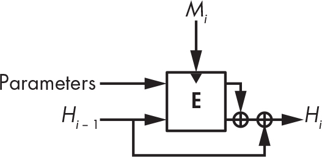

`Figure 6-8: BLAKE2’s compression function. The two halves of the state are XORed together after the block cipher.`

The block cipher in BLAKE2’s compression function is based on the stream cipher ChaCha, itself a variant of the Salsa20 stream cipher discussed in Chapter 5. Within this block cipher, BLAKE2b’s core operation is composed of the following chain of operations, which transforms a state of four 64-bit words using two message words, *M*i and *M*j:

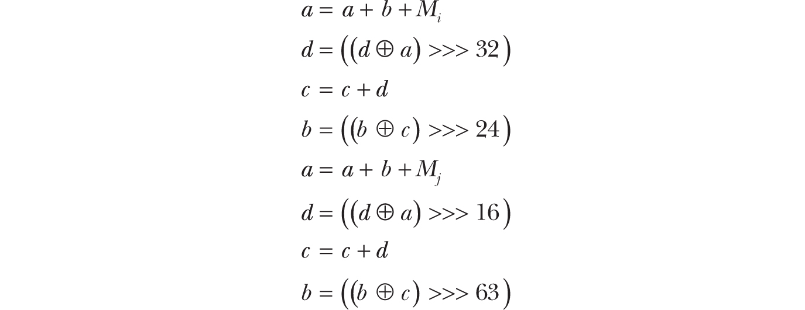

BLAKE2s’s core operation is similar but works with 32-bit instead of 64-bit words (and thus uses different rotation values).

Last but not least, BLAKE3 is a more parallelizable, simpler, more versatile, and faster version of BLAKE2 that was presented in 2020 at the Real World Crypto conference. Designed by Jack O’Connor, Samuel Neves, Zooko Wilcox-O’Hearn, and myself, BLAKE3 has quickly become one of the most popular hash functions, thanks to its undeniable advantages. For more details, see *<https://github.com/BLAKE3-team/BLAKE3>*.

### `How Things Can Go Wrong`

Despite their apparent simplicity, hash functions can cause major security troubles when used at the wrong place or in the wrong way—for example, when using weak checksum algorithms like CRCs instead of a crypto hash to check file integrity in applications transmitting data over a network. However, this weakness pales in comparison to others, which can cause total compromise in seemingly secure hash functions. You’ll see two examples of failures: the first one applies to SHA-1 and SHA-2 but not to BLAKE2 or SHA-3, whereas the second one applies to all four of these functions.

#### `The Length-Extension Attack`

Figure 6-9 shows the *length-extension attack*, which is the main threat to the Merkle–Damgård construction.

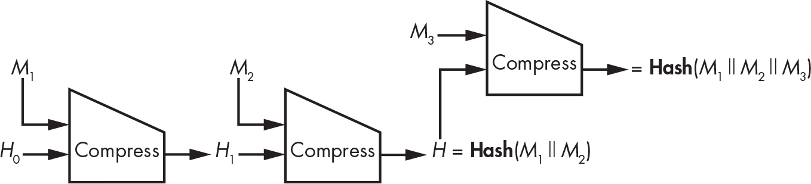

`Figure 6-9: The length-extension attack`

Basically, if you know **Hash**(*M*) for some *unknown* message, *M*, composed of blocks *M*₁ and *M*₂ (after padding), you can determine **Hash**(*M*₁ \|\| *M*₂ \|\| *M*₃) for any block, *M*₃. Because the hash of *M*₁ \|\| *M*₂ is the chaining value that follows immediately after *M*₂, you can add another block, *M*₃, to the hashed message, even though you don’t know the data that was hashed. What’s more, this trick generalizes to any number of blocks in the unknown message (*M*₁ \|\| *M*₂ here) or in the suffix (*M*₃).

The length-extension attack won’t affect most applications of hash functions, but it can compromise security if using the hash a bit too creatively. Unfortunately, SHA-2 hash functions are vulnerable to the length-extension attack, even though the NSA designed the functions and NIST standardized them while both were well aware of the flaw. This flaw could have been avoided simply by making the last compression function call different from all others (for example, by taking a 1 bit as an extra parameter while the previous calls take a 0 bit). That is what BLAKE2 does.

#### `Fooling Proof-of-Storage Protocols`

Cloud computing applications use hash functions within *proof-of-storage* protocols—that is, protocols where a server (the cloud provider) proves to a client (a user of a cloud storage service) that the server does in fact store the files that it’s supposed to store on behalf of the client.

In 2007, the paper “SafeStore: A Durable and Practical Storage System” (*<https://www.cs.utexas.edu/~lorenzo/papers/p129-kotla.pdf>*) by Ramakrishna Kotla, Lorenzo Alvisi, and Mike Dahlin proposed a proof-of-storage protocol to verify the storage of some file, *M*, as follows:

  1.  The client picks a random value, *C,* as a *challenge*.

  2.  The server computes **Hash**(*M* \|\| *C*) as a *response* and sends the result to the client.

  3.  The client also computes **Hash**(*M* \|\| *C*) and checks that it matches the value received from the server.

The premise of the paper is that the server shouldn’t be able to fool the client because if the server doesn’t know *M*, it can’t guess **Hash**(*M* \|\| *C*). But there’s a catch: in reality, **Hash** is an iterated hash that processes its input block by block, computing intermediate chaining values between each block. For example, if **Hash** is SHA-256 and *M* is 512 bits long (the size of a block in SHA-256), the server can cheat. How? The first time the server receives *M*, it computes *H*₁ = **Compress**(*H*₀, *M*₁), the chaining value obtained from SHA-256’s initial value, *H*₀, and from the 512-bit *M*. It then records *H*₁ in memory and discards *M*, at which point it no longer stores *M*.

When the client sends a random value, *C*, the server computes **Compress**(*H*₁, *C*), after adding the padding to *C* to fill a complete block, and returns the result as **Hash**(*M* \|\| *C*). The client then believes that because the server returned the correct value of **Hash**(*M* \|\| *C*), it holds the complete message—except that it may not, as you’ve seen.

This trick works for SHA-1, SHA-2, as well as SHA-3 and BLAKE2. The solution is simple: ask for **Hash**(*C* \|\| *M*) instead of **Hash**(*M* \|\| *C*).

### `Further Reading`

To learn more about hash functions, read the classics from the 1980s and ’90s: research articles like Ralph Merkle’s “One Way Hash Functions and DES” and Ivan Damgård’s “A Design Principle for Hash Functions.” Also read the first thorough study of block cipher–based hashing, “Hash Functions Based on Block Ciphers: A Synthetic Approach” by Bart Preneel, René Govaerts, and Joos Vandewalle.

For more on collision search, read the 1997 paper “Parallel Collision Search with Cryptanalytic Applications” by Paul van Oorschot and Michael Wiener. To learn more about the theoretical security notions that underpin preimage resistance and collision resistance, as well as length-extension attacks, search for *indifferentiability*.

For more recent research on hash functions, see the archives of the SHA-3 competition, which include all the different algorithms and how they were broken. You’ll find many references on the SHA-3 Zoo at *<https://ehash.iaik.tugraz.at/wiki/The_SHA-3_Zoo.html>*, and on NIST’s page, *<https://csrc.nist.gov/projects/hash-functions/sha-3-project>*.

For more on the SHA-3 winner Keccak and sponge functions, see *<https://keccak.team/sponge_duplex.html>*, the official page of the Keccak designers.

Finally, you may look up these two real exploitations of weak hash functions:

- The nation-state malware Flame exploited an MD5 collision to make a counterfeit certificate and appear to be a legitimate piece of software.
- The Xbox game console used a weak block cipher (called TEA) to build a hash function, which was exploited to hack the console and run arbitrary code on it.