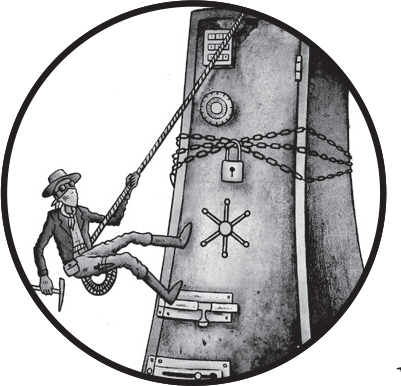
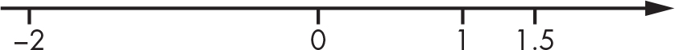
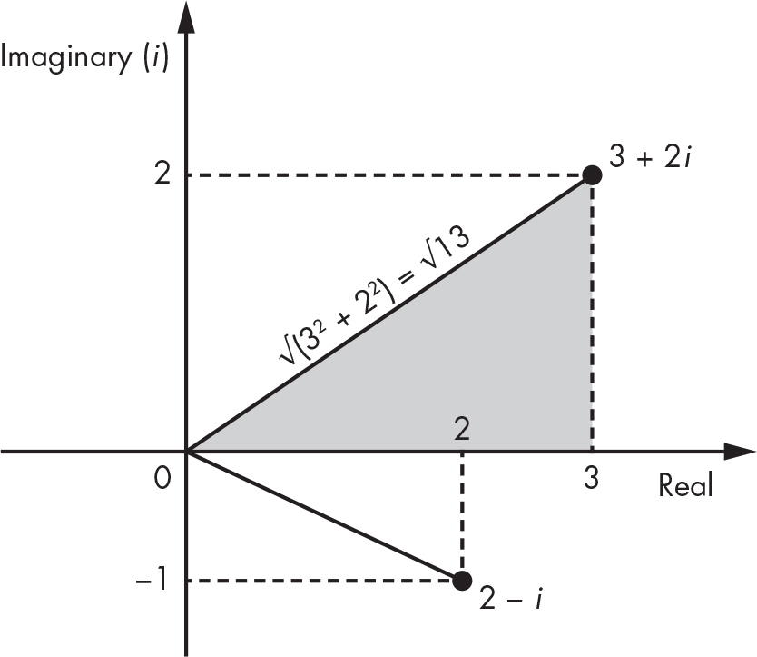
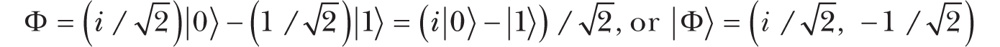
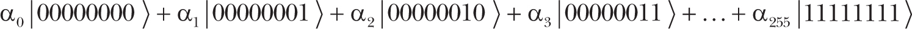
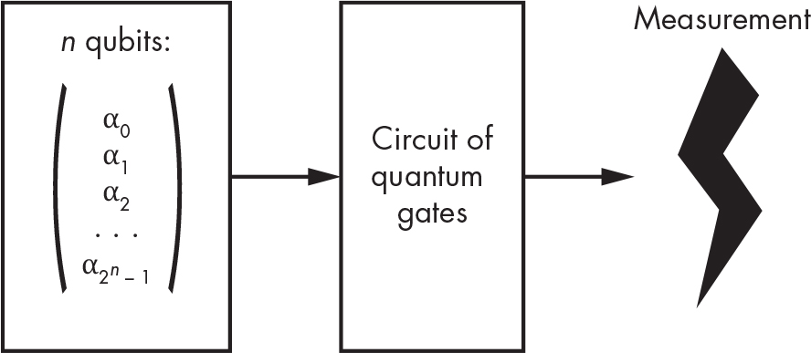
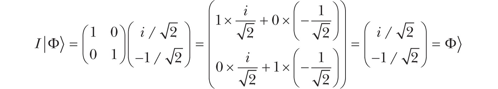
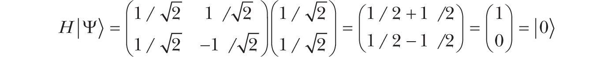
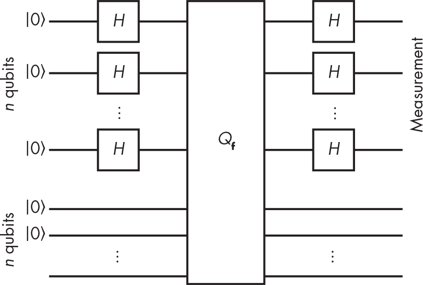
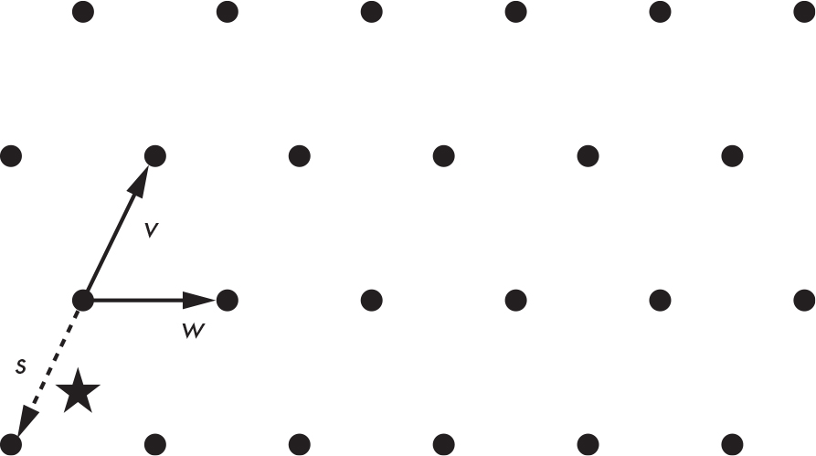

## `14` `QUANTUM AND POST-QUANTUM`

In this chapter, we’ll examine the future of cryptography over a time horizon of, say, a century or more—one in which quantum computers may exist. Quantum computers leverage phenomena from quantum physics to run different kinds of algorithms than we’re used to. While large quantum computers don’t exist yet, they have the potential to break RSA, Diffie–Hellman, and elliptic curve cryptography—all the public-key crypto deployed or standardized as of this writing.

To ensure against the quantum computing risk, cryptography researchers have developed alternative public-key *post-quantum* algorithms. In 2015, the NSA called for a transition to quantum-resistant algorithms, and in 2017 NIST began a process to standardize post-quantum algorithms, which they announced as part of new standards in 2022.

This chapter provides a nontechnical overview of the principles behind quantum computers as well as a glimpse of post-quantum algorithms. There’s some math involved, but only basic arithmetic and linear algebra, so don’t fret about the unusual notations.

### `How Quantum Computers Work`

Quantum computing uses quantum physics to compute differently and perform tasks that classical computers can’t, such as breaking RSA and elliptic curve cryptography efficiently. A quantum computer is not a superfast normal computer. In fact, quantum computers can’t efficiently solve any problem that’s too hard for a classical computer, such as brute-force search or **NP**-hard problems.

Quantum mechanics—the branch of physics that studies the behavior of subatomic particles, which behave truly randomly—is the basis of quantum computers. Unlike classical computers, which operate on bits that are either 0 or 1, quantum computers operate on *quantum bits* (or *qubits*), which can be “both 0 and 1 simultaneously.” This is a state of ambiguity called *superposition*, where my quotation marks indicate an oversimplification. In this microscopic world, physicists discovered that particles such as electrons and photons behave in a highly counterintuitive way: before you observe an electron, it isn’t at a definite location in space but in several locations at the same time (that is, in a state of superposition). Once you observe it—an operation called *measurement* —it stops at a fixed, random location and is no longer in superposition; the quantum state *collapsed*. This enables the creation of qubits in a quantum computer, along with the phenomena of entanglement and interference.

Quantum computers work because of *entanglement*, wherein two particles are connected (entangled) in a way that observing the value of one gives the value of the other, even if the two particles are widely separated (kilometers or even light-years away from each other). The *Einstein–Podolsky–Rosen (EPR) paradox* illustrates this behavior, which caused Albert Einstein to initially dismiss quantum mechanics. (See *<https://plato.stanford.edu/entries/qt-epr/>* for an in-depth explanation.)

*Interference* is also crucial to the operation of quantum computers. With this property, particles can combine or cancel out each other’s effects due to their wave-like nature, as the double-slit experiment famously illustrates. Quantum computing exploits interference so that the “waves” of valid solutions reinforce each other and invalid solutions cancel each other out.

To explain how a quantum computer works, I’ll distinguish the actual quantum computer (the hardware, including its quantum bits) from quantum algorithms (the software that runs on it, composed of *quantum gates*).

#### `Quantum Bits`

You can characterize qubits, or groups thereof, with *amplitudes*, which are numbers akin to probabilities that aren’t *exactly* probabilities. Whereas a probability is a number between 0 and 1, an amplitude is a complex number of the form *a* + *bi* (that is, *a* + *b* × *i*), where *a* and *b* are real numbers and *i* is an *imaginary unit*. You use the number *i* to form *imaginary numbers* of the form *bi*, with *b* a real number. When you multiply *i* by a real number, you get another imaginary number, and multiplying it by itself it results in –1 (that is, *i*² = –1).

Unlike real numbers, which you see as belonging to a line (see Figure 14-1), *complex numbers* belong to a plane (a space with two dimensions), as Figure 14-2 demonstrates.

`Figure 14-1: A view of real numbers as points on an infinite straight line`

In Figure 14-2, the x-axis corresponds to the *a* in *a* + *bi*, the y-axis corresponds to the *b*, and the dotted lines correspond to the real and imaginary parts of each number. For example, the vertical dotted line going from the point 3 + 2*i* down to 3 is two units long (the 2 in the imaginary part 2*i*).

`Figure 14-2: A view of complex numbers as points in a two-dimensional space`

You can use the Pythagorean theorem to compute the length of the line segment going from the origin (0) to the point *a* + *bi* by viewing this line as the hypotenuse of a triangle. The hypotenuse’s length is equal to the square root of the sum of the squared coordinates of the point, or √(*a*² + *b*²), which is called the *modulus* of the complex number *a* + *bi*. You denote the modulus as \|*a* + *bi*\| and can use it as the length of a complex number.

In a quantum computer, registers consist of one or more qubits in a state of superposition, which can be characterized by a set of such complex numbers, or amplitudes. But as you’ll see, these amplitudes can’t be just any numbers.

##### `Amplitudes of a Single Qubit`

You can characterize a single qubit by two amplitudes that we’ll denote as α (alpha) and β (beta). You can then express a qubit’s state as α\|0⟩ + ® \|1⟩, where the \| ⟩ notation denotes vectors in a quantum state. This notation means that when you observe this qubit, it appears as 0 with a probability \|α\|² and 1 with a probability \|β\|². For these to be actual probabilities, \|α\|² and \|β\|² must be numbers between 0 and 1, and \|α\|² + \|β\|² must be equal to 1.

For example, say you have the qubit Ψ (psi) with amplitudes α = 1/√2 and β = 1/√2. You express this as follows:

In the qubit Ψ, the value 0 has an amplitude of 1/√2, and the value 1 has the same amplitude, 1/√2. To get the actual probability from the amplitudes, compute the modulus of 1/√2 (which is equal to 1/√2 because it has no imaginary part) and then square it: (1/√2)² = 1/2. This means that if you observe the qubit Ψ, you’ll have a 1/2 chance of seeing a 0 and the same chance of seeing a 1.

Now consider the qubit Φ (phi), where:

The qubit Φ is fundamentally distinct from Ψ because unlike Ψ, where amplitudes have equal values, the qubit Φ has distinct amplitudes of α = *i*/√2 (a positive imaginary number) and β = –1/√2 (a negative real number). If, however, you observe Φ, the chance of seeing a 0 or 1 is 1/2, the same as it is with Ψ. Compute the probability of seeing a 0 as follows, based on the preceding rules:

Note that because α = *i*/√2, you can write α as *a* + *bi* with *a* = 0 and *b* = 1/√2, and computing \|α\| = √(*a*² + *b*²) yields 1/√2.

Different qubits can behave similarly to an observer (with the same probability of seeing a 0 for both qubits) but have different amplitudes. This says that the actual probabilities of seeing a 0 or a 1 characterize a qubit only partially; this is similar to observing the shadow of an object on a wall, which provides an idea of the object’s width and height but not of its depth. In the case of qubits, this hidden dimension is the value of its amplitude: Is it positive or negative? Is it a real or an imaginary number?

> `NOTE`

*To simplify notations, we often write a qubit as its pair of amplitudes (*α*,* β*). We can thus write the previous example as \|*Ψ⟩ *= (1/√2, 1/√2).*

##### `Amplitudes of Groups of Qubits`

How do we understand multiple qubits? For example, eight qubits can form a *quantum byte* when the quantum states of these eight qubits are connected via entanglement. You can describe such a quantum byte as follows, where the αs are the amplitudes associated with each of the 256 possible values of the group of eight qubits:

Note that you must have \|α₀\|² + \|〈α₁\|² + . . . + \|α₂₅₅\|² = 1 so that all probabilities sum to 1.

You can view this group of eight qubits as a set of 2⁸ = 256 amplitudes because it has 256 possible configurations, each with its own amplitude. In physical reality, however, you’d have eight physical objects, not 256. The 256 amplitudes are an implicit characteristic of the group of eight qubits; each of these 256 numbers can take any of infinitely many different values. Generalizing, you can characterize a group of *n* qubits by a set of 2*^(n)* complex numbers, a number that grows exponentially with the numbers of qubits.

If you want to simulate the evolution of a quantum state using a classical computer, you need to store this exponential number of amplitudes and perform calculations to modify them. This requirement is one of the main reasons why a classical computer can’t efficiently simulate a quantum computer: doing so requires a gigantic amount of memory (of the order of 2*^(n)*) to store the same amount of information contained in just *n* qubits using a quantum system. In practice, you can simulate a maximum of 50 or 60 qubits, depending on the type of calculation.

#### `Quantum Gates`

The concepts of amplitude and *quantum gates* are unique to quantum computing. A quantum gate is essentially a transformation of one or more qubits, and it’s the counterpart of electronic gates in the quantum computing realm. Whereas a classical computer uses registers, memory, and a microprocessor to perform a sequence of instructions on data, a quantum computer transforms a group of qubits reversibly by applying a series of quantum gates and then measures the value of one or more qubits. Quantum computers promise more computing power because with only *n* qubits they can affect the values of 2*^(n)* amplitudes. This property has profound implications.

From a mathematical standpoint, quantum algorithms are essentially a circuit of quantum gates that transforms a set of complex numbers (the amplitudes) before a final measurement, where the value of 1 or more qubits is observed (see Figure 14-3).

`Figure 14-3: Principle of a quantum algorithm`

We also refer to quantum algorithms as *quantum gate arrays* or *quantum circuits*.

##### `Quantum Gates as Matrix Multiplications`

Unlike the Boolean gates of a classical computer (AND, XOR, and so on), a quantum gate acts on a group of amplitudes just as a matrix acts when multiplied with a vector. For example, to apply the simplest quantum gate, the *identity* gate, to the qubit Φ, we see *I* as a 2×2 identity matrix and multiply it with the column vector consisting of the two amplitudes of Φ:

The result of this matrix–vector multiplication is another column vector with two elements, where the top value is equal to the dot product of the *I* matrix’s first line with the input vector (the result of adding the product of the first elements 1 and *i*/√2 to the product of the second elements 0 and –1/√2) and likewise for the bottom value.

The identity gate *I* is pretty useless because it doesn’t do anything and leaves a qubit unchanged.

> `NOTE`

*In practice, a quantum computer wouldn’t explicitly compute matrix–vector multiplications because the matrices would be way too large. (That’s why a classical computer can’t simulate quantum computing.) Instead, a quantum computer would transform qubits as physical particles through physical transformations that are equivalent to a matrix multiplication. Confused? Here’s what Richard Feynman had to say: “If you are not completely confused by quantum mechanics, you do not understand it.”*

##### `The Hadamard Quantum Gate`

One of the most useful quantum gates is the *Hadamard gate*, usually denoted as *H*. You can define the Hadamard gate as follows (note the negative value in the bottom-right position):

Applying this gate to the qubit \|Ψ⟩ = (1/√2, 1/√2) results in the following:

By applying the Hadamard gate *H* to \|Ψ⟩, you obtain the qubit \|0⟩ for which the value \|0⟩ has amplitude 1, and \|1⟩ has amplitude 0. This tells you that the qubit behaves deterministically: if you observe this qubit, you’ll always see a 0 and never a 1. In other words, you’ve lost the randomness of the initial qubit \|Ψ⟩.

Applying the Hadamard gate again to the qubit \|0⟩ results in the following:

This brings you back to the qubit \|Ψ⟩ and a randomized state. We often use the Hadamard gate in quantum algorithms to go from a deterministic state to a uniformly random one.

##### `Not All Matrices Are Quantum Gates`

Although you can see the application of quantum gates as matrix multiplications, not all matrices correspond to quantum gates. Recall that a qubit consists of the complex numbers α and β, the amplitudes of the qubit, that satisfy the condition \|α\|² + \|β\|² = 1. If you get two amplitudes that don’t match this condition after multiplying a qubit by a matrix, the result can’t be a qubit. Quantum gates correspond only to *unitary matrices*, which preserve the property \|α\|² + \|β\|² = 1.

Unitary matrices (and quantum gates by definition) are *invertible*, meaning that given the result of an operation, you can compute back the original qubit by applying the *inverse* matrix. This is why quantum computing is a kind of *reversible computing*.

### `Quantum Speedup`

A *quantum speedup* occurs when a quantum computer can solve a problem fundamentally faster than a classical one. For example, to search for an item among *n* items of an unordered list on a classical computer, you need on average *n*/2 operations because you need to look at each item in the list before finding the one you’re looking for. (On average, you’ll find that item after searching half of the list.) No classical algorithm can do better than *n*/2. However, a quantum algorithm exists to search for an item in only *O*(√*n*) operations, which is orders of magnitude smaller than *n*/2. For example, if *n* is equal to 1,000,000, then *n*/2 is 500,000, whereas √*n* is 1,000.

We quantify the difference between quantum and classical algorithms in terms of *time complexity*, which we represent with the *O*() notation. In the previous example, the quantum algorithm runs in time *O*(√*n*), but the classical algorithm can’t be faster than *O*(*n*). Because this difference in time complexity is due to the square exponent, we call this *quadratic speedup*. While such a speedup likely makes a difference, there are much more powerful ones.

#### `Exponential Speedup and Simon’s Problem`

*Exponential speedups* are the holy grail of quantum computing. They occur when a task that takes an exponential amount of time on a classical computer, such as *O*(2*^(n)*), can be performed on a quantum computer with polynomial complexity—namely, *O*(*n^(k)*) for some fixed number *k*. This exponential speedup can turn a practically impossible task into a possible one. (Recall from Chapter 9 that cryptographers and complexity theorists associate exponential time with the impossible and polynomial time with the practical.)

The poster child of exponential speedups is *Simon’s problem*. In this computational problem, a function, **f**(), transforms *n*-bit strings to *n*-bit strings, such that the output of **f**() looks like a random *n*-bit string, but with one constraint: there’s a secret value, *m*, such that for any two values *x*, *y*, we have **f**(*x*) = **f**(*y*) if and only if *y* = *x* ⊕ *m*. Simon’s problem consists in finding *m* given black-box access to **f**().

Solving Simon’s problem with a classical algorithm boils down to finding a collision, or values *x* and *y* such that **f**(*x*) = **f**(*y*). This takes approximately 2*^(n)*^(/2) queries to **f**(). However, Figure 14-4 shows that a quantum algorithm can solve Simon’s problem in only approximately *n* queries, with the extremely efficient time complexity of *O*(*n*).

`Figure 14-4: The circuit of the quantum algorithm that solves Simon’s problem efficiently`

In the quantum circuit solving Simon’s problem, you initialize 2*n* qubits to \|0⟩, apply Hadamard gates (*H*) to the first *n* qubits, and then apply the gate *Q***_(f)** to the two groups of all *n* qubits. Given two *n*-qubit groups *x* and *y*, the gate *Q*f transforms the quantum state \|*x*⟩\|*y*⟩ to the state \|*x*⟩\|**f**(*x*) ⊕ *y*⟩. That is, it computes the function **f**() on the quantum state reversibly because you can go from the new state to the old one by computing **f**(*x*) and XORing it to **f**(*x*) ⊕ *y*. (Explaining why this works is beyond this book’s scope.)

You can use the exponential speedup for Simon’s problem against symmetric ciphers only in very specific cases, but the next section will discuss some real crypto-killer applications of quantum computing.

#### `The Threat of Shor’s Algorithm`

In 1995, AT&T researcher Peter Shor published an eye-opening article titled “Polynomial-Time Algorithms for Prime Factorization and Discrete Logarithms on a Quantum Computer.” *Shor’s algorithm* is a quantum algorithm that causes an exponential speedup when solving the factoring, discrete logarithm (DLP), and elliptic curve discrete logarithm (ECDLP) problems. You can’t efficiently solve these problems with a classical computer, but you could with a quantum computer. This means that a quantum computer could solve any cryptographic algorithm that relies on those problems, including RSA, Diffie–Hellman, elliptic curve cryptography, and most currently deployed public-key cryptography mechanisms (except for those that transitioned to post-quantum cryptography). In other words, you could reduce the security of RSA or elliptic curve cryptography to that of Caesar’s cipher. (Shor might as well have titled his article “Breaking All Public-Key Crypto on a Quantum Computer.”) Renowned complexity theorist Scott Aaronson called Shor’s algorithm “one of the major scientific achievements of the late 20th century.”

Shor’s algorithm actually solves a more general class of problems than factoring and discrete logarithms. Specifically, if a function **f**() is *periodic*—that is, if there’s an ω (the period) such that **f**(*x* + ω) = **f**(*x*) for any *x*—then Shor’s algorithm will efficiently find ω. (This looks very similar to Simon’s problem, as it was a major inspiration for Shor’s algorithm.)

Discussing the details of how Shor’s algorithm achieves its speedup is far too technical for this book, but the next section shows how to use Shor’s algorithm to solve the factoring and discrete logarithm problems (see Chapter 9), the hard problems behind RSA and Diffie–Hellman.

##### `The Factoring Problem`

Say you want to factor a large number, *N* = *pq*. It’s easy to factor *N* if you can compute the period of *a^(x)* mod *N*, for some constant *a*. This task is hard to do with a classical computer but easy with a quantum one. First pick a random number *a* less than *N*, and ask Shor’s algorithm to find the period ω of the function **f**(*x*) = *a^(x)* mod *N*. Once you’ve found the period, you’ll have *a^(x)* mod *N* = *a^(x +)* ^(ω) mod *N* (that is, *a^(x)* mod *N* = *a^(x)a*^(ω) mod *N*), which means that *a*^(ω) mod *N* = 1, or equivalently *a*^(ω) – 1 mod *N* = 0. In other words, *a*^(ω) – 1 is a multiple of *N*, meaning that *a*^(ω) – 1 = *kN* for some unknown number *k*.

When ω is even, it’s easy to factor *a*^(ω) – 1 as (*a*^(ω)*^(/)*² – 1)(*a*^(ω)*^(/)*² + 1), where the value *a*^(ω)*^(/)*² is a *root of unity*, as (*a*^(ω)*^(/)*²)² mod *N* = 1. When the period ω is odd, rerun Shor with another value of *a* until you get an even number.

As the factors of *a*^(ω) – 1 contain the prime factors of *k* and *N*, you can find these factors distributed among those of *a*^(ω)*^(/)*² – 1 and *a*^(ω)*^(/)*² + 1. You can then calculate the greatest common divisor (GCD) between *a*^(ω)*^(/2)* – 1 and *N*, and between *a*^(ω)*^(/2)* + 1 and *N*, to obtain a nontrivial factor of *N*—that is, a value other than 1 or *N*. If this isn’t the case—for example, when *a*^(ω)*^(/)*² – 1 or *a*^(ω)*^(/)*² + 1 is a multiple of *N*—restart the attack with another *a*.

Having obtained the factors of *N*, you’ve now recovered the RSA private key from its public key, enabling you to decrypt encrypted messages or forge signatures.

Note that the best classical algorithm to use to factor a number *N* runs in time exponential in *n*, the bit length of *N* (that is, *n* = log₂ *N*). However, Shor’s algorithm runs in time *polynomial* in *n*—namely, *O*(*n*²(log *n*)(log log *n*)). This means that if you had a quantum computer, you could run Shor’s algorithm and see the result within a more reasonable amount of time than thousands of years.

##### `The Discrete Logarithm Problem`

The challenge in the discrete logarithm problem is to find *x*, given *y* = *g^(x)* mod *p*, for some known numbers *g* and *p*. Solving this problem takes a (sub)exponential amount of time on a classical computer, but you can find *x* easily with Shor’s algorithm thanks to its efficient period-finding technique.

For example, consider the function **f**(*a*, *b*) = *g^(a)y^(b)*. Say you want to find the period of this function, the numbers ω and ω′*,* such that **f**(*a* + ω, *b* + ω′) = **f**(*a*, *b*) for any *a* and *b*. The solution you seek is then *x* = –ω/ω′ modulo *q*, the order of *g*, which is a known parameter. The equality **f**(*a* + ω, *b* + ω′) = **f**(*a*, *b*) implies *g*^(ω)*y*^(ω) ′ mod *p* = 1. By substituting *y* with *g^(x)*, you have *g*^(ω) *^(+ x)*^(ω)′ mod *p* = 1, which is equivalent to ω + *x*ω′ mod *q* = 0, from which you derive *x* = – ω/ω′.

Again, the overall complexity is *O*(*n*²(log *n*)(log log *n*)), with *n* the bit length of *p*. This algorithm generalizes to find discrete logarithms in any finite commutative group, not just the group of numbers modulo a prime number. You can thus apply it to solve ECDLP as well, the elliptic curve version of the discrete logarithm problem.

#### `Grover’s Algorithm`

Another important form of quantum speedup is the ability to search among *n* items in time proportional to the square root of *n*, whereas any classical algorithm would take time proportional to *n*. This quadratic speedup is possible thanks to *Grover’s algorithm*, a quantum algorithm discovered in 1996. I won’t cover the internals of Grover’s algorithm because they’re essentially a bunch of Hadamard gates, but I’ll explain what kind of problem Grover solves and its potential impact on cryptographic security. I’ll also show why you can salvage a symmetric crypto algorithm from quantum computers by doubling the key or hash value size, whereas asymmetric algorithms are destroyed for good.

Think of Grover’s algorithm as a way to find the value *x* among *n* possible values, such that **f**(*x*) = 1, and where **f**(*x*) = 0 for most other values. If *m* values of *x* satisfy **f**(*x*) = 1, Grover will find a solution in time *O*(√(*n*/*m*)); that is, in time proportional to the square root of *n* divided by *m*. In comparison, a classical algorithm can’t do better than *O*(*n*/*m*).

Now consider the fact that **f**() can be any function. It could be, for example, “**f**(*x*) = 1 if and only if *x* is equal to the unknown secret key *K* such that **E**(*K*, *P*) = *C*” for some known plaintext *P* and ciphertext *C*, and where **E**() is some encryption function. In practice, this means that if you’re looking for a 128-bit AES key with a quantum computer, you’ll find the key in time proportional to 2⁶⁴, rather than 2¹²⁸ if you had only classical computers. You’d need a large enough plaintext to ensure the uniqueness of the key. (If the plaintext and ciphertext are, say, 32 bits, many candidate keys would map that plaintext to that ciphertext.) The complexity 2⁶⁴ is much smaller than 2¹²⁸, meaning that a secret key would be much easier to recover. But there’s an easy solution: to restore 128-bit security, just use 256-bit keys! Grover’s algorithm will then reduce the complexity of searching a key to 2^(256 / 2) = 2¹²⁸ operations.

Grover’s algorithm can also find preimages of hash functions (see Chapter 6). To find a preimage of some value *h*, we define the **f**() function as “**f**(*x*) = 1 if and only if **Hash**(*x*) = *h*, otherwise **f**(*x*) = 0.” Grover thus gets you preimages of *n*-bit hashes at the cost of the order of 2*^(n)*^(/2) operations. As with encryption, to ensure 2*^(n)* post-quantum security, use hash values twice as large, since Grover’s algorithm finds a preimage of a 2*n*-bit value in at least 2*^(n)* operations.

The bottom line is that you can salvage symmetric crypto algorithms from quantum computers by doubling the key or hash value size.

> `NOTE`

*There’s a famous quantum algorithm that finds hash function collisions in time* O*(2*^(n)*^(/3)), instead of* O*(2*^(n)*^(/2)), as with the classic birthday attack. This suggests that quantum computers can outperform classical computers for finding hash function collisions, except that the* O*(2*^(n)*^(/3))-time quantum algorithm also requires* O*(2*^(n)*^(/3)) space, or memory, to run. Give* O*(2*^(n)*^(/3))’s worth of computer space to a classic algorithm, and it can run a parallel collision search algorithm with a collision time of only* O*(2*^(n)*^(/6)), which is much faster than the* O*(2*^(n)*^(/3)) quantum algorithm. (For details of this attack, see “Cost Analysis of Hash Collisions” by Daniel J. Bernstein at* <https://cr.yp.to/papers.html#collisioncost>*.) In 2017, however, cryptographers proposed a quantum algorithm finding collisions in time* O*(2²*^(n)*^(/5)), requiring* O*(*n*) quantum memory and* O*(2*^(n)*^(/5)) classical memory. This may outperform classical search (see* <https://eprint.iacr.org/2017/847>*).*

### `Why Is It So Hard to Build a Quantum Computer?`

Although quantum computers can in principle be built, we don’t know how hard it will be or when that might happen, if at all. As of mid-2024, the record holder is a machine with 1,121 qubits (IBM’s “Condor”), whereas we’d need to keep millions of qubits stable for weeks to break any crypto. The point is, we’re not there yet.

The difficulty of building a quantum computer stems from needing extremely small things to play the role of qubits—smaller than atoms, such as photons. Because qubits must be so small, they’re also extremely fragile.

Also, qubits must be kept at extremely low temperatures (close to absolute zero) to remain stable. Even at freezing temperatures, the state of qubits decays, and they eventually become useless. As of this writing, we don’t yet know how to make qubits that last for more than a couple of seconds (their coherence time).

Another challenge is that the environment, such as heat and magnetic fields, can affect the qubits’ states and lead to computation errors. In theory, it’s possible to correct these errors, but it’s difficult to do so. Correcting qubits’ errors requires quantum error-correcting codes, which in turn require many additional qubits and a low enough rate of error.

At the moment, there are two main approaches to forming qubits: superconducting circuits and ion traps. Labs at Google and IBM champion using *superconducting circuits*, which is based on forming qubits as tiny electrical circuits that rely on quantum phenomena from superconductor materials, where charge carriers are pairs of electrons. Qubits made of superconducting circuits have a very short lifetime.

*Ion traps*, or trapped ions, consist of ions (charged atoms) and are manipulated using lasers to prepare the qubits in specific initial states. Ion traps tend to be more stable than superconducting circuits, but they’re slower to operate and seem harder to scale.

Building a quantum computer is really a moon shot effort. The challenge comes down to 1) building a system with a handful of qubits that’s stable, fault tolerant, and capable of applying basic quantum gates, and 2) scaling such a system to thousands or millions of qubits to make it useful. From a purely physical standpoint and to the best of our knowledge, there’s nothing to prevent the creation of large fault-tolerant quantum computers. But many things are possible in theory and prove hard or too costly to realize in practice (like secure computers). The future will tell who is right—the quantum optimists (who predict a large quantum computer within the decade) or the quantum skeptics (who argue that the human race will never see a quantum computer).

As mentioned earlier, as of January 2024, one of the most advanced achievements is IBM’s quantum computing chip Condor that includes 1,121 qubits, a technology based on superconducting circuits. But the number of qubits shouldn’t be the only metric when comparing quantum computing systems. Other important factors include the stability time, the number of qubits entangled together, and the ability to reliably correct errors.

### `Post-Quantum Cryptographic Algorithms`

The field of *post-quantum cryptography* focuses on designing public-key algorithms that a quantum computer can’t break; that is, they’re quantum safe and can replace RSA and elliptic curve–based algorithms in a future where off-the-shelf quantum computers could break 4,096-bit RSA moduli in a snap.

Such algorithms shouldn’t rely on a hard problem known to be efficiently solvable by Shor’s algorithm, which kills the hardness in factoring and discrete logarithm problems. Symmetric algorithms such as block ciphers and hash functions would lose only half their theoretical security in the face of a quantum computer but wouldn’t be as badly broken as RSA. They might constitute the basis for a post-quantum scheme.

In the following sections, we’ll review the four main types of post-quantum algorithms: code based, lattice based, multivariate, and hash based.

#### `Code-Based Cryptography`

Code-based post-quantum cryptographic algorithms are based on *error-correcting codes*, which are techniques designed to transmit bits over a noisy channel. The basic theory of error-correcting codes dates back to the 1950s. The first code-based encryption scheme (the *McEliece* cryptosystem) was developed in 1978 and is still unbroken. You can use code-based crypto schemes for both encryption and signatures. Their main limitation is the size of their public key, which is typically on the order of a hundred kilobytes. But is that really a problem when the average size of a web page is around 2MB?

Let me first explain what error-correcting codes are. Say you want to transmit a sequence of bits as a sequence of 3-bit words, but the transmission’s unreliable and you’re concerned about incorrectly transmitting one or more bits: you send 010, but the receiver gets 011. One might address this by using a basic error-correction *repetition code*: instead of transmitting 010, you transmit 000111000 (repeating each bit three times), and the receiver decodes the received word by taking the majority value for each of the 3 bits.

For example, a receiver would decode the repetition codeword 100110111 to 011 because 100 contains two 0s, then 110 contains two 1s, and 111 contains three 1s. This particular error-correcting code allows a receiver to correct only up to one error per 3-bit chunk, because if two errors occur in the same 3-bit chunk, the majority value would be the wrong one.

*Linear codes* are a less trivial example of error-correcting codes. In the case of linear codes, a word to encode is seen as an *n*-bit vector *v*, and encoding consists of multiplying *v* with an *m*×*n* matrix *G* to compute the code word *w* = *vG*. (In this example, *m* is greater than *n*, meaning the code word is longer than the original word.) One can structure the matrix *G* such that for a given number *t*, any *t*-bit error in *w* allows the recipient to recover the correct *v*. In other words, *t* is the maximum number of errors that one can correct.

To encrypt data using linear codes, the McEliece cryptosystem constructs *G* as a secret combination of three matrices and encrypts by computing *w* = *vG* added with some random value, *e*, which has a fixed number of bits set to 1. Here, *G* is the public key, and the private key is composed of the matrices *A*, *B*, and *C* such that *G* = *ABC.* Knowing *A*, *B*, and *C* allows one to decode a message reliably and retrieve *w*. But without these matrices, it should be impossible to decode the word and thus to decrypt.

The security of the McEliece encryption scheme relies on the hardness of decoding a linear code with insufficient information, a problem we know to be **NP**-hard and therefore out of reach of quantum computers. Bear in mind, however, that just because a problem is **NP**-hard doesn’t mean that all its instances will be impossible to solve in practice. It’s therefore necessary to evaluate which instances of the difficult problem are presented by a cryptosystem and whether these instances will always be difficult. McEliece’s cipher satisfies this criterion after years of analysis by cryptographers and coding theory experts.

#### `Lattice-Based Cryptography`

*Lattices* are mathematical structures that essentially consist of a set of points in an *n*-dimensional space, with some periodic structure. For example, Figure 14-5 shows how you can view a lattice in dimension two (*n* = 2) as the set of points.

`Figure 14-5: Points of a two-dimensional lattice, where` `v` `and` `w` `are basis vectors of the lattice and` `s` `is the closest vector to the star-shaped point`

Lattice theory has led to deceptively simple cryptography schemes. I’ll give you the gist of it.

*Short integer solution (SIS)* is a hard problem in lattice-based crypto that consists of finding the secret vector *s* of *n* numbers given (*A*, *b*) such that *b* = *As* mod *q*, where *A* is a random *m*×*n* matrix and *q* is a prime number.

Another hard problem in lattice-based cryptography, *learning with errors (LWE)*, consists of finding the secret vector *s* of *n* numbers given (*A*, *b*), where *b* = *As* + *e* mod *q*, with *A* being a random *m*×*n* matrix, *e* a random vector of noise, and *q* a prime number. This problem looks a lot like noisy decoding in code-based cryptography.

SIS and LWE are somewhat equivalent, and we can restate them as instances of the *closest vector problem (CVP)* on a lattice, or the problem of finding the vector in a lattice closest to a given point, by combining a set of basis vectors. The dotted vector *s* in Figure 14-5 shows how to find the closest vector to the star-shaped point by combining the basis vectors *v* and *w*.

CVP and other lattice problems are believed to be hard both for classical and quantum computers. But this doesn’t directly transfer to secure cryptosystems, because some problems are hard only in the worst case (that is, for their hardest instance) rather than the average case (which is what we need for crypto). Furthermore, while finding the exact solution to CVP is hard, finding an approximation of the solution can be considerably easier.

That said, post-quantum cryptosystems based on lattices have proven to offer the best combination of security and performance. The standards chosen by NIST in 2022 are mainly from this family, as you’ll see later.

#### `Multivariate Cryptography`

*Multivariate cryptography* focuses on building cryptographic schemes that are as hard to break as it is to solve systems of multivariate equations, or equations involving multiple unknowns that are multiplied together in the equations. Consider, for example, the following system of equations involving four unknowns *x*₁, *x*₂, *x*₃, *x*₄:

These equations consist of the sum of terms that are either a single unknown, such as *x*₄ (or terms of degree one), or the product of two unknown values, such as *x*₂*x*₃ (terms of degree two or *quadratic* terms). To solve this system, you need to find the values of *x*₁, *x*₂, *x*₃, *x*₄ that satisfy all four equations. Equations may be over all real numbers, integers only, or over finite sets of numbers. In cryptography, however, equations are typically over numbers modulo some prime numbers or over binary values (0 and 1).

The hard problem here is finding a solution to a random quadratic system, which is known as *multivariate quadratics (MQ)*. This problem is **NP**-hard and is therefore a potential basis for post-quantum systems because quantum computers won’t solve **NP**-hard problems efficiently.

Unfortunately, building a cryptosystem on top of MQ isn’t so straightforward. For example, if you were to use MQ for signatures, the private key might consist of three systems of equations: *L*₁, *N*, and *L*₂. Combining them in this order results in another system of equations called *P*, the public key. Applying the transformations *L*₁, *N*, and *L*₂ consecutively (that is, transforming a group of values as per the system of equations) is then equivalent to applying *P* by transforming *x*₁, *x*₂, *x*₃, *x*₄ to *y*₁, *y*₂, *y*₃, *y*₄, for example, defined as follows:

In such a cryptosystem, *L*₁, *N*, and *L*₂ are chosen such that *L*₁ and *L*₂ are linear transformations (that is, having equations where terms are only added, not multiplied) that are invertible, and where *N* is a quadratic system of equations that is also invertible. This makes the combination of the three an invertible quadratic system, but its inverse is hard to determine without knowing the inverses of *L*₁, *N*, and *L*₂.

Computing a signature then consists of computing the inverses of *L*₁, *N*, and *L*₂ applied to some message, *M*, which we see as a sequence of variables, *x*₁, *x*₂, . . .:

Verifying a signature then consists of verifying that *P*(*S*) = *M*.

Attackers could break such a cryptosystem if they manage to compute the inverse of *P* or to determine *L*₁, *N*, and *L*₂ from *P*. The actual hardness of solving such problems depends on the parameters of the scheme, such as the number of equations used and the size and type of the numbers. But choosing secure parameters is hard, and more than one “safe” multivariate scheme has been broken.

Multivariate cryptography isn’t used in major applications due to the challenge of achieving a reliable trade-off between security and performance. A practical benefit of multivariate signature schemes, however, is that they produce short signatures.

#### `Hash-Based Cryptography`

Unlike the previous schemes, hash-based cryptography is based on the well-established security of cryptographic hash functions rather than on the hardness of mathematical problems. Because quantum computers can’t break hash functions, they can’t break anything that relies on the difficulty of finding collisions or preimages, which is the key idea of hash function–based signature schemes.

Hash-based cryptographic schemes are pretty complex, so we’ll take a look at their simplest building block: the *Winternitz one-time signature (WOTS)*, a trick discovered around 1979. Here *one-time* means that you can use a private key to sign only one message; otherwise, the signature scheme becomes insecure. (You can combine WOTS with other methods to sign multiple messages, as you’ll see shortly.)

Say you want to sign a message viewed as a number between 0 and *w* – 1, where *w* is some parameter of the scheme. The private key is a random string, *K*. To sign a message, *M*, with 0 ≤ *M* \< *w*, compute **Hash**(**Hash**(. . .(**Hash**(*K*))), where the hash function **Hash** repeats *M* times. You denote this value as **Hash***^(M)*(*K*). The public key is **Hash***^(w)*(*K*), or the result of *w* nested iterations of **Hash**, starting from *K*.

A WOTS signature is verified, *S*, by checking that **Hash***^(w – M)*(*S*) is equal to the public key **Hash***^(w)*(*K*). Note that *S* is *K* after *M* applications of **Hash**, so if you do another *w* – *M* applications of **Hash**, you’ll get a value equal to *K* hashed *M* + (*w* – *M*) = *w* times, which is the public key.

This scheme has significant limitations:

**Attackers can forge signatures **From **Hash***^(M)*(*K*), the signature of *M*, you can compute **Hash**(**Hash***^(M)*(*K*)) = **Hash***^(M)* ⁺ ¹(*K*), which is a valid signature of the message *M* + 1. You can fix this problem by signing not only *M* but also *w* – *M*, using a second key.

**It works for only short messages **If messages are 8 bits long, there are up to 2⁸ – 1 = 255 possible messages, so you have to compute **Hash** up to 255 times to create a signature. That might work for short messages, but not for longer ones—for example, with 128-bit messages, signing the message 2¹²⁸ – 1 takes forever. A workaround is to split longer messages into shorter ones and sign each chunk independently.

**It works only once **If you use a private key to sign more than one message, an attacker can recover enough information to forge a signature. For example, if *w* = 8 and you sign the numbers 1 and 7 using the preceding trick to avoid trivial forgeries, the attacker gets **Hash**¹(*K*) and **Hash**⁷(*K* ′) as a signature of 1, and **Hash**⁷(*K*) and **Hash**¹(*K* ′) as a signature of 7. From these values, the attacker can compute **Hash***^(x)*(*K*) and **Hash***^(x)*(*K* ′) for any *x* in \[1;7\] and thus forge a signature on behalf of the owner of *K* and *K* ′. There’s no simple way to fix this.

State-of-the-art hash-based schemes rely on more complex versions of WOTS, combined with tree data structures and sophisticated techniques designed to sign different messages with different keys. Unfortunately, the resulting schemes produce large signatures (on the order of dozens of kilobytes, as with SPHINCS+, one of the signature algorithms chosen for standardization by NIST in 2022).

You should also note the difference between *stateful* and *stateless* signature schemes. SPHINCS+ is stateless, whereas XMSS is stateful, as it needs to maintain a counter. Statefulness greatly simplifies algorithm design but forces users to maintain a state such as a counter while using the algorithm.

Finally, note that public-key constructions relying on only hash functions can offer signature schemes but not encryption.

### `The NIST Standards`

In 2017, NIST organized an open competition to identify suitable post-quantum algorithm standards for encryption and signature. Like the previous competitions that gave us AES (Rijndael) and SHA-3 (Keccak), NIST’s Post-Quantum Cryptography Standardization project invited cryptographers to submit algorithms and cryptanalyze other submitters’ algorithms to eliminate them from the competition.

NIST received 69 submissions, most of which were lattice based. Of these submissions, 26 made it to the second round. In July 2020, NIST selected seven finalist and eight alternate algorithms. In July 2022, NIST announced the first four standards:

**CRYSTALS-Kyber **A lattice-based *key encapsulation mechanism (KEM)*, which is a primitive that can be seen as an encryption scheme for secret keys. It can be used to encrypt data (within a hybrid scheme, where a symmetric cipher actually encrypts the data using a key encrypted by the KEM) and used for key agreement, in a similar way as Diffie–Hellman protocols.

**CRYSTAL-Dilithium **A lattice-based signature scheme designed by the same team as CRYSTALS-Kyber.

**Falcon **A lattice-based signature scheme based on slightly different techniques and assumptions than Dilithium.

**SPHINCS+ **A hash-based signature scheme, thus the only algorithm not based on lattices.

NIST stated the following regarding having two lattice-based signature schemes:

\[Both\] were selected for their strong security and excellent performance, and NIST expects them to work well in most applications. Falcon will also be standardized by NIST since there may be use cases for which CRYSTALS-Dilithium signatures are too large.

The shortest Dilithium signatures are approximately 2KB long, whereas Falcon’s are half as long. NIST also stated that it will standardize SPHINCS+ “to avoid relying only on the security of lattices for signatures.”

At the time of writing, draft standards have been published under the FIPS series for Kyber, Dilithium, and SPHINCS+ as FIPS 203 (Module-Lattice-Based Key-Encapsulation Mechanism Standard), FIPS 204 (Module-Lattice-Based Digital Signature Standard), and FIPS 205 (Stateless Hash-Based Digital Signature Standard), respectively, while Falcon’s standard is expected a bit later.

These post-quantum algorithms are expected to first be used in hybrid modes, in combination with a classical, non-quantum-resilient algorithm to hedge the risk of weaknesses. For example, Kyber is generally used in combination with X25519, the Diffie–Hellman scheme relying on Curve25519, to protect TLS connections.

NIST also announced four algorithms advancing to the “fourth round.” These include the three code-based encryption schemes BIKE, Classic McEliece, and HQC. The isogeny-based SIKE was found to be completely broken shortly after the announcement and thus withdrew from the competition.

NIST started a new project in summer 2022 to identify more post-quantum signature schemes, stating that “signature schemes that are not based on structured lattices are of greatest interest” and expecting submissions with “short signatures and fast verification.” In June 2023, NIST received 50 submissions, including 11 multivariate, 7 lattice-based, 6 code-based, 2 hash-based, and 7 that use *MPC-in-the-head*. This emerging technique turns a multiparty-computation (MPC) protocol into a zero-knowledge proof of knowledge—that is, a single piece of data whose verification corresponds to the verification of a signature. The proposed number and variety of schemes will lead to new attacks and new attack techniques, and hopefully to reliable standards.

### `How Things Can Go Wrong`

Post-quantum cryptography may be fundamentally stronger than RSA or elliptic curve cryptography, but it’s not infallible or omnipotent. Our understanding of the security of post-quantum schemes and their implementations is more limited than otherwise, which brings with it increased risk.

#### `Unclear Security Level`

Post-quantum schemes can appear deceptively strong yet prove insecure against both quantum and classical attacks. Lattice-based algorithms, such as the ring-LWE family of computational problems (versions of the LWE problem that work with polynomials), are sometimes problematic. Ring-LWE is attractive for cryptographers because we can leverage it to build cryptosystems that are in principle as hard to break as it is to solve the hardest instances of ring-LWE problems, which can be **NP**-hard. But when security looks too good to be true, it often is.

Security proofs are often asymptotic, meaning they’re true only for large parameter values such as the dimension of the underlying lattice. However, in practice much smaller parameters are used. Even when a lattice-based scheme looks to be as hard to break as some **NP**-hard problem, its security remains hard to quantify. In the case of lattice-based algorithms, we rarely have a clear picture of the best attacks against them and the cost of such an attack in terms of computation or hardware, due to a lack of understanding of these recent constructions. This uncertainty makes lattice-based schemes harder to compare against better-understood constructions such as RSA. However, researchers have been making progress on this front and, ideally in a few years, lattice problems will be as well understood as RSA. (For more technical details on the ring-LWE problem, read Peikert’s excellent survey at *<https://eprint.iacr.org/2016/351>*.)

#### `The Eventual Existence of Large Quantum Computers`

Imagine this CNN headline circa April 2, 2048: “ACME, Inc. reveals its secretly built quantum computer, launches break-crypto-as-a-service platform.” OK, RSA and elliptic curve crypto are screwed. Now what?

The bottom line is that post-quantum encryption is way more critical than post-quantum signatures. Let’s look at the case of signatures first. If you were still using RSA-PSS or ECDSA as a signature scheme, you could issue new signatures using a post-quantum signature scheme to restore your signatures’ trust. You’d revoke your older, quantum-unsafe public keys and compute fresh signatures for every message you’d signed. After a bit of work, you’d be fine.

You’d have a reason to panic only if you were encrypting data using quantum-unsafe schemes, such as RSA-OAEP. In this case, all transmitted ciphertext could be compromised, so it would be pointless to reencrypt that plaintext with a post-quantum algorithm since your data’s confidentiality is already gone.

But what about key agreement, with Diffie–Hellman (DH) and its elliptic curve counterpart (ECDH)? At first glance, the situation looks to be as bad as with encryption: attackers who’ve collected public keys *g^(a)* and *g^(b)* could use their shiny new quantum computer to compute the secret exponent *a* or *b* and compute the shared secret *g^(ab)*, and then derive from it the keys that encrypted your traffic. But in practice, Diffie–Hellman isn’t always used in such a simplistic fashion. The actual session keys that encrypt your data may be derived from both the Diffie–Hellman shared secret and some internal state of your system. That’s how state-of-the-art mobile messaging systems work, thanks to a protocol pioneered with the Signal application. When you send a new message to a peer with Signal, it computes a new Diffie–Hellman shared secret and combines it with internal secrets that depend on the previous messages sent within that session (which can span long periods of time). Such advanced use of Diffie–Hellman makes the work of an attacker much harder, even with a quantum computer.

#### `Implementation Issues`

In practice, post-quantum schemes consist of code—software running on some physical processor—not just abstract algorithms. However strong the algorithms may be on paper, they won’t be immune to implementation errors, software bugs, or side-channel attacks. An algorithm may be completely post-quantum in theory but may still be broken once implemented—for example, by a classical computer program because a programmer forgot to enter a semicolon.

Furthermore, schemes such as code-based and lattice-based algorithms rely heavily on mathematical operations, the implementation of which uses a variety of tricks to make those operations as fast as possible. By the same token, the complexity of the code in these algorithms makes implementation more vulnerable to side-channel attacks, such as timing attacks, which infer information about secret values based on measurement of execution times. In fact, we’ve already applied such attacks to code-based encryption (see *<https://eprint.iacr.org/2010/479>*) and to lattice-based signature schemes (see *<https://eprint.iacr.org/2016/300>*).

Ironically, using post-quantum schemes may be less secure in practice at first than non-post-quantum ones due to potential vulnerabilities in their implementations.

### `Further Reading`

To learn the basics of quantum computation, read the classic *Quantum Computation and Quantum Information (Anniversary Edition)* by Michael Nielsen and Isaac Chuang (Cambridge, 2011). Scott Aaronson’s *Quantum Computing Since Democritus* (Cambridge, 2013), a less technical and more entertaining read, covers more than quantum computing.

Several software simulators allow you to experiment with quantum computing, such as The Quantum Computing Playground at *<https://www.quantumplayground.net>* or IBM’s platform at *<https://quantum.ibm.com>*. These sites are relatively easy to use, thanks to intuitive visualizations.

For the latest research in post-quantum cryptography, see *<https://pqcrypto.org>* and the associated conference PQCrypto.

The coming years promise to be particularly exciting for post-quantum crypto, thanks to the continuation of NIST’s Post-Quantum Cryptography Standardization project and the deployment at scale of post-quantum solutions.